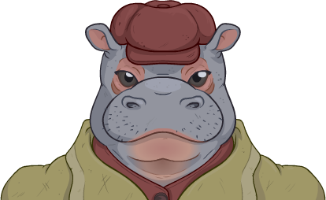
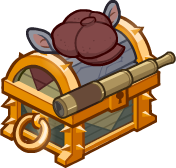

[Back to Main](index.md)

# Commodore Krux

This evergreen champion is almost certainly going to release with a Xaryxis content drop. We just don't know which yet.

> The giff Commodore Krux of the Second Wind met a group of adventurers in the Happy Beholder to recruit them to fight against the astral elves of the Xaryxian Empire.

[Wiki](https://forgottenrealms.fandom.com/wiki/Happy_Beholder)

# Basic Information

Commodore Krux will be an upcoming Evergreen champion.

* Seat: Unknown
* Race: Giff (Guess)
* Class: Unknown
* Roles: Unknown
* Age: Unknown
* Gender: Male (Guess)
* Alignment: Unknown
* Affiliation: Unknown
* Stats: Unknown

# Formation

Unknown.




# Abilities

**Base Attack: Unknown**
> Unknown effect.

<em>Raw Data</em>

<pre>
</pre>

 

**Ultimate Attack: Unknown**
> Unknown effect.

<em>Raw Data</em>

<pre>
</pre>

 

**All Hands on Deck**
> Unknown effect.

<em>Raw Data</em>

<pre>
{
    "p": 0,
    "v": 2,
    "id": 19883,
    "export_params": {"uses": ["icon"]},
    "type": 1,
    "graphic": "Icons/Champions/Icon_Formation_KruxAllHandsOnDeck",
    "fs": 0
}
</pre>

 

**Batten Hatches**
> Unknown effect.

<em>Raw Data</em>

<pre>
{
    "p": 0,
    "v": 2,
    "id": 19884,
    "export_params": {"uses": ["icon"]},
    "type": 1,
    "graphic": "Icons/Champions/Icon_Formation_KruxBattenHatches",
    "fs": 0
}
</pre>

 

**Battle Stations**
> Unknown effect.

<em>Raw Data</em>

<pre>
{
    "p": 0,
    "v": 2,
    "id": 19885,
    "export_params": {"uses": ["icon"]},
    "type": 1,
    "graphic": "Icons/Champions/Icon_Formation_KruxBattleStations",
    "fs": 0
}
</pre>

 

**Experienced Sailor**
> Unknown effect.

<em>Raw Data</em>

<pre>
{
    "p": 0,
    "v": 2,
    "id": 19886,
    "export_params": {"uses": ["icon"]},
    "type": 1,
    "graphic": "Icons/Champions/Icon_Formation_KruxExperiencedSailor",
    "fs": 0
}
</pre>

 

**Starfarers Spyglass**
> Unknown effect.

<em>Raw Data</em>

<pre>
{
    "p": 0,
    "v": 2,
    "id": 19887,
    "export_params": {"uses": ["icon"]},
    "type": 1,
    "graphic": "Icons/Champions/Icon_Formation_KruxStarfarersSpyglass",
    "fs": 0
}
</pre>

 

# Specialisations

**Specialisation: Foe of Xaryxis**
> Unknown effect.

<em>Raw Data</em>

<pre>
{
    "p": 0,
    "v": 2,
    "id": 19888,
    "export_params": {"uses": ["icon"]},
    "type": 1,
    "graphic": "Icons/Champions/Icon_Specialization_KruxFoeofXaryxis",
    "fs": 0
}
</pre>

 

**Specialisation: Nautical Knockback**
> Unknown effect.

<em>Raw Data</em>

<pre>
{
    "p": 0,
    "v": 2,
    "id": 19889,
    "export_params": {"uses": ["icon"]},
    "type": 1,
    "graphic": "Icons/Champions/Icon_Specialization_KruxNauticalKnockback",
    "fs": 0
}
</pre>

 

**Specialisation: Take the Helm**
> Unknown effect.

<em>Raw Data</em>

<pre>
{
    "p": 0,
    "v": 2,
    "id": 19890,
    "export_params": {"uses": ["icon"]},
    "type": 1,
    "graphic": "Icons/Champions/Icon_Specialization_KruxTaketheHelm",
    "fs": 0
}
</pre>

 

# Items

| Slot | Name | Type |
|---|---|---|
| 1 | `Coin Pouch` | Unknown |
| 2 | `Flintlock Pistols` | Unknown |
| 3 | `Giff Uniform` | Unknown |
| 4 | `Hat` | Unknown |
| 5 | `Memento` | Unknown |
| 6 | `Navigation Gear` | Unknown |

# Feats

Unknown.

# Legendaries

Unknown.

# Console Portrait

# Chests

| Gold |
|---|
|  |

[Back to Top](#top)

*Last Modified: {{ site.time }}*