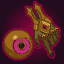
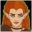
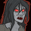
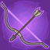
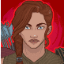

[Back to Main](index.md)

# Content Drops

A list of the upcoming content drops. Just be aware that the dates and order of these content drops are educated guesses based on the order their graphics appear in the definitions. CNE have been known to release content drops in different orders - so don't be surprised if that happens again.

## Vecna 10 - 23 July 2025

    
        
            **Icon**
        
        
            **Campaign**
        
        
            **Adventure Name**
        
        
            **Type**
        
    
    
        
            
        
        
            Vecna
        
        
            Shattered Reflections
        
        
            Adventure
        
    
    
        
             
        
        
            Vecna
        
        
            Shattered Reflections
        
        
            Variant #1
        
    
    
        
            
        
        
            Vecna
        
        
            Vecnas Grasp
        
        
            Adventure
        
    
    
        
             
        
        
            Vecna
        
        
            Vecnas Grasp
        
        
            Variant #1
        
    

## Mixed 15 Variants - 30 July 2025

    
        
            **Icon**
        
        
            **Campaign**
        
        
            **Adventure Name**
        
        
            **Type**
        
    
    
        
             
        
        
            Grand Tour
        
        
            Demon Lords
        
        
            Variant #2
        
    
    
        
             
        
        
            Grand Tour
        
        
            Madness of Zuggtmoy
        
        
            Variant #2
        
    
    
        
             
        
        
            Grand Tour
        
        
            The Cult of Lolth
        
        
            Variant #2
        
    
    
        
             
        
        
            Witchlight
        
        
            The Bitter End
        
        
            Variant #2
        
    
    
        
             
        
        
            Witchlight
        
        
            The Court of Storms
        
        
            Variant #3
        
    
    
        
             
        
        
            Witchlight
        
        
            The Palace of Hearts Desire
        
        
            Variant #2
        
    
    
        
             
        
        
            Xaryxis
        
        
            The Battle of Xaryxis
        
        
            Variant #2
        
    
    
        
             
        
        
            Xaryxis
        
        
            The Last Light of Xaryxis
        
        
            Variant #2
        
    
    
        
             
        
        
            Xaryxis
        
        
            Into Xaryxispace
        
        
            Variant #2
        
    
    
        
             
        
        
            Fortune's Wheel
        
        
            Heroes of the Day
        
        
            Variant #2
        
    
    
        
             
        
        
            Fortune's Wheel
        
        
            Times Mausoleum
        
        
            Variant #2
        
    
    
        
             
        
        
            Fortune's Wheel
        
        
            The Lost Modron
        
        
            Variant #2
        
    
    
        
             
        
        
            Vecna
        
        
            The Ruined Colossus
        
        
            Variant #2
        
    
    
        
             
        
        
            Vecna
        
        
            Death House
        
        
            Variant #2
        
    
    
        
             
        
        
            Vecna
        
        
            Sacrifice
        
        
            Variant #2
        
    

## Tales 1 - 27 August 2025

ⓘ This content drop might be joined by new [Blessings](blessings.md).

    
        
            **Icon**
        
        
            **Campaign**
        
        
            **Adventure Name**
        
        
            **Type**
        
    
    
        
            
        
        
            Tales
        
        
            An Aquired Taste
        
        
            Adventure
        
    
    
        
             
        
        
            Tales
        
        
            An Aquired Taste
        
        
            Variant #1
        
    
    
        
             
        
        
            Tales
        
        
            An Aquired Taste
        
        
            Variant #2
        
    
    
        
             
        
        
            Tales
        
        
            An Aquired Taste
        
        
            Variant #3
        
    
    
        
            
        
        
            Tales
        
        
            The Ties That Bind
        
        
            Adventure
        
    
    
        
             
        
        
            Tales
        
        
            The Ties That Bind
        
        
            Variant #1
        
    
    
        
             
        
        
            Tales
        
        
            The Ties That Bind
        
        
            Variant #2
        
    
    
        
             
        
        
            Tales
        
        
            The Ties That Bind
        
        
            Variant #3
        
    

## Tales 2 - 24 September 2025

    
        
            **Icon**
        
        
            **Campaign**
        
        
            **Adventure Name**
        
        
            **Type**
        
    
    
        
            
        
        
            Tales
        
        
            A Royal Welcome
        
        
            Adventure
        
    
    
        
             
        
        
            Tales
        
        
            A Royal Welcome
        
        
            Variant #1
        
    
    
        
             
        
        
            Tales
        
        
            A Royal Welcome
        
        
            Variant #2
        
    
    
        
             
        
        
            Tales
        
        
            A Royal Welcome
        
        
            Variant #3
        
    
    
        
            
        
        
            Tales
        
        
            Two Skies
        
        
            Adventure
        
    
    
        
             
        
        
            Tales
        
        
            Two Skies
        
        
            Variant #1
        
    
    
        
             
        
        
            Tales
        
        
            Two Skies
        
        
            Variant #2
        
    
    
        
             
        
        
            Tales
        
        
            Two Skies
        
        
            Variant #3
        
    

 
This page was made with the help of Randramb.

[Back to Top](#top)

*Last Modified: {{ site.time }}*