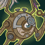
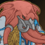
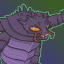
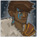
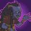
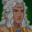
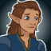
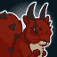
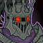

[Back to Main](index.md)

# Content Drops

A list of the upcoming content drops. Just be aware that the dates and order of these content drops are educated guesses based on the order their graphics appear in the definitions. CNE have been known to release content drops in different orders - so don't be surprised if that happens again.

## Fortune's Wheel 9 - 25 December 2024

ⓘ This content drop might be joined by new blessings.

    
        
            **Icon**
        
        
            **Campaign**
        
        
            **Adventure Name**
        
        
            **Type**
        
    
    
        
            
        
        
            Fortune's Wheel
        
        
            Full Circle
        
        
            Adventure
        
    
    
        
             
        
        
            Fortune's Wheel
        
        
            Full Circle
        
        
            Variant #1
        
    
    
        
            
        
        
            Fortune's Wheel
        
        
            Return to Fortunes Wheel
        
        
            Adventure
        
    
    
        
             
        
        
            Fortune's Wheel
        
        
            Return to Fortunes Wheel
        
        
            Variant #1
        
    

## Fortune's Wheel 10 - 22 January 2025

    
        
            **Icon**
        
        
            **Campaign**
        
        
            **Adventure Name**
        
        
            **Type**
        
    
    
        
            
        
        
            Fortune's Wheel
        
        
            Shemeshkas Gambit
        
        
            Adventure
        
    
    
        
             
        
        
            Fortune's Wheel
        
        
            Shemeshkas Gambit
        
        
            Variant #1
        
    
    
        
            
        
        
            Fortune's Wheel
        
        
            Tyrants Spiral
        
        
            Adventure
        
    
    
        
             
        
        
            Fortune's Wheel
        
        
            Tyrants Spiral
        
        
            Variant #1
        
    

## Mixed 13 Variants - 29 January 2025

    
        
            **Icon**
        
        
            **Campaign**
        
        
            **Adventure Name**
        
        
            **Type**
        
    
    
        
             
        
        
            Icewind Dale
        
        
            Cold As Ice
        
        
            Variant #3
        
    
    
        
             
        
        
            Icewind Dale
        
        
            Friends and Foes
        
        
            Variant #3
        
    
    
        
             
        
        
            Icewind Dale
        
        
            The Fall of Ythryn
        
        
            Variant #3
        
    
    
        
             
        
        
            Icewind Dale
        
        
            The Netherese Necropolis
        
        
            Variant #3
        
    
    
        
             
        
        
            Icewind Dale
        
        
            The Spire of Iriolathas
        
        
            Variant #3
        
    
    
        
             
        
        
            Witchlight
        
        
            Legends and Lore
        
        
            Variant #2
        
    
    
        
             
        
        
            Witchlight
        
        
            The End
        
        
            Variant #2
        
    
    
        
             
        
        
            Xaryxis
        
        
            Evacuation of Waterdeep
        
        
            Variant #3
        
    
    
        
             
        
        
            Xaryxis
        
        
            Seeds of Destruction
        
        
            Variant #3
        
    
    
        
             
        
        
            Fortune's Wheel
        
        
            Glitch in the Mortuary
        
        
            Variant #2
        
    
    
        
             
        
        
            Fortune's Wheel
        
        
            Welcome to the Outlands
        
        
            Variant #2
        
    
    
        
             
        
        
            Vecna
        
        
            A Tale of Two Vecnas
        
        
            Variant #2
        
    
    
        
             
        
        
            Vecna
        
        
            The Wizards Three
        
        
            Variant #2
        
    

## Vecna 5 - 26 February 2025

ⓘ This content drop might be joined by new blessings.

    
        
            **Icon**
        
        
            **Campaign**
        
        
            **Adventure Name**
        
        
            **Type**
        
    
    
        
            
        
        
            Vecna
        
        
            The Peylon Tree
        
        
            Adventure
        
    
    
        
             
        
        
            Vecna
        
        
            The Peylon Tree
        
        
            Variant #1
        
    
    
        
            
        
        
            Vecna
        
        
            Three Moons Vault
        
        
            Adventure
        
    
    
        
             
        
        
            Vecna
        
        
            Three Moons Vault
        
        
            Variant #1
        
    

 
This page was made with the help of Randramb.

[Back to Top](#top)

*Last Modified: {{ site.time }}*