[Back to Main](index.md)

# Content Drops

A list of the upcoming content drops. Just be aware that the dates and order of these content drops are educated guesses based on the order their graphics appear in the definitions. CNE have been known to release content drops in different orders - so don't be surprised if that happens again.

## Fortune's Wheel 7 - 28 August 2024

ⓘ This content drop might be joined by new blessings.

    
        
            **Icon**
        
        
            **Campaign**
        
        
            **Adventure Name**
        
        
            **Type**
        
    
    
        
            
        
        
            Fortune's Wheel
        
        
            Heroes of the Day
        
        
            Adventure
        
    
    
        
             
        
        
            Fortune's Wheel
        
        
            Heroes of the Day
        
        
            Variant #1
        
    
    
        
            
        
        
            Fortune's Wheel
        
        
            Times Mausoleum
        
        
            Adventure
        
    
    
        
             
        
        
            Fortune's Wheel
        
        
            Times Mausoleum
        
        
            Variant #1
        
    

## Vecna 3 - 25 September 2024

ⓘ This content drop might be joined by new blessings.

    
        
            **Icon**
        
        
            **Campaign**
        
        
            **Adventure Name**
        
        
            **Type**
        
    
    
        
            
        
        
            Vecna
        
        
            A Cause for Kas
        
        
            Adventure
        
    
    
        
             
        
        
            Vecna
        
        
            A Cause for Kas
        
        
            Variant #1
        
    
    
        
            
        
        
            Vecna
        
        
            The Ruined Colossus
        
        
            Adventure
        
    
    
        
             
        
        
            Vecna
        
        
            The Ruined Colossus
        
        
            Variant #1
        
    

## Descent into Avernus Mixed 5 Variants - 23 October 2024

    
        
            **Icon**
        
        
            **Campaign**
        
        
            **Adventure Name**
        
        
            **Type**
        
    
    
        
             
        
        
            Descent into Avernus
        
        
            Elturels Last Stand
        
        
            Variant #2
        
    
    
        
             
        
        
            Descent into Avernus
        
        
            Elturels Last Stand
        
        
            Variant #3
        
    
    
        
             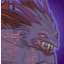
        
        
            Descent into Avernus
        
        
            Idyllglen
        
        
            Variant #3
        
    
    
        
             
        
        
            Descent into Avernus
        
        
            The Battle of High Hall Tower
        
        
            Variant #3
        
    
    
        
             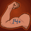
        
        
            Descent into Avernus
        
        
            The Bleeding Citadel
        
        
            Variant #3
        
    

## Mixed 10 Variants - 30 October 2024

    
        
            **Icon**
        
        
            **Campaign**
        
        
            **Adventure Name**
        
        
            **Type**
        
    
    
        
             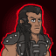
        
        
            Grand Tour
        
        
            Get Back in the Castle
        
        
            Variant #2
        
    
    
        
             
        
        
            Grand Tour
        
        
            Sanctum of the Sword
        
        
            Variant #2
        
    
    
        
             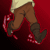
        
        
            Icewind Dale
        
        
            Tekelil is Hut
        
        
            Variant #3
        
    
    
        
             
        
        
            Icewind Dale
        
        
            The Rite of the Arcane Octade
        
        
            Variant #3
        
    
    
        
             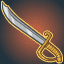
        
        
            Witchlight
        
        
            Beware the Jabberwock
        
        
            Variant #2
        
    
    
        
             
        
        
            Witchlight
        
        
            The Court of Storms
        
        
            Variant #2
        
    
    
        
             
        
        
            Xaryxis
        
        
            The Jungles of Doomspace
        
        
            Variant #2
        
    
    
        
             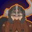
        
        
            Xaryxis
        
        
            To Infinitys and Beyond
        
        
            Variant #2
        
    
    
        
             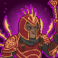
        
        
            Fortune's Wheel
        
        
            Fast Food
        
        
            Variant #2
        
    
    
        
             
        
        
            Fortune's Wheel
        
        
            The Fortunes Wheel
        
        
            Variant #2
        
    

## Vecna 4 - 27 November 2024

    
        
            **Icon**
        
        
            **Campaign**
        
        
            **Adventure Name**
        
        
            **Type**
        
    
    
        
            
        
        
            Vecna
        
        
            Death House
        
        
            Adventure
        
    
    
        
             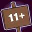
        
        
            Vecna
        
        
            Death House
        
        
            Variant #1
        
    
    
        
            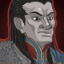
        
        
            Vecna
        
        
            Sacrifice
        
        
            Adventure
        
    
    
        
             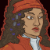
        
        
            Vecna
        
        
            Sacrifice
        
        
            Variant #1
        
    

## Fortune's Wheel 8 - 25 December 2024

    
        
            **Icon**
        
        
            **Campaign**
        
        
            **Adventure Name**
        
        
            **Type**
        
    
    
        
            
        
        
            Fortune's Wheel
        
        
            Realm of Enchanted
        
        
            Adventure
        
    
    
        
             
        
        
            Fortune's Wheel
        
        
            Realm of Enchanted
        
        
            Variant #1
        
    
    
        
            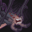
        
        
            Fortune's Wheel
        
        
            The Lost Modron
        
        
            Adventure
        
    
    
        
             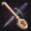
        
        
            Fortune's Wheel
        
        
            The Lost Modron
        
        
            Variant #1
        
    

 
This page was made with the help of Randramb.

[Back to Top](#top)

*Last Modified: {{ site.time }}*