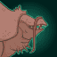

[Back to Main](index.md)

# Content Drops

A list of the upcoming content drops. Just be aware that the dates and order of these content drops are educated guesses based on the current event schedule - which itself is also often guesswork. So don't take these as facts.

## Witchlight 10 - 30 August 2023

    
        
            **Icon**
        
        
            **Campaign**
        
        
            **Adventure Name**
        
        
            **Type**
        
    
    
        
            
        
        
            Witchlight
        
        
            Legends and Lore
        
        
            Adventure
        
    
    
        
             
        
        
            Witchlight
        
        
            Legends and Lore
        
        
            Variant #1
        
    
    
        
            
        
        
            Witchlight
        
        
            The End
        
        
            Adventure
        
    
    
        
             
        
        
            Witchlight
        
        
            The End
        
        
            Variant #1
        
    

## Xaryxis 7 - 20 September 2023

This content drop will likely be joined by new blessings.

    
        
            **Icon**
        
        
            **Campaign**
        
        
            **Adventure Name**
        
        
            **Type**
        
    
    
        
            
        
        
            Xaryxis
        
        
            The Arena of Blood
        
        
            Adventure
        
    
    
        
             
        
        
            Xaryxis
        
        
            The Arena of Blood
        
        
            Variant #1
        
    
    
        
            
        
        
            Xaryxis
        
        
            The Jungles of Doomspace
        
        
            Adventure
        
    
    
        
             
        
        
            Xaryxis
        
        
            The Jungles of Doomspace
        
        
            Variant #1
        
    

## Xaryxis 8 - 11 October 2023

    
        
            **Icon**
        
        
            **Campaign**
        
        
            **Adventure Name**
        
        
            **Type**
        
    
    
        
            
        
        
            Xaryxis
        
        
            Foul Play
        
        
            Adventure
        
    
    
        
             
        
        
            Xaryxis
        
        
            Foul Play
        
        
            Variant #1
        
    
    
        
            
        
        
            Xaryxis
        
        
            Spelljammers in Training
        
        
            Adventure
        
    
    
        
             
        
        
            Xaryxis
        
        
            Spelljammers in Training
        
        
            Variant #1
        
    

## Fortune's Wheel 1 - 1 November 2023

This content drop will likely be joined by new blessings.

    
        
            **Icon**
        
        
            **Campaign**
        
        
            **Adventure Name**
        
        
            **Type**
        
    
    
        
            
        
        
            Fortune's Wheel
        
        
            The Beginning is the End
        
        
            Adventure
        
    
    
        
             
        
        
            Fortune's Wheel
        
        
            The Beginning is the End
        
        
            Variant #1
        
    
    
        
            
        
        
            Fortune's Wheel
        
        
            The End is the Beginning
        
        
            Adventure
        
    
    
        
             
        
        
            Fortune's Wheel
        
        
            The End is the Beginning
        
        
            Variant #1
        
    

 
This page was made with the help of Randramb.

[Back to Top](#top)

*Last Modified: {{ site.time }}*