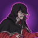
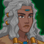

[Back to Main](index.md)

# Content Drops

A list of the upcoming content drops. Just be aware that the dates and order of these content drops are educated guesses based on the current event schedule - which itself is also often guesswork. So don't take these as facts.

## Fortune's Wheel 5 - 24 April 2024

ⓘ This content drop will likely be joined by new blessings.

    
        
            **Icon**
        
        
            **Campaign**
        
        
            **Adventure Name**
        
        
            **Type**
        
    
    
        
            
        
        
            Fortune's Wheel
        
        
            Inversion
        
        
            Adventure
        
    
    
        
             
        
        
            Fortune's Wheel
        
        
            Inversion
        
        
            Variant #1
        
    
    
        
            
        
        
            Fortune's Wheel
        
        
            The Witch and the Wyrmling
        
        
            Adventure
        
    
    
        
             
        
        
            Fortune's Wheel
        
        
            The Witch and the Wyrmling
        
        
            Variant #1
        
    

## Vecna 1 - 22 May 2024

ⓘ This content drop will likely be joined by new blessings.

    
        
            **Icon**
        
        
            **Campaign**
        
        
            **Adventure Name**
        
        
            **Type**
        
    
    
        
            
        
        
            Vecna
        
        
            A Tale of Two Vecnas
        
        
            Adventure
        
    
    
        
             
        
        
            Vecna
        
        
            A Tale of Two Vecnas
        
        
            Variant #1
        
    
    
        
            
        
        
            Vecna
        
        
            The Wizards Three
        
        
            Adventure
        
    
    
        
             
        
        
            Vecna
        
        
            The Wizards Three
        
        
            Variant #1
        
    

 
This page was made with the help of Randramb.

[Back to Top](#top)

*Last Modified: {{ site.time }}*