[Back to Main](index.md)

# Content Drops

A list of the upcoming content drops. Just be aware that the dates and order of these content drops are educated guesses based on the order their graphics appear in the definitions. CNE have been known to release content drops in different orders - so don't be surprised if that happens again.

## Tales 2 - 24 September 2025

This Tales drop will allow unlocking Melf and Lae'zel.

    
        
            **Icon**
        
        
            **Campaign**
        
        
            **Adventure Name**
        
        
            **Type**
        
    
    
        
            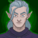
        
        
            Tales
        
        
            A Royal Welcome
        
        
            Adventure
        
    
    
        
             
        
        
            Tales
        
        
            A Royal Welcome
        
        
            Variant #1
        
    
    
        
             
        
        
            Tales
        
        
            A Royal Welcome
        
        
            Variant #2
        
    
    
        
             
        
        
            Tales
        
        
            A Royal Welcome
        
        
            Variant #3
        
    
    
        
            
        
        
            Tales
        
        
            Two Skies
        
        
            Adventure
        
    
    
        
             
        
        
            Tales
        
        
            Two Skies
        
        
            Variant #1
        
    
    
        
             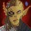
        
        
            Tales
        
        
            Two Skies
        
        
            Variant #2
        
    
    
        
             
        
        
            Tales
        
        
            Two Skies
        
        
            Variant #3
        
    

## Tales 3 - 22 October 2025

This Tales drop will allow unlocking Strongheart and Dynaheir.

ⓘ This content drop might be joined by new [Blessings](blessings.md).

    
        
            **Icon**
        
        
            **Campaign**
        
        
            **Adventure Name**
        
        
            **Type**
        
    
    
        
            
        
        
            Tales
        
        
            Friends of a Feather
        
        
            Adventure
        
    
    
        
             
        
        
            Tales
        
        
            Friends of a Feather
        
        
            Variant #1
        
    
    
        
             
        
        
            Tales
        
        
            Friends of a Feather
        
        
            Variant #2
        
    
    
        
             
        
        
            Tales
        
        
            Friends of a Feather
        
        
            Variant #3
        
    
    
        
            
        
        
            Tales
        
        
            Returning Day
        
        
            Adventure
        
    
    
        
             
        
        
            Tales
        
        
            Returning Day
        
        
            Variant #1
        
    
    
        
             
        
        
            Tales
        
        
            Returning Day
        
        
            Variant #2
        
    
    
        
             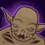
        
        
            Tales
        
        
            Returning Day
        
        
            Variant #3
        
    

## Mixed 15 Variants - 29 October 2025

    
        
            **Icon**
        
        
            **Campaign**
        
        
            **Adventure Name**
        
        
            **Type**
        
    
    
        
             
        
        
            Grand Tour
        
        
            Heatwave
        
        
            Variant #3
        
    
    
        
             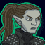
        
        
            Grand Tour
        
        
            Return to the Tomb
        
        
            Variant #3
        
    
    
        
             
        
        
            Grand Tour
        
        
            The Oozing Hunger
        
        
            Variant #3
        
    
    
        
             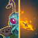
        
        
            Witchlight
        
        
            Beware the Jabberwock
        
        
            Variant #3
        
    
    
        
             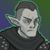
        
        
            Witchlight
        
        
            Legends and Lore
        
        
            Variant #3
        
    
    
        
             
        
        
            Witchlight
        
        
            The End
        
        
            Variant #3
        
    
    
        
             
        
        
            Xaryxis
        
        
            No One Can Hear You Scream
        
        
            Variant #2
        
    
    
        
             
        
        
            Xaryxis
        
        
            Welcome to the Rock
        
        
            Variant #2
        
    
    
        
             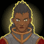
        
        
            Xaryxis
        
        
            Who Lurks Below
        
        
            Variant #3
        
    
    
        
             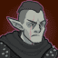
        
        
            Xaryxis
        
        
            Xanathar
        
        
            Variant #3
        
    
    
        
             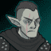
        
        
            Fortune's Wheel
        
        
            Realm of Enchanted
        
        
            Variant #2
        
    
    
        
             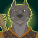
        
        
            Fortune's Wheel
        
        
            Full Circle
        
        
            Variant #2
        
    
    
        
             
        
        
            Fortune's Wheel
        
        
            Return to Fortunes Wheel
        
        
            Variant #2
        
    
    
        
             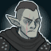
        
        
            Vecna
        
        
            The Peylon Tree
        
        
            Variant #2
        
    
    
        
             
        
        
            Vecna
        
        
            Three Moons Vault
        
        
            Variant #2
        
    

## Tales 4 - 26 November 2025

This Tales drop will allow unlocking Havilar and Hank.

    
        
            **Icon**
        
        
            **Campaign**
        
        
            **Adventure Name**
        
        
            **Type**
        
    
    
        
            
        
        
            Tales
        
        
            Market Mischief
        
        
            Adventure
        
    
    
        
             
        
        
            Tales
        
        
            Market Mischief
        
        
            Variant #1
        
    
    
        
             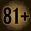
        
        
            Tales
        
        
            Market Mischief
        
        
            Variant #2
        
    
    
        
             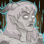
        
        
            Tales
        
        
            Market Mischief
        
        
            Variant #3
        
    
    
        
            
        
        
            Tales
        
        
            Tricksy Pixie
        
        
            Adventure
        
    
    
        
             
        
        
            Tales
        
        
            Tricksy Pixie
        
        
            Variant #1
        
    
    
        
             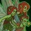
        
        
            Tales
        
        
            Tricksy Pixie
        
        
            Variant #2
        
    
    
        
             
        
        
            Tales
        
        
            Tricksy Pixie
        
        
            Variant #3
        
    

## Tales 5 - 23 December 2025

This Tales drop will allow unlocking Kas and Nordom.

ⓘ This content drop might be joined by new [Blessings](blessings.md).

    
        
            **Icon**
        
        
            **Campaign**
        
        
            **Adventure Name**
        
        
            **Type**
        
    
    
        
            
        
        
            Tales
        
        
            Ashes of the Past
        
        
            Adventure
        
    
    
        
            
        
        
            Tales
        
        
            Ashes of the Past: Var1
        
        
            Adventure
        
    
    
        
            
        
        
            Tales
        
        
            Ashes of the Past: Var2
        
        
            Adventure
        
    
    
        
            
        
        
            Tales
        
        
            Ashes of the Past: Var3
        
        
            Adventure
        
    
    
        
            
        
        
            Tales
        
        
            Case File9717
        
        
            Adventure
        
    
    
        
            
        
        
            Tales
        
        
            Case File9717: Var1
        
        
            Adventure
        
    
    
        
            
        
        
            Tales
        
        
            Case File9717: Var2
        
        
            Adventure
        
    
    
        
            
        
        
            Tales
        
        
            Case File9717: Var3
        
        
            Adventure
        
    

## Mixed 12 Variants - 31 December 2025

    
        
            **Icon**
        
        
            **Campaign**
        
        
            **Adventure Name**
        
        
            **Type**
        
    
    
        
             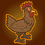
        
        
            Grand Tour
        
        
            Castle Thousand Vecnas
        
        
            Variant #3
        
    
    
        
             
        
        
            Grand Tour
        
        
            Dread Domain Tovag
        
        
            Variant #3
        
    
    
        
             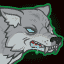
        
        
            Grand Tour
        
        
            Sanctum of the Sword
        
        
            Variant #3
        
    
    
        
             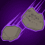
        
        
            Xaryxis
        
        
            Flight of the Kindori Pod
        
        
            Variant #3
        
    
    
        
             
        
        
            Xaryxis
        
        
            Rock and Roll
        
        
            Variant #3
        
    
    
        
             
        
        
            Xaryxis
        
        
            Rocky Reception
        
        
            Variant #3
        
    
    
        
             
        
        
            Xaryxis
        
        
            Topolahs Tower
        
        
            Variant #3
        
    
    
        
             
        
        
            Fortune's Wheel
        
        
            The Beginning is the End
        
        
            Variant #3
        
    
    
        
             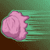
        
        
            Fortune's Wheel
        
        
            Souls Mirage
        
        
            Variant #2
        
    
    
        
             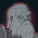
        
        
            Vecna
        
        
            Isle of Serpents
        
        
            Variant #2
        
    
    
        
             
        
        
            Vecna
        
        
            Tomb of Wayward Souls
        
        
            Variant #2
        
    
    
        
             
        
        
            Vecna
        
        
            Hellbound
        
        
            Variant #2
        
    

 
This page was made with the help of Randramb.

[Back to Top](#top)

*Last Modified: {{ site.time }}*