[Back to Main](index.md)

# Content Drops

A list of the upcoming content drops. Just be aware that the dates and order of these content drops are educated guesses based on the order their graphics appear in the definitions. CNE have been known to release content drops in different orders - so don't be surprised if that happens again.

## Vecna 7 - 23 April 2025

ⓘ This content drop might be joined by new [Blessings](blessings.md).

    
        
            **Icon**
        
        
            **Campaign**
        
        
            **Adventure Name**
        
        
            **Type**
        
    
    
        
            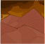
        
        
            Vecna
        
        
            Hellbound
        
        
            Adventure
        
    
    
        
             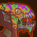
        
        
            Vecna
        
        
            Hellbound
        
        
            Variant #1
        
    
    
        
            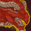
        
        
            Vecna
        
        
            The Red Belvedere
        
        
            Adventure
        
    
    
        
             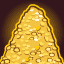
        
        
            Vecna
        
        
            The Red Belvedere
        
        
            Variant #1
        
    

## Mixed 15 Variants - 30 April 2025

    
        
            **Icon**
        
        
            **Campaign**
        
        
            **Adventure Name**
        
        
            **Type**
        
    
    
        
             
        
        
            Grand Tour
        
        
            Checkmate
        
        
            Variant #2
        
    
    
        
             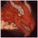
        
        
            Grand Tour
        
        
            The Oozing Hunger
        
        
            Variant #2
        
    
    
        
             
        
        
            Grand Tour
        
        
            Vecna Out
        
        
            Variant #2
        
    
    
        
             
        
        
            Witchlight
        
        
            Howling Peaks
        
        
            Variant #3
        
    
    
        
             
        
        
            Witchlight
        
        
            Love Unsoiled
        
        
            Variant #3
        
    
    
        
             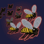
        
        
            Witchlight
        
        
            Minions of Endelyn
        
        
            Variant #3
        
    
    
        
             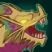
        
        
            Xaryxis
        
        
            Foul Play
        
        
            Variant #2
        
    
    
        
             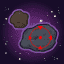
        
        
            Xaryxis
        
        
            Spelljammers in Training
        
        
            Variant #2
        
    
    
        
             
        
        
            Xaryxis
        
        
            The Arena of Blood
        
        
            Variant #2
        
    
    
        
             
        
        
            Fortune's Wheel
        
        
            Crystalwork
        
        
            Variant #2
        
    
    
        
             
        
        
            Fortune's Wheel
        
        
            Inversion
        
        
            Variant #2
        
    
    
        
             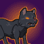
        
        
            Fortune's Wheel
        
        
            The Witch and the Wyrmling
        
        
            Variant #2
        
    
    
        
             
        
        
            Vecna
        
        
            Havocks Zenith
        
        
            Variant #2
        
    
    
        
             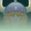
        
        
            Vecna
        
        
            The Heart of Havock
        
        
            Variant #2
        
    
    
        
             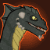
        
        
            Vecna
        
        
            A Cause for Kas
        
        
            Variant #2
        
    

## Vecna 8 - 28 May 2025

ⓘ This content drop might contain a new evergreen champion.

    
        
            **Icon**
        
        
            **Campaign**
        
        
            **Adventure Name**
        
        
            **Type**
        
    
    
        
            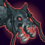
        
        
            Vecna
        
        
            Pandemonium
        
        
            Adventure
        
    
    
        
             
        
        
            Vecna
        
        
            Pandemonium
        
        
            Variant #1
        
    
    
        
            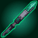
        
        
            Vecna
        
        
            Rod of Seven Parts
        
        
            Adventure
        
    
    
        
             
        
        
            Vecna
        
        
            Rod of Seven Parts
        
        
            Variant #1
        
    
    
        
             
        
        
            Vecna
        
        
            Rod of Seven Parts
        
        
            Variant #2
        
    

## Vecna 9 - 25 June 2025

ⓘ This content drop might be joined by new [Blessings](blessings.md).

    
        
            **Icon**
        
        
            **Campaign**
        
        
            **Adventure Name**
        
        
            **Type**
        
    
    
        
            
        
        
            Vecna
        
        
            The Ruinous Citadel
        
        
            Adventure
        
    
    
        
             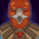
        
        
            Vecna
        
        
            The Ruinous Citadel
        
        
            Variant #1
        
    
    
        
            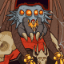
        
        
            Vecna
        
        
            The War of Pandesmos
        
        
            Adventure
        
    
    
        
             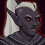
        
        
            Vecna
        
        
            The War of Pandesmos
        
        
            Variant #1
        
    

 
This page was made with the help of Randramb.

[Back to Top](#top)

*Last Modified: {{ site.time }}*