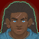
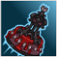
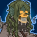
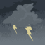
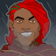
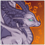
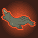
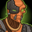

[Back to Main](index.md)

# Content Drops

A list of the upcoming content drops. Just be aware that the dates and order of these content drops are educated guesses based on the current event schedule - which itself is also often guesswork. So don't take these as facts.

## Fortune's Wheel 6 - 24 July 2024

ⓘ This content drop will likely contain a new evergreen champion.

    
        
            **Icon**
        
        
            **Campaign**
        
        
            **Adventure Name**
        
        
            **Type**
        
    
    
        
            
        
        
            Fortune's Wheel
        
        
            Souls Mirage
        
        
            Adventure
        
    
    
        
             
        
        
            Fortune's Wheel
        
        
            Souls Mirage
        
        
            Variant #1
        
    
    
        
            
        
        
            Fortune's Wheel
        
        
            Titan on the Town
        
        
            Adventure
        
    
    
        
             
        
        
            Fortune's Wheel
        
        
            Titan on the Town
        
        
            Variant #1
        
    
    
        
             
        
        
            Fortune's Wheel
        
        
            Titan on the Town
        
        
            Variant #2
        
    

## Mixed 9 Variants - 31 July 2024

    
        
            **Icon**
        
        
            **Campaign**
        
        
            **Adventure Name**
        
        
            **Type**
        
    
    
        
             
        
        
            Descent into Avernus
        
        
            Sibriex
        
        
            Variant #3
        
    
    
        
             
        
        
            Descent into Avernus
        
        
            Wrecked Flying Fotress
        
        
            Variant #3
        
    
    
        
             
        
        
            Icewind Dale
        
        
            Reghed Glacier Mysteries
        
        
            Variant #3
        
    
    
        
             
        
        
            Icewind Dale
        
        
            The Spire of Iriolathas
        
        
            Variant #2
        
    
    
        
             
        
        
            Witchlight
        
        
            Best Laid Plans
        
        
            Variant #3
        
    
    
        
             
        
        
            Witchlight
        
        
            The Roots of Loomlurch
        
        
            Variant #3
        
    
    
        
             
        
        
            Xaryxis
        
        
            Flight of the Kindori Pod
        
        
            Variant #2
        
    
    
        
             
        
        
            Xaryxis
        
        
            Hunt for the Last Breath
        
        
            Variant #2
        
    
    
        
             
        
        
            Fortune's Wheel
        
        
            Welcome to Sigil
        
        
            Variant #2
        
    

## Fortune's Wheel 7 - 28 August 2024

ⓘ This content drop will likely be joined by new blessings.

    
        
            **Icon**
        
        
            **Campaign**
        
        
            **Adventure Name**
        
        
            **Type**
        
    
    
        
            
        
        
            Fortune's Wheel
        
        
            Heroes of the Day
        
        
            Adventure
        
    
    
        
             
        
        
            Fortune's Wheel
        
        
            Heroes of the Day
        
        
            Variant #1
        
    
    
        
            
        
        
            Fortune's Wheel
        
        
            Times Mausoleum
        
        
            Adventure
        
    
    
        
             
        
        
            Fortune's Wheel
        
        
            Times Mausoleum
        
        
            Variant #1
        
    

## Vecna 3 - 25 September 2024

ⓘ This content drop will likely be joined by new blessings.

    
        
            **Icon**
        
        
            **Campaign**
        
        
            **Adventure Name**
        
        
            **Type**
        
    
    
        
            
        
        
            Vecna
        
        
            A Cause for Kas
        
        
            Adventure
        
    
    
        
             
        
        
            Vecna
        
        
            A Cause for Kas
        
        
            Variant #1
        
    
    
        
            
        
        
            Vecna
        
        
            The Ruined Colossus
        
        
            Adventure
        
    
    
        
             
        
        
            Vecna
        
        
            The Ruined Colossus
        
        
            Variant #1
        
    

 
This page was made with the help of Randramb.

[Back to Top](#top)

*Last Modified: {{ site.time }}*