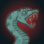

[Back to Main](index.md)

# Content Drops

A list of the upcoming content drops. Just be aware that the dates and order of these content drops are educated guesses based on the order their graphics appear in the definitions. CNE have been known to release content drops in different orders - so don't be surprised if that happens again.

## Vecna 5 - 26 February 2025

ⓘ This content drop might be joined by new [Blessings](blessings.md).

    
        
            **Icon**
        
        
            **Campaign**
        
        
            **Adventure Name**
        
        
            **Type**
        
    
    
        
            
        
        
            Vecna
        
        
            The Peylon Tree
        
        
            Adventure
        
    
    
        
             
        
        
            Vecna
        
        
            The Peylon Tree
        
        
            Variant #1
        
    
    
        
            
        
        
            Vecna
        
        
            Three Moons Vault
        
        
            Adventure
        
    
    
        
             
        
        
            Vecna
        
        
            Three Moons Vault
        
        
            Variant #1
        
    

## Vecna 6 - 26 March 2025

    
        
            **Icon**
        
        
            **Campaign**
        
        
            **Adventure Name**
        
        
            **Type**
        
    
    
        
            
        
        
            Vecna
        
        
            Isle of Serpents
        
        
            Adventure
        
    
    
        
             
        
        
            Vecna
        
        
            Isle of Serpents
        
        
            Variant #1
        
    
    
        
            
        
        
            Vecna
        
        
            Tomb of Wayward Souls
        
        
            Adventure
        
    
    
        
             
        
        
            Vecna
        
        
            Tomb of Wayward Souls
        
        
            Variant #1
        
    

 
This page was made with the help of Randramb.

[Back to Top](#top)

*Last Modified: {{ site.time }}*