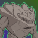
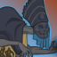
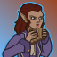

[Back to Main](index.md)

# Content Drops

Guesstimations of upcoming content drops - so don't take these as fact.

## Xaryxis 6 - 9 August 2023

    
        
            **Icon**
        
        
            **Campaign**
        
        
            **Adventure Name**
        
        
            **Type**
        
    
    
        
            
        
        
            Xaryxis
        
        
            Hunt for the Last Breath
        
        
            Adventure
        
    
    
        
             
        
        
            Xaryxis
        
        
            Hunt for the Last Breath
        
        
            Variant #1
        
    
    
        
            
        
        
            Xaryxis
        
        
            To Infinitys and Beyond
        
        
            Adventure
        
    
    
        
             
        
        
            Xaryxis
        
        
            To Infinitys and Beyond
        
        
            Variant #1
        
    

## Witchlight 10 - 30 August 2023

    
        
            **Icon**
        
        
            **Campaign**
        
        
            **Adventure Name**
        
        
            **Type**
        
    
    
        
            
        
        
            Witchlight
        
        
            Legends and Lore
        
        
            Adventure
        
    
    
        
             
        
        
            Witchlight
        
        
            Legends and Lore
        
        
            Variant #1
        
    
    
        
            
        
        
            Witchlight
        
        
            The End
        
        
            Adventure
        
    
    
        
             
        
        
            Witchlight
        
        
            The End
        
        
            Variant #1
        
    

## Xaryxis 7 - 20 September 2023

This content drop will likely be joined by new blessings.

    
        
            **Icon**
        
        
            **Campaign**
        
        
            **Adventure Name**
        
        
            **Type**
        
    
    
        
            
        
        
            Xaryxis
        
        
            The Arena of Blood
        
        
            Adventure
        
    
    
        
             
        
        
            Xaryxis
        
        
            The Arena of Blood
        
        
            Variant #1
        
    
    
        
            
        
        
            Xaryxis
        
        
            The Jungles of Doomspace
        
        
            Adventure
        
    
    
        
             
        
        
            Xaryxis
        
        
            The Jungles of Doomspace
        
        
            Variant #1
        
    

 
This page was made with the help of Randramb.

[Back to Top](#top)

*Last Modified: {{ site.time }}*