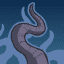
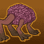
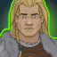
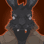
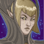
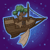
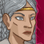

[Back to Main](index.md)

# Content Drops

A list of the upcoming content drops. Just be aware that the dates and order of these content drops are educated guesses based on the current event schedule - which itself is also often guesswork. So don't take these as facts.

## Mixed 10 Variants - 13 December 2023

    
        
            **Icon**
        
        
            **Campaign**
        
        
            **Adventure Name**
        
        
            **Type**
        
    
    
        
             
        
        
            Grand Tour
        
        
            Into the Unknown
        
        
            Variant #3
        
    
    
        
             
        
        
            Grand Tour
        
        
            The Twilight Grove
        
        
            Variant #3
        
    
    
        
             
        
        
            Avernus
        
        
            Bels Forge
        
        
            Variant #3
        
    
    
        
             
        
        
            Avernus
        
        
            Questlines
        
        
            Variant #3
        
    
    
        
             
        
        
            Icewind Dale
        
        
            Deekins Mission
        
        
            Variant #3
        
    
    
        
             
        
        
            Icewind Dale
        
        
            Frozen Vengeance
        
        
            Variant #3
        
    
    
        
             
        
        
            Witchlight
        
        
            The Bitter End
        
        
            Variant #2
        
    
    
        
             
        
        
            Witchlight
        
        
            The Palace of Hearts Desire
        
        
            Variant #2
        
    
    
        
             
        
        
            Xaryxis
        
        
            No One Can Hear You Scream
        
        
            Variant #2
        
    
    
        
             
        
        
            Xaryxis
        
        
            Welcome to the Rock
        
        
            Variant #2
        
    

## Xaryxis 9 - 3 January 2024

ⓘ This content drop will likely be joined by new blessings.

    
        
            **Icon**
        
        
            **Campaign**
        
        
            **Adventure Name**
        
        
            **Type**
        
    
    
        
            
        
        
            Xaryxis
        
        
            Into Xaryxispace
        
        
            Adventure
        
    
    
        
             
        
        
            Xaryxis
        
        
            Into Xaryxispace
        
        
            Variant #1
        
    
    
        
            
        
        
            Xaryxis
        
        
            The Battle of Xaryxis
        
        
            Adventure
        
    
    
        
             
        
        
            Xaryxis
        
        
            The Battle of Xaryxis
        
        
            Variant #1
        
    

## Xaryxis 10 - 24 January 2024

    
        
            **Icon**
        
        
            **Campaign**
        
        
            **Adventure Name**
        
        
            **Type**
        
    
    
        
            
        
        
            Xaryxis
        
        
            Realmspace Restored
        
        
            Adventure
        
    
    
        
             
        
        
            Xaryxis
        
        
            Realmspace Restored
        
        
            Variant #1
        
    
    
        
            
        
        
            Xaryxis
        
        
            The Last Light of Xaryxis
        
        
            Adventure
        
    
    
        
             
        
        
            Xaryxis
        
        
            The Last Light of Xaryxis
        
        
            Variant #1
        
    

 
This page was made with the help of Randramb.

[Back to Top](#top)

*Last Modified: {{ site.time }}*