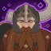
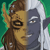
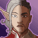
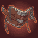
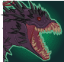
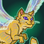

[Back to Main](index.md)

# Content Drops

A list of the upcoming content drops. Just be aware that the dates and order of these content drops are educated guesses based on the current event schedule - which itself is also often guesswork. So don't take these as facts.

## Mixed 10 Variants - 29 May 2024

    
        
            **Icon**
        
        
            **Campaign**
        
        
            **Adventure Name**
        
        
            **Type**
        
    
    
        
             
        
        
            Grand Tour
        
        
            Emperor Vecna Lives
        
        
            Variant #3
        
    
    
        
             
        
        
            Grand Tour
        
        
            Vecna Loots
        
        
            Variant #3
        
    
    
        
             
        
        
            Icewind Dale
        
        
            Ending the Rime Part1
        
        
            Variant #3
        
    
    
        
             
        
        
            Icewind Dale
        
        
            Ending the Rime Part2
        
        
            Variant #3
        
    
    
        
             
        
        
            Witchlight
        
        
            Fairy Rings of Thither
        
        
            Variant #3
        
    
    
        
             
        
        
            Witchlight
        
        
            Will of the Feywild
        
        
            Variant #3
        
    
    
        
             
        
        
            Xaryxis
        
        
            Rock and Roll
        
        
            Variant #2
        
    
    
        
             
        
        
            Xaryxis
        
        
            Rocky Reception
        
        
            Variant #2
        
    
    
        
             
        
        
            Fortune's Wheel
        
        
            The Beginning is the End
        
        
            Variant #2
        
    
    
        
             
        
        
            Fortune's Wheel
        
        
            The End is the Beginning
        
        
            Variant #2
        
    

## Vecna 2 - 26 June 2024

    
        
            **Icon**
        
        
            **Campaign**
        
        
            **Adventure Name**
        
        
            **Type**
        
    
    
        
            
        
        
            Vecna
        
        
            Havocks Zenith
        
        
            Adventure
        
    
    
        
             
        
        
            Vecna
        
        
            Havocks Zenith
        
        
            Variant #1
        
    
    
        
            
        
        
            Vecna
        
        
            The Heart of Havock
        
        
            Adventure
        
    
    
        
             
        
        
            Vecna
        
        
            The Heart of Havock
        
        
            Variant #1
        
    

## Fortune's Wheel 6 - 24 July 2024

    
        
            **Icon**
        
        
            **Campaign**
        
        
            **Adventure Name**
        
        
            **Type**
        
    
    
        
            
        
        
            Fortune's Wheel
        
        
            Souls Mirage
        
        
            Adventure
        
    
    
        
             
        
        
            Fortune's Wheel
        
        
            Souls Mirage
        
        
            Variant #1
        
    
    
        
            
        
        
            Fortune's Wheel
        
        
            Titan on the Town
        
        
            Adventure
        
    
    
        
             
        
        
            Fortune's Wheel
        
        
            Titan on the Town
        
        
            Variant #1
        
    
    
        
             
        
        
            Fortune's Wheel
        
        
            Titan on the Town
        
        
            Variant #2
        
    

 
This page was made with the help of Randramb.

[Back to Top](#top)

*Last Modified: {{ site.time }}*