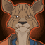
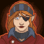
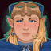
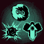
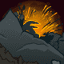
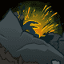
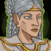
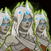

[Back to Main](index.md)

# Content Drops

A list of the upcoming content drops. Just be aware that the dates and order of these content drops are educated guesses based on the order their graphics appear in the definitions. CNE have been known to release content drops in different orders - so don't be surprised if that happens again.

## Tales 9 - 27 May 2026

This Tales drop will allow unlocking Birdsong and Tess.

ⓘ This content drop might be joined by new [Blessings](blessings.md){:target="_blank"}.

    
        
            **Icon**
        
        
            **Campaign**
        
        
            **Adventure Name**
        
        
            **Type**
        
    
    
        
            
        
        
            Tales
        
        
            Kindred Spirits
        
        
            Adventure
        
    
    
        
             
        
        
            Tales
        
        
            Kindred Spirits
        
        
            Variant #1
        
    
    
        
             
        
        
            Tales
        
        
            Kindred Spirits
        
        
            Variant #2
        
    
    
        
             
        
        
            Tales
        
        
            Kindred Spirits
        
        
            Variant #3
        
    
    
        
            
        
        
            Tales
        
        
            Making it Work
        
        
            Adventure
        
    
    
        
             
        
        
            Tales
        
        
            Making it Work
        
        
            Variant #1
        
    
    
        
             
        
        
            Tales
        
        
            Making it Work
        
        
            Variant #2
        
    
    
        
             
        
        
            Tales
        
        
            Making it Work
        
        
            Variant #3
        
    

## Tales 10 - 24 June 2026

Tales 10 will not unlock any champions.

    
        
            **Icon**
        
        
            **Campaign**
        
        
            **Adventure Name**
        
        
            **Type**
        
    
    
        
            
        
        
            Tales
        
        
            Champions of Waterdeep
        
        
            Adventure
        
    
    
        
             
        
        
            Tales
        
        
            Champions of Waterdeep
        
        
            Variant #1
        
    
    
        
             
        
        
            Tales
        
        
            Champions of Waterdeep
        
        
            Variant #2
        
    
    
        
             
        
        
            Tales
        
        
            Champions of Waterdeep
        
        
            Variant #3
        
    
    
        
            
        
        
            Tales
        
        
            The Sleeper Awakes
        
        
            Adventure
        
    
    
        
             
        
        
            Tales
        
        
            The Sleeper Awakes
        
        
            Variant #1
        
    
    
        
             
        
        
            Tales
        
        
            The Sleeper Awakes
        
        
            Variant #2
        
    
    
        
             
        
        
            Tales
        
        
            The Sleeper Awakes
        
        
            Variant #3
        
    

## Mastery 1 - 22 July 2026

    
        
            **Icon**
        
        
            **Campaign**
        
        
            **Adventure Name**
        
        
            **Type**
        
    
    
        
            
        
        
            Mastery
        
        
            No Good Deed
        
        
            Adventure
        
    
    
        
            
        
        
            Mastery
        
        
            Out of Time
        
        
            Adventure
        
    
    
        
            
        
        
            Mastery
        
        
            Rocket Elves
        
        
            Adventure
        
    
    
        
            
        
        
            Mastery
        
        
            The Real Power of Three
        
        
            Adventure
        
    

## Mixed 7 Variants - 29 July 2026

    
        
            **Icon**
        
        
            **Campaign**
        
        
            **Adventure Name**
        
        
            **Type**
        
    
    
        
             
        
        
            Grand Tour
        
        
            Neutral No More
        
        
            Variant #3
        
    
    
        
             
        
        
            Sword  Coast
        
        
            Leemooggoogoon Rises
        
        
            Variant #3
        
    
    
        
             
        
        
            Sword  Coast
        
        
            Lost in the Underdark
        
        
            Variant #3
        
    
    
        
             
        
        
            Sword  Coast
        
        
            The Prison of Velkynvelve
        
        
            Variant #3
        
    
    
        
             
        
        
            Xaryxis
        
        
            Realmspace Restored
        
        
            Variant #2
        
    
    
        
             
        
        
            Xaryxis
        
        
            Realmspace Restored
        
        
            Variant #3
        
    
    
        
             
        
        
            Xaryxis
        
        
            The Last Light of Xaryxis
        
        
            Variant #3
        
    

## Mastery 2 - 26 August 2026

    
        
            **Icon**
        
        
            **Campaign**
        
        
            **Adventure Name**
        
        
            **Type**
        
    
    
        
            
        
        
            Mastery
        
        
            Absolute Entourage
        
        
            Adventure
        
    
    
        
            
        
        
            Mastery
        
        
            Formation is Cursed
        
        
            Adventure
        
    
    
        
            
        
        
            Mastery
        
        
            Four Pillars
        
        
            Adventure
        
    
    
        
            
        
        
            Mastery
        
        
            Hallucinations of Mithral
        
        
            Adventure
        
    
    
        
            
        
        
            Mastery
        
        
            Space Clowns
        
        
            Adventure
        
    
    
        
            
        
        
            Mastery
        
        
            Thayit Aint
        
        
            Adventure
        
    
    
        
            
        
        
            Mastery
        
        
            Very Familiar
        
        
            Adventure
        
    
    
        
            
        
        
            Mastery
        
        
            Wizened Waterdeep
        
        
            Adventure
        
    

[Back to Top](#top)

*Last Modified: {{ site.time }}*