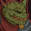
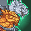
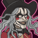
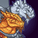

[Back to Main](index.md)

# Content Drops

A list of the upcoming content drops. Just be aware that the dates and order of these content drops are educated guesses based on the order their graphics appear in the definitions. CNE have been known to release content drops in different orders - so don't be surprised if that happens again.

## Mixed 10 Variants - 29 April 2026

    
        
            **Icon**
        
        
            **Campaign**
        
        
            **Adventure Name**
        
        
            **Type**
        
    
    
        
             
        
        
            Grand Tour
        
        
            Madness of Zuggtmoy
        
        
            Variant #3
        
    
    
        
             
        
        
            Grand Tour
        
        
            The Cult of Lolth
        
        
            Variant #3
        
    
    
        
             
        
        
            Xaryxis
        
        
            Foul Play
        
        
            Variant #3
        
    
    
        
             
        
        
            Xaryxis
        
        
            Into Xaryxispace
        
        
            Variant #3
        
    
    
        
             
        
        
            Xaryxis
        
        
            Spelljammers in Training
        
        
            Variant #3
        
    
    
        
             
        
        
            Xaryxis
        
        
            The Battle of Xaryxis
        
        
            Variant #3
        
    
    
        
             
        
        
            Fortune's Wheel
        
        
            The End is the Beginning
        
        
            Variant #3
        
    
    
        
             
        
        
            Fortune's Wheel
        
        
            Welcome to Sigil
        
        
            Variant #3
        
    
    
        
             
        
        
            Vecna
        
        
            Vecnas Grasp
        
        
            Variant #2
        
    
    
        
             
        
        
            Vecna
        
        
            The Ruinous Citadel
        
        
            Variant #2
        
    

## Tales 9 - 27 May 2026

This Tales drop will allow unlocking Birdsong and Tess.

ⓘ This content drop might be joined by new [Blessings](blessings.md){:target="_blank"}.

    
        
            **Icon**
        
        
            **Campaign**
        
        
            **Adventure Name**
        
        
            **Type**
        
    
    
        
            
        
        
            Tales
        
        
            Kindred Spirits
        
        
            Adventure
        
    
    
        
             
        
        
            Tales
        
        
            Kindred Spirits
        
        
            Variant #1
        
    
    
        
             
        
        
            Tales
        
        
            Kindred Spirits
        
        
            Variant #2
        
    
    
        
             
        
        
            Tales
        
        
            Kindred Spirits
        
        
            Variant #3
        
    
    
        
            
        
        
            Tales
        
        
            Making it Work
        
        
            Adventure
        
    
    
        
             
        
        
            Tales
        
        
            Making it Work
        
        
            Variant #1
        
    
    
        
             
        
        
            Tales
        
        
            Making it Work
        
        
            Variant #2
        
    
    
        
             
        
        
            Tales
        
        
            Making it Work
        
        
            Variant #3
        
    

## Tales 10 - 24 June 2026

    
        
            **Icon**
        
        
            **Campaign**
        
        
            **Adventure Name**
        
        
            **Type**
        
    
    
        
            
        
        
            Tales
        
        
            Champions of Waterdeep
        
        
            Adventure
        
    
    
        
             
        
        
            Tales
        
        
            Champions of Waterdeep
        
        
            Variant #1
        
    
    
        
             
        
        
            Tales
        
        
            Champions of Waterdeep
        
        
            Variant #2
        
    
    
        
             
        
        
            Tales
        
        
            Champions of Waterdeep
        
        
            Variant #3
        
    
    
        
            
        
        
            Tales
        
        
            The Sleeper Awakes
        
        
            Adventure
        
    
    
        
             
        
        
            Tales
        
        
            The Sleeper Awakes
        
        
            Variant #1
        
    
    
        
             
        
        
            Tales
        
        
            The Sleeper Awakes
        
        
            Variant #2
        
    
    
        
             
        
        
            Tales
        
        
            The Sleeper Awakes
        
        
            Variant #3
        
    

[Back to Top](#top)

*Last Modified: {{ site.time }}*