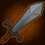
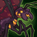

[Back to Main](index.md)

# Content Drops

A list of the upcoming content drops. Just be aware that the dates and order of these content drops are educated guesses based on the order their graphics appear in the definitions. CNE have been known to release content drops in different orders - so don't be surprised if that happens again.

## Tales 5 - 23 December 2025

This Tales drop will allow unlocking Kas and Nordom.

ⓘ This content drop might be joined by new [Blessings](blessings.md).

    
        
            **Icon**
        
        
            **Campaign**
        
        
            **Adventure Name**
        
        
            **Type**
        
    
    
        
            
        
        
            Tales
        
        
            Ashes of the Past
        
        
            Adventure
        
    
    
        
            
        
        
            Tales
        
        
            Ashes of the Past: Var1
        
        
            Adventure
        
    
    
        
            
        
        
            Tales
        
        
            Ashes of the Past: Var2
        
        
            Adventure
        
    
    
        
            
        
        
            Tales
        
        
            Ashes of the Past: Var3
        
        
            Adventure
        
    
    
        
            
        
        
            Tales
        
        
            Case File9717
        
        
            Adventure
        
    
    
        
            
        
        
            Tales
        
        
            Case File9717: Var1
        
        
            Adventure
        
    
    
        
            
        
        
            Tales
        
        
            Case File9717: Var2
        
        
            Adventure
        
    
    
        
            
        
        
            Tales
        
        
            Case File9717: Var3
        
        
            Adventure
        
    

## Mixed 12 Variants - 30 December 2025

    
        
            **Icon**
        
        
            **Campaign**
        
        
            **Adventure Name**
        
        
            **Type**
        
    
    
        
             
        
        
            Grand Tour
        
        
            Castle Thousand Vecnas
        
        
            Variant #3
        
    
    
        
             
        
        
            Grand Tour
        
        
            Dread Domain Tovag
        
        
            Variant #3
        
    
    
        
             
        
        
            Grand Tour
        
        
            Sanctum of the Sword
        
        
            Variant #3
        
    
    
        
             
        
        
            Xaryxis
        
        
            Flight of the Kindori Pod
        
        
            Variant #3
        
    
    
        
             
        
        
            Xaryxis
        
        
            Rock and Roll
        
        
            Variant #3
        
    
    
        
             
        
        
            Xaryxis
        
        
            Rocky Reception
        
        
            Variant #3
        
    
    
        
             
        
        
            Xaryxis
        
        
            Topolahs Tower
        
        
            Variant #3
        
    
    
        
             
        
        
            Fortune's Wheel
        
        
            The Beginning is the End
        
        
            Variant #3
        
    
    
        
             
        
        
            Fortune's Wheel
        
        
            Souls Mirage
        
        
            Variant #2
        
    
    
        
             
        
        
            Vecna
        
        
            Isle of Serpents
        
        
            Variant #2
        
    
    
        
             
        
        
            Vecna
        
        
            Tomb of Wayward Souls
        
        
            Variant #2
        
    
    
        
             
        
        
            Vecna
        
        
            Hellbound
        
        
            Variant #2
        
    

## Tales 6 - 28 January 2026

This Tales drop will allow unlocking Ravengard and Spurt.

    
        
            **Icon**
        
        
            **Campaign**
        
        
            **Adventure Name**
        
        
            **Type**
        
    
    
        
            
        
        
            Tales
        
        
            Legacy
        
        
            Adventure
        
    
    
        
             
        
        
            Tales
        
        
            Legacy:
        
        
            Variant #1
        
    
    
        
             
        
        
            Tales
        
        
            Legacy:
        
        
            Variant #2
        
    
    
        
             
        
        
            Tales
        
        
            Legacy:
        
        
            Variant #3
        
    
    
        
            
        
        
            Tales
        
        
            Ultimate Treasure
        
        
            Adventure
        
    
    
        
             
        
        
            Tales
        
        
            Ultimate Treasure:
        
        
            Variant #1
        
    
    
        
             
        
        
            Tales
        
        
            Ultimate Treasure:
        
        
            Variant #2
        
    
    
        
             
        
        
            Tales
        
        
            Ultimate Treasure:
        
        
            Variant #3
        
    

## Tales 7 - 25 February 2026

This Tales drop will allow unlocking Baeloth and Shadowheart.

ⓘ This content drop might be joined by new [Blessings](blessings.md).

    
        
            **Icon**
        
        
            **Campaign**
        
        
            **Adventure Name**
        
        
            **Type**
        
    
    
        
            
        
        
            Tales
        
        
            Battle Brawl
        
        
            Adventure
        
    
    
        
             
        
        
            Tales
        
        
            Battle Brawl:
        
        
            Variant #1
        
    
    
        
             
        
        
            Tales
        
        
            Battle Brawl:
        
        
            Variant #2
        
    
    
        
             
        
        
            Tales
        
        
            Battle Brawl:
        
        
            Variant #3
        
    
    
        
            
        
        
            Tales
        
        
            Dark Moon
        
        
            Adventure
        
    
    
        
             
        
        
            Tales
        
        
            Dark Moon
        
        
            Variant #1
        
    
    
        
             
        
        
            Tales
        
        
            Dark Moon
        
        
            Variant #2
        
    
    
        
             
        
        
            Tales
        
        
            Dark Moon
        
        
            Variant #3
        
    

## Mixed 12 Variants - 25 March 2026

    
        
            **Icon**
        
        
            **Campaign**
        
        
            **Adventure Name**
        
        
            **Type**
        
    
    
        
             
        
        
            Grand Tour
        
        
            Checkmate
        
        
            Variant #3
        
    
    
        
             
        
        
            Grand Tour
        
        
            Get Back in the Castle
        
        
            Variant #3
        
    
    
        
             
        
        
            Grand Tour
        
        
            Vecna Out
        
        
            Variant #3
        
    
    
        
             
        
        
            Xaryxis
        
        
            Hunt for the Last Breath
        
        
            Variant #3
        
    
    
        
             
        
        
            Xaryxis
        
        
            The Arena of Blood
        
        
            Variant #3
        
    
    
        
             
        
        
            Xaryxis
        
        
            The Jungles of Doomspace
        
        
            Variant #3
        
    
    
        
             
        
        
            Xaryxis
        
        
            To Infinitys and Beyond
        
        
            Variant #3
        
    
    
        
             
        
        
            Fortune's Wheel
        
        
            Shemeshkas Gambit
        
        
            Variant #2
        
    
    
        
             
        
        
            Fortune's Wheel
        
        
            Tyrants Spiral
        
        
            Variant #2
        
    
    
        
             
        
        
            Vecna
        
        
            The Red Belvedere
        
        
            Variant #2
        
    
    
        
             
        
        
            Vecna
        
        
            Pandemonium
        
        
            Variant #2
        
    
    
        
             
        
        
            Vecna
        
        
            The War of Pandesmos
        
        
            Variant #2
        
    

[Back to Top](#top)

*Last Modified: {{ site.time }}*