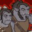

[Back to Main](index.md)

    
        
            
        
        
            Portrait
        
    

# Corazón

Dashing Human Pirate Rogue Corazón de Ballena grew up as posh Percival Milquetoast, heir to the Milquetoast estate, but he left it all behind - partly for adventure on the high seas, partly to spite his terrible, terrible dad.  Corazón is on a long-term quest to save the former crew of his ship, The Joyful Damnation, from a curse that he is at least partially responsible for. In the short term, the Joyful Damnation has become the Oxventurers' preferred mode of transportation. Corazón likes to avoid getting his hands dirty, preferring to use fast talking, deception and sheer force of personality to get around trouble. If things come down to a fight, he likes to stay stealthy, hiding, or darting in to take on foes one on one like a true swashbuckler.  And if that fails he can always fall back on the old classic, Grease, the world's best spell. According to him, And only him.

# Changes

Corazón will be a reworked champion in the Highharvestide event on 2 September 2026.

Only abilities that have seen some changes will be displayed here - and be aware that there's a lot of guesswork involved. Some abilities may not have names - some may have the *wrong* names - or specialisations might not be marked as such - etc.. Focus on the effect data itself.

Please do me a favour and don't get all melodramatic about what you find here. I - and CNE - don't appreciate it. These are spoilers and will almost certainly change before release - likely multiple times. That and we don't have access to any upgrade data prior to release. Making assumptions on how the champions will turn out based on this information would be premature.

# Attacks

**Base Attack: Shadow Step** (Guess)
> Corazón attacks a random enemy from the shadows.  
> Cooldown: 4.8s (Cap 1.2s)

<em>Raw Data</em>

<pre>
{
    "id": 1001,
    "name": "Shadow Step",
    "description": "Corazón attacks a random enemy from the shadows.",
    "long_description": "Corazón attacks a random enemy from the shadows.",
    "graphic_id": 0,
    "target": "random",
    "num_targets": 1,
    "aoe_radius": 0,
    "damage_modifier": 1,
    "cooldown": 4.8,
    "animations": [
        {
            "type": "melee_attack",
            "animation": "backstab",
            "target_offset_x": 180,
            "sound_frames": {
                "2": 179
            }
        }
    ],
    "tags": [
        "melee, magic"
    ],
    "damage_types": [
        "melee, magic"
    ]
}
</pre>

# Abilities

**Pirate's Code** (Guess)
> Corazón increases the damage of all Neutral (Good/Evil axis) Champions in the formation by 100% for each affected Champion.

ⓘ *Note: This ability is prestack.*

<em>Raw Data</em>

<pre>
{
    "id": 2883,
    "flavour_text": "",
    "description": {
        "desc": "$(source_hero) increases the damage of all Neutral (Good/Evil axis) Champions in the formation by $(amount)% for each affected Champion."
    },
    "effect_keys": [
        {
            "effect_string": "pre_stack,100"
        },
        {
            "off_when_benched": true,
            "effect_string": "hero_dps_multiplier_mult,0",
            "amount_expr": "upgrade_amount(20276,0)",
            "amount_func": "mult",
            "stack_func": "per_hero_attribute",
            "per_hero_expr": "HasTag(`geneutral`)",
            "targets": [
                "all"
            ],
            "filter_targets": [
                {
                    "type": "by_tags",
                    "tags": "geneutral"
                }
            ],
            "show_bonus": true
        }
    ],
    "requirements": "",
    "graphic_id": 11429,
    "large_graphic_id": 11425,
    "properties": {
        "is_formation_ability": true,
        "owner_use_outgoing_description": true,
        "indexed_effect_properties": true,
        "per_effect_index_bonuses": true,
        "default_bonus_index": 0
    }
}
</pre>

**Honorary Crewmates** (Guess)
> All Champions adjacent to Corazón gain the Neutral tag (along the good/evil spectrum), and the BASE effect of Pirate's Code is increased by 100% for each Champion that was not Neutral before.

<em>Raw Data</em>

<pre>
{
    "id": 2884,
    "flavour_text": "",
    "description": {
        "conditions": [
            {
                "condition": "upgrade_purchased 20280",
                "desc": "All Champions non-adjacent to Corazón gain the Neutral tag (along the good/evil spectrum), and the BASE effect of Pirate's Code is increased by 100% for each Champion that was not Neutral before."
            },
            {
                "desc": "All Champions adjacent to Corazón gain the Neutral tag (along the good/evil spectrum), and the BASE effect of Pirate's Code is increased by 100% for each Champion that was not Neutral before."
            }
        ]
    },
    "effect_keys": [
        {
            "off_when_benched": true,
            "effect_string": "add_hero_tags,0,geneutral",
            "targets": [
                "adj"
            ],
            "hide_amount_rate": true
        },
        {
            "effect_string": "buff_upgrade,100,20276",
            "amount_func": "mult",
            "stack_func": "per_hero_attribute",
            "per_hero_expr": "HasTag(`geneutral`) && !DefHasTag(`geneutral`)",
            "show_bonus": true
        }
    ],
    "requirements": "",
    "graphic_id": 11428,
    "large_graphic_id": 11424,
    "properties": {
        "is_formation_ability": true,
        "owner_use_outgoing_description": true
    }
}
</pre>

**G.O.A.T. Pirate** (Guess)
> Increase the effect of Pirate's Code by 25% each time a Champion affected by Pirate's Code attacks, stacking multiplicatively up to 100 times. Resets when a boss area is completed.

<em>Raw Data</em>

<pre>
{
    "id": 2885,
    "flavour_text": "",
    "description": {
        "desc": "Increase the effect of Pirate's Code by $(not_buffed amount)% each time a Champion affected by Pirate's Code attacks, stacking multiplicatively up to 100 times. Resets when a boss area is completed."
    },
    "effect_keys": [
        {
            "effect_string": "buff_upgrade,25,20276,1",
            "stacks_on_trigger": "champion_affected_by_upg_attacked,20276",
            "more_triggers": [
                {
                    "trigger": "boss_area_complete",
                    "action": {
                        "type": "reset"
                    }
                }
            ],
            "max_stacks": 100,
            "stacks_multiply": true,
            "show_bonus": true
        }
    ],
    "requirements": "",
    "graphic_id": 11426,
    "large_graphic_id": 11422,
    "properties": {
        "is_formation_ability": true,
        "owner_use_outgoing_description": true,
        "indexed_effect_properties": true,
        "per_effect_index_bonuses": true,
        "default_bonus_index": 0
    }
}
</pre>

# Specialisations

**Specialisation: Distant Crewmates** (Guess)
> Corazón's Honorary Crewmates ability now affects all non-adjacent Champions instead of adjacent ones.

<em>Raw Data</em>

<pre>
{
    "id": 2886,
    "flavour_text": "",
    "description": {
        "desc": "$(source_hero)'s Honorary Crewmates ability now affects all non-adjacent Champions instead of adjacent ones."
    },
    "effect_keys": [
        {
            "effect_string": "change_upgrade_targets,20278",
            "new_targets": "non_adj",
            "effect_index": 0
        }
    ],
    "requirements": "",
    "graphic_id": 11430,
    "large_graphic_id": 0,
    "properties": {
        "is_formation_ability": true,
        "owner_use_outgoing_description": true,
        "type": "upgrade"
    }
}
</pre>

**Specialisation: Mage Hand** (Guess)
> Grease puddles now form under the furthest enemy from the formation instead of under the enemy attacked. Effect of the puddles is increased by 10% multiplicitively. This has the added effect of making his base attack also count as a magic attack.

<em>Raw Data</em>

<pre>
{
    "id": 2887,
    "flavour_text": "",
    "description": {
        "desc": "Grease puddles now form under the furthest enemy from the formation instead of under the enemy attacked. Effect of the puddles is increased by $(amount)% multiplicitively. This has the added effect of making his base attack also count as a magic attack."
    },
    "effect_keys": [
        {
            "off_when_benched": true,
            "effect_string": "buff_upgrade,10,20277"
        },
        {
            "effect_string": "change_base_attack,1001"
        }
    ],
    "requirements": "",
    "graphic_id": 11431,
    "large_graphic_id": 0,
    "properties": {
        "is_formation_ability": true,
        "owner_use_outgoing_description": true,
        "type": "upgrade"
    }
}
</pre>

# Adventures and Variants

**Unlock Adventure: Brightly into Darkness (Corazón)** (Complete Area 50)
> Help the Harpells track down a lost artifact.

 **Variant 1: A Pirate's Curse** (Complete Area 75)
> Corazón starts in the formation and can't be moved or removed.  Every area cursed pirate ghosts appear. When a cursed pirate ghost attacks a Champion, they are stunned for 1 second. Only Corazón can deal damage to the cursed pirate ghosts, and he prioritizes attacking them over anything else.

 **Variant 2: Grease the Wheels** (Complete Area 125)
> In every boss area an orc war wagon appears to hamper the Champions' progress. The war wagon must also be defeated in order to progress. The effects of Corazón's Grease ability are doubled against the War Wagon. Getting to know Corazón: Not only does Grease slow enemies, but if you time Corazón's ultimate correctly, you can unleash a massive firestorm, burning the enemies as they slip and slide through the grease puddles!

 **Variant 3: Haunted by the Past** (Complete Area 175)
> Corazón starts in the formation and can't be moved or removed. Two cursed pirate ghosts join the formation, watching and judging Corazón. Every 25 areas they change positions. Cursed pirate ghosts increase the base attack cooldown of adjacent Champions by 1 second. Neutral Champions (on the good/evil spectrum), deal 100% additional damage.

# Formation

    <svg xmlns="http://www.w3.org/2000/svg" id="Corazón" fill="#aaa" data-formationName="Corazón" data-campaignName="Highharvestide" width="319" height="140"><circle cx="175" cy="65" r="15"/><circle cx="135" cy="85" r="15"/><circle cx="135" cy="125" r="15"/><circle cx="95" cy="25" r="15"/><circle cx="95" cy="65" r="15"/><circle cx="95" cy="105" r="15"/><circle cx="55" cy="85" r="15"/><circle cx="15" cy="25" r="15"/><circle cx="15" cy="65" r="15"/><circle cx="15" cy="105" r="15"/><text x="205" y="25" fill="#dcdcdc" font-size="25" font-family="Arial" font-weight="bold">Corazón</text><text x="205" y="65" fill="#dcdcdc" font-size="15" font-family="Arial" font-weight="bold">Highharvestide</text></svg>

[Back to Top](#top)

*Last Modified: {{ site.time }}*