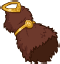
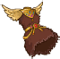
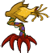
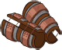
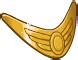
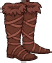
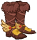

[Back to Main](index.md)

    
        Portait
    
    
        Model
    

# Diana

Diana was already a formidable gymnast when she and her friends were transported to the magical world of Dungeons & Dragons. Diana wields her Javelin Staff with determination and courage, harnessing its potent magic to triumph over countless obstacles. The confidence of this outspoken athlete propels her friends forward in their quest to return home.

# Basic Information

Diana will be the new champion in the The Great Modron March event on 1 May 2024.

    
        
            **Seat**:
        
        
            9
        
        
            **Stat**
        
        
            **Value**
        
        
            **Day 1 Trials**
        
        
            **Patrons**
        
    
    
        
            **Race**:
        
        
            Human
        
        
            **Strength**:
        
        
            12
        
        
            Yes
        
        
            Mirt
        
    
    
        
            **Class**:
        
        
            Monk
        
        
            **Dexterity**:
        
        
            16
        
        
            Yes
        
        
            -
        
    
    
        
            **Roles**:
        
        
            Support / Speed
        
        
            **Constitution**:
        
        
            12
        
        
            Yes
        
        
            -
        
    
    
        
            **Age**:
        
        
            14
        
        
            **Intelligence**:
        
        
            11
        
        
            Yes
        
        
            -
        
    
    
        
            **Gender**:
        
        
            Female
        
        
            **Wisdom**:
        
        
            13
        
        
            Yes
        
        
            Elminster
        
    
    
        
            **Alignment**:
        
        
            Lawful Good
        
        
            **Charisma**:
        
        
            11
        
        
            Yes
        
        
            &nbsp;
        
    
    
        
            **Affiliation**:
        
        
            Saturday Morning Squad
        
        
            **Total**:
        
        
            75
        
        
            Champion ID:
        
        
            148
        
    

# Formation

    <svg xmlns="http://www.w3.org/2000/svg" id="Diana" fill="#aaa" data-formationName="Diana" data-campaignName="The Great Modron March" width="389" height="160"><circle cx="175" cy="65" r="15"/><circle cx="175" cy="105" r="15"/><circle cx="135" cy="45" r="15"/><circle cx="95" cy="25" r="15"/><circle cx="95" cy="65" r="15"/><circle cx="95" cy="145" r="15"/><circle cx="55" cy="45" r="15"/><circle cx="55" cy="125" r="15"/><circle cx="15" cy="65" r="15"/><circle cx="15" cy="105" r="15"/><text x="205" y="25" fill="#dcdcdc" font-size="25" font-family="Arial" font-weight="bold">Diana</text><text x="205" y="65" fill="#dcdcdc" font-size="15" font-family="Arial" font-weight="bold">The Great Modron March</text></svg>

# Abilities

 **Base Attack: Javelin Staff** (Melee)
> Diana attacks a random enemy with her Javelin staff.  
> Cooldown: 4s (Cap 1s)

<em>Raw Data</em>

<pre>
{
    "id": 748,
    "name": "Javelin Staff",
    "description": "Diana attacks a random enemy with her Javelin staff.",
    "long_description": "",
    "graphic_id": 0,
    "target": "random",
    "num_targets": 1,
    "aoe_radius": 0,
    "damage_modifier": 1,
    "cooldown": 4,
    "animations": [
        {
            "type": "melee_attack",
            "target_offset_x": -40,
            "damage_frame": 6,
            "jump_sound": 30,
            "sound_frames": {
                "2": 194
            }
        }
    ],
    "tags": [
        "melee"
    ],
    "damage_types": [
        "melee"
    ]
}
</pre>

 **Base Attack: Javelin Staff** (Melee)
> Diana attacks a random enemy with her Javelin staff.  
> Cooldown: 4s (Cap 1s)

<em>Raw Data</em>

<pre>
{
    "id": 750,
    "name": "Javelin Staff",
    "description": "Diana attacks a random enemy with her Javelin staff.",
    "long_description": "",
    "graphic_id": 0,
    "target": "random",
    "num_targets": 1,
    "aoe_radius": 0,
    "damage_modifier": 1,
    "cooldown": 4,
    "animations": [
        {
            "type": "melee_attack",
            "attack_seq": "attack_b",
            "target_offset_x": 80,
            "damage_frame": 13,
            "jump_sound": 30,
            "sound_frames": {
                "2": 194
            }
        }
    ],
    "tags": [
        "melee"
    ],
    "damage_types": [
        "melee"
    ]
}
</pre>

 **Ultimate Attack: Javelin Staff Throw** (Level: 160)
> Diana throws her Javelin Staff, dealing ultimate damage 10 times to random enemies and stunning them for 5 seconds.  
> Cooldown: 240s (Cap 60s)

<em>Raw Data</em>

<pre>
{
    "id": 749,
    "name": "Javelin Staff Throw",
    "description": "Diana hits up to 10 enemies for ultimate damage, stunning them for 5 seconds.",
    "long_description": "Diana throws her Javelin Staff, dealing ultimate damage 10 times to random enemies and stunning them for 5 seconds.",
    "graphic_id": 23369,
    "target": "random",
    "num_targets": 1,
    "aoe_radius": 0,
    "damage_modifier": 0.03,
    "cooldown": 240,
    "animations": [
        {
            "type": "ultimate_attack",
            "ultimate": "diana",
            "stun_duration": 5,
            "max_hits": 10,
            "staff_graphic_id": 23190,
            "projectile_throw_speed": 1600,
            "projectile_bounce_speed": 1600,
            "projectile_return_speed": 1600,
            "projectile_impact_graphic_id": 58
        }
    ],
    "tags": [
        "ultimate",
        "ranged",
        "aoe"
    ],
    "damage_types": []
}
</pre>

 **Javelin Staff** (Level: 20)
> Diana's base attack, Javelin Staff, knocks around enemies she hits based on where she is positioned in her column in the formation.

<em>Raw Data</em>

<pre>
{
    "id": 14794,
    "hero_id": 148,
    "required_level": 20,
    "required_upgrade_id": 0,
    "upgrade_type": "unlock_ability",
    "effect": "effect_def,1944",
    "static_dps_mult": null,
    "default_enabled": 1,
    "name": "Javelin Staff"
}
{
    "id": 1944,
    "flavour_text": "",
    "description": {
        "desc": "Diana's base attack, Javelin Staff, knocks around enemies she hits based on where she is positioned in her column in the formation.",
        "post": {
            "conditions": [
                {
                    "condition": "not static_desc",
                    "desc": "^^$diana_javelin_staff_desc"
                }
            ]
        }
    },
    "effect_keys": [
        {
            "off_when_benched": true,
            "effect_string": "diana_javelin_staff",
            "top_pos_data": {
                "push_dir": [
                    120,
                    130
                ],
                "monster_retargets": true
            },
            "middle_pos_data": {
                "apply_ek_at_index": 1,
                "push_dir": [
                    -150,
                    0
                ]
            },
            "bottom_pos_data": {
                "push_dir": [
                    120,
                    -130
                ],
                "monster_retargets": true
            },
            "single_slot_pos_data": {
                "push_dir": [
                    300,
                    0
                ]
            }
        },
        {
            "apply_manually": true,
            "effect_string": "change_base_attack,750"
        }
    ],
    "requirements": "",
    "graphic_id": 23215,
    "large_graphic_id": 23212,
    "properties": {
        "is_formation_ability": true,
        "owner_use_outgoing_description": true,
        "retain_on_slot_changed": true
    }
}
</pre>

 **We'll Be Right Back** (Level: 100)
> Diana increases the speed of area transitions by 50% (caps at 400%).

<em>Raw Data</em>

<pre>
{
    "id": 14795,
    "hero_id": 148,
    "required_level": 100,
    "required_upgrade_id": 0,
    "upgrade_type": "unlock_ability",
    "effect": "effect_def,1945",
    "static_dps_mult": null,
    "default_enabled": 1,
    "name": "We'll Be Right Back",
    "tip_text": "Diana increases the speed of area transitions, enabling you to complete adventures faster!"
}
{
    "id": 1945,
    "flavour_text": "",
    "description": {
        "conditions": [
            {
                "condition": "compare amount > 400",
                "desc": "Diana increases the speed of area transitions by 400% (caps at $effect_cap%)."
            },
            {
                "desc": "Diana increases the speed of area transitions by $amount% (caps at $effect_cap%)."
            }
        ]
    },
    "effect_keys": [
        {
            "off_when_benched": true,
            "effect_string": "area_transition_time_scale,50",
            "effect_cap": 400
        }
    ],
    "requirements": "",
    "graphic_id": 23216,
    "large_graphic_id": 23213,
    "properties": {
        "is_formation_ability": true,
        "owner_use_outgoing_description": true
    }
}
</pre>

 **Electrum Chest Scavenger** (Level: 200)
> Diana can help scavenge up to 20 additional Electrum Chests when killing bosses. While this cap is not reached, Diana has a 0.5% chance of scavenging 1 Electrum Chest each time a boss drops a loot bag. The cap increases by 0.5 every day.

<em>Raw Data</em>

<pre>
{
    "id": 14798,
    "hero_id": 148,
    "required_level": 200,
    "required_upgrade_id": 0,
    "upgrade_type": "unlock_ability",
    "effect": "effect_def,1948",
    "static_dps_mult": null,
    "default_enabled": 1,
    "name": "Electrum Chest Scavenger",
    "tip_text": "Diana has a chance to discover Electrum Chests with each defeated boss, with a cap that increases every day."
}
{
    "id": 1948,
    "flavour_text": "",
    "description": {
        "desc": "Diana can help scavenge up to $(current_scavenge_cap diana_electrum_scavenger floor) additional Electrum Chests when killing bosses. While this cap is not reached, Diana has a $amount% chance of scavenging 1 Electrum Chest each time a boss drops a loot bag. The cap increases by $cap_increase_per_day every day.",
        "post": {
            "conditions": [
                {
                    "condition": "not static_desc",
                    "desc": "^^Electrum Chests Scavenged: $(stat_value diana_electrum_collected 0 none) ($(stat_value diana_electrum_collected_this_adventure 1 none) this adventure)"
                }
            ]
        }
    },
    "effect_keys": [
        {
            "off_when_benched": true,
            "effect_string": "scavenge_items,0.5",
            "id": "diana_electrum_scavenger",
            "item_type": "chest",
            "item_id": 282,
            "initial_cap": 20,
            "cap_increase_per_day": 0.5,
            "start_date": "2024-05-01 12:00:00",
            "total_collected_stat": "diana_electrum_collected",
            "adventure_collected_stat": "diana_electrum_collected_this_adventure",
            "upgrade_id": 14798
        }
    ],
    "requirements": "",
    "graphic_id": 23214,
    "large_graphic_id": 23211,
    "properties": {
        "is_formation_ability": true,
        "owner_use_outgoing_description": true
    }
}
</pre>

# Specialisations

 **Inspire: Acrobatic Assault** (Level: 60)
> Diana increases the damage of all Champions with a DEX of 15 or higher by 100%.

<em>Raw Data</em>

<pre>
{
    "id": 14791,
    "hero_id": 148,
    "required_level": 60,
    "required_upgrade_id": 0,
    "upgrade_type": null,
    "effect": "effect_def,1941",
    "static_dps_mult": null,
    "default_enabled": 1,
    "name": "Inspire: Acrobatic Assault",
    "specialization_name": "Inspire: Acrobatic Assault",
    "specialization_description": "Diana inspires her allies with her impressive feats of agility.",
    "specialization_graphic_id": 23238
}
{
    "id": 1941,
    "flavour_text": "",
    "description": {
        "desc": "Diana increases the damage of all Champions with a DEX of 15 or higher by $amount%."
    },
    "effect_keys": [
        {
            "off_when_benched": true,
            "effect_string": "hero_dps_multiplier_mult,100",
            "targets": [
                "all"
            ],
            "filter_targets": [
                {
                    "type": "hero_expr",
                    "hero_expr": "GetStat(`dex`)>=15"
                }
            ],
            "formation_arrows_for_effected_only": true,
            "retarget_when_any_hero_slot_changed": true,
            "retarget_when_ability_score_changed": [
                "dex"
            ]
        },
        {
            "off_when_benched": true,
            "effect_string": "expression_on_trigger,area_complete",
            "per_hero_expr": "GetStat(`dex`)>=15",
            "per_trigger_expr": "AppendToSaveStat(`diana_thats_what_i_call_teamwork`, false, trigger_count * as_int(per_hero_count >= 10))"
        }
    ],
    "requirements": "",
    "graphic_id": 23238,
    "large_graphic_id": 23238,
    "properties": {
        "is_formation_ability": true,
        "owner_use_outgoing_description": true
    }
}
</pre>

 **Inspire: Fledgling Fury** (Level: 60)
> Diana increases the damage of all Champions that are 20 years old or younger by 100%.

<em>Raw Data</em>

<pre>
{
    "id": 14793,
    "hero_id": 148,
    "required_level": 60,
    "required_upgrade_id": 0,
    "upgrade_type": null,
    "effect": "effect_def,1943",
    "static_dps_mult": null,
    "default_enabled": 1,
    "name": "Inspire: Fledgling Fury",
    "specialization_name": "Inspire: Fledgling Fury",
    "specialization_description": "Diana inspires her allies to match her youthful exuberance.",
    "specialization_graphic_id": 23240
}
{
    "id": 1943,
    "flavour_text": "",
    "description": {
        "desc": "Diana increases the damage of all Champions that are 20 years old or younger by $amount%."
    },
    "effect_keys": [
        {
            "off_when_benched": true,
            "effect_string": "hero_dps_multiplier_mult,100",
            "targets": [
                "all"
            ],
            "filter_targets": [
                {
                    "type": "hero_expr",
                    "hero_expr": "age<=20&&hero_id!=146"
                }
            ],
            "formation_arrows_for_effected_only": true,
            "retarget_when_any_hero_slot_changed": true
        },
        {
            "off_when_benched": true,
            "effect_string": "expression_on_trigger,area_complete",
            "per_hero_expr": "age<=20&&hero_id!=146",
            "per_trigger_expr": "AppendToSaveStat(`diana_thats_what_i_call_teamwork`, false, trigger_count * as_int(per_hero_count >= 10))"
        }
    ],
    "requirements": "",
    "graphic_id": 23240,
    "large_graphic_id": 23240,
    "properties": {
        "is_formation_ability": true,
        "owner_use_outgoing_description": true
    }
}
</pre>

 **Inspire: Modest Might** (Level: 60)
> Diana increases the damage of all Champions with a total ability score of 78 or less by 100%.

<em>Raw Data</em>

<pre>
{
    "id": 14792,
    "hero_id": 148,
    "required_level": 60,
    "required_upgrade_id": 0,
    "upgrade_type": null,
    "effect": "effect_def,1942",
    "static_dps_mult": null,
    "default_enabled": 1,
    "name": "Inspire: Modest Might",
    "specialization_name": "Inspire: Modest Might",
    "specialization_description": "Diana inspires her allies to do the best with what they have.",
    "specialization_graphic_id": 23241
}
{
    "id": 1942,
    "flavour_text": "",
    "description": {
        "desc": "Diana increases the damage of all Champions with a total ability score of 78 or less by $amount%."
    },
    "effect_keys": [
        {
            "off_when_benched": true,
            "effect_string": "hero_dps_multiplier_mult,100",
            "targets": [
                "all"
            ],
            "filter_targets": [
                {
                    "type": "hero_expr",
                    "hero_expr": "GetStat(`total_ability_score`)<=78"
                }
            ],
            "formation_arrows_for_effected_only": true,
            "retarget_when_any_hero_slot_changed": true,
            "retarget_when_ability_score_changed": [
                "str",
                "dex",
                "con",
                "int",
                "wis",
                "cha"
            ]
        },
        {
            "off_when_benched": true,
            "effect_string": "expression_on_trigger,area_complete",
            "per_hero_expr": "GetStat(`total_ability_score`)<=78",
            "per_trigger_expr": "AppendToSaveStat(`diana_thats_what_i_call_teamwork`, false, trigger_count * as_int(per_hero_count >= 10))"
        }
    ],
    "requirements": "",
    "graphic_id": 23241,
    "large_graphic_id": 23241,
    "properties": {
        "is_formation_ability": true,
        "owner_use_outgoing_description": true
    }
}
</pre>

 **Ensemble Cast** (Level: 130)
> Diana increases the effect of her Inspire specialization choice by 100% for each Champion it affects, stacking multiplicatively.

ⓘ *Note: This ability is prestack.*

<em>Raw Data</em>

<pre>
{
    "id": 14796,
    "hero_id": 148,
    "required_level": 130,
    "required_upgrade_id": 0,
    "upgrade_type": null,
    "effect": "effect_def,1946",
    "static_dps_mult": null,
    "default_enabled": 1,
    "name": "Ensemble Cast",
    "specialization_name": "Ensemble Cast",
    "specialization_description": "Diana's inspiration relies on how the team works together.",
    "specialization_graphic_id": 23239
}
{
    "id": 1946,
    "flavour_text": "",
    "description": {
        "desc": "Diana increases the effect of her Inspire specialization choice by $amount% for each Champion it affects, stacking multiplicatively."
    },
    "effect_keys": [
        {
            "off_when_benched": true,
            "effect_string": "pre_stack_amount,100"
        },
        {
            "off_when_benched": true,
            "effect_string": "buff_upgrades,0,14791,14792,14793",
            "show_bonus": true,
            "amount_expr": "upgrade_amount(14796,0)",
            "amount_func": "mult",
            "stacks_multiply": true,
            "stack_func": "per_upgrade_targets",
            "stack_func_data": {
                "upgrade_ids": [
                    14791,
                    14792,
                    14793
                ]
            },
            "amount_updated_listeners": [
                "slot_changed"
            ]
        }
    ],
    "requirements": "",
    "graphic_id": 0,
    "large_graphic_id": 23239,
    "properties": {
        "is_formation_ability": true,
        "formation_circle_icon": false,
        "indexed_effect_properties": true,
        "per_effect_index_bonuses": true,
        "default_bonus_index": 0,
        "owner_use_outgoing_description": true,
        "spec_option_post_apply_info": "Champions Buffed: $num_stacks___2"
    }
}
</pre>

 **Spotlight Episode** (Level: 130)
> Diana increases the effect of her Inspire specialization choice by 140% for each Champion it does NOT affect, stacking multiplicatively.

ⓘ *Note: This ability is prestack.*

<em>Raw Data</em>

<pre>
{
    "id": 14797,
    "hero_id": 148,
    "required_level": 130,
    "required_upgrade_id": 0,
    "upgrade_type": null,
    "effect": "effect_def,1947",
    "static_dps_mult": null,
    "default_enabled": 1,
    "name": "Spotlight Episode",
    "specialization_name": "Spotlight Episode",
    "specialization_description": "Diana focuses on how one Champion stands out from the rest.",
    "specialization_graphic_id": 23242
}
{
    "id": 1947,
    "flavour_text": "",
    "description": {
        "desc": "Diana increases the effect of her Inspire specialization choice by $amount% for each Champion it does NOT affect, stacking multiplicatively."
    },
    "effect_keys": [
        {
            "off_when_benched": true,
            "effect_string": "pre_stack_amount,140"
        },
        {
            "off_when_benched": true,
            "effect_string": "buff_upgrades,0,14791,14792,14793",
            "show_bonus": true,
            "amount_expr": "upgrade_amount(14797,0)",
            "amount_func": "mult",
            "stacks_multiply": true,
            "stack_func": "per_non_upgrade_targets",
            "stack_func_data": {
                "upgrade_ids": [
                    14791,
                    14792,
                    14793
                ]
            },
            "amount_updated_listeners": [
                "slot_changed"
            ]
        }
    ],
    "requirements": "",
    "graphic_id": 0,
    "large_graphic_id": 23242,
    "properties": {
        "is_formation_ability": true,
        "formation_circle_icon": false,
        "indexed_effect_properties": true,
        "per_effect_index_bonuses": true,
        "default_bonus_index": 0,
        "owner_use_outgoing_description": true,
        "spec_option_post_apply_info": "Champions Not Buffed: $num_stacks___2"
    }
}
</pre>

# Items

    
        
            **Icons**
        
        
            **Slot**
        
        
            **Epic Name**
        
        
            **Effect**
        
    
    
        
            **Fun Shopping Day**I can still smell the food court...<code>global_dps_multiplier_mult,10</code>**Weekend Clothes**Gotta look my best for the amusement park!<code>global_dps_multiplier_mult,65</code>**Adventurer's Fur**Dungeon Master, this isn't really my style...<code>global_dps_multiplier_mult,120</code>**Mythic Armor**I can take on Venger with this!<code>global_dps_multiplier_mult,230</code>&nbsp;
        
        
            1
        
        
            Mythic Armor
        
        
            All Champion Damage
        
    
    
        
            **Mom's Reminder**Mom gave me this before I left the house. I hope she's okay...<code>buff_upgrade,25,14795</code>**Stylish Bandana**This really pulled my outfit together.<code>buff_upgrade,87.5,14795</code>**Band of Agility**Whoa! I would have won gold at EVERY gymnastics competition with this!<code>buff_upgrade,150,14795</code>**Encrusted Band**Tiamat doesn't stand a chance!<code>buff_upgrade,275,14795</code>
        
        
            2
        
        
            Encrusted Band
        
        
            We'll Be Right Back
        
    
    
        
            **A Gift for Sir John**Sometimes, people just need a distraction, no matter how small.<code>buff_upgrades,25,14791,14792,14793</code>**Beholder's Bane**This beauty defeats the eye of the beholder!<code>buff_upgrades,87.5,14791,14792,14793</code>**Remembrance of Kosar**You shall live in my heart forever... for all the starfalls to come...<code>buff_upgrades,150,14791,14792,14793</code>**Yellow Dragon**If this will help Bobby, we'll take the whole thing!<code>buff_upgrades,275,14791,14792,14793</code>
        
        
            3
        
        
            Yellow Dragon
        
        
            All First Specialisations
        
    
    
        
            **Dungeon Master's Favor**I don't know what we would do without Dungeon Master's help.<code>buff_upgrades,25,14796,14797</code>**Magic Bracers**I can block any blade with these!<code>buff_upgrades,87.5,14796,14797</code>**Belt of Jumping**Why fight danger when you can just jump over it!<code>buff_upgrades,150,14796,14797</code>**Amulet of Natural Armor**Ha! I didn't even feel that hit!<code>buff_upgrades,275,14796,14797</code>
        
        
            4
        
        
            Amulet of Natural Armor
        
        
            All Second Specialisations (Prestack)
        
    
    
        
            **Could Be Worse**This isn't the first time it's been broken...<code>buff_ultimate,25</code>**Self-Mending Staff**...and it won't be the last!<code>buff_ultimate,87.5</code>**Extending Javelin**There are no heights I can't reach!<code>buff_ultimate,150</code>**Weavebound Staff**Dungeon Master told me the Weave itself flows through this...<code>buff_ultimate,275</code>
        
        
            5
        
        
            Weavebound Staff
        
        
            Ultimate Damage
        
    
    
        
            **The Hot Trend**I had to do SO MANY extra chores to get these!<code>reduce_ultimate_cooldown,6</code>**Walking Boots**These should be comfortable for walking around a park all day.<code>reduce_ultimate_cooldown,12</code>**Boots of Fur**These are always comfortable and always warm!<code>reduce_ultimate_cooldown,24</code>**Boots of Speed**Just TRY to keep up!<code>reduce_ultimate_cooldown,60</code>
        
        
            6
        
        
            Boots of Speed
        
        
            Ultimate Cooldown Reduction Cap: 501 dull / 251 shiny / 126 golden.
        
    

<em>Item Names and Descriptions</em>

<pre>
Slot 1:
       Fun Shopping Day: I can still smell the food court...
        Weekend Clothes: Gotta look my best for the amusement park!
       Adventurer's Fur: Dungeon Master, this isn't really my style...
           Mythic Armor: I can take on Venger with this!

Slot 2:
         Mom's Reminder: Mom gave me this before I left the house. I hope she's okay...
        Stylish Bandana: This really pulled my outfit together.
        Band of Agility: Whoa! I would have won gold at EVERY gymnastics competition with this!
         Encrusted Band: Tiamat doesn't stand a chance!

Slot 3:
    A Gift for Sir John: Sometimes, people just need a distraction, no matter how small.
        Beholder's Bane: This beauty defeats the eye of the beholder!
   Remembrance of Kosar: You shall live in my heart forever... for all the starfalls to come...
          Yellow Dragon: If this will help Bobby, we'll take the whole thing!

Slot 4:
 Dungeon Master's Favor: I don't know what we would do without Dungeon Master's help.
          Magic Bracers: I can block any blade with these!
        Belt of Jumping: Why fight danger when you can just jump over it!
Amulet of Natural Armor: Ha! I didn't even feel that hit!

Slot 5:
         Could Be Worse: This isn't the first time it's been broken...
     Self-Mending Staff: ...and it won't be the last!
      Extending Javelin: There are no heights I can't reach!
       Weavebound Staff: Dungeon Master told me the Weave itself flows through this...

Slot 6:
          The Hot Trend: I had to do SO MANY extra chores to get these!
          Walking Boots: These should be comfortable for walking around a park all day.
           Boots of Fur: These are always comfortable and always warm!
         Boots of Speed: Just TRY to keep up!
</pre>

 

# Feats

This list will only show feats that are going to be available on the release of this champion. The separate [Feats](feats.md) page may show others that could be available later if they exist.

    
        
            **Feat**
        
        
            **Effect**
        
        
            **Source**
        
    
    
        
            **Selflessness (Diana)**Don't worry, we'll protect you!<code>global_dps_multiplier_mult,10</code>Selflessness
        
        
            10% All Champion Damage
        
        
            Free
        
    
    
        
            **Inspiring Leader (Diana)**If we're going to save Hank, we have to work together!<code>global_dps_multiplier_mult,25</code>Inspiring Leader
        
        
            25% All Champion Damage
        
        
            Gold Chest
        
    
    
        
            **Keep Up (Diana)**We can make it! Come on!<code>buff_upgrade,40,14795</code>Keep Up
        
        
            40% We'll Be Right Back
        
        
            12,500 Gems
        
    
    
        
            **Quickly Now (Diana)**They're no match for our speed!<code>buff_upgrade,80,14795</code>Quickly Now
        
        
            80% We'll Be Right Back
        
        
            50,000 Gems
        
    
    
        
            **Follow My Lead (Diana)**This is just like that time with the beholder.<code>buff_upgrades,20,14791,14792,14793</code>Follow My Lead
        
        
            20% All First Specialisations
        
        
            Free
        
    
    
        
            **All Together (Diana)**We've faced Tiamat - this is nothing!<code>buff_upgrades,40,14791,14792,14793</code>All Together
        
        
            40% All First Specialisations
        
        
            Gold Chest
        
    
    
        
            **Previously... (Diana)**Don't worry, Eric. What could go wrong?<code>buff_upgrades,20,14796,14797</code>Previously...
        
        
            20% All Second Specialisations (Prestack)
        
        
            Free
        
    
    
        
            **Don't Go Away! (Diana)**Oh no! It's Venger!<code>buff_upgrades,40,14796,14797</code>Don't Go Away!
        
        
            40% All Second Specialisations (Prestack)
        
        
            Gold Chest
        
    
    
        
            **Next Time... (Diana)**See, I told you it would be fine!<code>buff_upgrades,80,14796,14797</code>Next Time...
        
        
            80% All Second Specialisations (Prestack)
        
        
            Event Bonus
        
    
    
        
            **Silver Medal (Diana)**I'm fast, but not fast enough...<code>reduce_attack_cooldown,0.25</code>Silver Medal
        
        
            -0.25s Base Attack Cooldown
        
        
            Free
        
    
    
        
            **Gold Medal (Diana)**See this? It means I'm the fastest!<code>reduce_attack_cooldown,0.5</code>Gold Medal
        
        
            -0.5s Base Attack Cooldown
        
        
            12,500 Gems
        
    

# Legendaries

* Increases the damage of all Champions by 10% for each Champion in the formation.
* Increases the damage of all Female Champions by 125%.
* Increases the damage of all Human Champions by 150%.
* Increases the damage of all Champions with a WIS score of 11 or higher by 100%.
* Increases the damage of all Champions by 20% for each Champion with a STR score of 11 or higher in the formation.
* Increases the damage of all Lawful Champions by 150%.

<em>DPS Applicable</em>

<pre>
     Arkhan: 3 / 6
    Artemis: 5 / 6
    Asharra: 5 / 6
      Azaka: 5 / 6
     Binwin: 4 / 6
Black Viper: 5 / 6
 Catti-brie: 5 / 6
     D'hani: 4 / 6
  Dark Urge: 2 / 6
     Delina: 4 / 6
    Dhadius: 3 / 6
    Farideh: 4 / 6
        Fen: 4 / 6
      Grimm: 3 / 6
     Gromma: 5 / 6
       Ishi: 4 / 6
    Jamilah: 5 / 6
   Jarlaxle: 3 / 6
        Jim: 4 / 6
    Karlach: 4 / 6
       Kent: 2 / 6
      Krond: 3 / 6
       Krux: 4 / 6
    Lae'zel: 5 / 6
     Lucius: 4 / 6
      Minsc: 3 / 6
      NERDS: 3 / 6
     Nahara: 4 / 6
      Nixie: 3 / 6
     Orisha: 4 / 6
   Prudence: 4 / 6
      Rosie: 4 / 6
      Strix: 4 / 6
    Torogar: 3 / 6
     Warden: 3 / 6
    Warduke: 4 / 6
     Yorven: 3 / 6
      Zorbu: 3 / 6
</pre>

<em>Non-DPS Applicable</em>

<pre>
       Alyndra: 4 / 6
       Antrius: 4 / 6
      Astarion: 3 / 6
         Avren: 2 / 6
          BBEG: 4 / 6
       Baeloth: 3 / 6
      Barrowin: 5 / 6
        Beadle: 2 / 6
       Blooshi: 3 / 6
          Brig: 4 / 6
          Briv: 2 / 6
       Bruenor: 3 / 6
      Calliope: 4 / 6
       Celeste: 6 / 6
     Certainty: 4 / 6
       Corazón: 4 / 6
        Deekin: 2 / 6
       Desmond: 4 / 6
         Diana: 6 / 6
           Dob: 3 / 6
        Donaar: 2 / 6
    Dragonbait: 4 / 6
Dungeon Master: 5 / 6
      Dynaheir: 6 / 6
        Egbert: 2 / 6
      Ellywick: 4 / 6
       Evandra: 3 / 6
        Evelyn: 5 / 6
     Ezmerelda: 5 / 6
        Freely: 2 / 6
          Gale: 3 / 6
       Gazrick: 3 / 6
       Havilar: 4 / 6
      Hew Maan: 5 / 6
         Hitch: 4 / 6
         Imoen: 5 / 6
      Jang Sao: 4 / 6
      K'thriss: 2 / 6
         Korth: 3 / 6
         Krull: 4 / 6
        Krydle: 3 / 6
         Mehen: 3 / 6
          Melf: 3 / 6
      Merilwen: 4 / 6
         Miria: 5 / 6
        Nayeli: 5 / 6
         Nerys: 6 / 6
          Nova: 3 / 6
         Nrakk: 4 / 6
          Omin: 4 / 6
        Orkira: 4 / 6
       Paultin: 4 / 6
      Penelope: 4 / 6
        Presto: 4 / 6
         Pwent: 3 / 6
        Qillek: 4 / 6
         Regis: 2 / 6
          Reya: 6 / 6
          Rust: 3 / 6
        Selise: 6 / 6
        Sentry: 5 / 6
     Sgt. Knox: 3 / 6
   Shadowheart: 5 / 6
       Shandie: 4 / 6
      Sisaspia: 4 / 6
        Solaak: 3 / 6
         Spurt: 3 / 6
         Stoki: 5 / 6
   Strongheart: 5 / 6
         Talin: 3 / 6
       Tatyana: 4 / 6
      Thellora: 4 / 6
        Turiel: 4 / 6
         Tyril: 3 / 6
       Ulkoria: 4 / 6
     Valentine: 4 / 6
            Vi: 4 / 6
       Viconia: 4 / 6
      Vin Ursa: 5 / 6
        Virgil: 3 / 6
       Vlahnya: 4 / 6
      Voronika: 4 / 6
        Walnut: 5 / 6
        Widdle: 4 / 6
       Wulfgar: 3 / 6
          Wyll: 4 / 6
        Xander: 4 / 6
      Xerophon: 3 / 6
</pre>

 

# Adventures and Variants

 **Unlock Adventure: The Mechanical Menace (Diana)** (Complete Area 50)
> Stop the Modron March from crushing Waterdeep under its mechanical heel.

 **Variant 1: Acrobat!** (Complete Area 75)
> Diana starts in the formation. She can be moved but not removed.  
> You may only use Champions that have a Dexterity of 15 or higher, an age of 20 or less, or total ability scores of 78 or less.  
> Getting to Know Diana: Diana's first specialization selects the types of Champions she buffs. Choose the buff that is best for your formation!

 **Variant 2: Child of the Stargazer** (Complete Area 125)
> Diana starts in the formation. She can be moved but not removed.  
> Kosar joins the formation. If Kosar is defeated, you automatically fail the area.  
> Kosar cheers on Diana, reducing her base attack cooldown by 50%.  
> Getting to Know Diana: Diana can use her Javelin staff to push monsters around. Can you figure out how to best protect Kosar?

 **Variant 3: Not That Guy Again!** (Complete Area 175)
> Diana starts in the formation. She can be moved but not removed.  
> Excluding Diana, only the youngest Champion, the most Dexterous Champion, and the Champion with the lowest total stats can deal damage. Diana can also deal damage.  
> At the start of each Boss area, Venger arrives on his nightmare as an additional boss that must be defeated.  
> Getting to Know Diana: Depending on the supporting Champions in your formation, pick either Ensemble Cast or Spotlight Episode to really boost Diana's buffing power.

# Other Champion Images

    
        
            Console Portait
        
    
    
        
            Gold Chest Icon
        
        
            Silver Chest Icon
        
    

[Back to Top](#top)

*Last Modified: {{ site.time }}*