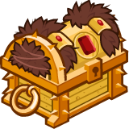

[Back to Main](index.md)

    
        Portait
    
    
        Model
    

# Diana

Diana, the Acrobat (voiced by Tonia Gayle Smith) – a brave, athletic, and outspoken 14-year-old girl, she is an Acrobat who carries the javelin quarterstaff, which can change size to suit her needs and be easily reconstructed if broken. Diana is also known to provide inspiration, guidance and support for her friends at times of peril or worry.

[Dungeons & Dragons (TV series) - Wikipedia](https://en.wikipedia.org/wiki/Dungeons_%26_Dragons_(TV_series))

# Basic Information

Diana will be the new champion in the The Great Modron March event on 1 May 2024.

    
        
            **Seat**:
        
        
            Unknown
        
    
    
        
            **Race**:
        
        
            Human (Guess)
        
    
    
        
            **Class**:
        
        
            Unknown
        
    
    
        
            **Roles**:
        
        
            Support / Speed (Guess)
        
    
    
        
            **Age**:
        
        
            14 (Guess)
        
    
    
        
            **Gender**:
        
        
            Female (Guess)
        
    
    
        
            **Alignment**:
        
        
            Unknown
        
    
    
        
            **Affiliation**:
        
        
            Saturday Morning Squad (Guess)
        
    

# Formation

    <svg xmlns="http://www.w3.org/2000/svg" id="Diana" fill="#aaa" data-formationName="Diana" data-campaignName="The Great Modron March" width="389" height="160"><circle cx="175" cy="65" r="15"/><circle cx="175" cy="105" r="15"/><circle cx="135" cy="45" r="15"/><circle cx="95" cy="25" r="15"/><circle cx="95" cy="65" r="15"/><circle cx="95" cy="145" r="15"/><circle cx="55" cy="45" r="15"/><circle cx="55" cy="125" r="15"/><circle cx="15" cy="65" r="15"/><circle cx="15" cy="105" r="15"/><text x="205" y="25" fill="#dcdcdc" font-size="25" font-family="Arial" font-weight="bold">Diana</text><text x="205" y="65" fill="#dcdcdc" font-size="15" font-family="Arial" font-weight="bold">The Great Modron March</text></svg>

# Abilities

**Base Attack: Javelin Staff** (Melee)
> Diana attacks a random enemy with her Javelin staff.  
> Cooldown: 4s (Cap 1s)

<em>Raw Data</em>

<pre>
{
    "id": 748,
    "name": "Javelin Staff",
    "description": "Diana attacks a random enemy with her Javelin staff.",
    "long_description": "",
    "graphic_id": 0,
    "target": "random",
    "num_targets": 1,
    "aoe_radius": 0,
    "damage_modifier": 1,
    "cooldown": 4,
    "animations": [
        {
            "type": "melee_attack",
            "target_offset_x": -40,
            "damage_frame": 6,
            "jump_sound": 30,
            "sound_frames": {
                "2": 194
            }
        }
    ],
    "tags": [
        "melee"
    ],
    "damage_types": [
        "melee"
    ]
}
</pre>

**Base Attack: Javelin Staff** (Melee)
> Diana attacks a random enemy with her Javelin staff.  
> Cooldown: 4s (Cap 1s)

<em>Raw Data</em>

<pre>
{
    "id": 750,
    "name": "Javelin Staff",
    "description": "Diana attacks a random enemy with her Javelin staff.",
    "long_description": "",
    "graphic_id": 0,
    "target": "random",
    "num_targets": 1,
    "aoe_radius": 0,
    "damage_modifier": 1,
    "cooldown": 4,
    "animations": [
        {
            "type": "melee_attack",
            "attack_seq": "attack_b",
            "target_offset_x": 80,
            "damage_frame": 13,
            "jump_sound": 30,
            "sound_frames": {
                "2": 194
            }
        }
    ],
    "tags": [
        "melee"
    ],
    "damage_types": [
        "melee"
    ]
}
</pre>

**Ultimate Attack: Javelin Staff Throw**
> Diana throws her Javelin Staff, dealing ultimate damage 10 times to random enemies and stunning them for 5 seconds.  
> Cooldown: 240s (Cap 60s)

<em>Raw Data</em>

<pre>
{
    "id": 749,
    "name": "Javelin Staff Throw",
    "description": "Diana hits up to 10 enemies for ultimate damage, stunning them for 5 seconds.",
    "long_description": "Diana throws her Javelin Staff, dealing ultimate damage 10 times to random enemies and stunning them for 5 seconds.",
    "graphic_id": 23369,
    "target": "random",
    "num_targets": 1,
    "aoe_radius": 0,
    "damage_modifier": 1,
    "cooldown": 240,
    "animations": [
        {
            "type": "ultimate_attack",
            "ultimate": "diana",
            "stun_duration": 5,
            "max_hits": 10,
            "staff_graphic_id": 23190,
            "projectile_throw_speed": 1600,
            "projectile_bounce_speed": 1600,
            "projectile_return_speed": 1600,
            "projectile_impact_graphic_id": 58
        }
    ],
    "tags": [
        "ultimate",
        "ranged",
        "aoe"
    ],
    "damage_types": []
}
</pre>

**Electrum Scavenger** (Guess)
> Diana can help scavenge up to 20 additional Electrum Chests when killing bosses. While this cap is not reached, Diana has a 0.5% chance of scavenging 1 Electrum Chest each time a boss is defeated. The cap increases by 0.5 every day.

<em>Raw Data</em>

<pre>
{
    "id": 1948,
    "flavour_text": "",
    "description": {
        "desc": "Diana can help scavenge up to $(current_scavenge_cap diana_electrum_scavenger floor) additional Electrum Chests when killing bosses. While this cap is not reached, Diana has a $amount% chance of scavenging 1 Electrum Chest each time a boss is defeated. The cap increases by $cap_increase_per_day every day.",
        "post": {
            "conditions": [
                {
                    "condition": "not static_desc",
                    "desc": "^^Electrum Chests Scavenged: $(stat_value diana_electrum_collected 0 none) ($(stat_value diana_electrum_collected_this_adventure 1 none) this adventure)"
                }
            ]
        }
    },
    "effect_keys": [
        {
            "off_when_benched": true,
            "effect_string": "scavenge_items,0.5",
            "id": "diana_electrum_scavenger",
            "item_type": "chest",
            "item_id": 282,
            "initial_cap": 20,
            "cap_increase_per_day": 0.5,
            "start_date": "2024-05-01 12:00:00",
            "total_collected_stat": "diana_electrum_collected",
            "adventure_collected_stat": "diana_electrum_collected_this_adventure",
            "upgrade_id": 14798
        }
    ],
    "requirements": "",
    "graphic_id": 23214,
    "large_graphic_id": 23211,
    "properties": {
        "is_formation_ability": true,
        "owner_use_outgoing_description": true
    }
}
</pre>

**Javelin Staff** (Guess)
> Diana's base attack, Javelin Staff, knocks around enemies she hits based on where she is positioned in her column in the formation.

<em>Raw Data</em>

<pre>
{
    "id": 1944,
    "flavour_text": "",
    "description": {
        "desc": "Diana's base attack, Javelin Staff, knocks around enemies she hits based on where she is positioned in her column in the formation.",
        "post": {
            "conditions": [
                {
                    "condition": "not static_desc",
                    "desc": "^^$diana_javelin_staff_desc"
                }
            ]
        }
    },
    "effect_keys": [
        {
            "off_when_benched": true,
            "effect_string": "diana_javelin_staff",
            "top_pos_data": {
                "push_dir": [
                    120,
                    130
                ],
                "monster_retargets": true
            },
            "middle_pos_data": {
                "attack_id": 750,
                "push_dir": [
                    -150,
                    0
                ]
            },
            "bottom_pos_data": {
                "push_dir": [
                    120,
                    -130
                ],
                "monster_retargets": true
            },
            "single_slot_pos_data": {
                "push_dir": [
                    300,
                    0
                ]
            }
        }
    ],
    "requirements": "",
    "graphic_id": 23215,
    "large_graphic_id": 23212,
    "properties": {
        "is_formation_ability": true,
        "owner_use_outgoing_description": true,
        "retain_on_slot_changed": true
    }
}
</pre>

**We'll Be Right Back** (Guess)
> Diana increases the speed of area transitions by 50%.

<em>Raw Data</em>

<pre>
{
    "id": 1945,
    "flavour_text": "",
    "description": {
        "desc": "Diana increases the speed of area transitions by $amount%."
    },
    "effect_keys": [
        {
            "off_when_benched": true,
            "effect_string": "area_transition_time_scale,50"
        }
    ],
    "requirements": "",
    "graphic_id": 23216,
    "large_graphic_id": 23213,
    "properties": {
        "is_formation_ability": true,
        "owner_use_outgoing_description": true
    }
}
</pre>

# Specialisations

**Fledgling Fury** (Guess)
> Diana increases the damage of all Champions that are 20 years old or younger by 100%.

<em>Raw Data</em>

<pre>
{
    "id": 1943,
    "flavour_text": "",
    "description": {
        "desc": "Diana increases the damage of all Champions that are 20 years old or younger by $amount%."
    },
    "effect_keys": [
        {
            "off_when_benched": true,
            "effect_string": "hero_dps_multiplier_mult,100",
            "targets": [
                "all"
            ],
            "filter_targets": [
                {
                    "type": "hero_expr",
                    "hero_expr": "age<=20&&hero_id!=146"
                }
            ],
            "formation_arrows_for_effected_only": true,
            "slot_change_updates_targets": true
        },
        {
            "off_when_benched": true,
            "effect_string": "expression_on_trigger,area_complete",
            "per_hero_expr": "age<=20&&hero_id!=146",
            "per_trigger_expr": "AppendToSaveStat(`diana_thats_what_i_call_teamwork`, false, trigger_count * as_int(per_hero_count >= 10))"
        }
    ],
    "requirements": "",
    "graphic_id": 23240,
    "large_graphic_id": 23240,
    "properties": {
        "is_formation_ability": true,
        "owner_use_outgoing_description": true
    }
}
</pre>

**Acrobatic Assault** (Guess)
> Diana increases the damage of all Champions with a DEX of 15 or higher by 100%.

<em>Raw Data</em>

<pre>
{
    "id": 1941,
    "flavour_text": "",
    "description": {
        "desc": "Diana increases the damage of all Champions with a DEX of 15 or higher by $amount%."
    },
    "effect_keys": [
        {
            "off_when_benched": true,
            "effect_string": "hero_dps_multiplier_mult,100",
            "targets": [
                "all"
            ],
            "filter_targets": [
                {
                    "type": "hero_expr",
                    "hero_expr": "GetStat(`dex`)>=15"
                }
            ],
            "formation_arrows_for_effected_only": true,
            "slot_change_updates_targets": true
        },
        {
            "off_when_benched": true,
            "effect_string": "expression_on_trigger,area_complete",
            "per_hero_expr": "GetStat(`dex`)>=15",
            "per_trigger_expr": "AppendToSaveStat(`diana_thats_what_i_call_teamwork`, false, trigger_count * as_int(per_hero_count >= 10))"
        }
    ],
    "requirements": "",
    "graphic_id": 23238,
    "large_graphic_id": 23238,
    "properties": {
        "is_formation_ability": true,
        "owner_use_outgoing_description": true
    }
}
</pre>

**Modest Might** (Guess)
> Diana increases the damage of all Champions with a total ability score of 78 or less by 100%.

<em>Raw Data</em>

<pre>
{
    "id": 1942,
    "flavour_text": "",
    "description": {
        "desc": "Diana increases the damage of all Champions with a total ability score of 78 or less by $amount%."
    },
    "effect_keys": [
        {
            "off_when_benched": true,
            "effect_string": "hero_dps_multiplier_mult,100",
            "targets": [
                "all"
            ],
            "filter_targets": [
                {
                    "type": "hero_expr",
                    "hero_expr": "GetStat(`total_ability_score`)<=78"
                }
            ],
            "formation_arrows_for_effected_only": true,
            "slot_change_updates_targets": true
        },
        {
            "off_when_benched": true,
            "effect_string": "expression_on_trigger,area_complete",
            "per_hero_expr": "GetStat(`total_ability_score`)<=78",
            "per_trigger_expr": "AppendToSaveStat(`diana_thats_what_i_call_teamwork`, false, trigger_count * as_int(per_hero_count >= 10))"
        }
    ],
    "requirements": "",
    "graphic_id": 23241,
    "large_graphic_id": 23241,
    "properties": {
        "is_formation_ability": true,
        "owner_use_outgoing_description": true
    }
}
</pre>

**Ensemble Cast** (Guess)
> Diana increases the effect of her Inspire specialization choice by 100% for each Champion it affects, stacking multiplicatively.

ⓘ *Note: This ability is prestack.*

<em>Raw Data</em>

<pre>
{
    "id": 1946,
    "flavour_text": "",
    "description": {
        "desc": "Diana increases the effect of her Inspire specialization choice by $amount% for each Champion it affects, stacking multiplicatively."
    },
    "effect_keys": [
        {
            "off_when_benched": true,
            "effect_string": "pre_stack_amount,100"
        },
        {
            "off_when_benched": true,
            "effect_string": "buff_upgrades,0,14791,14792,14793",
            "show_bonus": true,
            "amount_expr": "upgrade_amount(14796,0)",
            "amount_func": "mult",
            "stacks_multiply": true,
            "stack_func": "per_upgrade_targets",
            "stack_func_data": {
                "upgrade_ids": [
                    14791,
                    14792,
                    14793
                ]
            },
            "amount_updated_listeners": [
                "slot_changed"
            ]
        }
    ],
    "requirements": "",
    "graphic_id": 0,
    "large_graphic_id": 23239,
    "properties": {
        "is_formation_ability": true,
        "formation_circle_icon": false,
        "indexed_effect_properties": true,
        "per_effect_index_bonuses": true,
        "default_bonus_index": 0,
        "owner_use_outgoing_description": true,
        "spec_option_post_apply_info": "Champions Buffed: $num_stacks___2"
    }
}
</pre>

**Spotlight Episode** (Guess)
> Diana increases the effect of her Inspire specialization choice by 100% for each Champion it does NOT affect, stacking multiplicatively.

ⓘ *Note: This ability is prestack.*

<em>Raw Data</em>

<pre>
{
    "id": 1947,
    "flavour_text": "",
    "description": {
        "desc": "Diana increases the effect of her Inspire specialization choice by $amount% for each Champion it does NOT affect, stacking multiplicatively."
    },
    "effect_keys": [
        {
            "off_when_benched": true,
            "effect_string": "pre_stack_amount,100"
        },
        {
            "off_when_benched": true,
            "effect_string": "buff_upgrades,0,14791,14792,14793",
            "show_bonus": true,
            "amount_expr": "upgrade_amount(14796,0)",
            "amount_func": "mult",
            "stacks_multiply": true,
            "stack_func": "per_non_upgrade_targets",
            "stack_func_data": {
                "upgrade_ids": [
                    14791,
                    14792,
                    14793
                ]
            },
            "amount_updated_listeners": [
                "slot_changed"
            ]
        }
    ],
    "requirements": "",
    "graphic_id": 0,
    "large_graphic_id": 23242,
    "properties": {
        "is_formation_ability": true,
        "formation_circle_icon": false,
        "indexed_effect_properties": true,
        "per_effect_index_bonuses": true,
        "default_bonus_index": 0,
        "owner_use_outgoing_description": true,
        "spec_option_post_apply_info": "Champions Not Buffed: $num_stacks___2"
    }
}
</pre>

# Items

Unknown.

# Feats

Unknown.

# Legendaries

Unknown.

# Adventures and Variants

 **Unlock Adventure: The Mechanical Menace (Diana)** (Complete Area 50)
> Stop the Modron March from crushing Waterdeep under its mechanical heel.

 **Variant 1: Acrobat!** (Complete Area 75)
> Diana starts in the formation. She can be moved but not removed.  
> You may only use Champions that have a Dexterity of 15 or higher, an age of 20 or less, or total ability scores of 78 or less.  
> Getting to Know Diana: Diana's first specialization selects the types of Champions she buffs. Choose the buff that is best for your formation!

 **Variant 2: Child of the Stargazer** (Complete Area 125)
> Diana starts in the formation. She can be moved but not removed.  
> Kosar joins the formation. If Kosar is defeated, you automatically fail the area.  
> Kosar cheers on Diana, reducing her base attack cooldown by 50%.  
> Getting to know Diana: Diana can use her Javelin staff to push monsters around. Can you figure out how to best protect Kosar? Hint: Push down so monsters target your tank and not Kosar!

 **Variant 3: Not That Guy Again!** (Complete Area 175)
> Diana starts in the formation. She can be moved but not removed.  
> Excluding Diana, only the youngest Champion, the most Dexterous Champion, and the Champion with the lowest total stats can deal damage. Diana can also deal damage.  
> At the start of each Boss area, Venger arrives on his nightmare as an additional boss that must be defeated.  
> Getting to know Diana: Depending on the supporting Champions in your formation, pick either Ensemble Cast or Spotlight Episode to really boost Diana's buffing power.

# Other Champion Images

    
        
            Console Portait
        
    
    
        
            Gold Chest Icon
        
        
            Silver Chest Icon
        
    

[Back to Top](#top)

*Last Modified: {{ site.time }}*