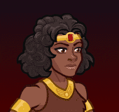

[Back to Main](index.md)

    
        Portait
    

# Diana

Diana, the Acrobat (voiced by Tonia Gayle Smith) – a brave, athletic, and outspoken 14-year-old girl, she is an Acrobat who carries the javelin quarterstaff, which can change size to suit her needs and be easily reconstructed if broken. Diana is also known to provide inspiration, guidance and support for her friends at times of peril or worry.

[Dungeons & Dragons (TV series) - Wikipedia](https://en.wikipedia.org/wiki/Dungeons_%26_Dragons_(TV_series))

# Basic Information

Diana will be the new champion in the The Great Modron March event on 1 May 2024.

    
        
            **Seat**:
        
        
            Unknown
        
    
    
        
            **Race**:
        
        
            Human (Guess)
        
    
    
        
            **Class**:
        
        
            Unknown
        
    
    
        
            **Roles**:
        
        
            Unknown
        
    
    
        
            **Age**:
        
        
            14 (Guess)
        
    
    
        
            **Gender**:
        
        
            Female (Guess)
        
    
    
        
            **Alignment**:
        
        
            Unknown
        
    
    
        
            **Affiliation**:
        
        
            Saturday Morning Squad (Guess)
        
    

# Formation

Unknown.


    



# Abilities

**Base Attack: Unknown**
> Unknown effect.

<em>Raw Data</em>

<pre>
</pre>

**Ultimate Attack: Unknown**
> Unknown effect.

<em>Raw Data</em>

<pre>
</pre>

**Electrum Scavenger** (Guess)
> Unknown effect.

<em>Raw Data</em>

<pre>
{
    "id": 23214,
    "graphic": "Icons/Events/2018 GreatModronMarch/GreatModronMarch_Y7/Icon_Formation_Diana_ElectrumChestScavenger",
    "v": 2,
    "fs": 0,
    "p": 0,
    "type": 1,
    "export_params": {
        "uses": [
            "icon"
        ]
    }
}
</pre>

**Javelin Staff** (Guess)
> Unknown effect.

<em>Raw Data</em>

<pre>
{
    "id": 23215,
    "graphic": "Icons/Events/2018 GreatModronMarch/GreatModronMarch_Y7/Icon_Formation_Diana_JavelinStaff",
    "v": 2,
    "fs": 0,
    "p": 0,
    "type": 1,
    "export_params": {
        "uses": [
            "icon"
        ]
    }
}
</pre>

**We'll Be Right Back** (Guess)
> Unknown effect.

<em>Raw Data</em>

<pre>
{
    "id": 23216,
    "graphic": "Icons/Events/2018 GreatModronMarch/GreatModronMarch_Y7/Icon_Formation_Diana_WellBeRightBack",
    "v": 2,
    "fs": 0,
    "p": 0,
    "type": 1,
    "export_params": {
        "uses": [
            "icon"
        ]
    }
}
</pre>

# Specialisations

**Specialisation: Acrobatic Assault** (Guess)
> Unknown effect.

<em>Raw Data</em>

<pre>
{
    "id": 23238,
    "graphic": "Icons/Events/2018 GreatModronMarch/GreatModronMarch_Y7/Icon_Specialization_Diana_AcrobaticAssault",
    "v": 2,
    "fs": 0,
    "p": 0,
    "type": 1,
    "export_params": {
        "uses": [
            "icon"
        ],
        "quantize": true
    }
}
</pre>

**Specialisation: Ensemble Cast** (Guess)
> Unknown effect.

<em>Raw Data</em>

<pre>
{
    "id": 23239,
    "graphic": "Icons/Events/2018 GreatModronMarch/GreatModronMarch_Y7/Icon_Specialization_Diana_EnsembleCast",
    "v": 2,
    "fs": 0,
    "p": 0,
    "type": 1,
    "export_params": {
        "uses": [
            "icon"
        ],
        "quantize": true
    }
}
</pre>

**Specialisation: Fledgling Fury** (Guess)
> Unknown effect.

<em>Raw Data</em>

<pre>
{
    "id": 23240,
    "graphic": "Icons/Events/2018 GreatModronMarch/GreatModronMarch_Y7/Icon_Specialization_Diana_FledglingFury",
    "v": 2,
    "fs": 0,
    "p": 0,
    "type": 1,
    "export_params": {
        "uses": [
            "icon"
        ],
        "quantize": true
    }
}
</pre>

**Specialisation: Modest Might** (Guess)
> Unknown effect.

<em>Raw Data</em>

<pre>
{
    "id": 23241,
    "graphic": "Icons/Events/2018 GreatModronMarch/GreatModronMarch_Y7/Icon_Specialization_Diana_ModestMight",
    "v": 2,
    "fs": 0,
    "p": 0,
    "type": 1,
    "export_params": {
        "uses": [
            "icon"
        ],
        "quantize": true
    }
}
</pre>

**Specialisation: Spotlight Episode** (Guess)
> Unknown effect.

<em>Raw Data</em>

<pre>
{
    "id": 23242,
    "graphic": "Icons/Events/2018 GreatModronMarch/GreatModronMarch_Y7/Icon_Specialization_Diana_SpotlightEpisode",
    "v": 2,
    "fs": 0,
    "p": 0,
    "type": 1,
    "export_params": {
        "uses": [
            "icon"
        ],
        "quantize": true
    }
}
</pre>

# Items

Unknown.

# Feats

Unknown.

# Legendaries

Unknown.

# Adventures and Variants

Unknown.

# Other Champion Images

    
        
            Console Portait
        
    

[Back to Top](#top)

*Last Modified: {{ site.time }}*