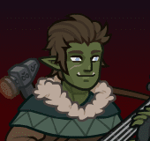
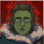
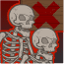

[Back to Main](index.md)

    
        
            
        
        
            Portrait
        
    

# Dob

Dob is an enthusiastic, energetic music-maker who never lets a little thing like 'not having a plan' stand in the way of action. His sister, Suzette, raised him. When he fell ill, she attempted various, wild cures leaving Dob with a permanent, lurid green hue to his skin. Dob became a traveling bard, self-taught in music and magic. This brought him into contact with the Oxventurers, with whom he shares many bizarre adventures. Accomplished and charismatic, this bard favours lulling enemies to sleep or hard-rocking spell attacks with acrobatic combat. Dob also carries Ethelfrith's Hammer, a cursed weapon with the power to summon 60 obedient skeletons, but exacts a heavy price for doing so.

# Changes

Dob will be a reworked champion in the Liars' Night event on 7 October 2026.

Only abilities that have seen some changes will be displayed here - and be aware that there's a lot of guesswork involved. Some abilities may not have names - some may have the *wrong* names - or specialisations might not be marked as such - etc.. Focus on the effect data itself.

Please do me a favour and don't get all melodramatic about what you find here. I - and CNE - don't appreciate it. These are spoilers and will almost certainly change before release - likely multiple times. That and we don't have access to any upgrade data prior to release. Making assumptions on how the champions will turn out based on this information would be premature.

# Abilities

**Busking** (Guess)
> Dob increases global gold find by 100% for each Champion next to him, stacking multiplicatively.

<em>Raw Data</em>

<pre>
{
    "id": 2947,
    "flavour_text": "",
    "description": {
        "desc": "$(source_hero) increases global gold find by $(not_buffed amount)% for each Champion next to him, stacking multiplicatively."
    },
    "effect_keys": [
        {
            "effect_string": "gold_multiplier_mult,100",
            "targets": [
                "self"
            ],
            "show_bonus": true
        }
    ],
    "requirements": "",
    "graphic_id": 15743,
    "large_graphic_id": 15740,
    "properties": {
        "is_formation_ability": true,
        "owner_use_outgoing_description": true,
        "indexed_effect_properties": true,
        "per_effect_index_bonuses": true,
        "default_bonus_index": 0
    }
}
</pre>

**Offshore Accounting** (Guess)
> At the transition to each new area, there is a 50% chance that Dob sets the Champion's gold amount to zero and gains Deposit stacks equal to the exponent of the lost gold. Dob increases both the damage increase of Traveling Entertainer and the gold find bonus of Busking by 0.1% for each Deposit stack, stacking multiplicatively. Number of Deposit stacks is capped at 25 times the highest area completed in the current adventure.

<em>Raw Data</em>

<pre>
{
    "id": 2948,
    "flavour_text": "",
    "description": {
        "desc": "At the transition to each new area, there is a $(amount)% chance that Dob sets the Champion's gold amount to zero and gains Deposit stacks equal to the exponent of the lost gold. Dob increases both the damage increase of Traveling Entertainer and the gold find bonus of Busking by $(traveling_entertainer_buff)% for each Deposit stack, stacking multiplicatively. Number of Deposit stacks is capped at $(deposit_stack_cap_mult) times the highest area completed in the current adventure."
    },
    "effect_keys": [
        {
            "effect_string": "dob_offshore_accounting,50,0.1,0.1,25,1"
        },
        {
            "off_when_benched": true,
            "effect_string": "buff_upgrade,0,20923",
            "manual_stacking": true,
            "stacks_multiply": true,
            "show_bonus": true,
            "stack_title": "Deposit Stacks"
        },
        {
            "off_when_benched": true,
            "effect_string": "buff_upgrade,0,20924",
            "manual_stacking": true,
            "stacks_multiply": true
        }
    ],
    "requirements": "",
    "graphic_id": 15744,
    "large_graphic_id": 15741,
    "properties": {
        "is_formation_ability": true,
        "owner_use_outgoing_description": true,
        "indexed_effect_properties": true,
        "per_effect_index_bonuses": true,
        "default_bonus_index": 0
    }
}
</pre>

# Specialisations

**Specialisation: Befriend the Magical** (Guess)
> Dob increases the attack bonus of Traveling Entertainer by 100% for each Oxventures Champion or Champion with a magical base attack, stacking multiplicatively and applied multiplicatively.

ⓘ *Note: This ability is prestack.*

<em>Raw Data</em>

<pre>
{
    "id": 2949,
    "flavour_text": "",
    "description": {
        "desc": "Dob increases the attack bonus of Traveling Entertainer by $(amount)% for each Oxventures Champion or Champion with a magical base attack, stacking multiplicatively and applied multiplicatively."
    },
    "effect_keys": [
        {
            "effect_string": "pre_stack,100",
            "skip_effect_key_desc": true
        },
        {
            "effect_string": "buff_upgrade,100,20923",
            "amount_expr": "upgrade_amount(20926,0)",
            "stacks_multiply": true,
            "amount_func": "mult",
            "stack_func": "per_crusader",
            "stack_func_data": {
                "target_filters": [
                    {
                        "type": "tags",
                        "tags": "oxventure"
                    },
                    {
                        "type": "attack_type",
                        "attack": "magic"
                    }
                ]
            },
            "amount_updated_listeners": [
                "slot_changed"
            ],
            "show_bonus": true
        }
    ],
    "requirements": "",
    "graphic_id": 15748,
    "large_graphic_id": 0,
    "properties": {
        "is_formation_ability": true,
        "owner_use_outgoing_description": true,
        "indexed_effect_properties": true,
        "per_effect_index_bonuses": true,
        "default_bonus_index": 0,
        "spec_option_post_apply_info": "Qualified Champions: $num_stacks___2"
    }
}
</pre>

**Specialisation: Befriend the Friendly** (Guess)
> Dob increases the attack bonus of Traveling Entertainer by 100% for each Oxventures Champion or Champion with a Charisma of 17 or higher, stacking multiplicatively and applied multiplicatively.

ⓘ *Note: This ability is prestack.*

<em>Raw Data</em>

<pre>
{
    "id": 2950,
    "flavour_text": "",
    "description": {
        "desc": "Dob increases the attack bonus of Traveling Entertainer by $(amount)% for each Oxventures Champion or Champion with a Charisma of 17 or higher, stacking multiplicatively and applied multiplicatively."
    },
    "effect_keys": [
        {
            "effect_string": "pre_stack,100",
            "skip_effect_key_desc": true
        },
        {
            "effect_string": "buff_upgrade,100,20923",
            "amount_expr": "upgrade_amount(20927,0)",
            "stacks_multiply": true,
            "amount_func": "mult",
            "stack_func": "per_crusader",
            "stack_func_data": {
                "target_filters": [
                    {
                        "type": "tags",
                        "tags": "oxventure"
                    },
                    {
                        "type": "stat",
                        "stat": "cha",
                        "comparison": ">=",
                        "value": 17
                    }
                ]
            },
            "amount_updated_listeners": [
                "slot_changed"
            ],
            "show_bonus": true
        }
    ],
    "requirements": "",
    "graphic_id": 15747,
    "large_graphic_id": 0,
    "properties": {
        "is_formation_ability": true,
        "owner_use_outgoing_description": true,
        "indexed_effect_properties": true,
        "per_effect_index_bonuses": true,
        "default_bonus_index": 0,
        "spec_option_post_apply_info": "Qualified Champions: $num_stacks___2"
    }
}
</pre>

**Specialisation: Befriend the Quick** (Guess)
> Dob increases the attack bonus of Traveling Entertainer by 100% for each Oxventures Champion or Champion with a Dexterity of 17 or higher, stacking multiplicatively and applied multiplicatively.

ⓘ *Note: This ability is prestack.*

<em>Raw Data</em>

<pre>
{
    "id": 2951,
    "flavour_text": "",
    "description": {
        "desc": "Dob increases the attack bonus of Traveling Entertainer by $(amount)% for each Oxventures Champion or Champion with a Dexterity of 17 or higher, stacking multiplicatively and applied multiplicatively."
    },
    "effect_keys": [
        {
            "effect_string": "pre_stack,100",
            "skip_effect_key_desc": true
        },
        {
            "effect_string": "buff_upgrade,100,20923",
            "amount_expr": "upgrade_amount(20928,0)",
            "stacks_multiply": true,
            "amount_func": "mult",
            "stack_func": "per_crusader",
            "stack_func_data": {
                "target_filters": [
                    {
                        "type": "tags",
                        "tags": "oxventure"
                    },
                    {
                        "type": "stat",
                        "stat": "dex",
                        "comparison": ">=",
                        "value": 17
                    }
                ]
            },
            "amount_updated_listeners": [
                "slot_changed"
            ],
            "show_bonus": true
        }
    ],
    "requirements": "",
    "graphic_id": 15749,
    "large_graphic_id": 0,
    "properties": {
        "is_formation_ability": true,
        "owner_use_outgoing_description": true,
        "indexed_effect_properties": true,
        "per_effect_index_bonuses": true,
        "default_bonus_index": 0,
        "spec_option_post_apply_info": "Qualified Champions: $num_stacks___2"
    }
}
</pre>

**Specialisation: Befriend Everybody!** (Guess)
> Dob increases the attack bonus of Traveling Entertainer by 100% for each unique species in the formation, stacking multiplicatively and applied multiplicatively.

ⓘ *Note: This ability is prestack.*

<em>Raw Data</em>

<pre>
{
    "id": 2952,
    "flavour_text": "",
    "description": {
        "desc": "Dob increases the attack bonus of Traveling Entertainer by $(not_buffed amount)% for each unique species in the formation, stacking multiplicatively and applied multiplicatively."
    },
    "effect_keys": [
        {
            "effect_string": "pre_stack,100",
            "skip_effect_key_desc": true
        },
        {
            "effect_string": "buff_upgrade,100,20923",
            "amount_expr": "upgrade_amount(20929,0)",
            "stacks_multiply": true,
            "amount_func": "mult",
            "stack_func": "per_unique_race",
            "amount_updated_listeners": [
                "slot_changed",
                "hero_tags_changed"
            ],
            "show_bonus": true
        }
    ],
    "requirements": "",
    "graphic_id": 15749,
    "large_graphic_id": 0,
    "properties": {
        "is_formation_ability": true,
        "owner_use_outgoing_description": true,
        "indexed_effect_properties": true,
        "per_effect_index_bonuses": true,
        "default_bonus_index": 0
    }
}
</pre>

# Adventures and Variants

**Unlock Adventure: Brightly into Darkness (Dob)** (Complete Area 50)
> Help the Harpells track down a lost artifact.

 **Variant 1: Half-Orc's Charm** (Complete Area 75)
> Dob starts in the formation. He can't be moved or removed.  
> Champions next to Dob deal no damage.  
> Getting to Know Dob: Dob increases the damage of Champions NOT next to him. Place your DPS Champions away from him!

 **Variant 2: Making Friends** (Complete Area 125)
> Dob starts in the formation. He can be moved, but not removed.  
> Only Champions with a Charisma and/or Dexterity of 17+ may be used.  
> Getting to Know Dob: Dob's specialization has the potential to greatly enhance your formation. Pick the one that is best for your Champions!

 **Variant 3: Skeletons! (on Strike)** (Complete Area 175)
> Dob starts in the formation. He can be moved, but not removed.Dob's Ultimate starts unlocked and its cooldown duration is half as long.Each wave in non-boss areas spawns a relentless Striking Skeleton. They are slow, but they deal 400% damage. In addition, if they are defeated, they respawn in the same location after 5 seconds.Getting To Know Dob: Dob's attacks can prevent dangerous opponents from reaching the formation. Use him and other knockback attacks to keep the Striking Skeletons away!

# Formation

    <svg xmlns="http://www.w3.org/2000/svg" id="Dob" fill="#aaa" data-formationName="Dob" data-campaignName="Liar's Night" width="251" height="160"><circle cx="135" cy="125" r="15"/><circle cx="95" cy="25" r="15"/><circle cx="95" cy="65" r="15"/><circle cx="95" cy="105" r="15"/><circle cx="95" cy="145" r="15"/><circle cx="55" cy="125" r="15"/><circle cx="15" cy="25" r="15"/><circle cx="15" cy="65" r="15"/><circle cx="15" cy="105" r="15"/><circle cx="15" cy="145" r="15"/><text x="165" y="25" fill="#dcdcdc" font-size="25" font-family="Arial" font-weight="bold">Dob</text><text x="165" y="65" fill="#dcdcdc" font-size="15" font-family="Arial" font-weight="bold">Liar's Night</text></svg>

[Back to Top](#top)

*Last Modified: {{ site.time }}*