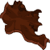
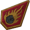
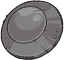

[Back to Main](index.md)

    
        Portait
    
    
        Model
    

# Duke Ravengard

Grand Duke Ulder Ravengard is the human Supreme Marshall of the Flaming Fist, and father of Wyll. His story stretches through all three acts of Baldur's Gate 3, and he can become a camp follower late in the game.

Ulder Ravengard is a recurring character in the Forgotten Realms setting of Dungeons and Dragons, appearing in the 5e adventures:  Murder in Baldur's Gate,  The Rise of Tiamat, and  Baldur's Gate: Descent into Avernus.

[Grand Duke Ulder Ravengard - BG3 Wiki](https://bg3.wiki/wiki/Ulder_Ravengard)

# Basic Information

Duke Ravengard will be the new champion in the Dragondown event on 5 June 2024.

    
        
            **Seat**:
        
        
            Unknown
        
    
    
        
            **Race**:
        
        
            Human (Guess)
        
    
    
        
            **Class**:
        
        
            Unknown
        
    
    
        
            **Roles**:
        
        
            Unknown
        
    
    
        
            **Age**:
        
        
            Unknown
        
    
    
        
            **Gender**:
        
        
            Male (Guess)
        
    
    
        
            **Alignment**:
        
        
            Unknown
        
    
    
        
            **Affiliation**:
        
        
            Unknown
        
    

# Formation

Unknown.


    



# Abilities

**Base Attack: Unknown**
> Unknown effect.

<em>Raw Data</em>

<pre>
</pre>

**Ultimate Attack: Unknown**
> Unknown effect.

<em>Raw Data</em>

<pre>
</pre>

**Unknown**
> Unknown effect.

<em>Raw Data</em>

<pre>
</pre>

# Specialisations

Unknown.

# Items

    
        
            **Icons**
        
        
            **Name**
        
    
    
        
            
        
        
            Armor
        
    
    
        
            
        
        
            Elturel Links
        
    
    
        
            
        
        
            Helm
        
    
    
        
            
        
        
            Rank Symbol
        
    
    
        
            
        
        
            Shield
        
    
    
        
            
        
        
            Weapon
        
    

# Feats

Unknown.

# Legendaries

Unknown.

# Adventures and Variants

Unknown.


# Other Champion Images



[Back to Top](#top)

*Last Modified: {{ site.time }}*