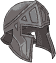

[Back to Main](index.md)

    
        Portait
    
    
        Model
    

# Duke Ravengard

Grand Duke Ulder Ravengard is the human Supreme Marshall of the Flaming Fist, and father of Wyll. His story stretches through all three acts of Baldur's Gate 3, and he can become a camp follower late in the game.

Ulder Ravengard is a recurring character in the Forgotten Realms setting of Dungeons and Dragons, appearing in the 5e adventures:  Murder in Baldur's Gate,  The Rise of Tiamat, and  Baldur's Gate: Descent into Avernus.

[Grand Duke Ulder Ravengard - BG3 Wiki](https://bg3.wiki/wiki/Ulder_Ravengard)

# Basic Information

Duke Ravengard will be a new champion in the Dragondown event on 5 June 2024.

    
        
            **Seat**:
        
        
            Unknown
        
    
    
        
            **Race**:
        
        
            Human (Guess)
        
    
    
        
            **Class**:
        
        
            Fighter (Guess)
        
    
    
        
            **Roles**:
        
        
            DPS / Support (Guess)
        
    
    
        
            **Age**:
        
        
            Unknown
        
    
    
        
            **Gender**:
        
        
            Male (Guess)
        
    
    
        
            **Alignment**:
        
        
            Unknown
        
    
    
        
            **Affiliation**:
        
        
            Unknown
        
    

# Formation

Unknown.


    



# Abilities

**Base Attack: Duke's Longsword** (Melee)
> Duke Ravengard attacks the closest enemy for one hit with his longsword.  
> Cooldown: 4s (Cap 1s)

<em>Raw Data</em>

<pre>
{
    "id": 756,
    "name": "Duke's Longsword",
    "description": "Duke Ravengard attacks the closest enemy for one hit with his longsword.",
    "long_description": "",
    "graphic_id": 0,
    "target": "front",
    "num_targets": 1,
    "aoe_radius": 0,
    "damage_modifier": 1,
    "cooldown": 4,
    "animations": [
        {
            "type": "melee_attack",
            "target_offset_x": -40,
            "start_frame": 5,
            "damage_frame": 12,
            "jump_sound": 30,
            "sound_frames": {
                "2": 194
            }
        }
    ],
    "tags": [
        "melee"
    ],
    "damage_types": [
        "melee"
    ]
}
</pre>

**Base Attack: Duke's Shield Bash** (Melee)
> Duke Ravengard attacks the closest enemy for one hit with his longsword. If he scores a critical hit, he follows-up by smashing the enemy with his shield, knocking them back a short distance.  
> Cooldown: 4s (Cap 1s)

<em>Raw Data</em>

<pre>
{
    "id": 757,
    "name": "Duke's Shield Bash",
    "description": "Duke Ravengard attacks the closest enemy for one hit with his longsword. If he scores a critical hit, he follows-up by smashing the enemy with his shield, knocking them back a short distance.",
    "long_description": "",
    "graphic_id": 0,
    "target": "front",
    "num_targets": 1,
    "aoe_radius": 0,
    "damage_modifier": 1,
    "cooldown": 4,
    "animations": [
        {
            "type": "melee_attack",
            "special_melee": "ravengard_lead_the_charge",
            "target_offset": [
                -75,
                0
            ],
            "shield_bash_effect": {
                "effect_string": "reduce_target_base_attack_cooldown_by_percent_action,100",
                "targets": [
                    "adj"
                ]
            }
        }
    ],
    "tags": [
        "melee"
    ],
    "damage_types": [
        "melee"
    ]
}
</pre>

**Ultimate Attack: Duke's Fire Shield**
> Duke Ravengard ignites in flames for 20 seconds, damaging attacking melee enemies and increasing his damage.  
> Cooldown: 3s (Cap 0.75s)

ⓘ *Note: Very short ultimate cooldowns are almost always for testing purposes and are likely to be increased later.*

<em>Raw Data</em>

<pre>
{
    "id": 758,
    "name": "Duke's Fire Shield",
    "description": "Duke Ravengard ignites in flames for 20 seconds, damaging attacking melee enemies and increasing his damage.",
    "long_description": "",
    "graphic_id": 23613,
    "target": "none",
    "num_targets": 1,
    "aoe_radius": 0,
    "damage_modifier": 1,
    "cooldown": 3,
    "animations": [
        {
            "type": "ultimate_attack",
            "ultimate": "duke_ravengard",
            "no_damage_display": true
        }
    ],
    "tags": [
        "ultimate"
    ],
    "damage_types": [
        "magic"
    ]
}
</pre>

**Critical Teamwork** (Guess)
> Duke Ravengard's base chance to Critical Hit is 20%.

<em>Raw Data</em>

<pre>
{
    "id": 1968,
    "flavour_text": "",
    "description": {
        "desc": "$source's base chance to Critical Hit is $(amount)%."
    },
    "effect_keys": [
        {
            "effect_string": "set_base_crit_chance,20"
        }
    ],
    "requirements": "",
    "graphic_id": 0,
    "large_graphic_id": 0,
    "properties": []
}
</pre>

**Marshall of the Flaming Fist** (Guess)
> Duke Ravengard gains a Command stack for each Champion with a melee base attack in the formation (including himself). Each stack increases the damage of these Champions by 400%, stacking multiplicatively.

<em>Raw Data</em>

<pre>
{
    "id": 1969,
    "flavour_text": "",
    "description": {
        "desc": "$(source_hero) gains a Command stack for each Champion with a melee base attack in the formation (including himself). Each stack increases the damage of these Champions by $(not_buffed amount)%, stacking multiplicatively."
    },
    "effect_keys": [
        {
            "effect_string": "hero_dps_multiplier_mult,400",
            "targets": [
                "all"
            ],
            "filter_targets": [
                {
                    "type": "hero_expr",
                    "hero_expr": "HasAttackDamageType(`melee`)"
                }
            ],
            "amount_func": "mult",
            "show_bonus": true,
            "stack_func": "per_hero_attribute",
            "per_hero_expr": "HasAttackDamageType(`melee`)",
            "per_hero_targets": [
                "all"
            ],
            "amount_updated_listeners": [
                "slot_changed",
                "feat_changed",
                "attack_changed"
            ],
            "use_computed_amount_for_description": true
        }
    ],
    "requirements": "",
    "graphic_id": 0,
    "large_graphic_id": 0,
    "properties": {
        "is_formation_ability": true,
        "owner_use_outgoing_description": true
    }
}
</pre>

**Position of Power** (Guess)
> Duke Ravengard increases the effect of the outgoing positional formation abilities of all Champions with a melee base attack by 25% for each Command stack he has, stacking additively.

<em>Raw Data</em>

<pre>
{
    "id": 1970,
    "flavour_text": "",
    "description": {
        "desc": "$(source_hero) increases the effect of the outgoing positional formation abilities of all Champions with a melee base attack by $(not_buffed amount)% for each Command stack he has, stacking additively."
    },
    "effect_keys": [
        {
            "off_when_benched": true,
            "effect_string": "buff_positional_formation_abilities,25",
            "targets": [
                "all"
            ],
            "filter_targets": [
                {
                    "type": "hero_expr",
                    "hero_expr": "HasAttackDamageType(`melee`)"
                }
            ],
            "include_escorts": true,
            "stacks_multiply": false,
            "amount_func": "add",
            "stack_func": "per_hero_attribute",
            "per_hero_expr": "HasAttackDamageType(`melee`)",
            "per_hero_targets": [
                "all"
            ],
            "amount_updated_listeners": [
                "slot_changed",
                "feat_changed",
                "attack_changed"
            ],
            "show_bonus": true,
            "use_computed_amount_for_description": true,
            "override_key_desc": "Increases the effect of $target's outgoing Positional Formation Abilities by $amount%",
            "stack_title": "Command Stacks"
        }
    ],
    "requirements": "",
    "graphic_id": 0,
    "large_graphic_id": 0,
    "properties": {
        "is_formation_ability": true,
        "owner_use_outgoing_description": true
    }
}
</pre>

# Specialisations

**Lead the Charge** (Guess)
> Whenever a Champion with a melee base attack gets a critical hit, increase the effect of Marshal of the Flaming Fist by 100% and additively increase the odds of all Champions in the formation getting critical hits by 1%. Both effects stack additively up to 50 times and reset when changing areas.

<em>Raw Data</em>

<pre>
{
    "id": 1971,
    "flavour_text": "",
    "description": {
        "desc": "Whenever a Champion with a melee base attack gets a critical hit, increase the effect of Marshal of the Flaming Fist by $(not_buffed amount)% and additively increase the odds of all Champions in the formation getting critical hits by $(not_buffed amount___2)%. Both effects stack additively up to 50 times and reset when changing areas."
    },
    "effect_keys": [
        {
            "effect_string": "buff_upgrade,100,15028",
            "off_when_benched": true,
            "max_stacks": 50,
            "stack_title": "Critical Teamwork Stacks",
            "stacks_multiply": false,
            "show_bonus": true,
            "stacks_on_trigger": "on_broadcast_stacks,melee_hero_crit",
            "more_triggers": [
                {
                    "trigger": "area_changed",
                    "action": {
                        "type": "reset"
                    }
                }
            ]
        },
        {
            "effect_string": "global_buff_base_crit_chance_add,1",
            "off_when_benched": true,
            "max_stacks": 50,
            "stack_title": "Critical Teamwork Stacks",
            "stacks_multiply": false,
            "show_bonus": true,
            "stacks_on_trigger": "on_broadcast_stacks,melee_hero_crit",
            "more_triggers": [
                {
                    "trigger": "area_changed",
                    "action": {
                        "type": "reset"
                    }
                }
            ],
            "skip_effect_key_desc": true
        },
        {
            "effect_string": "broadcast_on_trigger,melee_hero_crit,pre_target_attack_crit",
            "off_when_benched": true,
            "targets": [
                "all"
            ],
            "filter_targets": [
                {
                    "type": "hero_expr",
                    "hero_expr": "HasAttackDamageType(`melee`)"
                }
            ],
            "override_key_desc": "Each time $target deals a Critical Hit, they contribute a Critical Teamwork stack to $(source_hero)"
        }
    ],
    "requirements": "",
    "graphic_id": 0,
    "large_graphic_id": 0,
    "properties": {
        "is_formation_ability": true,
        "owner_use_outgoing_description": true,
        "indexed_effect_properties": true,
        "per_effect_index_bonuses": true
    }
}
</pre>

**Legacy of Ravengard** (Guess)
> When Duke Ravengard gets a critical hit, he follows up by bashing the enemy with his shield, knocking it back a short distance. When this occurs, all melee Champions adjacent to Ulder have their base attack cooldowns immediately reset.

<em>Raw Data</em>

<pre>
{
    "id": 1972,
    "flavour_text": "",
    "description": {
        "desc": "When $(source_hero) gets a critical hit, he follows up by bashing the enemy with his shield, knocking it back a short distance. When this occurs, all melee Champions adjacent to Ulder have their base attack cooldowns immediately reset."
    },
    "effect_keys": [
        {
            "effect_string": "change_base_attack,757"
        }
    ],
    "requirements": "",
    "graphic_id": 0,
    "large_graphic_id": 0,
    "properties": {
        "is_formation_ability": true,
        "owner_use_outgoing_description": true
    }
}
</pre>

**Strength of Baldurs Gate** (Guess)
> Champions with a melee base attack have their crit chance additively increased by 20% and crit damage increased by 1000%.

<em>Raw Data</em>

<pre>
{
    "id": 1973,
    "flavour_text": "",
    "description": {
        "desc": "Champions with a melee base attack have their crit chance additively increased by 20% and crit damage increased by 1000%."
    },
    "effect_keys": [
        {
            "effect_string": "buff_base_crit_chance_add,20",
            "targets": [
                "all"
            ],
            "filter_targets": [
                {
                    "type": "hero_expr",
                    "hero_expr": "HasAttackDamageType(`melee`)"
                }
            ]
        },
        {
            "effect_string": "buff_base_crit_damage_mult,1000",
            "targets": [
                "all"
            ],
            "filter_targets": [
                {
                    "type": "hero_expr",
                    "hero_expr": "HasAttackDamageType(`melee`)"
                }
            ]
        }
    ],
    "requirements": "",
    "graphic_id": 0,
    "large_graphic_id": 0,
    "properties": {
        "is_formation_ability": true,
        "owner_use_outgoing_description": true
    }
}
</pre>

# Items

    
        
            **Icons**
        
        
            **Name**
        
    
    
        
            
        
        
            Armor
        
    
    
        
            
        
        
            Elturel Links
        
    
    
        
            
        
        
            Helm
        
    
    
        
            
        
        
            Rank Symbol
        
    
    
        
            
        
        
            Shield
        
    
    
        
            
        
        
            Weapon
        
    

# Feats

Unknown.

# Legendaries

Unknown.

# Adventures and Variants

Unknown.

# Other Champion Images

    
        
            Gold Chest Icon
        
        
            Silver Chest Icon
        
    

[Back to Top](#top)

*Last Modified: {{ site.time }}*