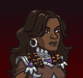
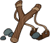
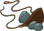

[Back to Main](index.md)

    
        Portait
    
    
        Model
    

# Dynaheir

Dynaheir, a Wychlaran Invoker hailing from the distant land of Rashemen, travels with her stalwart bodyguard, Minsc. Dynaheir carries a deep-seated animosity toward the Red Wizards of Thay. The mere mention of these hated adversaries sparks a fiery determination in her eyes and a steely edge to her voice, underscoring the intensity of her commitment to the ongoing struggle between the Witches of Rashemen and the Red Wizards.

# Basic Information

Dynaheir will be the new champion in the Fleetswake event on 21 February 2024.

    
        
            **Seat**:
        
        
            3
        
        
            **Stat**
        
        
            **Value**
        
        
            **Day 1 Trials**
        
        
            **Patrons**
        
    
    
        
            **Race**:
        
        
            Human
        
        
            **Strength**:
        
        
            11
        
        
            Yes
        
        
            Mirt
        
    
    
        
            **Class**:
        
        
            Wizard
        
        
            **Dexterity**:
        
        
            13
        
        
            Yes
        
        
            Vajra
        
    
    
        
            **Roles**:
        
        
            Support / Speed
        
        
            **Constitution**:
        
        
            16
        
        
            Yes
        
        
            Strahd
        
    
    
        
            **Age**:
        
        
            28
        
        
            **Intelligence**:
        
        
            17
        
        
            Yes
        
        
            Zariel (with Feat)
        
    
    
        
            **Gender**:
        
        
            Female
        
        
            **Wisdom**:
        
        
            15
        
        
            Yes
        
        
            &nbsp;
        
    
    
        
            **Alignment**:
        
        
            Lawful Good
        
        
            **Charisma**:
        
        
            12
        
        
            Yes
        
        
            &nbsp;
        
    
    
        
            **Affiliation**:
        
        
            Heroes of Baldur's Gate
        
        
            **Total**:
        
        
            84
        
        
            Champion ID:
        
        
            145
        
    

# Formation

    

# Abilities

 **Base Attack: An Old School Sling** (Ranged)
> Dynaheir attacks the closest enemy with her sling, dealing 1 hit.  
> Cooldown: 7s (Cap 1.75s)

<em>Raw Data</em>

<pre>
{
    "id": 727,
    "name": "An Old School Sling",
    "description": "Dynaheir attacks the closest enemy with her trusty sling.",
    "long_description": "Dynaheir attacks the closest enemy with her sling, dealing 1 hit.",
    "graphic_id": 0,
    "target": "front",
    "num_targets": 1,
    "aoe_radius": 0,
    "damage_modifier": 1,
    "cooldown": 7,
    "animations": [
        {
            "type": "ranged_attack",
            "projectile": "generic",
            "shoot_frame": 14,
            "shoot_offset_x": 100,
            "shoot_offset_y": -65,
            "projectile_count": 1,
            "projectile_details": {
                "projectile_speed": 2400,
                "has_trail": false,
                "extend_line": true,
                "projectile_graphic_id": 5395
            }
        }
    ],
    "tags": [
        "ranged"
    ],
    "damage_types": [
        "ranged"
    ]
}
</pre>

 **Ultimate Attack: Lightning Bolt** (Level: 0)
> Dynaheir casts a lightning bolt through the target with the most health remaining, dealing 1 ultimate hit to all creatures in a wide line and stunning them for 5 seconds.  
> Cooldown: 250s (Cap 62.5s)

<em>Raw Data</em>

<pre>
{
    "id": 729,
    "name": "Lightning Bolt",
    "description": "Dynaheir flings a lightning bolt at the toughest monster, damaging all enemies in a line.",
    "long_description": "Dynaheir casts a lightning bolt through the target with the most health remaining, dealing 1 ultimate hit to all creatures in a wide line and stunning them for 5 seconds.",
    "graphic_id": 22275,
    "target": "highest_health",
    "num_targets": 1,
    "aoe_radius": 0,
    "damage_modifier": 0.03,
    "cooldown": 250,
    "animations": [
        {
            "type": "ranged_attack",
            "projectile": "dynaheir_lightning_bolt",
            "animation_sequence_name": "attack_c",
            "shoot_frame": 13,
            "shoot_offset_x": -20,
            "shoot_offset_y": -50,
            "shoot_sound": 149,
            "projectile_details": {
                "hash": "dynaheir_lightning_bolt",
                "projectile_speed": 1600,
                "projectile_graphic_id": 22219,
                "projectile_hit_graphic_id": 22218,
                "projectile_hit_tint": [
                    0.5,
                    0.5,
                    1
                ],
                "projectile_hit_additive": true,
                "impact_offset_y": -60,
                "impact_scale_x": -1,
                "projectile_additive": true,
                "projectile_tint": [
                    0.5,
                    0.5,
                    1
                ],
                "move_across_entire_screen": true,
                "hit_monsters_moved_through": true,
                "line_thickness": 200,
                "trail": {
                    "additive": true,
                    "tint": [
                        0.5,
                        0.5,
                        1
                    ],
                    "particle_graphic_ids": [
                        22217,
                        22219
                    ],
                    "lifespan": 0.15,
                    "spawn_rate": 150,
                    "initial_velocity": {
                        "x": 0,
                        "y": 0
                    },
                    "velocity_jitter": {
                        "x": 100,
                        "y": 100
                    },
                    "alpha_lerp": {
                        "0": 1,
                        "0.75": 1,
                        "1": 0
                    },
                    "scale_lerp": {
                        "0": {
                            "x": 1,
                            "y": 0.6
                        },
                        "0.75": {
                            "x": 1,
                            "y": 0.6
                        },
                        "1": {
                            "x": 0,
                            "y": 0
                        }
                    }
                }
            },
            "effects_on_monsters": [
                {
                    "effect_string": "monster_stun,5,1509",
                    "animation": "hit",
                    "after_damage": true
                }
            ]
        }
    ],
    "tags": [
        "ranged",
        "ultimate"
    ],
    "damage_types": [
        "magic"
    ]
}
</pre>

 **The Resolve of Rashemen** (Level: 30)
> Dynaheir increases the damage of all Champions in the formation with a CON of 15+ by 400% for each Champion affected by this ability, stacking multiplicatively.

ⓘ *Note: This ability might be prestack.*

<em>Raw Data</em>

<pre>
{
    "id": 13874,
    "hero_id": 145,
    "required_level": 30,
    "required_upgrade_id": 0,
    "upgrade_type": "unlock_ability",
    "effect": "effect_def,1849",
    "static_dps_mult": null,
    "default_enabled": 1,
    "name": "The Resolve of Rashemen",
    "tip_text": "Dynaheir increases the damage of all Champions with a Constitution of 15 or higher. The more high Con Champions, the greater the buff!"
}
{
    "id": 1849,
    "flavour_text": "",
    "description": {
        "desc": "Dynaheir increases the damage of all Champions in the formation with a CON of 15+ by $amount% for each Champion affected by this ability, stacking multiplicatively."
    },
    "effect_keys": [
        {
            "effect_string": "pre_stack_amount,400",
            "off_when_benched": true,
            "retarget_when_any_hero_slot_changed": true,
            "retarget_when_ability_score_changed": [
                "con"
            ]
        },
        {
            "effect_string": "hero_dps_multiplier_mult,0",
            "amount_expr": "upgrade_amount(13874,0)",
            "off_when_benched": true,
            "targets": [
                "all"
            ],
            "filter_targets": [
                {
                    "type": "stat_score",
                    "stat": "con",
                    "score": 15,
                    "check": ">="
                }
            ],
            "formation_arrows_for_effected_only": true,
            "show_bonus": true,
            "stacks_multiply": true,
            "amount_func": "mult",
            "stack_func": "per_upgrade_targets",
            "stack_func_data": {
                "upgrade_id": 13874,
                "upgrade_index": 1
            },
            "amount_updated_listeners": [
                "slot_changed",
                "ability_score_changed"
            ],
            "use_computed_amount_for_description": true
        }
    ],
    "requirements": "",
    "graphic_id": 22268,
    "large_graphic_id": 22263,
    "properties": {
        "is_formation_ability": true,
        "owner_use_outgoing_description": true,
        "per_effect_index_bonuses": true,
        "default_bonus_index": 1,
        "indexed_effect_properties": true
    }
}
</pre>

 **Enemy of Thay** (Level: 70)
> Humanoid enemies are Dynaheir's Favored Foe. There is a 50% chance that an additional Red Wizard spawns with each wave in non-boss areas.

<em>Raw Data</em>

<pre>
{
    "id": 13875,
    "hero_id": 145,
    "required_level": 70,
    "required_upgrade_id": 0,
    "upgrade_type": "unlock_ability",
    "effect": "effect_def,1850",
    "static_dps_mult": null,
    "default_enabled": 1,
    "name": "Enemy of Thay"
}
{
    "id": 1850,
    "flavour_text": "",
    "description": {
        "desc": "Humanoid enemies are Dynaheir's Favored Foe. There is a $(amount___2)% chance that an additional Red Wizard spawns with each wave in non-boss areas."
    },
    "effect_keys": [
        {
            "effect_string": "favored_foe,humanoid",
            "off_when_benched": true
        },
        {
            "effect_string": "spawn_additional_monsters,50",
            "off_when_benched": true,
            "monster_ids": [
                804,
                805,
                806
            ],
            "spawn_count": 1,
            "boss_areas": false
        }
    ],
    "requirements": "",
    "graphic_id": 22267,
    "large_graphic_id": 22262,
    "properties": {
        "is_formation_ability": true,
        "formation_circle_icon": false,
        "indexed_effect_properties": true,
        "owner_use_outgoing_description": true
    }
}
</pre>

 **Spoils of War** (Level: 100)
> All Favored Foes have a 50% chance to drop double quest items or count for double quest progress.

<em>Raw Data</em>

<pre>
{
    "id": 13876,
    "hero_id": 145,
    "required_level": 100,
    "required_upgrade_id": 0,
    "upgrade_type": "unlock_ability",
    "effect": "effect_def,1851",
    "static_dps_mult": null,
    "default_enabled": 1,
    "name": "Spoils of War",
    "tip_text": "Dynaheir causes Favored Foes (like her dislike of Humanoid Red Wizards) to have a chance to drop double quest items."
}
{
    "id": 1851,
    "flavour_text": "",
    "description": {
        "desc": "All Favored Foes have a $amount% chance to drop double quest items or count for double quest progress."
    },
    "effect_keys": [
        {
            "effect_string": "chance_multiply_favored_foe_quest_rewards,50,2",
            "off_when_benched": true
        }
    ],
    "requirements": "",
    "graphic_id": 22269,
    "large_graphic_id": 22264,
    "properties": {
        "is_formation_ability": true,
        "owner_use_outgoing_description": true,
        "formation_circle_icon": false
    }
}
</pre>

 **Defensive Position** (Level: 140)
> Dynaheir increases the bonus of The Resolve of Rashemen by $(amount___3)% each time an ally is attacked, up to a maximum of $max_stacks___4 stacks. Stacks apply multiplicatively and reset when changing areas.

<em>Raw Data</em>

<pre>
{
    "id": 13877,
    "hero_id": 145,
    "required_level": 140,
    "required_upgrade_id": 0,
    "upgrade_type": "unlock_ability",
    "effect": "effect_def,1852",
    "static_dps_mult": null,
    "default_enabled": 1,
    "name": "Defensive Position"
}
{
    "id": 1852,
    "flavour_text": "",
    "description": {
        "desc": "Dynaheir increases the bonus of The Resolve of Rashemen by $(amount___3)% each time an ally is attacked, up to a maximum of $max_stacks___4 stacks. Stacks apply multiplicatively and reset when changing areas."
    },
    "effect_keys": [
        {
            "effect_string": "buff_upgrade,20,13874",
            "off_when_benched": true,
            "stacks_multiply": true,
            "max_stacks": 100,
            "show_bonus": true,
            "more_triggers": [
                {
                    "trigger": "hero_attacked",
                    "target": "other",
                    "action": {
                        "type": "add_stack"
                    }
                },
                {
                    "trigger": "area_changed",
                    "action": {
                        "type": "reset_stacks"
                    }
                }
            ]
        }
    ],
    "requirements": "",
    "graphic_id": 22266,
    "large_graphic_id": 0,
    "properties": {
        "is_formation_ability": true,
        "formation_circle_icon": false
    }
}
</pre>

 **The Unapproachable East** (Level: 200)
> Champions in the front-most column of the formation have their Overwhelm increased to 25, if it wasn't already higher.

<em>Raw Data</em>

<pre>
{
    "id": 13878,
    "hero_id": 145,
    "required_level": 200,
    "required_upgrade_id": 0,
    "upgrade_type": "unlock_ability",
    "effect": "effect_def,1853",
    "static_dps_mult": null,
    "default_enabled": 1,
    "name": "The Unapproachable East"
}
{
    "id": 1853,
    "flavour_text": "",
    "description": {
        "desc": "Champions in the front-most column of the formation have their Overwhelm increased to $amount, if it wasn't already higher."
    },
    "effect_keys": [
        {
            "effect_string": "base_overwhelm,25",
            "off_when_benched": true,
            "targets": [
                "front_column"
            ],
            "use_computed_amount_for_description": true
        }
    ],
    "requirements": "",
    "graphic_id": 22270,
    "large_graphic_id": 22265,
    "properties": {
        "is_formation_ability": true,
        "owner_use_outgoing_description": true,
        "type": "do_not_buff_pls"
    }
}
</pre>

# Specialisations

# Items

    
        
            **Icons**
        
        
            **Slot**
        
        
            **Epic Name**
        
        
            **Effect**
        
    
    
        
            **Childhood Training**I was the scourge of small creatures all across Rashemen.**Old Slingshot**Not much in a real fight.**Adventurer's Sling**Spells aren't always the answer.**Enchanted Sling**I've yet to find a creature this cannot harm!&nbsp;
        
        
            1
        
        
            Enchanted Sling
        
        
            All Champion Damage
        
    
    
        
            **First Attempt**I carved this as a child. I pretended I was a Wychlaran.**Witch-Mask**Masks have power in ways many don't seem to know...**Rashemi Face-Veil**I remember the first time I wore this. All of my life had led to that.**Regal Asatheirr**All Wychlaran, past and present, are with me now.
        
        
            2
        
        
            Regal Asatheirr
        
        
            The Resolve of Rashemen
        
    
    
        
            **Important Lead**By the three, I will hunt these monsters to the ends of Toril.**Robe Fragment**They were here - and not long ago. We must be quick.**Forged Thayan Missive**Finally, we can strike them where it hurts**Red Wizard Trophy**I carry this in remembrance of all the lives it took.
        
        
            3
        
        
            Red Wizard Trophy
        
        
            Spoils of War
        
    
    
        
            **A Reminder of Home**Somehow, these still smell of Rashemen.**Rashemi Attire**Part of me misses wearing this. But I've moved on to greater robes.**Wychlaran Garments**This gives me the commanding presence I demand.**Robes of the Archmage**Can we do something about the red? I don't like red robes.
        
        
            4
        
        
            Robes of the Archmage
        
        
            Defensive Position
        
    
    
        
            **It Will Do**We have to eat, right?**Bland Rations**I think I'll be gathering the food from now on.**Aged Sjorl**Not your taste? Then you have bad taste.**Old Empires Fire Wine**The decanter is for Minsc. The glass is all I require.
        
        
            5
        
        
            Old Empires Fire Wine
        
        
            All Specialisations
        
    
    
        
            **Handy Components**I cast more than simple spells.**Fireball Components**I love when they group up!**Lightning Bolt Components**You worry about the frontline. I'll handle the ones in the back!**Wychlaran Component Pouch**The secrets of this pouch could reshape realities.
        
        
            6
        
        
            Wychlaran Component Pouch
        
        
            Ultimate Cooldown Reduction Cap: 501 dull / 251 shiny / 126 golden.
        
    

<em>Item Names and Descriptions</em>

<pre>
Slot 1:
       Childhood Training: I was the scourge of small creatures all across Rashemen.
            Old Slingshot: Not much in a real fight.
       Adventurer's Sling: Spells aren't always the answer.
          Enchanted Sling: I've yet to find a creature this cannot harm!

Slot 2:
            First Attempt: I carved this as a child. I pretended I was a Wychlaran.
               Witch-Mask: Masks have power in ways many don't seem to know...
        Rashemi Face-Veil: I remember the first time I wore this. All of my life had led to
                           that.
          Regal Asatheirr: All Wychlaran, past and present, are with me now.

Slot 3:
           Important Lead: By the three, I will hunt these monsters to the ends of Toril.
            Robe Fragment: They were here - and not long ago. We must be quick.
    Forged Thayan Missive: Finally, we can strike them where it hurts
        Red Wizard Trophy: I carry this in remembrance of all the lives it took.

Slot 4:
       A Reminder of Home: Somehow, these still smell of Rashemen.
           Rashemi Attire: Part of me misses wearing this. But I've moved on to greater robes.
       Wychlaran Garments: This gives me the commanding presence I demand.
    Robes of the Archmage: Can we do something about the red? I don't like red robes.

Slot 5:
               It Will Do: We have to eat, right?
            Bland Rations: I think I'll be gathering the food from now on.
               Aged Sjorl: Not your taste? Then you have bad taste.
    Old Empires Fire Wine: The decanter is for Minsc. The glass is all I require.

Slot 6:
         Handy Components: I cast more than simple spells.
      Fireball Components: I love when they group up!
Lightning Bolt Components: You worry about the frontline. I'll handle the ones in the back!
Wychlaran Component Pouch: The secrets of this pouch could reshape realities.
</pre>

# Feats

This list will only show feats that are going to be available on the release of this champion. The separate [Feats](feats.md) page may show others that could be available later if they exist.

    
        
            **Feat**
        
        
            **Effect**
        
        
            **Source**
        
    
    
        
            **Selflessness (Dynaheir)**My life is not worth more than stopping the Thayans...Selflessness
        
        
            10% All Champion Damage
        
        
            Free
        
    
    
        
            **Inspiring Leader (Dynaheir)**The sun smiles on us! To victory!Inspiring Leader
        
        
            25% All Champion Damage
        
        
            12,500 Gems
        
    
    
        
            **Promising Group (Dynaheir)**I've traveled with worse. We can do this.Promising Group
        
        
            20% The Resolve of Rashemen
        
        
            Free
        
    
    
        
            **Wychlaran Empowerment (Dynaheir)**Just keep fighting - I'll make sure you have the power!Wychlaran Empowerment
        
        
            40% The Resolve of Rashemen
        
        
            Gold Chest
        
    
    
        
            **Slain Dragon's Hoard (Dynaheir)**Who brought the Bag of Holding?Slain Dragon's Hoard
        
        
            20% Spoils of War
        
        
            Free
        
    
    
        
            **Treasures of Bhaal (Dynaheir)**Careful - these could be cursed!Treasures of Bhaal
        
        
            40% Spoils of War
        
        
            12,500 Gems
        
    
    
        
            **Two by Three (Dynaheir)**This is most optimal for this situation.Two by Three
        
        
            20% Defensive Position
        
        
            Free
        
    
    
        
            **Triangle Formation (Dynaheir)**Minsc wants to go first - and I think we should let him.Triangle Formation
        
        
            40% Defensive Position
        
        
            Gold Chest
        
    
    
        
            **Empowering West (Dynaheir)**Hold! We can weather this storm!Empowering West
        
        
            +10 to The Unapproachable East
        
        
            Gold Chest
        
    
    
        
            **Witchcraft (Dynaheir)**I'll do things my way - you do yours in your way.Witchcraft
        
        
            20% All Specialisations
        
        
            12,500 Gems
        
    
    
        
            **Wychlaran Potential (Dynaheir)**You stand before a true Wychlaran.Wychlaran Potential
        
        
            40% All Specialisations
        
        
            50,000 Gems
        
    
    
        
            **Actor (Dynaheir)**We all wear many masks.Actor
        
        
            Stat: +1 Charisma
        
        
            12,500 Gems
        
    

# Legendaries

* Increases the damage of all Champions by 10% for each Champion in the formation.
* Increases the damage of all Champions by 20% for each Male Champion in the formation.
* Increases the damage of all Champions by 30% for each Human Champion in the formation.
* Increases the damage of all Champions with a CON score of 15 or higher by 200%.
* Increases the damage of all Champions with a INT score of 11 or higher by 100%.
* Increases the damage of all Good Champions by 150%.

<em>DPS Applicable</em>

<pre>
     Arkhan: 3 / 6
    Asharra: 3 / 6
      Azaka: 4 / 6
   Birdsong: 3 / 6
Black Viper: 3 / 6
 Catti-brie: 4 / 6
     D'hani: 4 / 6
     Delina: 5 / 6
    Dhadius: 4 / 6
     Drizzt: 5 / 6
    Farideh: 4 / 6
        Fen: 4 / 6
      Grimm: 6 / 6
       Ishi: 5 / 6
    Jaheira: 3 / 6
    Jamilah: 3 / 6
   Jarlaxle: 4 / 6
        Jim: 4 / 6
    Karlach: 3 / 6
       Kent: 5 / 6
      Krond: 4 / 6
       Krux: 6 / 6
    Lae'zel: 3 / 6
     Lucius: 4 / 6
      Makos: 4 / 6
      Minsc: 5 / 6
      NERDS: 3 / 6
      Nixie: 3 / 6
     Orisha: 4 / 6
   Prudence: 4 / 6
      Rosie: 4 / 6
      Strix: 4 / 6
    Torogar: 3 / 6
     Warden: 2 / 6
    Warduke: 4 / 6
     Yorven: 3 / 6
      Zorbu: 5 / 6
</pre>

<em>Non-DPS Applicable</em>

<pre>
          Aila: 3 / 6
       Alyndra: 3 / 6
       Antrius: 4 / 6
      Astarion: 4 / 6
         Avren: 5 / 6
       Baeloth: 5 / 6
      Barrowin: 5 / 6
        Beadle: 4 / 6
       Blooshi: 4 / 6
          Briv: 5 / 6
       Bruenor: 5 / 6
      Calliope: 4 / 6
       Celeste: 4 / 6
     Certainty: 4 / 6
       Corazón: 4 / 6
        Deekin: 4 / 6
       Desmond: 5 / 6
           Dob: 6 / 6
        Donaar: 4 / 6
    Dragonbait: 6 / 6
Dungeon Master: 6 / 6
      Dynaheir: 5 / 6
        Egbert: 4 / 6
      Ellywick: 3 / 6
       Evandra: 4 / 6
        Evelyn: 5 / 6
     Ezmerelda: 5 / 6
        Freely: 4 / 6
       Gazrick: 5 / 6
       Havilar: 3 / 6
      Hew Maan: 5 / 6
         Hitch: 5 / 6
         Imoen: 5 / 6
      Jang Sao: 3 / 6
      K'thriss: 4 / 6
         Korth: 4 / 6
         Krull: 5 / 6
        Krydle: 6 / 6
       Lazaapz: 4 / 6
          Melf: 5 / 6
      Merilwen: 4 / 6
         Miria: 3 / 6
        Môrgæn: 3 / 6
         Nerys: 5 / 6
        Nordom: 4 / 6
          Nova: 5 / 6
         Nrakk: 5 / 6
        Orkira: 4 / 6
       Paultin: 4 / 6
      Penelope: 3 / 6
        Presto: 5 / 6
         Pwent: 5 / 6
        Qillek: 5 / 6
         Regis: 4 / 6
          Reya: 4 / 6
          Rust: 5 / 6
        Selise: 3 / 6
        Sentry: 4 / 6
     Sgt. Knox: 6 / 6
   Shadowheart: 2 / 6
         Shaka: 6 / 6
       Shandie: 5 / 6
      Sisaspia: 4 / 6
        Solaak: 5 / 6
         Stoki: 4 / 6
   Strongheart: 5 / 6
         Talin: 5 / 6
       Tatyana: 3 / 6
      Thellora: 3 / 6
        Turiel: 6 / 6
         Tyril: 6 / 6
       Ulkoria: 4 / 6
         Uriah: 5 / 6
     Valentine: 3 / 6
            Vi: 5 / 6
       Viconia: 3 / 6
      Vin Ursa: 3 / 6
        Virgil: 5 / 6
       Vlahnya: 4 / 6
      Voronika: 4 / 6
        Walnut: 2 / 6
        Widdle: 3 / 6
       Wulfgar: 5 / 6
          Wyll: 6 / 6
        Xander: 5 / 6
      Xerophon: 3 / 6
</pre>

 

# Other Champion Images

    
        
            Console Portait
        
    
    
        
            Gold Chest Icon
        
        
            Silver Chest Icon
        
    

[Back to Top](#top)

*Last Modified: {{ site.time }}*