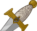
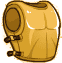
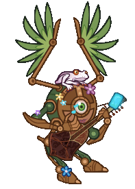
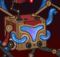
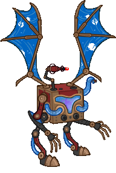
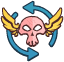
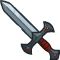
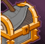

[Back to Main](index.md)

# Emergence 10

We know the next Emergence event will be Constructs and that it will start on 22 January 2025.

### Shop Contents

ⓘ *Note: This list might not be complete.*

    
        
            ID: 1**Support Pigment**The chosen equipment piece will now also increase the damage of all Champions by 200%<code>global_dps_multiplier_mult,200</code>
        
        
            **Pigmint**
            Marvelous Support Pigment
        
    
    
        
            ID: 2500**Blade of the Ages (Xerophon)**A reminder of a time and place I've left behind. I doubt Ythyrn's dead will mind.<code>global_dps_multiplier_mult,230</code>
        
        
            **Golden Epic**
            All Champion Damage
            Xerophon (Slot 1)
        
    
    
        
            ID: 3729**Cavalier's Breastplate (Eric)**Not even Tiamat can melt this metal!<code>health_mult,100</code>
        
        
            **Golden Epic**
            Health
            Eric (Slot 2)
        
    
    
        
            ID: 514**Modron Ellywick (Ellywick)**
        
        
            **Skin**
            Modron Ellywick
        
    
    
        
            ID: 515**Modron Vin Ursa (Vin Ursa)**
        
        
            **Skin**
            Modron Vin Ursa
        
    
    
        
            ID: 2007**Shar's Veil (Shadowheart)**Lady Shar demands my heart, and I give it to her freely.<code>change_hero_alignment_tag,lawful,evil</code>
        
        
            **Feat**
            Shar's Veil
            Shadowheart (Change Alignment to Lawful Evil)
        
    
    
        
            ID: 2011**Weapon Master (Kas)**I've practiced the blade for centuries. You are nothing before me.<code>hero_dps_multiplier_mult,120</code>
        
        
            **Feat**
            Weapon Master
            Kas (120% Self DPS)
        
    
    
        
            ID: 2012**Tenacious (Bobby)**Heroes never say die!<code>increase_ability_score,con,2</code>
        
        
            **Feat**
            Tenacious
            Bobby (Stat: +2 Constitution)
        
    
    
        
            ID: 2034**Prolonged Push (Eric)**You guys handle the fighting. I'll stay back here and hold them off!<code>buff_upgrade,80,16132,0</code>
        
        
            **Feat**
            Prolonged Push
            Eric (80% Keep Away)
        
    
    
        
            ID: 719**Construct Emergence Chest**Loot for: Bobby, Eric, Ellywick, Kas, Shadowheart, Vin Ursa and Xerophon<code>"for_crusaders":[152,157,83,153,141,127,88]</code>
        
        
            **Chest**
            Construct Emergence Chest
        
    

The Construct Emergence Chest will contain loot for Bobby, Eric, Ellywick, Kas, Shadowheart, Vin Ursa and Xerophon.


# Emergence FAQ



[Back to Top](#top)

*Last Modified: {{ site.time }}*