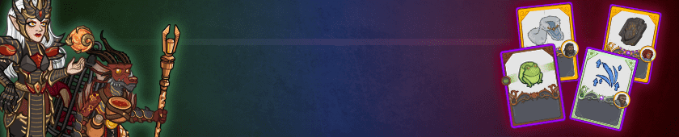

[Back to Main](index.md)





# Emergence 11

We know the next Emergence event will be Dragons and that it will start on 23 April 2025.

### Shop Contents

ⓘ *Note: This list might not be complete.*

    
        
            ID: 1**Support Pigment**The chosen equipment piece will now also increase the damage of all Champions by 200%<code>global_dps_multiplier_mult,200</code>
        
        
            **Pigmint**
            Marvelous Support Pigment
        
    
    
        
            ID: 557**Highlord Miria (Miria)**
        
        
            **Skin**
            Highlord Miria
        
    
    
        
            ID: 558**Dragonlance Spurt (Spurt)**
        
        
            **Skin**
            Dragonlance Spurt
        
    
    
        
            
        
        
            **Feat**
            Reaching Shadow
        
    
    
        
            ID: 2155**Venom Harvester (Spurt)**Spurt make discovery! Wyvern tail VERY stingy!<code>buff_spurt_waspiration_effect,80,0</code>
        
        
            **Feat**
            Venom Harvester
            Spurt (+80% to Wa-spiration: Stingy)
        
    
    
        
            ID: 2156**Heavily Armored (Miria)**You have no idea how much suffering a body can take.<code>health_mult,60</code>
        
        
            **Feat**
            Heavily Armored
            Miria (60% Health)
        
    
    
        
            ID: 2157**Weapon Master (Grimm)**Whether giants or dragons, all I need is one good swing.  ~Grimm<code>hero_dps_multiplier_mult,120</code>
        
        
            **Feat**
            Weapon Master
            Grimm (120% Self DPS)
        
    
    
        
            ID: 734**Chromatic Dragon Emergence Chest**Loot for: Beadle, Grimm, Miria, Reya and Spurt<code>"for_crusaders":[64,161,121,86,43]</code>
        
        
            **Chest**
            Chromatic Dragon Emergence Chest
        
    

The Chromatic Dragon Emergence Chest will contain loot for Beadle, Grimm, Miria, Reya and Spurt.


# Emergence FAQ



[Back to Top](#top)

*Last Modified: {{ site.time }}*