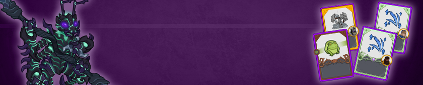
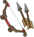

[Back to Main](index.md)

# Emergence 13

We know the next Emergence event will be Shadar-kai and that it will start on 22 October 2025.

### Shop Contents

ⓘ *Note: This list might not be complete.*

    
        
            ID: 1**Support Pigment**The chosen equipment piece will now also increase the damage of all Champions by 200%<code>global_dps_multiplier_mult,200</code>
        
        
            **Pigmint**
            Marvelous Support Pigment
        
    
    
        
            ID: 2480**+1 Bow of Owlbear Slaying (NERDS)**After perfectly stalking their foe, it ends with a surprise attack!  Increases the effect of NERDS's Ranger ability by 275%.<code>buff_upgrade,275,6140</code>
        
        
            **Golden Epic**
            +1 Bow of Owlbear Slaying
            NERDS (Slot 2)
        
    
    
        
            ID: 3681**Ring of Spell Turning (Wren)**They told me I couldn't block spells, but nothing about returning them!  Increases the effect of Wren's Hero's Call ability by 275%.<code>buff_upgrade,275,15208</code>
        
        
            **Golden Epic**
            Ring of Spell Turning
            Wren (Slot 2)
        
    
    
        
            ID: 3993**Accursed Harness (KoS)**I will protect their legacy at all costs.  Increases the effect of Shadows's Phase Two: The Warden ability by 275%.<code>buff_upgrade,275,17759</code>
        
        
            **Golden Epic**
            Accursed Harness
            KoS (Slot 2)
        
    
    
        
            ID: 614**Shadowfell Kalix (Kalix)**
        
        
            **Skin**
            Shadowfell Kalix
        
    
    
        
            ID: 2261**Tabaxi Glitch (Shandie)**I don't have friends. I've got clowder.  Shandie also counts as a Tabaxi and increases the effect of Agile Allies by 20% for each unique species in the formation, stacking additively.<code>add_hero_tags,0,tabaxi buff_upgrade,20,9727</code>
        
        
            **Feat**
            Tabaxi Glitch
            Shandie
        
    
    
        
            ID: 2262**Death's Shadow (Kalix)**I am their end. I am inevitable.  Increases the effect of Kalix's Chameleon Carapace ability by 80%.<code>buff_upgrade,80,16519,0</code>
        
        
            **Feat**
            Death's Shadow
            Kalix
        
    
    
        
            ID: 2326**Dark Zealot (KoS)**The light of the empire fades... I am what remains...  Increases the effect of Shadows's Phase Three: The Warrior ability by 80%.<code>buff_upgrade,80,17760</code>
        
        
            **Feat**
            Dark Zealot
            KoS
        
    
    
        
            ID: 2327**Tess Family (Tess)**We'll always be together, won't we, girl?  Increases the effect of Tess's Unleash Uggie ability by 80%.<code>buff_upgrade,80,17317</code>
        
        
            **Feat**
            Tess Family
            Tess
        
    
    
        
            ID: 2328**Lightbringer (Baldric)**Looks like there's still life in you yet.  Increases the effect of Baldric's Healing Lantern ability by 80%.<code>buff_upgrade,80,17478</code>
        
        
            **Feat**
            Lightbringer
            Baldric
        
    
    
        
            ID: 770**Shadowfell Emergence Chest**Loot for: Shandie, Wren, Kalix, Tess, Baldric and Shadows<code>"for_crusaders":[47,155,158,164,165,168]</code>
        
        
            **Chest**
            Shadowfell Emergence Chest
        
    

The Shadowfell Emergence Chest will contain loot for Shandie, Wren, Kalix, Tess, Baldric and Shadows.


# Emergence FAQ



[Back to Top](#top)

*Last Modified: {{ site.time }}*