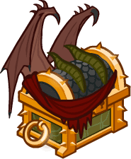

[Back to Main](index.md)





# Emergence 15

We know the next Emergence event will be Draconians and that it will start on 22 April 2026.

### Shop Contents

ⓘ *Note: This list might not be complete.*

    
        
            ID: 1**Support Pigment**The chosen equipment piece will now also increase the damage of all Champions by 200%<code>global_dps_multiplier_mult,200</code>
        
        
            **Pigmint**
            Marvelous Support Pigment
        
    
    
        
            ID: 20**Shield of Foaming Ale (Bruenor)**A magical shield with secret and mysterious powers.  Buffs Bruenor's Ultimate Attack Damage by 275%.<code>buff_ultimate,275</code>
        
        
            **Golden Epic**
            Shield of Foaming Ale
            Bruenor (Slot 5)
        
    
    
        
            ID: 2504**Reminder of Freedom (Xerophon)**My future lays before me -- a new path, a new me. I am no one's tool and no one's captive.  All Champions damage +230%.<code>global_dps_multiplier_mult,230</code>
        
        
            **Golden Epic**
            Reminder of Freedom
            Xerophon (Slot 2)
        
    
    
        
            ID: 4161**Rabbitslayer (Tasslehoff)**And Caramon told me it wouldn't be of any use unless I met a vicious rabbit!  Increases the effect of Tasslehoff's second set of Specializations by 275%.<code>buff_upgrades,275,19237,19238,19239</code>
        
        
            **Golden Epic**
            Rabbitslayer
            Tasslehoff (Slot 2)
        
    
    
        
            ID: 684**Dragon Army Infiltrator Eric (Eric)**
        
        
            **Skin**
            Dragon Army Infiltrator Eric
        
    
    
        
            ID: 2465**Pierce the Heavens (Kyre)**I've practiced this spiral thrust maneuver ten thousand times.  Increases the base chance of Stunning Strike up to 200%.<code>change_upgrade_data,18668,0 change_upgrade_data,18668,2</code>
        
        
            **Feat**
            Pierce the Heavens
            Kyre
        
    
    
        
            ID: 2499**Misdirection (Donaar)**Hey! Look over there! A distraction!  Enemies that attempt to attack this Champion will instead attack a different Champion, if possible.<code>global_dps_multiplier_mult,100 reverse_taunt</code>
        
        
            **Feat**
            Misdirection
            Donaar
        
    
    
        
            ID: 2513**Flaming Darts (Raistlin)**Kalith karan, tobaniskar! ~Raistlin  Raistlin fires two additional magic missiles with his base attack.<code>do_nothing</code>
        
        
            **Feat**
            Flaming Darts
            Raistlin
        
    
    
        
            ID: 2530**Volatile Magic (Lucius)**Oh, dear! That was quite a strong reaction. Let's try that again.  Increases the effect of Lucius's Elemental Adept ability by 80%.<code>buff_upgrade,80,19250</code>
        
        
            **Feat**
            Volatile Magic
            Lucius
        
    
    
        
            ID: 2556**Extra Payout (Binwin)**Talk to the other guy. I don't deal with that.  Increases the effect of Binwin's specialization abilities by 80%.<code>buff_upgrades,80,18464,18465,18463</code>
        
        
            **Feat**
            Extra Payout
            Binwin
        
    
    
        
            ID: 801**Draconian Emergence Chest**Loot for: Bruenor, Binwin, Donaar, Lucius, Xerophon, Diana, Kyre, Raistlin and Tasslehoff<code>"for_crusaders":[1,27,34,72,88,148,172,173,174]</code>
        
        
            **Chest**
            Draconian Emergence Chest
        
    

The Draconian Emergence Chest will contain loot for Bruenor, Binwin, Donaar, Lucius, Xerophon, Diana, Kyre, Raistlin and Tasslehoff.


# Emergence FAQ



[Back to Top](#top)

*Last Modified: {{ site.time }}*