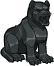
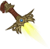
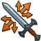

[Back to Main](index.md)





# Emergence 16

We know the next Emergence event will be Strahd Zombies and that it will start on 29 July 2026.

### Shop Contents

ⓘ *Note: This list might not be complete.*

    
        
            ID: 1**Support Pigment**The chosen equipment piece will now also increase the damage of all Champions by 200%<code>global_dps_multiplier_mult,200</code>
        
        
            **Pigmint**
            Marvelous Support Pigment
        
    
    
        
            ID: 428**Figurine of Guenhwyvar (Drizzt)**A unique figurine that summons my faithful companion, Guenhwyvar.  Buffs Drizzt's Ultimate Attack Damage by 275%.<code>buff_ultimate,275</code>
        
        
            **Golden Epic**
            Figurine of Guenhwyvar
            Drizzt (Slot 5)
        
    
    
        
            ID: 1668**Dagger of Lathander (Ezmerelda)**Let the Morninglord light a new dawn throughout Barovia!  Increases the effect of Ezmerelda's Training Montage ability by 275%. (Prestack)<code>buff_upgrade,275,15037,0</code>
        
        
            **Golden Epic**
            Dagger of Lathander
            Ezmerelda (Slot 3)
        
    
    
        
            
        
        
            **Golden Epic**
            slot 3
            Van Richten (Slot 3)
        
    
    
        
            ID: 714**Zombie Hunter Drizzt (Drizzt)**
        
        
            **Skin**
            Zombie Hunter Drizzt
        
    
    
        
            ID: 2466**Blinding Force (Kyre)**Know yourself. Know what needs to be done. Know to never hesitate.  Increases the stun duration to 20 seconds for Stunning Strike.<code>change_upgrade_data,18668,0</code>
        
        
            **Feat**
            Blinding Force
            Kyre
        
    
    
        
            ID: 2534**Abrasive Magic (Lucius)**I do have a tendency to get under people's skin.  Increases the amount of health segments broken by Armor Eating Acid by 1.<code>buff_upgrade,100,19252</code>
        
        
            **Feat**
            Abrasive Magic
            Lucius
        
    
    
        
            
        
        
            **Feat**
            Inevitable Triumph
        
    
    
        
            ID: 2701**Prodigal Leader (Laurana)**I'm not discussing anything. I'm the general. It's my decision. ~Laurana  All Champions damage +50%.<code>global_dps_multiplier_mult,50</code>
        
        
            **Feat**
            Prodigal Leader
            Laurana
        
    
    
        
            ID: 2702**Devastating Arcana (Raistlin)**I don't need you now. I won't need you anymore... ever. Watch! ~Raistlin  Increases the effect of Raistlin's Debilitating Magic ability by 80%.<code>buff_upgrade,80,18931</code>
        
        
            **Feat**
            Devastating Arcana
            Raistlin
        
    
    
        
            ID: 827**Ravenloft Emergence Chest**Loot for: Drizzt, Ezmerelda, Lucius, Kyre, Raistlin, Laurana and Van Richten<code>"for_crusaders":[18,70,72,172,173,175,177]</code>
        
        
            **Chest**
            Ravenloft Emergence Chest
        
    

The Ravenloft Emergence Chest will contain loot for Drizzt, Ezmerelda, Lucius, Kyre, Raistlin, Laurana and Van Richten.


# Emergence FAQ



[Back to Top](#top)

*Last Modified: {{ site.time }}*