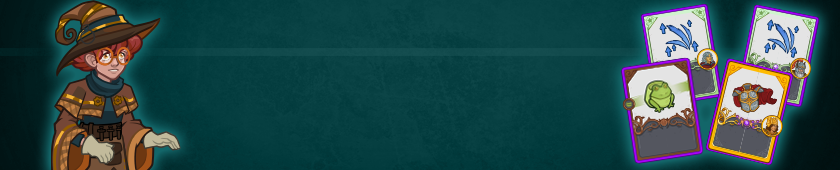
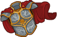

[Back to Main](index.md)

# Emergence 17

We know the next Emergence event will be Draconians and that it will start on 30 September 2026.

### Shop Contents

ⓘ *Note: This list might not be complete.*

    
        
            ID: 1**Support Pigment**The chosen equipment piece will now also increase the damage of all Champions by 200%<code>global_dps_multiplier_mult,200</code>
        
        
            **Pigmint**
            Marvelous Support Pigment
        
    
    
        
            ID: 4353**Storied Plate (Caramon)**They don't need me. Even Tika doesn't need me, not like Raist needed me.  Increases the health of Caramon by 100%.<code>health_mult,100</code>
        
        
            **Golden Epic**
            Storied Plate
            Caramon (Slot 2)
        
    
    
        
            ID: 743**Alchemical Savant Presto (Presto)**
        
        
            **Skin**
            Alchemical Savant Presto
        
    
    
        
            ID: 1851**Long Story Short (Umberto)**And that is how they THOUGHT they got away with it!  Increases the maximum number of Ongoing Investigation's Clue Stacks by 50%.<code>buff_upgrade_effect_stacks_max_mult,50,15050</code>
        
        
            **Feat**
            Long Story Short
            Umberto
        
    
    
        
            ID: 1968**Vengeful Promise (Minthara)**Now there is freedom. Soon there will be vengeance.  Increases the health bonus of the Unyielding component of Minthara's Oath of Vengeance ability by 80%.<code>buff_upgrade,80,15945,1</code>
        
        
            **Feat**
            Vengeful Promise
            Minthara
        
    
    
        
            ID: 2519**Consumptive Arcana (Raistlin)**Stand back. I have strength for one more spell. ~Raistlin  Increases the health threshold of Debilitating Magic to trigger when Raistlin is above 80% health.<code>change_upgrade_data,18931</code>
        
        
            **Feat**
            Consumptive Arcana
            Raistlin
        
    
    
        
            ID: 2717**Unyielding Initiative (Flint)**I almost lost him, Tanis.  Increases the Initiative and Follow Through stacks gained when Flint attacks to 2.<code>change_upgrade_data,20133,0</code>
        
        
            **Feat**
            Unyielding Initiative
            Flint
        
    
    
        
            ID: 2762**Scholar (Caramon)**Your brains are in your sword-arm, my brother. ~Raistlin  Increases the Intelligence score of Caramon by 2.<code>increase_ability_score,int,2</code>
        
        
            **Feat**
            Scholar
            Caramon
        
    


# Emergence FAQ



[Back to Top](#top)

*Last Modified: {{ site.time }}*