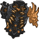
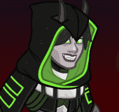

[Back to Main](index.md)

# Emergence 5

We know the next Emergence event will be Astral Elves and that it will start on 24 January 2024.

### Shop Contents

ⓘ *Note: This list might not be complete.*

    
        
            
        
        
            **Pigmint**
            Marvelous Support Pigment
        
    
    
        
            
        
        
            **Golden Epic**
            Rapid Fire
            Virgil (Slot 5)
        
    
    
        
            
        
        
            **Golden Epic**
            Health
            Karlach (Slot 2)
        
    
    
        
            
        
        
            **Skin**
            Spelljammer Pilot Strix
        
    
    
        
            
        
        
            **Skin**
            Spelljammer Pilot Miria
        
    
    
        
            
        
        
            **Feat**
            Caged Dreams
            Miria (80% Soul Cage)
        
    
    
        
            
        
        
            **Feat**
            Fields of Green
            D'hani (80% Chance to Apply Stroke of Green)
        
    
    
        
            
        
        
            **Feat**
            Prodigal Leader
            Gazrick (50% All Champion Damage)
        
    
    
        
            
        
        
            **Feat**
            Fiery Tempest
            Karlach (80% The Fury of Avernus)
        
    
    
        
            
        
        
            **Chest**
            Astral Elf Emergence Chest
        
    

The Astral Elf Emergence Chest will contain loot for Miria, Strix, Virgil, Wyll, D'hani and Gazrick.


# Emergence FAQ



[Back to Top](#top)

*Last Modified: {{ site.time }}*