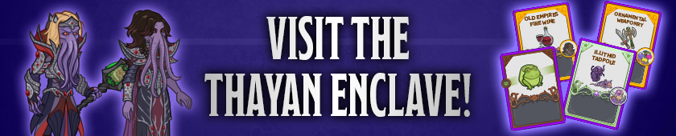
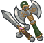
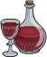

[Back to Main](index.md)

# Emergence 6

We know the next Emergence event will be Illithids and that it will start on 28 February 2024.

### Shop Contents

ⓘ *Note: This list might not be complete.*

    
        
            
        
        
            **Pigmint**
            Marvelous Support Pigment
        
    
    
        
            
        
        
            **Golden Epic**
            Fighter
            NERDS (Slot 1)
        
    
    
        
            
        
        
            **Golden Epic**
            All Specialisations
            Dynaheir (Slot 5)
        
    
    
        
            
        
        
            **Skin**
            Mind Flayer Celeste
        
    
    
        
            
        
        
            **Skin**
            Mind Flayer Dynaheir
        
    
    
        
            
        
        
            **Feat**
            Tenacious
            Presto (Stat: +2 Constitution)
        
    
    
        
            
        
        
            **Feat**
            Illithid Tadpole
            Dynaheir (25% All Champion Damage & +1 Ceremorphosis Stack)
        
    
    
        
            
        
        
            **Feat**
            Prodigal Leader
            Solaak (50% All Champion Damage)
        
    
    
        
            
        
        
            **Feat**
            Illithid Tadpole
            Minsc (25% All Champion Damage & +1 Ceremorphosis Stack)
        
    
    
        
            
        
        
            **Chest**
            Gold Illithid Emergence Chest
        
    

The Gold Illithid Emergence Chest will contain loot for Miria, Strix, Virgil, Karlach, D'hani and Gazrick.


# Emergence FAQ



[Back to Top](#top)

*Last Modified: {{ site.time }}*