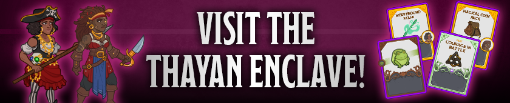
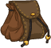
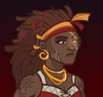
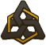
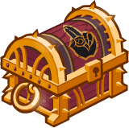

[Back to Main](index.md)

# Emergence 7

We know the next Emergence event will be Vecna Cultists and that it will start on 22 May 2024.

### Shop Contents

ⓘ *Note: This list might not be complete.*

    
        
            
        
        
            **Pigmint**
            Marvelous Support Pigment
        
    
    
        
            
        
        
            **Golden Epic**
            Guiding Hand
            Azaka (Slot 3)
        
    
    
        
            
        
        
            **Golden Epic**
            Ultimate Damage
            Diana (Slot 5)
        
    
    
        
            
        
        
            **Skin**
            Pirate Azaka
        
    
    
        
            
        
        
            **Skin**
            Pirate Diana
        
    
    
        
            
        
        
            **Feat**
            Courage in Battle
            Drizzt (+1 Mithral Hall Stacks)
        
    
    
        
            
        
        
            **Feat**
            Quick Friends
            Evelyn (80% Conduit of the Light)
        
    
    
        
            
        
        
            **Feat**
            Scholar
            Diana (Stat: +2 Intelligence)
        
    
    
        
            
        
        
            **Feat**
            Heavily Armored
            Krydle (60% Health)
        
    
    
        
            
        
        
            **Chest**
            Vecna Emergence Chest
        
    

The Vecna Emergence Chest will contain loot for Drizzt, Evelyn, Azaka, Krydle and Diana.


# Emergence FAQ



[Back to Top](#top)

*Last Modified: {{ site.time }}*