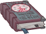

[Back to Main](index.md)





# Emergence 8

We know the next Emergence event will be Planescape and that it will start on 24 July 2024. The enemies will be Sigil Rabble-Rousers and will include members from the Harmonium, Heralds of Dust, and Cakers.

### Shop Contents

ⓘ *Note: This list might not be complete.*

    
        
            
        
        
            **Golden Epic**
            All Champion Damage
            Ulkoria (Slot 2)
        
    
    
        
            
        
        
            **Golden Epic**
            Uncover Weakness (Prestack)
            Aeon (Slot 3)
        
    
    
        
            
        
        
            **Skin**
            Secret Agent Maan
        
    
    
        
            
        
        
            **Skin**
            Tabaxi Glitch Shandie
        
    
    
        
            
        
        
            **Feat**
            Heart of Battle
            Ravengard (40% of Critical Teamwork Stacks Persist When Reset)
        
    
    
        
            
        
        
            **Feat**
            Woken the Hive
            Umberto (80% Beehive Barrage)
        
    
    
        
            
        
        
            **Feat**
            Air Genasi Glitch
            Valentine (Counts as Genasi & Change Alignment to Chaotic Evil)
        
    
    
        
            
        
        
            **Feat**
            Better Every Day
            Ulkoria (80% Watchful Order)
        
    
    
        
            
        
        
            **Chest**
            Planescape Emergence Chest
        
    

The Planescape Emergence Chest will contain loot for Shandie, Ulkoria, Hew Maan, Valentine, Ravengard, Aeon and Umberto.


# Emergence FAQ



[Back to Top](#top)

*Last Modified: {{ site.time }}*