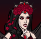
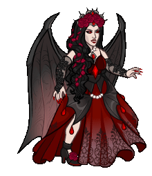

[Back to Main](index.md)

# Emergence 9

We know the next Emergence event will be Vampires and that it will start on 23 October 2024. 

ⓘ *Note: We've been told by Justin on Dev Insights that the 9 jump Briv feat will be in this Emergence - but there's no data in the definitions yet to back that statement up.*

### Shop Contents

ⓘ *Note: This list might not be complete.*

    
        
            ID: 1**Support Pigment**The chosen equipment piece will now also increase the damage of all Champions by 200%<code>global_dps_multiplier_mult,200</code>
        
        
            **Pigmint**
            Marvelous Support Pigment
        
    
    
        
            ID: 3637**Eye of Vecna (Kas)**Sometimes I feel as if he can still see me through it...<code>buff_upgrade,100,15621,0</code>
        
        
            **Golden Epic**
            Life Drain
            Kas (Slot 3)
        
    
    
        
            ID: 3225**Muskets of Precision (Krux)**Won these in a game at Infinity's. That celestial was not happy with me...<code>buff_upgrade,275,11653</code>
        
        
            **Golden Epic**
            All Hands On Deck!
            Krux (Slot 2)
        
    
    
        
            ID: 461**Nosferatu Widdle (Widdle)**
        
        
            **Skin**
            Nosferatu Widdle
        
    
    
        
            ID: 462**Vampire Nahara (Nahara)**
        
        
            **Skin**
            Vampire Nahara
        
    
    
        
            ID: 1723**Prodigal Leader (Voronika)**Do as I say - you'll live longer.<code>global_dps_multiplier_mult,50</code>
        
        
            **Feat**
            Prodigal Leader
            Voronika (50% All Champion Damage)
        
    
    
        
            ID: 1880**Gem (Ellywick)**Spread the wealth.<code>ellywick_gem_prioritized</code>
        
        
            **Feat**
            Gem
            Ellywick (Always draws at least 1 Gems card.)
        
    
    
        
            ID: 1893**Make Undead (Nahara)**I feel stronger...<code>add_hero_tags,0,undead hero_dps_multiplier_mult,400</code>
        
        
            **Feat**
            Make Undead
            Nahara (Counts as Undead & 400% Self DPS)
        
    
    
        
            ID: 1894**Make Undead (Widdle)**HUNGRY!<code>add_hero_tags,0,undead buff_upgrade,160,6905</code>
        
        
            **Feat**
            Make Undead
            Widdle (Counts as Undead & 160% Vampiric Gaze)
        
    
    
        
            ID: 2004**Strategic Stride (Briv)**My mighty legs could go farther, but there is wisdom in restraint.<code>cap_upgrade,25600,3452</code>
        
        
            **Feat**
            Strategic Stride
            Briv (Cap Unnatural Haste at 9j)
        
    
    
        
            ID: 677**Vampire Emergence Chest**Loot for: Briv, Ellywick, Widdle, Nahara, Voronika, Krux and Kas<code>"for_crusaders":[58,83,91,102,104,136,153]</code>
        
        
            **Chest**
            Vampire Emergence Chest
        
    

The Vampire Emergence Chest will contain loot for Briv, Ellywick, Widdle, Nahara, Voronika, Krux and Kas.


# Emergence FAQ



[Back to Top](#top)

*Last Modified: {{ site.time }}*