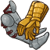
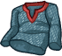
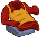
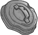
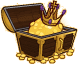

[Back to Main](index.md)

    
        
            
        
        
        Portrait
        
    
    
        
            
        
        
        Model
        
    

# Eric

Eric, the Cavalier at the age of 15, is the spoiled child, originating from a rich home. On the surface, Eric is a big-mouthed comic relief coward. Eric has a heroic core, and frequently saves his friends from danger with his magical griffin shield, which can project a force field. Despite his aloofness and several instances of selfishness, Eric shares the common camaraderie of the group, and occasionally steps to the fore as a substitute leader in Hank's absence.

[D&D (TV Series) - Wikipedia](https://en.wikipedia.org/wiki/Dungeons_%26_Dragons_(TV_series))

# Basic Information

Eric will be a new champion in the Wintershield event on 1 January 2025.

    
        
            **Seat**:
        
        
            Unknown
        
    
    
        
            **Species**:
        
        
            Human (Guess)
        
    
    
        
            **Class**:
        
        
            Fighter (Guess)
        
    
    
        
            **Roles**:
        
        
            Tanking / Support / Gold / Control (Guess)
        
    
    
        
            **Age**:
        
        
            15 (Guess)
        
    
    
        
            **Gender**:
        
        
            Male (Guess)
        
    
    
        
            **Alignment**:
        
        
            Unknown
        
    
    
        
            **Affiliation**:
        
        
            Saturday Morning Squad (Guess)
        
    

# Formation

    <svg xmlns="http://www.w3.org/2000/svg" id="Eric" fill="#aaa" data-formationName="Eric" data-campaignName="Wintershield" width="299" height="140"><circle cx="175" cy="65" r="15"/><circle cx="175" cy="105" r="15"/><circle cx="135" cy="45" r="15"/><circle cx="135" cy="85" r="15"/><circle cx="95" cy="25" r="15"/><circle cx="95" cy="105" r="15"/><circle cx="55" cy="45" r="15"/><circle cx="55" cy="85" r="15"/><circle cx="55" cy="125" r="15"/><circle cx="15" cy="65" r="15"/><text x="205" y="25" fill="#dcdcdc" font-size="25" font-family="Arial" font-weight="bold">Eric</text><text x="205" y="65" fill="#dcdcdc" font-size="15" font-family="Arial" font-weight="bold">Wintershield</text></svg>

# Attacks

**Base Attack: Forceful Bash** (Melee)
> Eric hits the closest enemy with his shield, dealing one hit and knocking them back a short distance.  
> Cooldown: 6.5s (Cap 1.625s)

<em>Raw Data</em>

<pre>
{
    "id": 824,
    "name": "Forceful Bash",
    "description": "Eric knocks back the closest enemy with a hit from his shield.",
    "long_description": "Eric hits the closest enemy with his shield, dealing one hit and knocking them back a short distance.",
    "graphic_id": 0,
    "target": "front",
    "num_targets": 1,
    "aoe_radius": 0,
    "damage_modifier": 1,
    "cooldown": 6.5,
    "animations": [
        {
            "type": "melee_attack",
            "target_offset_x": -45,
            "damage_frame": 10,
            "jump_sound": 30,
            "sound_frames": {
                "10": 154
            },
            "effects_on_monsters": [
                {
                    "effect_string": "push_back_monster,10",
                    "animation": "hit",
                    "after_damage": true
                }
            ]
        }
    ],
    "tags": [
        "melee"
    ],
    "damage_types": [
        "melee"
    ]
}
</pre>

**Ultimate Attack: Protective Field**
> Eric's shield projects a powerful force field, dealing 1 ultimate hit to all monsters while protecting the Champions from all damage for 10 seconds.  
> Cooldown: 600s (Cap 150s)

<em>Raw Data</em>

<pre>
{
    "id": 825,
    "name": "Protective Field",
    "description": "A field from Eric's shield knocks back enemies and protects the Champions for 10 seconds.",
    "long_description": "Eric's shield projects a powerful force field, dealing 1 ultimate hit to all monsters while protecting the Champions from all damage for 10 seconds.",
    "graphic_id": 25267,
    "target": "none",
    "num_targets": 0,
    "aoe_radius": 0,
    "damage_modifier": 0.03,
    "cooldown": 600,
    "animations": [
        {
            "type": "ultimate_attack",
            "ultimate": "eric"
        }
    ],
    "tags": [
        "magic",
        "ultimate"
    ],
    "damage_types": [
        "magic"
    ]
}
</pre>

# Abilities

**Cavalier's Code** (Guess)
> Eric increases the effect of his Trait specialization choice and the party's Gold Find by 20% for each enemy that has spawned in the current area, stacking multiplicatively up to 100 enemies. Boss enemies count as 25 enemies for this ability.

<em>Raw Data</em>

<pre>
{
    "id": 2159,
    "flavour_text": "",
    "description": {
        "desc": "Eric increases the effect of his Trait specialization choice and the party's Gold Find by $(not_buffed amount)% for each enemy that has spawned in the current area, stacking multiplicatively up to $max_stacks enemies. Boss enemies count as 25 enemies for this ability."
    },
    "effect_keys": [
        {
            "off_when_benched": true,
            "effect_string": "buff_upgrades,20,16134,16135,16136",
            "show_bonus": true,
            "amount_func": "mult",
            "stack_func": "per_hero_attribute",
            "post_process_expr": "normal_monsters_spawned + 25*boss_monsters_spawned",
            "limit": 100,
            "max_stacks": 100,
            "amount_updated_listeners": [
                "monster_spawned"
            ]
        },
        {
            "off_when_benched": true,
            "effect_string": "gold_multiplier_mult,20",
            "amount_func": "mult",
            "stack_func": "per_hero_attribute",
            "post_process_expr": "normal_monsters_spawned + 25*boss_monsters_spawned",
            "limit": 100,
            "max_stacks": 100,
            "amount_updated_listeners": [
                "monster_spawned"
            ]
        }
    ],
    "requirements": "",
    "graphic_id": 25257,
    "large_graphic_id": 25253,
    "properties": {
        "is_formation_ability": true,
        "formation_circle_icon": false,
        "owner_use_outgoing_description": true
    }
}
</pre>

**Shield of the Cavalier** (Guess)
> Eric increases the health of all other Champions by 25% of his max health, and when any Champion in the formation gains temporary health, the amount gained is increased by 100%.

<em>Raw Data</em>

<pre>
{
    "id": 2160,
    "flavour_text": "",
    "description": {
        "desc": "Eric increases the health of all other Champions by $amount% of his max health, and when any Champion in the formation gains temporary health, the amount gained is increased by $(amount___2)%."
    },
    "effect_keys": [
        {
            "off_when_benched": true,
            "effect_string": "increase_health_by_source_percent,25",
            "targets": [
                "other"
            ]
        },
        {
            "off_when_benched": true,
            "effect_string": "temp_health_mult,100",
            "targets": [
                "all"
            ],
            "skip_effect_key_desc": true
        }
    ],
    "requirements": "",
    "graphic_id": 25260,
    "large_graphic_id": 25256,
    "properties": {
        "is_formation_ability": true,
        "owner_use_outgoing_description": true,
        "default_bonus_index": 1,
        "indexed_effect_properties": true,
        "per_effect_index_bonuses": true
    }
}
</pre>

**Preferred Target** (Guess)
> All Ranged and Magic attacking enemies target Eric before any other Champion in the formation.

<em>Raw Data</em>

<pre>
{
    "id": 2161,
    "flavour_text": "",
    "description": {
        "desc": "All Ranged and Magic attacking enemies target Eric before any other Champion in the formation."
    },
    "effect_keys": [
        {
            "off_when_benched": true,
            "effect_string": "damage_type_taunt,ranged,magic"
        }
    ],
    "requirements": "",
    "graphic_id": 25259,
    "large_graphic_id": 25255,
    "properties": {
        "is_formation_ability": true,
        "formation_circle_icon": false,
        "owner_use_outgoing_description": true
    }
}
</pre>

**Keep Away** (Guess)
> For the first 60 seconds in any area, Eric increases the distance of all knockback effects by 100%.

<em>Raw Data</em>

<pre>
{
    "id": 2162,
    "flavour_text": "",
    "description": {
        "desc": "For the first $amount seconds in any area, Eric increases the distance of all knockback effects by $(amount___2)%.",
        "post": {
            "conditions": [
                {
                    "condition": "not static_desc",
                    "desc": "$eric_keep_away_desc"
                }
            ]
        }
    },
    "effect_keys": [
        {
            "off_when_benched": true,
            "effect_string": "effect_duration,60"
        },
        {
            "off_when_benched": true,
            "apply_manually": true,
            "effect_string": "push_back_mult,100"
        }
    ],
    "requirements": "",
    "graphic_id": 25258,
    "large_graphic_id": 25254,
    "properties": {
        "is_formation_ability": true,
        "formation_circle_icon": false,
        "owner_use_outgoing_description": true,
        "default_bonus_index": 0,
        "indexed_effect_properties": true,
        "per_effect_index_bonuses": true
    }
}
</pre>

**Corrupted Gems Scavenger** (Guess)
> Eric can help scavenge up to 5000 additional Corrupted Gems when killing bosses. While this cap is not reached, Eric has a 100% chance of scavenging 100_per_drop Corrupted Gems each time a boss is defeated. The cap increases by 150 every day.

<em>Raw Data</em>

<pre>
{
    "id": 2163,
    "flavour_text": "",
    "description": {
        "desc": "Eric can help scavenge up to $(current_scavenge_cap eric_corrupted_gem_scavenger floor) additional Corrupted Gems when killing bosses. While this cap is not reached, Eric has a $amount% chance of scavenging $amount_per_drop Corrupted Gems each time a boss is defeated. The cap increases by $cap_increase_per_day every day.",
        "post": {
            "conditions": [
                {
                    "condition": "not static_desc",
                    "desc": "^^Corrupted Gems Scavenged: $(stat_value eric_corrupted_gems_collected 0 none) ($(stat_value eric_corrupted_gems_collected_this_adventure 1 none) this adventure)"
                }
            ]
        }
    },
    "effect_keys": [
        {
            "off_when_benched": true,
            "effect_string": "scavenge_items,100",
            "id": "eric_corrupted_gem_scavenger",
            "item_type": "corrupted_gems",
            "initial_cap": 5000,
            "cap_increase_per_day": 150,
            "start_date": "2024-09-04 12:00:00",
            "total_collected_stat": "eric_corrupted_gems_collected",
            "adventure_collected_stat": "eric_corrupted_gems_collected_this_adventure",
            "upgrade_id": 16133,
            "amount_per_drop": 10
        }
    ],
    "requirements": "",
    "graphic_id": 0,
    "large_graphic_id": 0,
    "properties": {
        "is_formation_ability": true,
        "formation_circle_icon": false,
        "owner_use_outgoing_description": true
    }
}
</pre>

**Unlock Ultimate** (Guess)
> Unlocks Eric's Protective Field Ultimate Attack.

<em>Raw Data</em>

<pre>
{
    "id": 2172,
    "flavour_text": "",
    "description": {
        "desc": "Unlocks Eric's Protective Field Ultimate Attack"
    },
    "effect_keys": [
        {
            "effect_string": "eric_ult",
            "duration": 10,
            "push_amount": 1000
        },
        {
            "apply_manually": true,
            "effect_string": "damage_reduction,100",
            "targets": [
                "all"
            ]
        },
        {
            "effect_string": "set_ultimate_attack"
        }
    ],
    "requirements": "",
    "graphic_id": 0,
    "large_graphic_id": 25267,
    "properties": {
        "is_formation_ability": true,
        "owner_use_outgoing_description": true,
        "formation_circle_icon": false,
        "show_outgoing_desc_when_benched": false
    }
}
</pre>

# Specialisations

**Trait: Cautious** (Guess)
> Eric increases the damage of all Champions by 100%, increased by 100% for each column they are in front of him, stacking multiplicatively.

<em>Raw Data</em>

<pre>
{
    "id": 2164,
    "flavour_text": "",
    "description": {
        "desc": "Eric increases the damage of all Champions by $(amount)%, increased by $(amount___2)% for each column they are in front of him, stacking multiplicatively."
    },
    "effect_keys": [
        {
            "off_when_benched": true,
            "effect_string": "base_amount,100"
        },
        {
            "off_when_benched": true,
            "effect_string": "additional_amount,100"
        },
        {
            "off_when_benched": true,
            "effect_string": "hero_dps_multiplier_mult,0",
            "amount_func": "eric_trait",
            "base_amount_idx": 0,
            "additional_amount_idx": 1,
            "additional_per_column": "ahead",
            "targets": [
                "all"
            ],
            "use_computed_amount_for_description": true,
            "show_bonus": true
        }
    ],
    "requirements": "",
    "graphic_id": 25262,
    "large_graphic_id": 25262,
    "properties": {
        "is_formation_ability": true,
        "default_bonus_index": 0,
        "indexed_effect_properties": true,
        "per_effect_index_bonuses": true,
        "owner_use_outgoing_description": true
    }
}
</pre>

**Trait: Brave** (Guess)
> Eric increases the damage of all Champions by 100%, increased by 100% for each column they are behind him, stacking multiplicatively.

<em>Raw Data</em>

<pre>
{
    "id": 2165,
    "flavour_text": "",
    "description": {
        "desc": "Eric increases the damage of all Champions by $(amount)%, increased by $(amount___2)% for each column they are behind him, stacking multiplicatively."
    },
    "effect_keys": [
        {
            "off_when_benched": true,
            "effect_string": "base_amount,100"
        },
        {
            "off_when_benched": true,
            "effect_string": "additional_amount,100"
        },
        {
            "off_when_benched": true,
            "effect_string": "hero_dps_multiplier_mult,0",
            "amount_func": "eric_trait",
            "base_amount_idx": 0,
            "additional_amount_idx": 1,
            "additional_per_column": "behind",
            "targets": [
                "all"
            ],
            "use_computed_amount_for_description": true
        }
    ],
    "requirements": "",
    "graphic_id": 25261,
    "large_graphic_id": 25261,
    "properties": {
        "is_formation_ability": true,
        "default_bonus_index": 0,
        "indexed_effect_properties": true,
        "per_effect_index_bonuses": true,
        "owner_use_outgoing_description": true
    }
}
</pre>

**Trait: Sarcastic** (Guess)
> Eric increases the damage of adjacent Champions by 600%.

<em>Raw Data</em>

<pre>
{
    "id": 2166,
    "flavour_text": "",
    "description": {
        "desc": "Eric increases the damage of adjacent Champions by $amount%."
    },
    "effect_keys": [
        {
            "off_when_benched": true,
            "effect_string": "hero_dps_multiplier_mult,600",
            "targets": [
                "adj"
            ]
        }
    ],
    "requirements": "",
    "graphic_id": 25263,
    "large_graphic_id": 25263,
    "properties": {
        "is_formation_ability": true,
        "owner_use_outgoing_description": true
    }
}
</pre>

**Unassuming Force** (Guess)
> Eric increases the damage bonus of his Trait specialization choice by 100% for each Champion in the formation with a total ability score of 78 or less, stacking multiplicatively.

ⓘ *Note: This ability is prestack.*

<em>Raw Data</em>

<pre>
{
    "id": 2167,
    "flavour_text": "",
    "description": {
        "desc": "Eric increases the damage bonus of his Trait specialization choice by $amount% for each Champion in the formation with a total ability score of 78 or less, stacking multiplicatively."
    },
    "effect_keys": [
        {
            "off_when_benched": true,
            "effect_string": "pre_stack,100"
        },
        {
            "off_when_benched": true,
            "effect_string": "buff_upgrades,0,16134,16135,16136",
            "amount_expr": "upgrade_amount(16137,0)",
            "amount_func": "mult",
            "stack_func": "per_hero_attribute",
            "per_hero_expr": "GetStat(`total_ability_score`) <= 78",
            "show_bonus": true,
            "amount_updated_listeners": [
                "slot_changed",
                "ability_score_changed"
            ]
        }
    ],
    "requirements": "",
    "graphic_id": 25265,
    "large_graphic_id": 25265,
    "properties": {
        "is_formation_ability": true,
        "formation_circle_icon": false,
        "owner_use_outgoing_description": true,
        "default_bonus_index": 0,
        "indexed_effect_properties": true,
        "per_effect_index_bonuses": true,
        "spec_option_post_apply_info": "Champions in Formation Targeted: $num_stacks___2"
    }
}
</pre>

**Youthful Valor** (Guess)
> Eric increases the damage bonus of his Trait specialization choice by 100% for each Champion in the formation with an age of 20 or less, stacking multiplicatively.

ⓘ *Note: This ability is prestack.*

<em>Raw Data</em>

<pre>
{
    "id": 2168,
    "flavour_text": "",
    "description": {
        "desc": "Eric increases the damage bonus of his Trait specialization choice by $amount% for each Champion in the formation with an age of 20 or less, stacking multiplicatively."
    },
    "effect_keys": [
        {
            "off_when_benched": true,
            "effect_string": "pre_stack,100"
        },
        {
            "off_when_benched": true,
            "effect_string": "buff_upgrades,0,16134,16135,16136",
            "amount_expr": "upgrade_amount(16138,0)",
            "amount_func": "mult",
            "stack_func": "per_hero_attribute",
            "per_hero_expr": "age <= 20 && hero_id != 146",
            "show_bonus": true,
            "amount_updated_listeners": [
                "slot_changed"
            ]
        }
    ],
    "requirements": "",
    "graphic_id": 25266,
    "large_graphic_id": 25266,
    "properties": {
        "is_formation_ability": true,
        "formation_circle_icon": false,
        "owner_use_outgoing_description": true,
        "default_bonus_index": 0,
        "indexed_effect_properties": true,
        "per_effect_index_bonuses": true,
        "spec_option_post_apply_info": "Champions in Formation Targeted: $num_stacks___2"
    }
}
</pre>

**Treasure Hunters** (Guess)
> Eric increases the damage bonus of his Trait specialization choice by 100% for each Champion in the formation with the Gold Find role, stacking multiplicatively.

ⓘ *Note: This ability is prestack.*

<em>Raw Data</em>

<pre>
{
    "id": 2169,
    "flavour_text": "",
    "description": {
        "desc": "Eric increases the damage bonus of his Trait specialization choice by $amount% for each Champion in the formation with the Gold Find role, stacking multiplicatively."
    },
    "effect_keys": [
        {
            "off_when_benched": true,
            "effect_string": "pre_stack,100"
        },
        {
            "off_when_benched": true,
            "effect_string": "buff_upgrades,0,16134,16135,16136",
            "amount_expr": "upgrade_amount(16139,0)",
            "amount_func": "mult",
            "stack_func": "per_hero_attribute",
            "per_hero_expr": "HasTag(`gold`)",
            "show_bonus": true,
            "amount_updated_listeners": [
                "slot_changed"
            ]
        }
    ],
    "requirements": "",
    "graphic_id": 25264,
    "large_graphic_id": 25264,
    "properties": {
        "is_formation_ability": true,
        "formation_circle_icon": false,
        "owner_use_outgoing_description": true,
        "default_bonus_index": 0,
        "indexed_effect_properties": true,
        "per_effect_index_bonuses": true,
        "spec_option_post_apply_info": "Champions in Formation Targeted: $num_stacks___2"
    }
}
</pre>

# Items

    
        
            **Icons**
        
        
            **Name**
        
    
    
        
            
        
        
            Armor
        
    
    
        
            
        
        
            Belt
        
    
    
        
            
        
        
            Cape
        
    
    
        
            
        
        
            Clothing
        
    
    
        
            
        
        
            Shield
        
    
    
        
            
        
        
            Wealth
        
    

# Feats

Unknown.

# Legendaries

Unknown.

# Adventures and Variants

**Unlock Adventure: The Merry Map Misadventure (Eric)** (Complete Area 50)
> Help a poor map find its way home for the holidays.

 **Variant 1: Cavalier!** (Complete Area 75)
> Eric starts in the formation. He can be moved but not removed.  
> Only Champions in the front two columns and the back column can deal damage.  
> 1-2 Bullywug Spear Throwers spawn with each wave. They don't drop gold, nor count towards quest progress.  
> Getting to Know Eric: Eric's first specialization choice determines how he buffs the formation. Does he lead from the front or cower in the back?

 **Variant 2: Prison Without Walls** (Complete Area 125)
> Eric starts in the formation. He can't be moved or removed.  
> In area 126 or higher, no Tanking Champions other than Eric can be added to the formation, and any other Tanking Champions are automatically removed.  
> A transformed Lukyon joins the formation. He doesn't do much in his cursed form.  
> Getting to Know Eric: Knock back abilities are stronger when Eric is in the formation. Take advantage of that to protect your non-tanking Champions at the front!

 **Variant 3: The Wrath of Venger** (Complete Area 175)
> Eric starts in the formation. He can be moved but not removed.  
> At the start of each Boss area, Venger arrives on his nightmare as an additional boss that must be defeated.  
> You may only use Champions with an age of 20 or younger, have a total ability score of 78 or lower, or have the Gold Find role.  
> Getting to Know Eric: Eric's second set of specializations determines which Champions he works best with. Which formation will you build?

# Other Champion Images

    
        
            Console Portrait
        
    
    
        
            Gold Chest Icon
        
        
            Silver Chest Icon
        
    

[Back to Top](#top)

*Last Modified: {{ site.time }}*