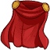
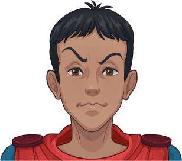

[Back to Main](index.md)

    
        
            
        
        
        Portrait
        
    
    
        
            
        
        
        Model
        
    

# Eric

Eric is the Cavalier of the group of friends trapped in the magical world of Dungeons & Dragons. Known for his sarcasm and frequent cowardice, he's often the butt of jokes. Yet, when danger strikes, Eric's bravery emerges, and he uses his magical shield to protect his friends. Despite his complaints and fears, his loyalty and courage make him an essential part of the group's quest to find their way home.

# Basic Information

Eric will be a new champion in the Wintershield event on 1 January 2025.

    
        
            **Seat**:
        
        
            4
        
        
            **Stat**
        
        
            **Value**
        
        
            **Day 1 Trials**
        
        
            **Patrons**
        
    
    
        
            **Species**:
        
        
            Human
        
        
            **Strength**:
        
        
            13
        
        
            Yes
        
        
            Mirt
        
    
    
        
            **Class**:
        
        
            Fighter
        
        
            **Dexterity**:
        
        
            12
        
        
            Yes
        
        
            Vajra
        
    
    
        
            **Roles**:
        
        
            Support / Tanking / Gold / Control
        
        
            **Constitution**:
        
        
            14
        
        
            Yes
        
        
            Strahd (with Feat)
        
    
    
        
            **Age**:
        
        
            15
        
        
            **Intelligence**:
        
        
            11
        
        
            Yes
        
        
            -
        
    
    
        
            **Gender**:
        
        
            Male
        
        
            **Wisdom**:
        
        
            10
        
        
            Yes
        
        
            Elminster
        
    
    
        
            **Alignment**:
        
        
            Neutral Good
        
        
            **Charisma**:
        
        
            9
        
        
            -
        
        
            &nbsp;
        
    
    
        
            **Affiliation**:
        
        
            Saturday Morning Squad
        
        
            **Total**:
        
        
            69
        
        
            Champion ID:
        
        
            157
        
    

# Formation

    <svg xmlns="http://www.w3.org/2000/svg" id="Eric" fill="#aaa" data-formationName="Eric" data-campaignName="Wintershield" width="299" height="140"><circle cx="175" cy="65" r="15"/><circle cx="175" cy="105" r="15"/><circle cx="135" cy="45" r="15"/><circle cx="135" cy="85" r="15"/><circle cx="95" cy="25" r="15"/><circle cx="95" cy="105" r="15"/><circle cx="55" cy="45" r="15"/><circle cx="55" cy="85" r="15"/><circle cx="55" cy="125" r="15"/><circle cx="15" cy="65" r="15"/><text x="205" y="25" fill="#dcdcdc" font-size="25" font-family="Arial" font-weight="bold">Eric</text><text x="205" y="65" fill="#dcdcdc" font-size="15" font-family="Arial" font-weight="bold">Wintershield</text></svg>

# Attacks

 **Base Attack: Forceful Bash** (Melee)
> Eric hits the closest enemy with his shield, dealing one hit and knocking them back a short distance.  
> Cooldown: 6.5s (Cap 1.625s)

<em>Raw Data</em>

<pre>
{
    "id": 824,
    "name": "Forceful Bash",
    "description": "Eric knocks back the closest enemy with a hit from his shield.",
    "long_description": "Eric hits the closest enemy with his shield, dealing one hit and knocking them back a short distance.",
    "graphic_id": 0,
    "target": "front",
    "num_targets": 1,
    "aoe_radius": 0,
    "damage_modifier": 1,
    "cooldown": 6.5,
    "animations": [
        {
            "type": "melee_attack",
            "target_offset_x": -45,
            "damage_frame": 10,
            "jump_sound": 30,
            "sound_frames": {
                "10": 154
            },
            "effects_on_monsters": [
                {
                    "effect_string": "push_back_monster,10",
                    "animation": "hit",
                    "after_damage": true
                }
            ]
        }
    ],
    "tags": [
        "melee"
    ],
    "damage_types": [
        "melee"
    ]
}
</pre>

 **Ultimate Attack: Protective Field** (Level: 0)
> Eric's shield projects a powerful force field, dealing 1 ultimate hit to all monsters while protecting the Champions from all damage for 10 seconds.  
> Cooldown: 600s (Cap 150s)

<em>Raw Data</em>

<pre>
{
    "id": 825,
    "name": "Protective Field",
    "description": "A field from Eric's shield knocks back enemies and protects the Champions for 10 seconds.",
    "long_description": "Eric's shield projects a powerful force field, dealing 1 ultimate hit to all monsters while protecting the Champions from all damage for 10 seconds.",
    "graphic_id": 25267,
    "target": "none",
    "num_targets": 0,
    "aoe_radius": 0,
    "damage_modifier": 0.03,
    "cooldown": 600,
    "animations": [
        {
            "type": "ultimate_attack",
            "ultimate": "eric"
        }
    ],
    "tags": [
        "magic",
        "ultimate"
    ],
    "damage_types": [
        "magic"
    ]
}
</pre>

# Abilities

 **Cavalier's Code** (Level: 100)
> Eric increases the effect of his Trait specialization choice and the party's Gold Find by 20% for each enemy that has spawned in the current area, stacking multiplicatively up to 100 enemies. Boss enemies count as 25 enemies for this ability.

<em>Raw Data</em>

<pre>
{
    "id": 16129,
    "hero_id": 157,
    "required_level": 100,
    "required_upgrade_id": 0,
    "upgrade_type": "unlock_ability",
    "effect": "effect_def,2159",
    "static_dps_mult": null,
    "default_enabled": 1,
    "name": "Cavalier's Code",
    "tip_text": "Eric's first specialization choice buffs different areas of the formation, and his Cavalier's Code increases these buffs and gold find as enemies spawn."
}
{
    "id": 2159,
    "flavour_text": "",
    "description": {
        "desc": "Eric increases the effect of his Trait specialization choice and the party's Gold Find by $(not_buffed amount)% for each enemy that has spawned in the current area, stacking multiplicatively up to $max_stacks enemies. Boss enemies count as 25 enemies for this ability."
    },
    "effect_keys": [
        {
            "off_when_benched": true,
            "effect_string": "buff_upgrades,20,16134,16135,16136",
            "show_bonus": true,
            "amount_func": "mult",
            "stack_func": "per_hero_attribute",
            "post_process_expr": "normal_monsters_spawned + 25*boss_monsters_spawned",
            "limit": 100,
            "max_stacks": 100,
            "amount_updated_listeners": [
                "monster_spawned"
            ]
        },
        {
            "off_when_benched": true,
            "effect_string": "gold_multiplier_mult,20",
            "amount_func": "mult",
            "stack_func": "per_hero_attribute",
            "post_process_expr": "normal_monsters_spawned + 25*boss_monsters_spawned",
            "limit": 100,
            "max_stacks": 100,
            "amount_updated_listeners": [
                "monster_spawned"
            ]
        }
    ],
    "requirements": "",
    "graphic_id": 25257,
    "large_graphic_id": 25253,
    "properties": {
        "is_formation_ability": true,
        "formation_circle_icon": false,
        "owner_use_outgoing_description": true
    }
}
</pre>

 **Shield of the Cavalier** (Level: 190)
> Eric increases the health of all other Champions by 25% of his max health, and when any Champion in the formation gains temporary health, the amount gained is increased by 100%.

<em>Raw Data</em>

<pre>
{
    "id": 16130,
    "hero_id": 157,
    "required_level": 190,
    "required_upgrade_id": 0,
    "upgrade_type": "unlock_ability",
    "effect": "effect_def,2160",
    "static_dps_mult": null,
    "default_enabled": 1,
    "name": "Shield of the Cavalier"
}
{
    "id": 2160,
    "flavour_text": "",
    "description": {
        "desc": "Eric increases the health of all other Champions by $amount% of his max health, and when any Champion in the formation gains temporary health, the amount gained is increased by $(amount___2)%."
    },
    "effect_keys": [
        {
            "off_when_benched": true,
            "effect_string": "increase_health_by_source_percent,25",
            "targets": [
                "other"
            ]
        },
        {
            "off_when_benched": true,
            "effect_string": "temp_health_mult,100",
            "targets": [
                "all"
            ],
            "skip_effect_key_desc": true
        }
    ],
    "requirements": "",
    "graphic_id": 25260,
    "large_graphic_id": 25256,
    "properties": {
        "is_formation_ability": true,
        "owner_use_outgoing_description": true,
        "default_bonus_index": 1,
        "indexed_effect_properties": true,
        "per_effect_index_bonuses": true
    }
}
</pre>

 **Protective Field** (Level: 240)
> Unlocks Eric's Protective Field Ultimate Attack.

<em>Raw Data</em>

<pre>
{
    "id": 16140,
    "hero_id": 157,
    "required_level": 240,
    "required_upgrade_id": 0,
    "upgrade_type": "unlock_ultimate",
    "effect": "effect_def,2172",
    "static_dps_mult": null,
    "default_enabled": 1,
    "name": "Protective Field"
}
{
    "id": 2172,
    "flavour_text": "",
    "description": {
        "desc": "Unlocks Eric's Protective Field Ultimate Attack"
    },
    "effect_keys": [
        {
            "effect_string": "eric_ult",
            "duration": 10,
            "push_amount": 1000
        },
        {
            "apply_manually": true,
            "effect_string": "damage_reduction,100",
            "targets": [
                "all"
            ]
        },
        {
            "effect_string": "set_ultimate_attack"
        }
    ],
    "requirements": "",
    "graphic_id": 0,
    "large_graphic_id": 25267,
    "properties": {
        "is_formation_ability": true,
        "owner_use_outgoing_description": true,
        "formation_circle_icon": false,
        "show_outgoing_desc_when_benched": false
    }
}
</pre>

 **Preferred Target** (Level: 300)
> All Ranged and Magic attacking enemies target Eric before any other Champion in the formation.

<em>Raw Data</em>

<pre>
{
    "id": 16131,
    "hero_id": 157,
    "required_level": 300,
    "required_upgrade_id": 0,
    "upgrade_type": "unlock_ability",
    "effect": "effect_def,2161",
    "static_dps_mult": null,
    "default_enabled": 1,
    "name": "Preferred Target"
}
{
    "id": 2161,
    "flavour_text": "",
    "description": {
        "desc": "All Ranged and Magic attacking enemies target Eric before any other Champion in the formation."
    },
    "effect_keys": [
        {
            "off_when_benched": true,
            "effect_string": "damage_type_taunt,ranged,magic"
        }
    ],
    "requirements": "",
    "graphic_id": 25259,
    "large_graphic_id": 25255,
    "properties": {
        "is_formation_ability": true,
        "formation_circle_icon": false,
        "owner_use_outgoing_description": true
    }
}
</pre>

 **Keep Away** (Level: 350)
> For the first 60 seconds in any area, Eric increases the distance of all knockback effects by 100%.

<em>Raw Data</em>

<pre>
{
    "id": 16132,
    "hero_id": 157,
    "required_level": 350,
    "required_upgrade_id": 0,
    "upgrade_type": "unlock_ability",
    "effect": "effect_def,2162",
    "static_dps_mult": null,
    "default_enabled": 1,
    "name": "Keep Away"
}
{
    "id": 2162,
    "flavour_text": "",
    "description": {
        "desc": "For the first $amount seconds in any area, Eric increases the distance of all knockback effects by $(amount___2)%.",
        "post": {
            "conditions": [
                {
                    "condition": "not static_desc",
                    "desc": "$eric_keep_away_desc"
                }
            ]
        }
    },
    "effect_keys": [
        {
            "off_when_benched": true,
            "effect_string": "effect_duration,60"
        },
        {
            "off_when_benched": true,
            "apply_manually": true,
            "effect_string": "push_back_mult,100"
        }
    ],
    "requirements": "",
    "graphic_id": 25258,
    "large_graphic_id": 25254,
    "properties": {
        "is_formation_ability": true,
        "formation_circle_icon": false,
        "owner_use_outgoing_description": true,
        "default_bonus_index": 0,
        "indexed_effect_properties": true,
        "per_effect_index_bonuses": true
    }
}
</pre>

**Corrupted Gem Scavenger** (Level: 410)
> Eric can help scavenge up to 5000 additional Corrupted Gems when killing bosses. While this cap is not reached, Eric has a 100% chance of scavenging 100_per_drop Corrupted Gems each time a boss is defeated. The cap increases by 150 every day.

<em>Raw Data</em>

<pre>
{
    "id": 16133,
    "hero_id": 157,
    "required_level": 410,
    "required_upgrade_id": 0,
    "upgrade_type": "unlock_ability",
    "effect": "effect_def,2163",
    "static_dps_mult": null,
    "default_enabled": 1,
    "name": "Corrupted Gem Scavenger",
    "tip_text": "Eric has a chance to uncover Corrupted Gems with each defeated boss, with a cap that increases every day."
}
{
    "id": 2163,
    "flavour_text": "",
    "description": {
        "desc": "Eric can help scavenge up to $(current_scavenge_cap eric_corrupted_gem_scavenger floor) additional Corrupted Gems when killing bosses. While this cap is not reached, Eric has a $amount% chance of scavenging $amount_per_drop Corrupted Gems each time a boss is defeated. The cap increases by $cap_increase_per_day every day.",
        "post": {
            "conditions": [
                {
                    "condition": "not static_desc",
                    "desc": "^^Corrupted Gems Scavenged: $(stat_value eric_corrupted_gems_collected 0 none) ($(stat_value eric_corrupted_gems_collected_this_adventure 1 none) this adventure)"
                }
            ]
        }
    },
    "effect_keys": [
        {
            "off_when_benched": true,
            "effect_string": "scavenge_items,100",
            "id": "eric_corrupted_gem_scavenger",
            "item_type": "corrupted_gems",
            "initial_cap": 5000,
            "cap_increase_per_day": 150,
            "start_date": "2024-09-04 12:00:00",
            "total_collected_stat": "eric_corrupted_gems_collected",
            "adventure_collected_stat": "eric_corrupted_gems_collected_this_adventure",
            "upgrade_id": 16133,
            "amount_per_drop": 10
        }
    ],
    "requirements": "",
    "graphic_id": 0,
    "large_graphic_id": 0,
    "properties": {
        "is_formation_ability": true,
        "formation_circle_icon": false,
        "owner_use_outgoing_description": true
    }
}
</pre>

# Specialisations

 **Trait: Cautious** (Level: 30)
> Eric increases the damage of all Champions by 100%, increased by 100% for each column they are in front of him, stacking multiplicatively.

<em>Upgrade Data</em>

<pre>
Upgrades:
      130: 100%
      220: 100%
      400: 100%
      620: 100%
      830: 100%
    1,050: 100%
    1,210: 100%
    1,410: 100%
    1,590: 100%
    1,780: 100%
    1,970: 100%
    2,160: 100%
    2,350: 100%
    2,540: 100%
    2,720: 100%
    2,900: 100%
    3,050: 100%
    3,290: 100%
    3,480: 100%
    3,680: 100%

    Total Upgrade Bonus: 1.05e08%
</pre>

<em>Raw Data</em>

<pre>
{
    "id": 16134,
    "hero_id": 157,
    "required_level": 30,
    "required_upgrade_id": 0,
    "upgrade_type": null,
    "effect": "effect_def,2164",
    "static_dps_mult": null,
    "default_enabled": 1,
    "name": "Trait: Cautious",
    "specialization_name": "Trait: Cautious",
    "specialization_description": "Eric prefers to hang out at the back of the formation due to his cautious nature.",
    "specialization_graphic_id": 25262
}
{
    "id": 2164,
    "flavour_text": "",
    "description": {
        "desc": "Eric increases the damage of all Champions by $(amount)%, increased by $(amount___2)% for each column they are in front of him, stacking multiplicatively."
    },
    "effect_keys": [
        {
            "off_when_benched": true,
            "effect_string": "base_amount,100"
        },
        {
            "off_when_benched": true,
            "effect_string": "additional_amount,100"
        },
        {
            "off_when_benched": true,
            "effect_string": "hero_dps_multiplier_mult,0",
            "amount_func": "eric_trait",
            "base_amount_idx": 0,
            "additional_amount_idx": 1,
            "additional_per_column": "ahead",
            "targets": [
                "all"
            ],
            "use_computed_amount_for_description": true,
            "show_bonus": true
        }
    ],
    "requirements": "",
    "graphic_id": 25262,
    "large_graphic_id": 25262,
    "properties": {
        "is_formation_ability": true,
        "default_bonus_index": 0,
        "indexed_effect_properties": true,
        "per_effect_index_bonuses": true,
        "owner_use_outgoing_description": true
    }
}
{
    "id": 16143,
    "hero_id": 157,
    "required_level": 130,
    "required_upgrade_id": 0,
    "upgrade_type": "upgrade_ability",
    "effect": "buff_upgrades,100,16134,16135,16136",
    "static_dps_mult": null,
    "default_enabled": 1,
    "name": ""
}
{
    "id": 16426,
    "hero_id": 157,
    "required_level": 220,
    "required_upgrade_id": 0,
    "upgrade_type": "upgrade_ability",
    "effect": "buff_upgrades,100,16134,16135,16136",
    "static_dps_mult": null,
    "default_enabled": 1,
    "name": ""
}
{
    "id": 16429,
    "hero_id": 157,
    "required_level": 400,
    "required_upgrade_id": 0,
    "upgrade_type": "upgrade_ability",
    "effect": "buff_upgrades,100,16134,16135,16136",
    "static_dps_mult": null,
    "default_enabled": 1,
    "name": ""
}
{
    "id": 16432,
    "hero_id": 157,
    "required_level": 620,
    "required_upgrade_id": 0,
    "upgrade_type": "upgrade_ability",
    "effect": "buff_upgrades,100,16134,16135,16136",
    "static_dps_mult": null,
    "default_enabled": 1,
    "name": ""
}
{
    "id": 16434,
    "hero_id": 157,
    "required_level": 830,
    "required_upgrade_id": 0,
    "upgrade_type": "upgrade_ability",
    "effect": "buff_upgrades,100,16134,16135,16136",
    "static_dps_mult": null,
    "default_enabled": 1,
    "name": ""
}
{
    "id": 16437,
    "hero_id": 157,
    "required_level": 1050,
    "required_upgrade_id": 0,
    "upgrade_type": "upgrade_ability",
    "effect": "buff_upgrades,100,16134,16135,16136",
    "static_dps_mult": null,
    "default_enabled": 1,
    "name": ""
}
{
    "id": 16439,
    "hero_id": 157,
    "required_level": 1210,
    "required_upgrade_id": 0,
    "upgrade_type": "upgrade_ability",
    "effect": "buff_upgrades,100,16134,16135,16136",
    "static_dps_mult": null,
    "default_enabled": 1,
    "name": ""
}
{
    "id": 16442,
    "hero_id": 157,
    "required_level": 1410,
    "required_upgrade_id": 0,
    "upgrade_type": "upgrade_ability",
    "effect": "buff_upgrades,100,16134,16135,16136",
    "static_dps_mult": null,
    "default_enabled": 1,
    "name": ""
}
{
    "id": 16444,
    "hero_id": 157,
    "required_level": 1590,
    "required_upgrade_id": 0,
    "upgrade_type": "upgrade_ability",
    "effect": "buff_upgrades,100,16134,16135,16136",
    "static_dps_mult": null,
    "default_enabled": 1,
    "name": ""
}
{
    "id": 16446,
    "hero_id": 157,
    "required_level": 1780,
    "required_upgrade_id": 0,
    "upgrade_type": "upgrade_ability",
    "effect": "buff_upgrades,100,16134,16135,16136",
    "static_dps_mult": null,
    "default_enabled": 1,
    "name": ""
}
{
    "id": 16448,
    "hero_id": 157,
    "required_level": 1970,
    "required_upgrade_id": 0,
    "upgrade_type": "upgrade_ability",
    "effect": "buff_upgrades,100,16134,16135,16136",
    "static_dps_mult": null,
    "default_enabled": 1,
    "name": ""
}
{
    "id": 16451,
    "hero_id": 157,
    "required_level": 2160,
    "required_upgrade_id": 0,
    "upgrade_type": "upgrade_ability",
    "effect": "buff_upgrades,100,16134,16135,16136",
    "static_dps_mult": null,
    "default_enabled": 1,
    "name": ""
}
{
    "id": 16453,
    "hero_id": 157,
    "required_level": 2350,
    "required_upgrade_id": 0,
    "upgrade_type": "upgrade_ability",
    "effect": "buff_upgrades,100,16134,16135,16136",
    "static_dps_mult": null,
    "default_enabled": 1,
    "name": ""
}
{
    "id": 16455,
    "hero_id": 157,
    "required_level": 2540,
    "required_upgrade_id": 0,
    "upgrade_type": "upgrade_ability",
    "effect": "buff_upgrades,100,16134,16135,16136",
    "static_dps_mult": null,
    "default_enabled": 1,
    "name": ""
}
{
    "id": 16457,
    "hero_id": 157,
    "required_level": 2720,
    "required_upgrade_id": 0,
    "upgrade_type": "upgrade_ability",
    "effect": "buff_upgrades,100,16134,16135,16136",
    "static_dps_mult": null,
    "default_enabled": 1,
    "name": ""
}
{
    "id": 16460,
    "hero_id": 157,
    "required_level": 2900,
    "required_upgrade_id": 0,
    "upgrade_type": "upgrade_ability",
    "effect": "buff_upgrades,100,16134,16135,16136",
    "static_dps_mult": null,
    "default_enabled": 1,
    "name": ""
}
{
    "id": 16462,
    "hero_id": 157,
    "required_level": 3050,
    "required_upgrade_id": 0,
    "upgrade_type": "upgrade_ability",
    "effect": "buff_upgrades,100,16134,16135,16136",
    "static_dps_mult": null,
    "default_enabled": 1,
    "name": ""
}
{
    "id": 16465,
    "hero_id": 157,
    "required_level": 3290,
    "required_upgrade_id": 0,
    "upgrade_type": "upgrade_ability",
    "effect": "buff_upgrades,100,16134,16135,16136",
    "static_dps_mult": null,
    "default_enabled": 1,
    "name": ""
}
{
    "id": 16468,
    "hero_id": 157,
    "required_level": 3480,
    "required_upgrade_id": 0,
    "upgrade_type": "upgrade_ability",
    "effect": "buff_upgrades,100,16134,16135,16136",
    "static_dps_mult": null,
    "default_enabled": 1,
    "name": ""
}
{
    "id": 16469,
    "hero_id": 157,
    "required_level": 3680,
    "required_upgrade_id": 0,
    "upgrade_type": "upgrade_ability",
    "effect": "buff_upgrades,100,16134,16135,16136",
    "static_dps_mult": null,
    "default_enabled": 1,
    "name": ""
}
</pre>

 **Trait: Brave** (Level: 30)
> Eric increases the damage of all Champions by 100%, increased by 100% for each column they are behind him, stacking multiplicatively.

<em>Upgrade Data</em>

<pre>
Upgrades:
      130: 100%
      220: 100%
      400: 100%
      620: 100%
      830: 100%
    1,050: 100%
    1,210: 100%
    1,410: 100%
    1,590: 100%
    1,780: 100%
    1,970: 100%
    2,160: 100%
    2,350: 100%
    2,540: 100%
    2,720: 100%
    2,900: 100%
    3,050: 100%
    3,290: 100%
    3,480: 100%
    3,680: 100%

    Total Upgrade Bonus: 1.05e08%
</pre>

<em>Raw Data</em>

<pre>
{
    "id": 16135,
    "hero_id": 157,
    "required_level": 30,
    "required_upgrade_id": 0,
    "upgrade_type": null,
    "effect": "effect_def,2165",
    "static_dps_mult": null,
    "default_enabled": 1,
    "name": "Trait: Brave",
    "specialization_name": "Trait: Brave",
    "specialization_description": "Eric reluctantly leads from the front, supporting his allies in the place he can best protect them with his shield.",
    "specialization_graphic_id": 25261
}
{
    "id": 2165,
    "flavour_text": "",
    "description": {
        "desc": "Eric increases the damage of all Champions by $(amount)%, increased by $(amount___2)% for each column they are behind him, stacking multiplicatively."
    },
    "effect_keys": [
        {
            "off_when_benched": true,
            "effect_string": "base_amount,100"
        },
        {
            "off_when_benched": true,
            "effect_string": "additional_amount,100"
        },
        {
            "off_when_benched": true,
            "effect_string": "hero_dps_multiplier_mult,0",
            "amount_func": "eric_trait",
            "base_amount_idx": 0,
            "additional_amount_idx": 1,
            "additional_per_column": "behind",
            "targets": [
                "all"
            ],
            "use_computed_amount_for_description": true
        }
    ],
    "requirements": "",
    "graphic_id": 25261,
    "large_graphic_id": 25261,
    "properties": {
        "is_formation_ability": true,
        "default_bonus_index": 0,
        "indexed_effect_properties": true,
        "per_effect_index_bonuses": true,
        "owner_use_outgoing_description": true
    }
}
{
    "id": 16143,
    "hero_id": 157,
    "required_level": 130,
    "required_upgrade_id": 0,
    "upgrade_type": "upgrade_ability",
    "effect": "buff_upgrades,100,16134,16135,16136",
    "static_dps_mult": null,
    "default_enabled": 1,
    "name": ""
}
{
    "id": 16426,
    "hero_id": 157,
    "required_level": 220,
    "required_upgrade_id": 0,
    "upgrade_type": "upgrade_ability",
    "effect": "buff_upgrades,100,16134,16135,16136",
    "static_dps_mult": null,
    "default_enabled": 1,
    "name": ""
}
{
    "id": 16429,
    "hero_id": 157,
    "required_level": 400,
    "required_upgrade_id": 0,
    "upgrade_type": "upgrade_ability",
    "effect": "buff_upgrades,100,16134,16135,16136",
    "static_dps_mult": null,
    "default_enabled": 1,
    "name": ""
}
{
    "id": 16432,
    "hero_id": 157,
    "required_level": 620,
    "required_upgrade_id": 0,
    "upgrade_type": "upgrade_ability",
    "effect": "buff_upgrades,100,16134,16135,16136",
    "static_dps_mult": null,
    "default_enabled": 1,
    "name": ""
}
{
    "id": 16434,
    "hero_id": 157,
    "required_level": 830,
    "required_upgrade_id": 0,
    "upgrade_type": "upgrade_ability",
    "effect": "buff_upgrades,100,16134,16135,16136",
    "static_dps_mult": null,
    "default_enabled": 1,
    "name": ""
}
{
    "id": 16437,
    "hero_id": 157,
    "required_level": 1050,
    "required_upgrade_id": 0,
    "upgrade_type": "upgrade_ability",
    "effect": "buff_upgrades,100,16134,16135,16136",
    "static_dps_mult": null,
    "default_enabled": 1,
    "name": ""
}
{
    "id": 16439,
    "hero_id": 157,
    "required_level": 1210,
    "required_upgrade_id": 0,
    "upgrade_type": "upgrade_ability",
    "effect": "buff_upgrades,100,16134,16135,16136",
    "static_dps_mult": null,
    "default_enabled": 1,
    "name": ""
}
{
    "id": 16442,
    "hero_id": 157,
    "required_level": 1410,
    "required_upgrade_id": 0,
    "upgrade_type": "upgrade_ability",
    "effect": "buff_upgrades,100,16134,16135,16136",
    "static_dps_mult": null,
    "default_enabled": 1,
    "name": ""
}
{
    "id": 16444,
    "hero_id": 157,
    "required_level": 1590,
    "required_upgrade_id": 0,
    "upgrade_type": "upgrade_ability",
    "effect": "buff_upgrades,100,16134,16135,16136",
    "static_dps_mult": null,
    "default_enabled": 1,
    "name": ""
}
{
    "id": 16446,
    "hero_id": 157,
    "required_level": 1780,
    "required_upgrade_id": 0,
    "upgrade_type": "upgrade_ability",
    "effect": "buff_upgrades,100,16134,16135,16136",
    "static_dps_mult": null,
    "default_enabled": 1,
    "name": ""
}
{
    "id": 16448,
    "hero_id": 157,
    "required_level": 1970,
    "required_upgrade_id": 0,
    "upgrade_type": "upgrade_ability",
    "effect": "buff_upgrades,100,16134,16135,16136",
    "static_dps_mult": null,
    "default_enabled": 1,
    "name": ""
}
{
    "id": 16451,
    "hero_id": 157,
    "required_level": 2160,
    "required_upgrade_id": 0,
    "upgrade_type": "upgrade_ability",
    "effect": "buff_upgrades,100,16134,16135,16136",
    "static_dps_mult": null,
    "default_enabled": 1,
    "name": ""
}
{
    "id": 16453,
    "hero_id": 157,
    "required_level": 2350,
    "required_upgrade_id": 0,
    "upgrade_type": "upgrade_ability",
    "effect": "buff_upgrades,100,16134,16135,16136",
    "static_dps_mult": null,
    "default_enabled": 1,
    "name": ""
}
{
    "id": 16455,
    "hero_id": 157,
    "required_level": 2540,
    "required_upgrade_id": 0,
    "upgrade_type": "upgrade_ability",
    "effect": "buff_upgrades,100,16134,16135,16136",
    "static_dps_mult": null,
    "default_enabled": 1,
    "name": ""
}
{
    "id": 16457,
    "hero_id": 157,
    "required_level": 2720,
    "required_upgrade_id": 0,
    "upgrade_type": "upgrade_ability",
    "effect": "buff_upgrades,100,16134,16135,16136",
    "static_dps_mult": null,
    "default_enabled": 1,
    "name": ""
}
{
    "id": 16460,
    "hero_id": 157,
    "required_level": 2900,
    "required_upgrade_id": 0,
    "upgrade_type": "upgrade_ability",
    "effect": "buff_upgrades,100,16134,16135,16136",
    "static_dps_mult": null,
    "default_enabled": 1,
    "name": ""
}
{
    "id": 16462,
    "hero_id": 157,
    "required_level": 3050,
    "required_upgrade_id": 0,
    "upgrade_type": "upgrade_ability",
    "effect": "buff_upgrades,100,16134,16135,16136",
    "static_dps_mult": null,
    "default_enabled": 1,
    "name": ""
}
{
    "id": 16465,
    "hero_id": 157,
    "required_level": 3290,
    "required_upgrade_id": 0,
    "upgrade_type": "upgrade_ability",
    "effect": "buff_upgrades,100,16134,16135,16136",
    "static_dps_mult": null,
    "default_enabled": 1,
    "name": ""
}
{
    "id": 16468,
    "hero_id": 157,
    "required_level": 3480,
    "required_upgrade_id": 0,
    "upgrade_type": "upgrade_ability",
    "effect": "buff_upgrades,100,16134,16135,16136",
    "static_dps_mult": null,
    "default_enabled": 1,
    "name": ""
}
{
    "id": 16469,
    "hero_id": 157,
    "required_level": 3680,
    "required_upgrade_id": 0,
    "upgrade_type": "upgrade_ability",
    "effect": "buff_upgrades,100,16134,16135,16136",
    "static_dps_mult": null,
    "default_enabled": 1,
    "name": ""
}
</pre>

 **Trait: Sarcastic** (Level: 30)
> Eric increases the damage of adjacent Champions by 600%.

<em>Upgrade Data</em>

<pre>
Upgrades:
      130: 100%
      220: 100%
      400: 100%
      620: 100%
      830: 100%
    1,050: 100%
    1,210: 100%
    1,410: 100%
    1,590: 100%
    1,780: 100%
    1,970: 100%
    2,160: 100%
    2,350: 100%
    2,540: 100%
    2,720: 100%
    2,900: 100%
    3,050: 100%
    3,290: 100%
    3,480: 100%
    3,680: 100%

    Total Upgrade Bonus: 1.05e08%
</pre>

<em>Raw Data</em>

<pre>
{
    "id": 16136,
    "hero_id": 157,
    "required_level": 30,
    "required_upgrade_id": 0,
    "upgrade_type": null,
    "effect": "effect_def,2166",
    "static_dps_mult": null,
    "default_enabled": 1,
    "name": "Trait: Sarcastic",
    "specialization_name": "Trait: Sarcastic",
    "specialization_description": "Eric's sarcastic wit will inevitably lead him into trouble.",
    "specialization_graphic_id": 25263
}
{
    "id": 2166,
    "flavour_text": "",
    "description": {
        "desc": "Eric increases the damage of adjacent Champions by $amount%."
    },
    "effect_keys": [
        {
            "off_when_benched": true,
            "effect_string": "hero_dps_multiplier_mult,600",
            "targets": [
                "adj"
            ]
        }
    ],
    "requirements": "",
    "graphic_id": 25263,
    "large_graphic_id": 25263,
    "properties": {
        "is_formation_ability": true,
        "owner_use_outgoing_description": true
    }
}
{
    "id": 16143,
    "hero_id": 157,
    "required_level": 130,
    "required_upgrade_id": 0,
    "upgrade_type": "upgrade_ability",
    "effect": "buff_upgrades,100,16134,16135,16136",
    "static_dps_mult": null,
    "default_enabled": 1,
    "name": ""
}
{
    "id": 16426,
    "hero_id": 157,
    "required_level": 220,
    "required_upgrade_id": 0,
    "upgrade_type": "upgrade_ability",
    "effect": "buff_upgrades,100,16134,16135,16136",
    "static_dps_mult": null,
    "default_enabled": 1,
    "name": ""
}
{
    "id": 16429,
    "hero_id": 157,
    "required_level": 400,
    "required_upgrade_id": 0,
    "upgrade_type": "upgrade_ability",
    "effect": "buff_upgrades,100,16134,16135,16136",
    "static_dps_mult": null,
    "default_enabled": 1,
    "name": ""
}
{
    "id": 16432,
    "hero_id": 157,
    "required_level": 620,
    "required_upgrade_id": 0,
    "upgrade_type": "upgrade_ability",
    "effect": "buff_upgrades,100,16134,16135,16136",
    "static_dps_mult": null,
    "default_enabled": 1,
    "name": ""
}
{
    "id": 16434,
    "hero_id": 157,
    "required_level": 830,
    "required_upgrade_id": 0,
    "upgrade_type": "upgrade_ability",
    "effect": "buff_upgrades,100,16134,16135,16136",
    "static_dps_mult": null,
    "default_enabled": 1,
    "name": ""
}
{
    "id": 16437,
    "hero_id": 157,
    "required_level": 1050,
    "required_upgrade_id": 0,
    "upgrade_type": "upgrade_ability",
    "effect": "buff_upgrades,100,16134,16135,16136",
    "static_dps_mult": null,
    "default_enabled": 1,
    "name": ""
}
{
    "id": 16439,
    "hero_id": 157,
    "required_level": 1210,
    "required_upgrade_id": 0,
    "upgrade_type": "upgrade_ability",
    "effect": "buff_upgrades,100,16134,16135,16136",
    "static_dps_mult": null,
    "default_enabled": 1,
    "name": ""
}
{
    "id": 16442,
    "hero_id": 157,
    "required_level": 1410,
    "required_upgrade_id": 0,
    "upgrade_type": "upgrade_ability",
    "effect": "buff_upgrades,100,16134,16135,16136",
    "static_dps_mult": null,
    "default_enabled": 1,
    "name": ""
}
{
    "id": 16444,
    "hero_id": 157,
    "required_level": 1590,
    "required_upgrade_id": 0,
    "upgrade_type": "upgrade_ability",
    "effect": "buff_upgrades,100,16134,16135,16136",
    "static_dps_mult": null,
    "default_enabled": 1,
    "name": ""
}
{
    "id": 16446,
    "hero_id": 157,
    "required_level": 1780,
    "required_upgrade_id": 0,
    "upgrade_type": "upgrade_ability",
    "effect": "buff_upgrades,100,16134,16135,16136",
    "static_dps_mult": null,
    "default_enabled": 1,
    "name": ""
}
{
    "id": 16448,
    "hero_id": 157,
    "required_level": 1970,
    "required_upgrade_id": 0,
    "upgrade_type": "upgrade_ability",
    "effect": "buff_upgrades,100,16134,16135,16136",
    "static_dps_mult": null,
    "default_enabled": 1,
    "name": ""
}
{
    "id": 16451,
    "hero_id": 157,
    "required_level": 2160,
    "required_upgrade_id": 0,
    "upgrade_type": "upgrade_ability",
    "effect": "buff_upgrades,100,16134,16135,16136",
    "static_dps_mult": null,
    "default_enabled": 1,
    "name": ""
}
{
    "id": 16453,
    "hero_id": 157,
    "required_level": 2350,
    "required_upgrade_id": 0,
    "upgrade_type": "upgrade_ability",
    "effect": "buff_upgrades,100,16134,16135,16136",
    "static_dps_mult": null,
    "default_enabled": 1,
    "name": ""
}
{
    "id": 16455,
    "hero_id": 157,
    "required_level": 2540,
    "required_upgrade_id": 0,
    "upgrade_type": "upgrade_ability",
    "effect": "buff_upgrades,100,16134,16135,16136",
    "static_dps_mult": null,
    "default_enabled": 1,
    "name": ""
}
{
    "id": 16457,
    "hero_id": 157,
    "required_level": 2720,
    "required_upgrade_id": 0,
    "upgrade_type": "upgrade_ability",
    "effect": "buff_upgrades,100,16134,16135,16136",
    "static_dps_mult": null,
    "default_enabled": 1,
    "name": ""
}
{
    "id": 16460,
    "hero_id": 157,
    "required_level": 2900,
    "required_upgrade_id": 0,
    "upgrade_type": "upgrade_ability",
    "effect": "buff_upgrades,100,16134,16135,16136",
    "static_dps_mult": null,
    "default_enabled": 1,
    "name": ""
}
{
    "id": 16462,
    "hero_id": 157,
    "required_level": 3050,
    "required_upgrade_id": 0,
    "upgrade_type": "upgrade_ability",
    "effect": "buff_upgrades,100,16134,16135,16136",
    "static_dps_mult": null,
    "default_enabled": 1,
    "name": ""
}
{
    "id": 16465,
    "hero_id": 157,
    "required_level": 3290,
    "required_upgrade_id": 0,
    "upgrade_type": "upgrade_ability",
    "effect": "buff_upgrades,100,16134,16135,16136",
    "static_dps_mult": null,
    "default_enabled": 1,
    "name": ""
}
{
    "id": 16468,
    "hero_id": 157,
    "required_level": 3480,
    "required_upgrade_id": 0,
    "upgrade_type": "upgrade_ability",
    "effect": "buff_upgrades,100,16134,16135,16136",
    "static_dps_mult": null,
    "default_enabled": 1,
    "name": ""
}
{
    "id": 16469,
    "hero_id": 157,
    "required_level": 3680,
    "required_upgrade_id": 0,
    "upgrade_type": "upgrade_ability",
    "effect": "buff_upgrades,100,16134,16135,16136",
    "static_dps_mult": null,
    "default_enabled": 1,
    "name": ""
}
</pre>

 **Unassuming Force** (Level: 470)
> Eric increases the damage bonus of his Trait specialization choice by 100% for each Champion in the formation with a total ability score of 78 or less, stacking multiplicatively.

ⓘ *Note: This ability is prestack.*

<em>Raw Data</em>

<pre>
{
    "id": 16137,
    "hero_id": 157,
    "required_level": 470,
    "required_upgrade_id": 0,
    "upgrade_type": null,
    "effect": "effect_def,2167",
    "static_dps_mult": null,
    "default_enabled": 1,
    "name": "Unassuming Force",
    "specialization_name": "Unassuming Force",
    "specialization_description": "Eric amplifies the hidden potential of those with unassuming abilities.",
    "specialization_graphic_id": 25265
}
{
    "id": 2167,
    "flavour_text": "",
    "description": {
        "desc": "Eric increases the damage bonus of his Trait specialization choice by $amount% for each Champion in the formation with a total ability score of 78 or less, stacking multiplicatively."
    },
    "effect_keys": [
        {
            "off_when_benched": true,
            "effect_string": "pre_stack,100"
        },
        {
            "off_when_benched": true,
            "effect_string": "buff_upgrades,0,16134,16135,16136",
            "amount_expr": "upgrade_amount(16137,0)",
            "amount_func": "mult",
            "stack_func": "per_hero_attribute",
            "per_hero_expr": "GetStat(`total_ability_score`) <= 78",
            "show_bonus": true,
            "amount_updated_listeners": [
                "slot_changed",
                "ability_score_changed"
            ]
        }
    ],
    "requirements": "",
    "graphic_id": 25265,
    "large_graphic_id": 25265,
    "properties": {
        "is_formation_ability": true,
        "formation_circle_icon": false,
        "owner_use_outgoing_description": true,
        "default_bonus_index": 0,
        "indexed_effect_properties": true,
        "per_effect_index_bonuses": true,
        "spec_option_post_apply_info": "Champions in Formation Targeted: $num_stacks___2"
    }
}
</pre>

 **Youthful Valor** (Level: 470)
> Eric increases the damage bonus of his Trait specialization choice by 100% for each Champion in the formation with an age of 20 or less, stacking multiplicatively.

ⓘ *Note: This ability is prestack.*

<em>Raw Data</em>

<pre>
{
    "id": 16138,
    "hero_id": 157,
    "required_level": 470,
    "required_upgrade_id": 0,
    "upgrade_type": null,
    "effect": "effect_def,2168",
    "static_dps_mult": null,
    "default_enabled": 1,
    "name": "Youthful Valor",
    "specialization_name": "Youthful Valor",
    "specialization_description": "Eric thrives alongside Champions who share the vitality of youth.",
    "specialization_graphic_id": 25266
}
{
    "id": 2168,
    "flavour_text": "",
    "description": {
        "desc": "Eric increases the damage bonus of his Trait specialization choice by $amount% for each Champion in the formation with an age of 20 or less, stacking multiplicatively."
    },
    "effect_keys": [
        {
            "off_when_benched": true,
            "effect_string": "pre_stack,100"
        },
        {
            "off_when_benched": true,
            "effect_string": "buff_upgrades,0,16134,16135,16136",
            "amount_expr": "upgrade_amount(16138,0)",
            "amount_func": "mult",
            "stack_func": "per_hero_attribute",
            "per_hero_expr": "age <= 20 && hero_id != 146",
            "show_bonus": true,
            "amount_updated_listeners": [
                "slot_changed"
            ]
        }
    ],
    "requirements": "",
    "graphic_id": 25266,
    "large_graphic_id": 25266,
    "properties": {
        "is_formation_ability": true,
        "formation_circle_icon": false,
        "owner_use_outgoing_description": true,
        "default_bonus_index": 0,
        "indexed_effect_properties": true,
        "per_effect_index_bonuses": true,
        "spec_option_post_apply_info": "Champions in Formation Targeted: $num_stacks___2"
    }
}
</pre>

 **Treasure Hunters** (Level: 470)
> Eric increases the damage bonus of his Trait specialization choice by 100% for each Champion in the formation with the Gold Find role, stacking multiplicatively.

ⓘ *Note: This ability is prestack.*

<em>Raw Data</em>

<pre>
{
    "id": 16139,
    "hero_id": 157,
    "required_level": 470,
    "required_upgrade_id": 0,
    "upgrade_type": null,
    "effect": "effect_def,2169",
    "static_dps_mult": null,
    "default_enabled": 1,
    "name": "Treasure Hunters",
    "specialization_name": "Treasure Hunters",
    "specialization_description": "Eric excels alongside Champions who seek both riches and glory.",
    "specialization_graphic_id": 25264
}
{
    "id": 2169,
    "flavour_text": "",
    "description": {
        "desc": "Eric increases the damage bonus of his Trait specialization choice by $amount% for each Champion in the formation with the Gold Find role, stacking multiplicatively."
    },
    "effect_keys": [
        {
            "off_when_benched": true,
            "effect_string": "pre_stack,100"
        },
        {
            "off_when_benched": true,
            "effect_string": "buff_upgrades,0,16134,16135,16136",
            "amount_expr": "upgrade_amount(16139,0)",
            "amount_func": "mult",
            "stack_func": "per_hero_attribute",
            "per_hero_expr": "HasTag(`gold`)",
            "show_bonus": true,
            "amount_updated_listeners": [
                "slot_changed"
            ]
        }
    ],
    "requirements": "",
    "graphic_id": 25264,
    "large_graphic_id": 25264,
    "properties": {
        "is_formation_ability": true,
        "formation_circle_icon": false,
        "owner_use_outgoing_description": true,
        "default_bonus_index": 0,
        "indexed_effect_properties": true,
        "per_effect_index_bonuses": true,
        "spec_option_post_apply_info": "Champions in Formation Targeted: $num_stacks___2"
    }
}
</pre>

# Items

    
        
            **Icons**
        
        
            **Slot**
        
        
            **Epic Name**
        
        
            **Effect**
        
    
    
        
            ID: 3722**Last Season's Fashion**I'll just throw this out tomorrow.<code>global_dps_multiplier_mult,10 allow_ge:true</code>ID: 3723**Trendy Clothes**I always dress to impress.<code>global_dps_multiplier_mult,65 allow_ge:true</code>ID: 3724**Cavalier's Gambeson**How did Dungeon Master know yellow is my color?<code>global_dps_multiplier_mult,120 allow_ge:true</code>ID: 3725**Garb of Power**Hey, nice threads! Now, what would Dungeon Master say?<code>global_dps_multiplier_mult,230 allow_ge:true</code>&nbsp;
        
        
            1
        
        
            Garb of Power
        
        
            All Champion Damage
        
    
    
        
            ID: 3726**Costume Armor**Cheap and fake, but looks real enough.<code>health_mult,10 allow_ge:false</code>ID: 3727**Gauntlets & Greaves**Real steel is real heavy!<code>health_mult,30 allow_ge:false</code>ID: 3728**Masterwork Chainmail**Venger's goons can't hurt me now!<code>health_mult,50 allow_ge:false</code>ID: 3729**Cavalier's Breastplate**Not even Tiamat can melt this metal!<code>health_mult,100 allow_ge:false</code>
        
        
            2
        
        
            Cavalier's Breastplate
        
        
            Health
        
    
    
        
            ID: 3730**Dad's Old Belt**Not another hand-me-down!<code>buff_upgrades,25,16134,16135,16136 allow_ge:false</code>ID: 3731**Everyday Belt**Of course it's a designer brand.<code>buff_upgrades,87.5,16134,16135,16136 allow_ge:false</code>ID: 3732**Cavalier's Amber Belt**It really ties the whole outfit together. Get it?<code>buff_upgrades,150,16134,16135,16136 allow_ge:false</code>ID: 3733**Griffon Crest Girdle**See how it glows? That's how you know it's good.<code>buff_upgrades,275,16134,16135,16136 allow_ge:false</code>
        
        
            3
        
        
            Griffon Crest Girdle
        
        
            All First Specialisations
        
    
    
        
            ID: 3734**Leftover Fun Money**I need more allowance!<code>buff_upgrade,25,16129 allow_ge:false</code>ID: 3735**Fistful of Dollars**What I wouldn't give for a few dollars more!<code>buff_upgrade,87.5,16129 allow_ge:false</code>ID: 3736**Bag of Gold Coins**It's a good start. Now let's find some more!<code>buff_upgrade,150,16129 allow_ge:false</code>ID: 3737**King's Ransom**If I'm going to be trapped in this world, why not be trapped in style?<code>buff_upgrade,275,16129 allow_ge:false</code>
        
        
            4
        
        
            King's Ransom
        
        
            Cavalier's Code
        
    
    
        
            ID: 3738**Tattered Cape**That's the last time I let Bobby borrow anything.<code>buff_upgrades,10,16137,16138,16139 allow_ge:false</code>ID: 3739**Adventurer's Cape**Does this make me look heroic?<code>buff_upgrades,30,16137,16138,16139 allow_ge:false</code>ID: 3740**Cloak of the Cavalier**I can be courageous when it counts. I'll show you!<code>buff_upgrades,50,16137,16138,16139 allow_ge:false</code>ID: 3741**Magnificent Mantle**That's what I call luxury! I look like a million bucks!<code>buff_upgrades,100,16137,16138,16139 allow_ge:false</code>
        
        
            5
        
        
            Magnificent Mantle
        
        
            All Second Specialisations (Prestack)
        
    
    
        
            ID: 3742**Trash Can Lid**Oh, great. What am I supposed to do with this old thing?<code>reduce_ultimate_cooldown,15 allow_ge:false</code>ID: 3743**Trusty Trash Targe**Whatever works, I guess. Now get behind me!<code>reduce_ultimate_cooldown,30 allow_ge:false</code>ID: 3744**Magic Shield**Hey, no fair! Dungeon Master gave the others way better stuff!<code>reduce_ultimate_cooldown,60 allow_ge:false</code>ID: 3745**Shield of the Cavalier**I'll always protect my friends. Just don't tell them I said that.<code>reduce_ultimate_cooldown,150 allow_ge:false</code>
        
        
            6
        
        
            Shield of the Cavalier
        
        
            Ultimate Cooldown Reduction Cap: 501 dull / 251 shiny / 126 golden.
        
    

<em>Item Names and Descriptions</em>

<pre>
Slot 1:
 Last Season's Fashion: I'll just throw this out tomorrow.
        Trendy Clothes: I always dress to impress.
   Cavalier's Gambeson: How did Dungeon Master know yellow is my color?
         Garb of Power: Hey, nice threads! Now, what would Dungeon Master say?

Slot 2:
         Costume Armor: Cheap and fake, but looks real enough.
   Gauntlets & Greaves: Real steel is real heavy!
  Masterwork Chainmail: Venger's goons can't hurt me now!
Cavalier's Breastplate: Not even Tiamat can melt this metal!

Slot 3:
        Dad's Old Belt: Not another hand-me-down!
         Everyday Belt: Of course it's a designer brand.
 Cavalier's Amber Belt: It really ties the whole outfit together. Get it?
  Griffon Crest Girdle: See how it glows? That's how you know it's good.

Slot 4:
    Leftover Fun Money: I need more allowance!
    Fistful of Dollars: What I wouldn't give for a few dollars more!
     Bag of Gold Coins: It's a good start. Now let's find some more!
         King's Ransom: If I'm going to be trapped in this world, why not be trapped in style?

Slot 5:
         Tattered Cape: That's the last time I let Bobby borrow anything.
     Adventurer's Cape: Does this make me look heroic?
 Cloak of the Cavalier: I can be courageous when it counts. I'll show you!
    Magnificent Mantle: That's what I call luxury! I look like a million bucks!

Slot 6:
         Trash Can Lid: Oh, great. What am I supposed to do with this old thing?
    Trusty Trash Targe: Whatever works, I guess. Now get behind me!
          Magic Shield: Hey, no fair! Dungeon Master gave the others way better stuff!
Shield of the Cavalier: I'll always protect my friends. Just don't tell them I said that.
</pre>

 

# Feats

This list will only show feats that are going to be available on the release of this champion. The separate [Feats](feats.md) page may show others that could be available later if they exist.

    
        
            **Feat**
        
        
            **Effect**
        
        
            **Source**
        
    
    
        
            ID: 2023**Selflessness (Eric)**Okay, okay. I'll help! And I won't even ask for a reward this time.<code>global_dps_multiplier_mult,10</code>Selflessness
        
        
            10% All Champion Damage
        
        
            Free
        
    
    
        
            ID: 2024**Inspiring Leader (Eric)**Don't worry, guys. The old Cavalier knows what he's doing.<code>global_dps_multiplier_mult,25</code>Inspiring Leader
        
        
            25% All Champion Damage
        
        
            12,500 Gems
        
    
    
        
            ID: 2025**Frugal (Eric)**My folks always say you have to save money to make money.<code>gold_multiplier_mult,10</code>Frugal
        
        
            10% Gold
        
        
            Free
        
    
    
        
            ID: 2026**Lucky (Eric)**Hey, those monsters dropped treasure! Don't mind if I do!<code>gold_multiplier_mult,25</code>Lucky
        
        
            25% Gold
        
        
            12,500 Gems
        
    
    
        
            ID: 2027**Tough (Eric)**It'll take more than that to keep me down!<code>health_mult,15</code>Tough
        
        
            15% Health
        
        
            Free
        
    
    
        
            ID: 2028**Resilient (Eric)**When the going gets tough, the tough get tougher!<code>health_mult,30</code>Resilient
        
        
            30% Health
        
        
            12,500 Gems
        
    
    
        
            ID: 2029**Defensive Duelist (Eric)**These baddies mean business! Stay close, guys!<code>overwhelm_start_increase,5</code>Defensive Duelist
        
        
            +5 Overwhelm
        
        
            Free
        
    
    
        
            ID: 2030**Calm Under Pressure (Eric)**I just have to stay cool and don't panic. Easier said than done.<code>overwhelm_start_increase,10</code>Calm Under Pressure
        
        
            +10 Overwhelm
        
        
            12,500 Gems
        
    
    
        
            ID: 2031**Humble Strength (Eric)**Just don't expect me to fight a dragon, okay?<code>buff_upgrade,20,16129</code>Humble Strength
        
        
            20% Cavalier's Code
        
        
            Free
        
    
    
        
            ID: 2032**Hidden Potential (Eric)**There's more to me than just a fancy shield, you know.<code>buff_upgrade,40,16129</code>Hidden Potential
        
        
            40% Cavalier's Code
        
        
            Gold Chest
        
    
    
        
            ID: 2034**Prolonged Push (Eric)**You guys handle the fighting. I'll stay back here and hold them off!<code>buff_upgrade,80,16132,0</code>Prolonged Push
        
        
            80% Duration Keep Away
        
        
            Emergence 10
        
    
    
        
            ID: 2036**Cowardly Commander (Eric)**Stand where I tell you to and we just might survive!<code>buff_upgrades,20,16134,16135,16136</code>Cowardly Commander
        
        
            20% All First Specialisations
        
        
            Free
        
    
    
        
            ID: 2037**Opportunistic Bravado (Eric)**It's not my fault if we lose, but I'll take the credit if we win.<code>buff_upgrades,40,16134,16135,16136</code>Opportunistic Bravado
        
        
            40% All First Specialisations
        
        
            Gold Chest
        
    
    
        
            ID: 2038**Cavalier Approach (Eric)**I have a strategy! It's called Don't Get Hit!<code>buff_upgrade,80,16134,1 buff_upgrade,80,16135,1</code>Cavalier Approach
        
        
            80% All First Specialisations
        
        
            Event Bonus
        
    
    
        
            ID: 2039**Misplaced Confidence (Eric)**Venger! Don't worry, guys. I'll hold off this hornhead myself.<code>buff_upgrades,40,16137,16138,16139</code>Misplaced Confidence
        
        
            40% All Second Specialisations (Prestack)
        
        
            Gold Chest
        
    
    
        
            ID: 2040**Friendly Resolve (Eric)**We'll all make it back home one way or another, and we'll do it together.<code>buff_upgrades,80,16137,16138,16139</code>Friendly Resolve
        
        
            80% All Second Specialisations (Prestack)
        
        
            50,000 Gems
        
    
    
        
            ID: 2041**Scholar (Eric)**See? I'm smarter than I look. Now let's follow MY plan for once.<code>increase_ability_score,int,2</code>Scholar
        
        
            Stat: +2 Intelligence
        
        
            Event Bonus
        
    

# Legendaries

* Increases the damage of all Champions by 100%.
* Increases the damage of all Champions by 20% for each Male Champion in the formation.
* Increases the damage of all Human Champions by 150%.
* Increases the damage of all Champions with a DEX score of 11 or higher by 100%.
* Increases the damage of all Champions with a CON score of 11 or higher by 100%.
* Increases the damage of all Good Champions by 150%.

<em>DPS Applicable</em>

<pre>
        Arkhan: 4 / 6
       Artemis: 5 / 6
       Asharra: 3 / 6
         Azaka: 5 / 6
Beadle & Grimm: 6 / 6
        Binwin: 4 / 6
      Birdsong: 4 / 6
   Black Viper: 5 / 6
         Bobby: 6 / 6
    Catti-brie: 6 / 6
        D'hani: 5 / 6
     Dark Urge: 4 / 6
        Delina: 5 / 6
       Dhadius: 4 / 6
        Drizzt: 5 / 6
       Farideh: 5 / 6
           Fen: 4 / 6
         Grimm: 6 / 6
        Gromma: 3 / 6
       Jaheira: 4 / 6
       Jamilah: 5 / 6
           Jim: 4 / 6
           Kas: 5 / 6
         Krond: 4 / 6
       Lae'zel: 4 / 6
        Lucius: 4 / 6
         Makos: 3 / 6
         Minsc: 6 / 6
         NERDS: 4 / 6
        Nahara: 4 / 6
         Nixie: 4 / 6
        Orisha: 4 / 6
      Prudence: 4 / 6
         Rosie: 5 / 6
         Strix: 5 / 6
       Torogar: 4 / 6
        Warden: 4 / 6
       Warduke: 5 / 6
          Wren: 5 / 6
        Yorven: 4 / 6
         Zorbu: 5 / 6
</pre>

<em>Non-DPS Applicable</em>

<pre>
          Aeon: 3 / 6
          Aila: 4 / 6
       Alyndra: 4 / 6
      Astarion: 4 / 6
         Avren: 4 / 6
          BBEG: 3 / 6
      Barrowin: 5 / 6
        Beadle: 4 / 6
       Blooshi: 4 / 6
          Brig: 6 / 6
          Briv: 5 / 6
       Bruenor: 4 / 6
      Calliope: 5 / 6
       Celeste: 5 / 6
     Certainty: 5 / 6
       Corazón: 5 / 6
        Deekin: 4 / 6
         Diana: 6 / 6
           Dob: 5 / 6
        Donaar: 4 / 6
    Dragonbait: 5 / 6
Dungeon Master: 6 / 6
      Dynaheir: 6 / 6
        Egbert: 5 / 6
      Ellywick: 4 / 6
          Eric: 6 / 6
       Evandra: 4 / 6
        Evelyn: 6 / 6
     Ezmerelda: 6 / 6
        Freely: 4 / 6
          Gale: 5 / 6
       Gazrick: 4 / 6
        Halsin: 5 / 6
       Havilar: 5 / 6
      Hew Maan: 5 / 6
         Hitch: 6 / 6
         Imoen: 6 / 6
      Jang Sao: 3 / 6
      K'thriss: 3 / 6
         Korth: 4 / 6
         Krull: 4 / 6
        Krydle: 5 / 6
       Lazaapz: 4 / 6
         Mehen: 4 / 6
          Melf: 5 / 6
      Merilwen: 4 / 6
      Minthara: 4 / 6
         Miria: 4 / 6
        Môrgæn: 4 / 6
        Nayeli: 6 / 6
         Nerys: 6 / 6
        Nordom: 4 / 6
          Nova: 5 / 6
         Nrakk: 4 / 6
          Omin: 3 / 6
        Orkira: 5 / 6
      Penelope: 5 / 6
        Presto: 5 / 6
         Pwent: 5 / 6
        Qillek: 5 / 6
     Ravengard: 5 / 6
         Regis: 4 / 6
          Reya: 6 / 6
          Rust: 4 / 6
        Selise: 5 / 6
     Sgt. Knox: 6 / 6
   Shadowheart: 4 / 6
         Shaka: 5 / 6
       Shandie: 5 / 6
      Sisaspia: 4 / 6
        Solaak: 5 / 6
         Spurt: 4 / 6
   Strongheart: 6 / 6
         Talin: 5 / 6
       Tatyana: 4 / 6
      Thellora: 4 / 6
        Turiel: 5 / 6
         Tyril: 5 / 6
       Ulkoria: 5 / 6
       Umberto: 5 / 6
         Uriah: 5 / 6
     Valentine: 4 / 6
            Vi: 5 / 6
       Viconia: 3 / 6
      Vin Ursa: 4 / 6
        Virgil: 5 / 6
       Vlahnya: 4 / 6
      Voronika: 4 / 6
        Walnut: 4 / 6
        Widdle: 4 / 6
       Wulfgar: 6 / 6
          Wyll: 6 / 6
        Xander: 5 / 6
      Xerophon: 4 / 6
</pre>

 

# Adventures and Variants

**Unlock Adventure: The Merry Map Misadventure (Eric)** (Complete Area 50)
> Help a poor map find its way home for the holidays.

 **Variant 1: Cavalier!** (Complete Area 75)
> Eric starts in the formation. He can be moved but not removed.  
> Only Champions in the front two columns and the back column can deal damage.  
> 1-2 Bullywug Spear Throwers spawn with each wave. They don't drop gold, nor count towards quest progress.  
> Getting to Know Eric: Eric's first specialization choice determines how he buffs the formation. Does he lead from the front or cower in the back?

 **Variant 2: Prison Without Walls** (Complete Area 125)
> Eric starts in the formation. He can't be moved or removed.  
> In area 126 or higher, no Tanking Champions other than Eric can be added to the formation, and any other Tanking Champions are automatically removed.  
> A transformed Lukyon joins the formation. He doesn't do much in his cursed form.  
> Getting to Know Eric: Knock back abilities are stronger when Eric is in the formation. Take advantage of that to protect your non-tanking Champions at the front!

 **Variant 3: The Wrath of Venger** (Complete Area 175)
> Eric starts in the formation. He can be moved but not removed.  
> At the start of each Boss area, Venger arrives on his nightmare as an additional boss that must be defeated.  
> You may only use Champions with an age of 20 or younger, have a total ability score of 78 or lower, or have the Gold Find role.  
> Getting to Know Eric: Eric's second set of specializations determines which Champions he works best with. Which formation will you build?

# Other Champion Images

    
        
            Console Portrait
        
    
    
        
            Gold Chest Icon
        
        
            Silver Chest Icon
        
    

[Back to Top](#top)

*Last Modified: {{ site.time }}*