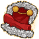

[Back to Main](index.md)

    
        
            
        
        
        Portrait
        
    
    
        
            
        
        
        Model
        
    

# Eric

Eric, the Cavalier at the age of 15, is the spoiled child, originating from a rich home. On the surface, Eric is a big-mouthed comic relief coward. Eric has a heroic core, and frequently saves his friends from danger with his magical griffin shield, which can project a force field. Despite his aloofness and several instances of selfishness, Eric shares the common camaraderie of the group, and occasionally steps to the fore as a substitute leader in Hank's absence.

[D&D (TV Series) - Wikipedia](https://en.wikipedia.org/wiki/Dungeons_%26_Dragons_(TV_series))

# Basic Information

Eric will be a new champion in the Wintershield event on 1 January 2025.

    
        
            **Seat**:
        
        
            Unknown
        
    
    
        
            **Species**:
        
        
            Human (Guess)
        
    
    
        
            **Class**:
        
        
            Fighter (Guess)
        
    
    
        
            **Roles**:
        
        
            Unknown
        
    
    
        
            **Age**:
        
        
            15 (Guess)
        
    
    
        
            **Gender**:
        
        
            Male (Guess)
        
    
    
        
            **Alignment**:
        
        
            Unknown
        
    
    
        
            **Affiliation**:
        
        
            Saturday Morning Squad (Guess)
        
    

# Formation

Unknown.


    



# Attacks

Unknown.

# Abilities

**Cavalier's Code** (Guess)
> Unknown effect.

<em>Raw Data</em>

<pre>
{
    "id": 25257,
    "graphic": "Icons/Events/2017Wintershield/Wintershield_Y8/Icon_Formation_EricCavaliersCode",
    "v": 2,
    "fs": 0,
    "p": 0,
    "type": 1,
    "export_params": {
        "uses": [
            "icon"
        ],
        "quantize": true
    }
}
</pre>

**Keep Away** (Guess)
> Unknown effect.

<em>Raw Data</em>

<pre>
{
    "id": 25258,
    "graphic": "Icons/Events/2017Wintershield/Wintershield_Y8/Icon_Formation_EricKeepAway",
    "v": 2,
    "fs": 0,
    "p": 0,
    "type": 1,
    "export_params": {
        "uses": [
            "icon"
        ],
        "quantize": true
    }
}
</pre>

**Preferred Target** (Guess)
> Unknown effect.

<em>Raw Data</em>

<pre>
{
    "id": 25259,
    "graphic": "Icons/Events/2017Wintershield/Wintershield_Y8/Icon_Formation_EricPreferredTarget",
    "v": 2,
    "fs": 0,
    "p": 0,
    "type": 1,
    "export_params": {
        "uses": [
            "icon"
        ],
        "quantize": true
    }
}
</pre>

**Shield of the Cavalier** (Guess)
> Unknown effect.

<em>Raw Data</em>

<pre>
{
    "id": 25260,
    "graphic": "Icons/Events/2017Wintershield/Wintershield_Y8/Icon_Formation_EricShieldoftheCavalier",
    "v": 2,
    "fs": 0,
    "p": 0,
    "type": 1,
    "export_params": {
        "uses": [
            "icon"
        ],
        "quantize": true
    }
}
</pre>

# Specialisations

**Trait: Brave** (Guess)
> Unknown effect.

<em>Raw Data</em>

<pre>
{
    "id": 25261,
    "graphic": "Icons/Events/2017Wintershield/Wintershield_Y8/Icon_Specialization_EricTraitBrave",
    "v": 2,
    "fs": 0,
    "p": 0,
    "type": 1,
    "export_params": {
        "uses": [
            "icon"
        ],
        "quantize": true
    }
}
</pre>

**Trait: Cautious** (Guess)
> Unknown effect.

<em>Raw Data</em>

<pre>
{
    "id": 25262,
    "graphic": "Icons/Events/2017Wintershield/Wintershield_Y8/Icon_Specialization_EricTraitCautious",
    "v": 2,
    "fs": 0,
    "p": 0,
    "type": 1,
    "export_params": {
        "uses": [
            "icon"
        ],
        "quantize": true
    }
}
</pre>

**Trait: Sarcastic** (Guess)
> Unknown effect.

<em>Raw Data</em>

<pre>
{
    "id": 25263,
    "graphic": "Icons/Events/2017Wintershield/Wintershield_Y8/Icon_Specialization_EricTraitSarcastic",
    "v": 2,
    "fs": 0,
    "p": 0,
    "type": 1,
    "export_params": {
        "uses": [
            "icon"
        ],
        "quantize": true
    }
}
</pre>

**Treasure Hunters** (Guess)
> Unknown effect.

<em>Raw Data</em>

<pre>
{
    "id": 25264,
    "graphic": "Icons/Events/2017Wintershield/Wintershield_Y8/Icon_Specialization_EricTreasureHunters",
    "v": 2,
    "fs": 0,
    "p": 0,
    "type": 1,
    "export_params": {
        "uses": [
            "icon"
        ],
        "quantize": true
    }
}
</pre>

**Unassuming Force** (Guess)
> Unknown effect.

<em>Raw Data</em>

<pre>
{
    "id": 25265,
    "graphic": "Icons/Events/2017Wintershield/Wintershield_Y8/Icon_Specialization_EricUnassumingForce",
    "v": 2,
    "fs": 0,
    "p": 0,
    "type": 1,
    "export_params": {
        "uses": [
            "icon"
        ],
        "quantize": true
    }
}
</pre>

**Youthful Valor** (Guess)
> Unknown effect.

<em>Raw Data</em>

<pre>
{
    "id": 25266,
    "graphic": "Icons/Events/2017Wintershield/Wintershield_Y8/Icon_Specialization_EricYouthfulValor",
    "v": 2,
    "fs": 0,
    "p": 0,
    "type": 1,
    "export_params": {
        "uses": [
            "icon"
        ],
        "quantize": true
    }
}
</pre>

# Items

    
        
            **Icons**
        
        
            **Name**
        
    
    
        
            
        
        
            Armor
        
    
    
        
            
        
        
            Belt
        
    
    
        
            
        
        
            Cape
        
    
    
        
            
        
        
            Clothing
        
    
    
        
            
        
        
            Shield
        
    
    
        
            
        
        
            Wealth
        
    

# Feats

Unknown.

# Legendaries

Unknown.

# Adventures and Variants

**Unlock Adventure: The Merry Map Misadventure (???)** (Complete Area 50)
> Help a poor map find its way home for the holidays.

**Variant 1: TBD** (Complete Area 75)
> 

**Variant 2: TBD** (Complete Area 125)
> 

**Variant 3: TBD** (Complete Area 175)
> 

# Other Champion Images

    
        
            Console Portrait
        
    
    
        
            Gold Chest Icon
        
        
            Silver Chest Icon
        
    

[Back to Top](#top)

*Last Modified: {{ site.time }}*