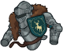
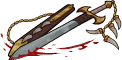
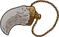
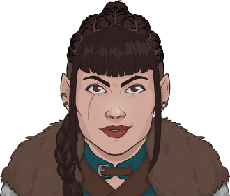

[Back to Main](index.md)

# Evandra

Rough and tumble, and ready for action, half-elven Fighter Evandra brings the muscle. Evandra ran away from home when her father discovered that she had been training in strength and combat. He tried to force her into an arranged marriage with an elven nobleman, but Evandra rejected this on both principle and taste. She decided instead to become an adventurer, free from her father's judgement.

# Basic Information

Evandra will be the new champion in the The Great Modron March event on 24 May 2023.

* Seat: 5
* Race: Half-Elf
* Class: Fighter
* Roles: Support / Tanking / Gold
* Age: 27
* Gender: Female
* Alignment: Chaotic Neutral
* Affiliation: Awful Ones

| Stat | Value | Day 1 Trials | Patrons |
|---|---|---|---|
| Strength | 17 | Yes | - |
| Dexterity | 12 | Yes | Vajra |
| Constitution | 16 | Yes | Strahd (with Feat) |
| Intelligence | 12 | Yes | - |
| Wisdom | 9 | - | |
| Charisma | 11 | Yes | |
| Total | 77 | |

# Formation

# Abilities

 **Base Attack: Trusty Sword** (Melee)
> Evandra moves up next to the closest enemy and swings her sword, dealing 1 hit to all nearby enemies.

<em>Raw Data</em>

<pre>
{
    "description": "Evandra moves up next to the closest enemy and swings her sword, dealing 1 hit to all nearby enemies.",
    "long_description": "",
    "damage_modifier": 1,
    "damage_types": ["melee"],
    "graphic_id": 0,
    "target": "front",
    "aoe_radius": 150,
    "tags": [
        "melee",
        "aoe"
    ],
    "num_targets": 1,
    "animations": [{
        "damage_frame": 12,
        "jump_sound": 30,
        "sound_frames": {"2": 194},
        "target_offset_x": -34,
        "type": "melee_attack"
    }],
    "name": "Trusty Sword",
    "cooldown": 5,
    "id": 627
}
</pre>

 

 **Ultimate Attack: Improvised Arms** (Level: 0)
> A mechanical guard charges toward the party. Evandra moves up, attacks the guard, and instantly "disarms" it and defeats it. Evandra uses the guard's arm as a weapon for the next 15 seconds instead of her sword. For the duration, Evandra's attack deals an additional 3 seconds of BUD damage, her normal attack speed cooldown is faster by 2 seconds, and Freedom's Fury is increased by 100% for the duration.

<em>Raw Data</em>

<pre>
{
    "description": "Evandra disarms a mechanical guard. She uses the guard's arm as a weapon for the next 15 seconds and gains some additional effects for the duration",
    "long_description": "A mechanical guard charges toward the party. Evandra moves up, attacks the guard, and instantly \"disarms\" it and defeats it. Evandra uses the guard's arm as a weapon for the next 15 seconds instead of her sword. For the duration, Evandra's attack deals an additional 3 seconds of BUD damage, her normal attack speed cooldown is faster by 2 seconds, and Freedom's Fury is increased by 100% for the duration.",
    "damage_modifier": 0,
    "damage_types": ["melee"],
    "graphic_id": 19319,
    "target": "none",
    "aoe_radius": 0,
    "tags": [
        "melee",
        "ultimate"
    ],
    "num_targets": 0,
    "animations": [{
        "ultimate": "evandra",
        "type": "ultimate_attack",
        "no_damage_display": true
    }],
    "name": "Improvised Arms",
    "cooldown": 140,
    "id": 628
}
</pre>

 

**Evandra, the Magnificent** (Level: 0)
> Evandra can be used in any Wild Beyond the Witchlight campaign adventure or variant, even if she would not normally be available to be used due to variant or patron restrictions.

<em>Raw Data</em>

<pre>
{
    "static_dps_mult": null,
    "required_level": 0,
    "effect": "effect_def,1481",
    "name": "Evandra, the Magnificent",
    "id": 11294,
    "hero_id": 124,
    "upgrade_type": "unlock_ability",
    "default_enabled": 1,
    "required_upgrade_id": 0
}
{
    "effect_keys": [{"effect_string": "do_nothing"}],
    "requirements": "",
    "description": {"desc": "$(source_hero) can be used in any Wild Beyond the Witchlight campaign adventure or variant, even if she would not normally be available to be used due to variant or patron restrictions."},
    "id": 1481,
    "flavour_text": "",
    "graphic_id": 0,
    "properties": {
        "is_formation_ability": true,
        "owner_use_outgoing_description": true,
        "formation_circle_icon": false
    }
}
</pre>

 

 **Freedom's Fury** (Level: 20)
> Evandra increases the damage of all Neutral (Good/Evil axis) Champions by 100%.

<em>Raw Data</em>

<pre>
{
    "static_dps_mult": null,
    "required_level": 20,
    "effect": "effect_def,1482",
    "tip_text": "Evandra buffs Neutral Champions on the Good / Evil axis. Try using Lawful and Chaotic Neutral Champions with her.",
    "name": "Freedom's Fury",
    "id": 11295,
    "hero_id": 124,
    "upgrade_type": "unlock_ability",
    "default_enabled": 1,
    "required_upgrade_id": 0
}
{
    "effect_keys": [{
        "off_when_benched": true,
        "effect_string": "hero_dps_multiplier_mult,100",
        "filter_targets": [{
            "type": "by_tags",
            "tags": "geneutral"
        }],
        "targets": ["all"]
    }],
    "requirements": "",
    "description": {"desc": "$(source_hero) increases the damage of all Neutral (Good/Evil axis) Champions by $(amount)%."},
    "id": 1482,
    "flavour_text": "",
    "graphic_id": 19313,
    "properties": {"is_formation_ability": true}
}
</pre>

 

 **Never Completely 'Armless** (Level: 80)
> When Evandra's health is brought to zero, she loses her left arm but returns to full health. Her arm regrows after moving to a new area. While missing her arm, she increases the damage bonus of Freedom's Fury by 100% for each second she had her arm in the current area, stacking additively and being applied multiplicatively.

<em>Raw Data</em>

<pre>
{
    "static_dps_mult": null,
    "required_level": 80,
    "effect": "effect_def,1483",
    "tip_text": "The first time Evandra would otherwise die in an area, she merely loses and arm and returns to full health.",
    "name": "Never Completely 'Armless",
    "id": 11296,
    "hero_id": 124,
    "upgrade_type": "unlock_ability",
    "default_enabled": 1,
    "required_upgrade_id": 0
}
{
    "effect_keys": [
        {
            "pre_kill_priority": 1000,
            "effect_string": "evandra_never_completely_armless"
        },
        {
            "stack_title": "Seconds Armed",
            "manual_stacking": true,
            "stacks_multiply": false,
            "show_bonus": true,
            "effect_string": "buff_amount,100"
        },
        {
            "amount_expr": "upgrade_amount(11296,1)",
            "effect_string": "buff_upgrade,0,11295",
            "apply_manually": true
        }
    ],
    "requirements": "",
    "description": {"desc": "When $(source_hero)'s health is brought to zero, she loses her left arm but returns to full health. Her arm regrows after moving to a new area. While missing her arm, she increases the damage bonus of $(upgrade_name id___3) by $(not_buffed amount___2)% for each second she had her arm in the current area, stacking additively and being applied multiplicatively."},
    "id": 1483,
    "flavour_text": "",
    "graphic_id": 19315,
    "properties": {
        "indexed_effect_properties": true,
        "is_formation_ability": true,
        "default_bonus_index": 1,
        "owner_use_outgoing_description": true,
        "per_effect_index_bonuses": true
    }
}
</pre>

 

 **Find the Secret Stash** (Level: 120)
> Increases the formation's gold find by 100%. Every time a Champion attacks but does not defeat an enemy, increase this bonus by 50%, stacking additively up to 120 times and applying multiplicatively. This bonus resets when an enemy is defeated.
>  
> - Total Gold Find Bonus: 100%

<em>Raw Data</em>

<pre>
{
    "static_dps_mult": null,
    "required_level": 120,
    "effect": "effect_def,1484",
    "name": "Find the Secret Stash",
    "id": 11297,
    "hero_id": 124,
    "upgrade_type": "unlock_ability",
    "default_enabled": 1,
    "required_upgrade_id": 0
}
{
    "effect_keys": [
        {
            "off_when_benched": true,
            "effect_string": "gold_multiplier_mult,100"
        },
        {
            "stack_title": "Stacks",
            "stacks_multiply": false,
            "total_title": "Stack Bonus",
            "off_when_benched": true,
            "show_bonus": true,
            "effect_string": "buff_upgrade,50,11297,0",
            "more_triggers": [{
                "action": {"type": "reset"},
                "trigger": "monster_killed"
            }],
            "max_stacks": 120,
            "stacks_on_trigger": "hero_attack_ended_no_kill"
        }
    ],
    "requirements": "",
    "description": {
        "post": {"conditions": [{
            "condition": "not static_desc",
            "desc": "^^Total Gold Find Bonus: $(amount)%"
        }]},
        "desc": "Increases the formation's gold find by $(not_buffed amount)%. Every time a Champion attacks but does not defeat an enemy, increase this bonus by $(not_buffed amount___2)%, stacking additively up to $(max_stacks___2) times and applying multiplicatively. This bonus resets when an enemy is defeated."
    },
    "id": 1484,
    "flavour_text": "",
    "graphic_id": 19312,
    "properties": {
        "indexed_effect_properties": true,
        "is_formation_ability": true,
        "default_bonus_index": 0,
        "owner_use_outgoing_description": true,
        "per_effect_index_bonuses": true
    }
}
</pre>

 

 **Inspiring Fortitude** (Level: 160)
> Evandra increases the health of all other Champions by 25% of her max health, and healing effects on all Champions is increased by 25%.

<em>Raw Data</em>

<pre>
{
    "static_dps_mult": null,
    "required_level": 160,
    "effect": "effect_def,1485",
    "name": "Inspiring Fortitude",
    "id": 11298,
    "hero_id": 124,
    "upgrade_type": "unlock_ability",
    "default_enabled": 1,
    "required_upgrade_id": 0
}
{
    "effect_keys": [
        {
            "off_when_benched": true,
            "effect_string": "increase_health_by_source_percent,25",
            "targets": ["other"]
        },
        {
            "off_when_benched": true,
            "effect_string": "healing_add_mult,25",
            "targets": ["all"]
        }
    ],
    "requirements": "",
    "description": {"desc": "$(source_hero) increases the health of all other Champions by $(amount)% of her max health, and healing effects on all Champions is increased by $(amount___2)%."},
    "id": 1485,
    "flavour_text": "",
    "graphic_id": 19314,
    "properties": {
        "indexed_effect_properties": true,
        "is_formation_ability": true,
        "per_effect_index_bonuses": true
    }
}
</pre>

 

# Specialisations

 **Carnival Crew** (Level: 200)
> Evandra increases the damage bonus of Freedom's Fury by 150% for each Champion with a total ability score of 78 or less in the formation, stacking multiplicatively, and all Awful Ones Champions can be used in Witchlight adventures, even if they do not meet the base restrictions.

<em>Raw Data</em>

<pre>
{
    "static_dps_mult": null,
    "specialization_name": "Carnival Crew",
    "required_level": 200,
    "effect": "effect_def,1488",
    "name": "Carnival Crew",
    "specialization_graphic_id": 19316,
    "id": 11301,
    "hero_id": 124,
    "upgrade_type": "unlock_ability",
    "default_enabled": 1,
    "required_upgrade_id": 0,
    "specialization_description": "Evandra focuses on her connection with her Awful Ones affiliation"
}
{
    "effect_keys": [
        {
            "stack_title": "Qualified Champions",
            "amount_updated_listeners": [
                "slot_changed",
                "feat_changed"
            ],
            "show_bonus": true,
            "amount_func": "mult",
            "stack_func": "per_crusader",
            "effect_string": "buff_upgrade,150,11295",
            "stack_func_data": {"target_filters": [{
                "stat": "total_ability_score",
                "comparison": "<=",
                "type": "stat",
                "value": 78
            }]}
        },
        {
            "off_when_benched": true,
            "valid_for_campaign_ids": [27],
            "effect_string": "force_allow_hero_by_tag,awfulones"
        }
    ],
    "requirements": "",
    "description": {"desc": "$(source_hero) increases the damage bonus of $(upgrade_name id) by $(not_buffed amount)% for each Champion with a total ability score of 78 or less in the formation, stacking multiplicatively, and all Awful Ones Champions can be used in Witchlight adventures, even if they do not meet the base restrictions."},
    "id": 1488,
    "flavour_text": "",
    "graphic_id": 0,
    "properties": {
        "is_formation_ability": true,
        "spec_option_post_apply_info": "Qualified Champions: $num_stacks",
        "owner_use_outgoing_description": true,
        "type": "upgrade",
        "formation_circle_icon": false
    }
}
</pre>

 

 **Fighting Force** (Level: 200)
> Evandra increases the damage bonus of Freedom's Fury by 125% for each Fighter, Barbarian, Ranger, or Paladin Champion in the formation, stacking multiplicatively and applied multiplicatively.

<em>Raw Data</em>

<pre>
{
    "static_dps_mult": null,
    "specialization_name": "Fighting Force",
    "required_level": 200,
    "effect": "effect_def,1487",
    "name": "Fighting Force",
    "specialization_graphic_id": 19317,
    "id": 11300,
    "hero_id": 124,
    "upgrade_type": "unlock_ability",
    "default_enabled": 1,
    "required_upgrade_id": 0,
    "specialization_description": "Evandra focuses on her connection with battle-hardened Champions"
}
{
    "effect_keys": [{
        "stacks_multiply": true,
        "off_when_benched": true,
        "effect_string": "buff_upgrade_per_any_tagged_crusader_mult,125,11295,fighter|barbarian|ranger|paladin"
    }],
    "requirements": "",
    "description": {"desc": "$(source_hero) increases the damage bonus of $(upgrade_name id) by $(not_buffed amount)% for each Fighter, Barbarian, Ranger, or Paladin Champion in the formation, stacking multiplicatively and applied multiplicatively."},
    "id": 1487,
    "flavour_text": "",
    "graphic_id": 0,
    "properties": {
        "is_formation_ability": true,
        "spec_option_post_apply_info": "Qualified Champions: $num_stacks",
        "owner_use_outgoing_description": true,
        "type": "upgrade",
        "formation_circle_icon": false
    }
}
</pre>

 

 **Powerful Allies** (Level: 200)
> Evandra increases the damage bonus of Freedom's Fury by 100% for each Female or Nonbinary Champion in the formation, stacking multiplicatively and applied multiplicatively.

<em>Raw Data</em>

<pre>
{
    "static_dps_mult": null,
    "specialization_name": "Powerful Allies",
    "required_level": 200,
    "effect": "effect_def,1486",
    "name": "Powerful Allies",
    "specialization_graphic_id": 19318,
    "id": 11299,
    "hero_id": 124,
    "upgrade_type": "unlock_ability",
    "default_enabled": 1,
    "required_upgrade_id": 0,
    "specialization_description": "Evandra focuses on her connection with Female and Nonbinary Champions"
}
{
    "effect_keys": [{
        "stacks_multiply": true,
        "off_when_benched": true,
        "effect_string": "buff_upgrade_per_any_tagged_crusader_mult,100,11295,female|(!female^!male)"
    }],
    "requirements": "",
    "description": {"desc": "$(source_hero) increases the damage bonus of $(upgrade_name id) by $(not_buffed amount)% for each Female or Nonbinary Champion in the formation, stacking multiplicatively and applied multiplicatively."},
    "id": 1486,
    "flavour_text": "",
    "graphic_id": 0,
    "properties": {
        "is_formation_ability": true,
        "spec_option_post_apply_info": "Female or Nonbinary Champions: $num_stacks",
        "owner_use_outgoing_description": true,
        "type": "upgrade",
        "formation_circle_icon": false
    }
}
</pre>

 

# Items

| Icon | Slot | Epic Name | Type |
|:-:|---|---|---|
|  | 1 | `Living Collar` | All Champion Damage |
|  | 2 | `Armor of Victory` | Health |
|  | 3 | `Blade of Vengeance` | Freedom's Fury |
|  | 4 | `Necklace of Fury` | Find the Secret Stash |
|  | 5 | `Horn of the Infinite` | All Specialisations |
|  | 6 | `Head of the Gnoll King` | Ultimate Cooldown Reduction |

<em>Item Names and Descriptions</em>

<pre>
Slot 1:
       Faux Fur Collar: Of course it's fake - do you know how much stuff like this costs?
Low-Quality Fur Collar: Made this one myself. There are only a few holes and burn marks on it.
         Dire Fox Skin: It may look like it was adorable, but it nearly took my arm off!
                        ...again.
         Living Collar: Bandits are very surprised when this comes to life and bites their
                        throats.

Slot 2:
        Borrowed Armor: Those guys were already dead when we found them in the alley.
        Improved Armor: Can you believe this was just lying around in a house we broke into?
         Heroic Outfit: Oh, I could totally strangle someone with this cape!
      Armor of Victory: Won this at a jousting tourney. No thanks to Dargle-bark.

Slot 3:
          Rented Blade: I checked this out in Stormwood. They didn't even ask for collateral!
          Bandit Sword: These bandits were strange. 'No, we're guards!' Barely fought back.
     Trusty Long Sword: I've cut off SO many heads with this baby.
    Blade of Vengeance: This sword was forged to kill me, but I killed them first! Easy fight,
                        really.

Slot 4:
          Unknown Fang: Nixie stole this at some point. No idea what it is, but it looks kinda
                        cool.
             Orc Tooth: Got this off Mogdar during a battle of strength. He says he didn't
                        agree to it.
        Bearowl Trophy: Dargle-bark as a bearowl is really annoying - so I took this to shut
                        him up.
      Necklace of Fury: Pulled this off an eldritch beast after I fell through a portal. No big
                        deal.

Slot 5:
            Dirty Horn: Found this on a dead guard. Don't ask what else I found...
          Travel Qanci: Got this on discount after threatening the merchant's family.
   Rejuvenating Kantsi: Lorienne blessed this horn to heal me in battle! But it only heals 1
                        hp...
  Horn of the Infinite: This horn never runs out of ale! I don't remember two tendays after
                        getting it!

Slot 6:
    Evandra's Left Arm: No big deal. I'll just get Vlithryn to fix it.
        Preserved Limb: Vlithryn didn't fix it... She just screeched and walked away. Very
                        rude.
        Mechanical Arm: I've beaten so many guards with this. Really gets the anger out.
Head of the Gnoll King: Got a wizard to make it stop decaying because it looks cool on my belt.
</pre>

 

# Feats

This list will only show feats that are going to be available on the release of this champion. The separate [Feats](feats.md) page may show others that could be available later if they exist.

| Icon | Feat | Effect | Source |
|---|---|---|---|
|  | `Selflessness` | 10% All Champion Damage | Free |
|  | `Inspiring Leader` | 25% All Champion Damage | 12,500 Gems |
|  | `Tough` | 15% Health | Free |
|  | `Resilient` | 30% Health | Gold Chest |
|  | `Defensive Duelist` | +5 Overwhelm | Free |
|  | `Calm Under Pressure` | +10 Overwhelm | 12,500 Gems |
|  | `Frugal` | 10% Gold | Free |
|  | `Lucky` | 25% Gold | Gold Chest |
|  | `Improvised Weapon` | 20% Freedom's Fury | Free |
|  | `Neutral Ground` | 40% Freedom's Fury | Gold Chest |
|  | `Ringmaster` | 80% Freedom's Fury | 50,000 Gems |
|  | `I've Had Worse` | 40% Never Completely 'Armless | Gold Chest |
|  | `Look Harder!` | 40% Find the Secret Stash | Gold Chest |
|  | `Best of the Awful` | 40% All Specialisations | Gold Chest |
|  | `Keen Mind` | Stat: +1 Intelligence | 12,500 Gems |

# Legendaries

* Increases the damage of all Champions by 10% for each Champion in the formation.
* Increases the damage of all Champions by 20% for each Male Champion in the formation.
* Increases the damage of all Champions by 70% for each Half-Elf Champion in the formation.
* Increases the damage of all Champions with a CON score of 11 or higher by 100%.
* Increases the damage of all Champions by 40% for each Champion with a STR score of 15 or higher in the formation.
* Increases the damage of all Neutral Champions by 150%.

<em>DPS Applicable</em>

<pre>
     Arkhan: 6 / 6
    Artemis: 5 / 6
    Asharra: 4 / 6
      Azaka: 5 / 6
     Binwin: 5 / 6
   Birdsong: 5 / 6
Black Viper: 5 / 6
 Catti-brie: 4 / 6
     D'hani: 4 / 6
     Delina: 4 / 6
     Drizzt: 5 / 6
    Farideh: 5 / 6
        Fen: 4 / 6
      Grimm: 5 / 6
     Gromma: 5 / 6
       Ishi: 4 / 6
    Jaheira: 5 / 6
    Jamilah: 5 / 6
   Jarlaxle: 6 / 6
        Jim: 5 / 6
       Kent: 6 / 6
      Krond: 5 / 6
     Lucius: 6 / 6
      Makos: 6 / 6
      Minsc: 5 / 6
      NERDS: 5 / 6
     Nahara: 5 / 6
      Nixie: 5 / 6
      Nrakk: 6 / 6
     Orisha: 4 / 6
      Rosie: 4 / 6
      Strix: 4 / 6
    Torogar: 5 / 6
     Warden: 4 / 6
    Warduke: 5 / 6
     Yorven: 6 / 6
      Zorbu: 5 / 6
</pre>

 

# Console Portrait

# Chests

| Gold | Silver |
|---|---|
|  |  |

[Back to Top](#top)

*Last Modified: {{ site.time }}*