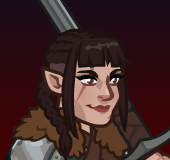
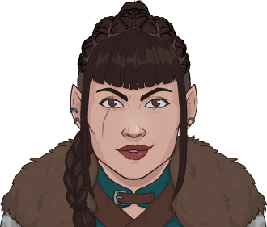

[Back to Main](index.md)

# Evandra

Evandra is a "half-elf fighter" from the 1 For All sketch show.

[https://tvtropes.org/pmwiki/pmwiki.php/Characters/OneForAll](https://tvtropes.org/pmwiki/pmwiki.php/Characters/OneForAll)

# Basic Information

Evandra will be the new champion in the The Great Modron March event on 24 May 2023.

* Seat: Unknown
* Race: Half-Elf (Guess)
* Class: Fighter (Guess)
* Roles: Support / Tank (Guess)
* Age: Unknown
* Gender: Female (Guess)
* Alignment: Unknown
* Affiliation: Awful Ones (Guess)
* Stats: Unknown

# Formation

# Abilities

**Base Attack: Trusty Sword** (Melee)
> Evandra moves up next to the closest enemy and swings her sword, dealing 1 hit to all nearby enemies.

<em>Raw Data</em>

<pre>
{
    "description": "Evandra moves up next to the closest enemy and swings her sword, dealing 1 hit to all nearby enemies.",
    "long_description": "",
    "damage_modifier": 1,
    "damage_types": ["melee"],
    "graphic_id": 0,
    "target": "front",
    "aoe_radius": 150,
    "tags": [
        "melee",
        "aoe"
    ],
    "num_targets": 1,
    "animations": [{
        "damage_frame": 12,
        "jump_sound": 30,
        "sound_frames": {"2": 194},
        "target_offset_x": -34,
        "type": "melee_attack"
    }],
    "name": "Trusty Sword",
    "cooldown": 5,
    "id": 627
}
</pre>

 

**Ultimate Attack: Improvised Arms**
> A mechanical guard charges toward the party. Evandra moves up, attacks the guard, and instantly "disarms" it and defeats it. Evandra uses the guard's arm as a weapon for the next 15 seconds instead of her sword. For the duration, Evandra's attack deals an additional 3 seconds of BUD damage, her normal attack speed cooldown is faster by 2 seconds, and Freedom's Fury is increased by 100% for the duration.

<em>Raw Data</em>

<pre>
{
    "description": "Evandra disarms a mechanical guard. She uses the guard's arm as a weapon for the next 15 seconds and gains some additional effects for the duration",
    "long_description": "A mechanical guard charges toward the party. Evandra moves up, attacks the guard, and instantly \"disarms\" it and defeats it. Evandra uses the guard's arm as a weapon for the next 15 seconds instead of her sword. For the duration, Evandra's attack deals an additional 3 seconds of BUD damage, her normal attack speed cooldown is faster by 2 seconds, and Freedom's Fury is increased by 100% for the duration.",
    "damage_modifier": 0,
    "damage_types": ["melee"],
    "graphic_id": 19319,
    "target": "none",
    "aoe_radius": 0,
    "tags": [
        "melee",
        "ultimate"
    ],
    "num_targets": 0,
    "animations": [{
        "ultimate": "evandra",
        "type": "ultimate_attack",
        "no_damage_display": true
    }],
    "name": "Improvised Arms",
    "cooldown": 140,
    "id": 628
}
</pre>

 

**Freedoms Fury** (Guess)
> Evandra increases the damage of all Neutral (Good/Evil axis) Champions by `$(amount)%`.

<em>Raw Data</em>

<pre>
{
    "effect_keys": [{
        "off_when_benched": true,
        "effect_string": "hero_dps_multiplier_mult,100",
        "filter_targets": [{
            "type": "by_tags",
            "tags": "geneutral"
        }],
        "targets": ["all"]
    }],
    "requirements": "",
    "description": {"desc": "$(source_hero) increases the damage of all Neutral (Good/Evil axis) Champions by $(amount)%."},
    "id": 1482,
    "flavour_text": "",
    "graphic_id": 19313,
    "properties": {"is_formation_ability": true}
}
</pre>

 

**Never Completely Armless** (Guess)
> When Evandra's health is brought to zero, she loses her left arm but returns to full health. Her arm regrows after moving to a new area. While missing her arm, she increases the damage bonus of `$(upgrade_name id___3)` by `$(not_buffed amount___2)%` for each second she had her arm in the current area, stacking additively and being applied multiplicatively.

<em>Raw Data</em>

<pre>
{
    "effect_keys": [
        {"effect_string": "evandra_never_completely_armless"},
        {
            "stack_title": "Seconds Armed",
            "manual_stacking": true,
            "stacks_multiply": false,
            "show_bonus": true,
            "effect_string": "buff_amount,100"
        },
        {
            "amount_expr": "upgrade_amount(11296,1)",
            "effect_string": "buff_upgrade,0,11295",
            "apply_manually": true
        }
    ],
    "requirements": "",
    "description": {"desc": "When $(source_hero)'s health is brought to zero, she loses her left arm but returns to full health. Her arm regrows after moving to a new area. While missing her arm, she increases the damage bonus of $(upgrade_name id___3) by $(not_buffed amount___2)% for each second she had her arm in the current area, stacking additively and being applied multiplicatively."},
    "id": 1483,
    "flavour_text": "",
    "graphic_id": 19315,
    "properties": {
        "indexed_effect_properties": true,
        "is_formation_ability": true,
        "default_bonus_index": 1,
        "owner_use_outgoing_description": true,
        "per_effect_index_bonuses": true
    }
}
</pre>

 

**Find the Secret Stash** (Guess)
> Increase the formation's gold find by `$(not_buffed amount)%`. Every time a Champion attacks but does not defeat an enemy, increase this bonus by `$(not_buffed amount___2)%`, stacking additively up to `$(max_stacks___2)` times and applying multiplicatively. Bonus resets when an enemy is defeated.
>  
> - Total Gold Find Bonus: `$(amount)%`.

<em>Raw Data</em>

<pre>
{
    "effect_keys": [
        {
            "off_when_benched": true,
            "effect_string": "gold_multiplier_mult,100"
        },
        {
            "stack_title": "Stacks",
            "stacks_multiply": false,
            "off_when_benched": true,
            "show_bonus": true,
            "effect_string": "buff_upgrade,50,11297,0",
            "more_triggers": [{
                "action": {"type": "reset"},
                "trigger": "monster_killed"
            }],
            "max_stacks": 120,
            "stacks_on_trigger": "hero_attack_ended_no_kill"
        }
    ],
    "requirements": "",
    "description": {
        "post": {"conditions": [{
            "condition": "not static_desc",
            "desc": "^^Total Gold Find Bonus: $(amount)%"
        }]},
        "desc": "Increase the formation's gold find by $(not_buffed amount)%. Every time a Champion attacks but does not defeat an enemy, increase this bonus by $(not_buffed amount___2)%, stacking additively up to $(max_stacks___2) times and applying multiplicatively. Bonus resets when an enemy is defeated."
    },
    "id": 1484,
    "flavour_text": "",
    "graphic_id": 19312,
    "properties": {
        "indexed_effect_properties": true,
        "is_formation_ability": true,
        "default_bonus_index": 0,
        "owner_use_outgoing_description": true,
        "per_effect_index_bonuses": true
    }
}
</pre>

 

**Inspiring Fortitude** (Guess)
> Evandra increases the health of all other Champions by `$(amount)%` of her max health, and any healing effect on those Champions is increased by `$(amount___2)%`.

<em>Raw Data</em>

<pre>
{
    "effect_keys": [
        {
            "off_when_benched": true,
            "effect_string": "increase_health_by_source_percent,25",
            "targets": ["other"]
        },
        {
            "off_when_benched": true,
            "effect_string": "healing_add_mult,25",
            "targets": ["other"]
        }
    ],
    "requirements": "",
    "description": {"desc": "$(source_hero) increases the health of all other Champions by $(amount)% of her max health, and any healing effect on those Champions is increased by $(amount___2)%."},
    "id": 1485,
    "flavour_text": "",
    "graphic_id": 19314,
    "properties": {
        "indexed_effect_properties": true,
        "is_formation_ability": true,
        "owner_use_outgoing_description": true,
        "per_effect_index_bonuses": true
    }
}
</pre>

 

# Specialisations

**Specialisation: Carnival Crew** (Guess)
> Evandra increases the damage bonus of `$(upgrade_name id)` by `$(not_buffed amount)%` for each Champion with a total ability score of 78 or less in the formation, stacking multiplicatively. In addition, all Awful Ones Champions are available to be used if Wild beyond the Witchlight is the current campaign, even if they do not currently qualify based on variant or patron restrictions.

<em>Raw Data</em>

<pre>
{
    "effect_keys": [
        {
            "stack_title": "Affected Champions",
            "amount_updated_listeners": [
                "slot_changed",
                "feat_changed"
            ],
            "show_bonus": true,
            "amount_func": "mult",
            "stack_func": "per_crusader",
            "effect_string": "buff_upgrade,150,11295",
            "stack_func_data": {"target_filters": [{
                "stat": "total_ability_score",
                "comparison": "<=",
                "type": "stat",
                "value": 78
            }]}
        },
        {
            "off_when_benched": true,
            "valid_for_campaign_ids": [27],
            "effect_string": "force_allow_hero_by_tag,awfulones"
        }
    ],
    "requirements": "",
    "description": {"desc": "$(source_hero) increases the damage bonus of $(upgrade_name id) by $(not_buffed amount)% for each Champion with a total ability score of 78 or less in the formation, stacking multiplicatively. In addition, all Awful Ones Champions are available to be used if Wild beyond the Witchlight is the current campaign, even if they do not currently qualify based on variant or patron restrictions."},
    "id": 1488,
    "flavour_text": "",
    "graphic_id": 0,
    "properties": {
        "is_formation_ability": true,
        "spec_option_post_apply_info": "Qualified Champions: $num_stacks",
        "owner_use_outgoing_description": true,
        "type": "upgrade",
        "formation_circle_icon": false
    }
}
</pre>

 

**Specialisation: Fighting Force** (Guess)
> Evandra increases the damage bonus of `$(upgrade_name id)` by `$(not_buffed amount)%` for each Fighter, Barbarian, Ranger, or Paladin Champion in the formation, stacking multiplicatively and applied multiplicatively.

<em>Raw Data</em>

<pre>
{
    "effect_keys": [{
        "stacks_multiply": true,
        "off_when_benched": true,
        "effect_string": "buff_upgrade_per_any_tagged_crusader_mult,125,11295,fighter|barbarian|ranger|paladin"
    }],
    "requirements": "",
    "description": {"desc": "$(source_hero) increases the damage bonus of $(upgrade_name id) by $(not_buffed amount)% for each Fighter, Barbarian, Ranger, or Paladin Champion in the formation, stacking multiplicatively and applied multiplicatively."},
    "id": 1487,
    "flavour_text": "",
    "graphic_id": 0,
    "properties": {
        "is_formation_ability": true,
        "spec_option_post_apply_info": "Qualified Champions: $num_stacks",
        "owner_use_outgoing_description": true,
        "type": "upgrade",
        "formation_circle_icon": false
    }
}
</pre>

 

**Specialisation: Powerful Allies** (Guess)
> Evandra increases the damage bonus of `$(upgrade_name id)` by `$(not_buffed amount)%` for each Female or Nonbinary Champion in the formation, stacking multiplicatively and applied multiplicatively.

<em>Raw Data</em>

<pre>
{
    "effect_keys": [{
        "stacks_multiply": true,
        "off_when_benched": true,
        "effect_string": "buff_upgrade_per_any_tagged_crusader_mult,100,11295,female|(!female^!male)"
    }],
    "requirements": "",
    "description": {"desc": "$(source_hero) increases the damage bonus of $(upgrade_name id) by $(not_buffed amount)% for each Female or Nonbinary Champion in the formation, stacking multiplicatively and applied multiplicatively."},
    "id": 1486,
    "flavour_text": "",
    "graphic_id": 0,
    "properties": {
        "is_formation_ability": true,
        "spec_option_post_apply_info": "Female or Nonbinary Champions: $num_stacks",
        "owner_use_outgoing_description": true,
        "type": "upgrade",
        "formation_circle_icon": false
    }
}
</pre>

 

# Items

| Slot | Name | Type |
|---|---|---|
| 1 | `Armor` | Unknown |
| 2 | `Drinking Horn` | Unknown |
| 3 | `Fox Fur` | Unknown |
| 4 | `Severed Limb` | Unknown |
| 5 | `Sword` | Unknown |
| 6 | `Trophy` | Unknown |

# Feats

Unknown.

# Legendaries

Unknown.

# Console Portrait

[Back to Top](#top)

*Last Modified: {{ site.time }}*