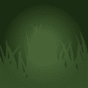
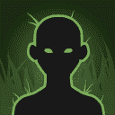

[Back to Main](index.md)

# Events 2.0

Virtually nothing is known about Events 2.0. We're not even sure that's what they'll be called. I'm just using that based on some of the text definitions that were added recently.

Given that there are some graphics for Festival of Fools 2.0 - we can only assume a release date for this system could potentially be 6 March 2024. But that would be wild speculation and we don't do that here.

## Text Defines

These are some of the raw text defines that reference Events 2.0 or new events in general.

<em>Raw Data</em>

<pre>
{
    "id": 5471,
    "key": "events_2_faq_title",
    "contents": ""
}
{
    "id": 5472,
    "key": "events_2_faq",
    "contents": ""
}
{
    "id": 5463,
    "key": "events_2_achievement_box_msg",
    "contents": "Each achievement increases the damage of all Champions by 1%"
}
{
    "id": 5458,
    "key": "supporter_flex_slot_locked_msg",
    "contents": "Unlock the supporter slot now by purchasing DLC containing an event boost"
}
{
    "id": 5440,
    "key": "getting_event_details",
    "contents": "Getting event details..."
}
{
    "id": 5489,
    "key": "events_pick_champion_confirmation",
    "contents": "Are you sure you want to pick $heroName?"
}
</pre>

 

## Icons

    
        
            
        
        
            **Attack**
            Icon_Events20_GenericAttack
        
    
    
        
            
        
        
            **Magic**
            Icon_Events20_GenericMagic
        
    
    
        
            
        
        
            **Ranged**
            Icon_Events20_GenericRanged
        
    

## Festival of Fools 2.0

    
        
            
        
        
            **Background**
            FestivalofFools_2_0_64Background
        
    
    
        
            
        
        
            **Blank Champion**
            FestivalofFools_2_0_BlankChampion
        
    
    
        
            
        
        
            **Buff**
            FestivalofFools_2_0_Buff
        
    

## Greengrass 2.0

    
        
            
        
        
            **Background**
            Greengrass_2_0_64Background
        
    
    
        
            
        
        
            **Blank Champion**
            Greengrass_2_0_BlankChampion
        
    
    
        
            
        
        
            **Buff**
            Greengrass_2_0_Buff
        
    

[Back to Top](#top)

*Last Modified: {{ site.time }}*