[Back to Main](index.md)

# Exclusivity Dates

A list of things that are currently or used to be in an exclusivity period.

# Premium Exclusive Feats

These are feats that were previously released in premium packs and are now sitting in an exclusivity period until they will be available again for gems.

ⓘ *Note: This list does **not** include feats from Emergences or giveaways. They have their own section below.*

    
        <a id="showHideFeats" onClick="exclusiveToggleAllFeats()" style="cursor:pointer">[hide all feats]</a>
    

    
        
            **Champion**
        
        
            **Feat**
        
        
            **Effect**
        
        
            **Source**
        
        
            **Date**
        
    
    
        
            KoS
        
        
            ID: 2317**Tragic Devotion (KoS)**You need not die... You need not be cleansed...  Increases the effect of King of Shadows' Power of the King ability whenever his max health is doubled by 10% (pre-stack). (Prestack)<code>buff_upgrade,10,17757,2</code>Tragic Devotion
        
        
            Increases the effect of King of Shadows' Power of the King ability whenever his max health is doubled by 10% (pre-stack). (Prestack)
        
        
            50,000 Gems
        
        
            01 Jan 2026
        
    
    
        
            Astarion
        
        
            ID: 2296**Exquisite Taste (Astarion)**Straight from the neck is preferred, but goblets are used in mortal company.  Increases the effect of Astarion's Well Fed ability by 80%. (Prestack)<code>buff_upgrade,80,12491</code>Exquisite Taste
        
        
            Increases the effect of Astarion's Well Fed ability by 80%. (Prestack)
        
        
            50,000 Gems
        
        
            01 Jan 2026
        
    
    
        
            Thellora
        
        
            ID: 2297**Stampede (Thellora)**Altogether now! The bards shall sing of our charge!  Increases the effect of Thellora's Defender of the Meek, Vanguard of the Quick and Callessa's Blessed by 80%. (Prestack)<code>buff_upgrades,80,12982,12983,12984</code>Stampede
        
        
            Increases the effect of Thellora's Defender of the Meek, Vanguard of the Quick and Callessa's Blessed by 80%. (Prestack)
        
        
            50,000 Gems
        
        
            01 Jan 2026
        
    
    
        
            Farideh
        
        
            ID: 2174**Blessing of Asmodeus (Farideh)**I didn't ask for this power, but it's mine now. I'll use it for good.  Increases the effect of Farideh's Chosen of Asmodeus ability by 80%. (Prestack)<code>buff_upgrade,80,17836,0</code>Blessing of Asmodeus
        
        
            Increases the effect of Farideh's Chosen of Asmodeus ability by 80%. (Prestack)
        
        
            50,000 Gems
        
        
            08 Jan 2026
        
    
    
        
            Ezmerelda
        
        
            ID: 2299**Lethal Study (Ezmerelda)**Every creature has a weak spot. Watch and learn.  Increases the effect of Ezmerelda's Training Montage ability by 80%. (Prestack)<code>buff_upgrade,80,15037,0</code>Lethal Study
        
        
            Increases the effect of Ezmerelda's Training Montage ability by 80%. (Prestack)
        
        
            50,000 Gems
        
        
            08 Jan 2026
        
    
    
        
            Kas
        
        
            ID: 2298**Federates (Kas)**Only a handful of mortals may say that they've earned my esteem.  Increases the effect of Kas' Mortal Pawns ability by 80%.<code>buff_upgrade,80,15620,2</code>Federates
        
        
            Increases the effect of Kas' Mortal Pawns ability by 80%.
        
        
            50,000 Gems
        
        
            08 Jan 2026
        
    
    
        
            Avren
        
        
            ID: 2300**Multiversal Allies (Avren)**I've got friends in weird places.  Increases the damage of all Champions by 20% for each unique species in the formation, stacking additively.<code>effect_def,2193</code>Multiversal Allies
        
        
            Increases the damage of all Champions by 20% for each unique species in the formation, stacking additively.
        
        
            50,000 Gems
        
        
            15 Jan 2026
        
    
    
        
            Krond
        
        
            ID: 2301**Kindred Spirits (Krond)**Whatever our cause, we fight for it together.  Increases the base effect of Krond's Unsung Alliance ability by 80%. (Prestack)<code>buff_upgrade,80,17237,0</code>Kindred Spirits
        
        
            Increases the base effect of Krond's Unsung Alliance ability by 80%. (Prestack)
        
        
            50,000 Gems
        
        
            15 Jan 2026
        
    
    
        
            Halsin
        
        
            ID: 2302**Prodigal Leader (Halsin)**Even those who defile nature inevitably return to it, in the end.  All Champions damage +50%.<code>global_dps_multiplier_mult,50</code>Prodigal Leader
        
        
            All Champions damage +50%.
        
        
            50,000 Gems
        
        
            29 Jan 2026
        
    
    
        
            Dark Urge
        
        
            ID: 2303**Blood Moon (Dark Urge)**Time for the final act.  Increases the effect of Dark Urge's The Urge ability by 80%.<code>buff_upgrade,80,14379</code>Blood Moon
        
        
            Increases the effect of Dark Urge's The Urge ability by 80%.
        
        
            50,000 Gems
        
        
            29 Jan 2026
        
    
    
        
            Skylla
        
        
            ID: 2339**Whispers of the Grave (Skylla)**When all the life has left you, only her laughter will remain.  Increases the effect of Skylla's Whispers of Baba Yaga ability by 80%. (Prestack)<code>buff_upgrade,80,17845,0</code>Whispers of the Grave
        
        
            Increases the effect of Skylla's Whispers of Baba Yaga ability by 80%. (Prestack)
        
        
            50,000 Gems
        
        
            05 Feb 2026
        
    
    
        
            Widdle
        
        
            ID: 2351**Entertainer (Widdle)**Do you have any idea how difficult it is to keep Darklords entertained?  Increases the Charisma score of Widdle by 2.<code>increase_ability_score,cha,2</code>Entertainer
        
        
            Increases the Charisma score of Widdle by 2.
        
        
            50,000 Gems
        
        
            05 Feb 2026
        
    
    
        
            Sentry
        
        
            ID: 2350**Taunt (Sentry)**Foes assail me, but my shield echoes my will: unyielding, unbroken.  All Champions damage +100%. Sentry's attacks have a 50% chance to taunt enemies.<code>global_dps_multiplier_mult,100 taunt,50</code>Taunt
        
        
            All Champions damage +100%. Sentry's attacks have a 50% chance to taunt enemies.
        
        
            50,000 Gems
        
        
            05 Feb 2026
        
    
    
        
            Havilar
        
        
            ID: 2367**Bedeviled (Havilar)**Hold 'em still, Mot! This next swing's gonna STING!  Increases the effect of Havilar's Mot ability by 80%. (Prestack)<code>buff_upgrade,80,18038</code>Bedeviled
        
        
            Increases the effect of Havilar's Mot ability by 80%. (Prestack)
        
        
            50,000 Gems
        
        
            12 Feb 2026
        
    
    
        
            Havilar
        
        
            ID: 2369**High Road to Hell (Havilar)**Faster, Zoonie! Kill! Kill!  Increases the effect of Havilar's Speed Demon ability by 100%.<code>buff_upgrade,100,18042</code>High Road to Hell
        
        
            Increases the effect of Havilar's Speed Demon ability by 100%.
        
        
            50,000 Gems
        
        
            12 Feb 2026
        
    
    
        
            Turiel
        
        
            ID: 2352**Axiomatic Embrace (Turiel)**Good may be corrupted, but law is ineffable by definition.  Increases the effect of Turiel's Lawful Mission ability by 80%. (Prestack)<code>buff_upgrade,80,10661,0</code>Axiomatic Embrace
        
        
            Increases the effect of Turiel's Lawful Mission ability by 80%. (Prestack)
        
        
            50,000 Gems
        
        
            12 Feb 2026
        
    
    
        
            Minthara
        
        
            ID: 2353**Intense Strife (Minthara)**You think yourself broken? Defeated? I've only just begun.  Increases the effect of Minthara's Soul Branding ability by 80%. (Prestack)<code>buff_upgrade,80,15944,0</code>Intense Strife
        
        
            Increases the effect of Minthara's Soul Branding ability by 80%. (Prestack)
        
        
            50,000 Gems
        
        
            12 Feb 2026
        
    
    
        
            Jang Sao
        
        
            ID: 2355**Eternity and Infinity (Jang Sao)**Nothing can be bolder. Nothing can be vaster.  Increases the effect of Jang Sao's Wisdom of the Ages and Speed of Shooting Stars by 80%. (Prestack)<code>buff_upgrades,80,13261,13262</code>Eternity and Infinity
        
        
            Increases the effect of Jang Sao's Wisdom of the Ages and Speed of Shooting Stars by 80%. (Prestack)
        
        
            50,000 Gems
        
        
            19 Feb 2026
        
    
    
        
            Virgil
        
        
            ID: 2356**Standard Affair (Virgil)**We're all in this together! ...No, Kent, I'm not singing.  Increases the damage of all Champions by 20% for each unique species in the formation, stacking additively.<code>effect_def,2527</code>Standard Affair
        
        
            Increases the damage of all Champions by 20% for each unique species in the formation, stacking additively.
        
        
            50,000 Gems
        
        
            19 Feb 2026
        
    
    
        
            Gromma
        
        
            ID: 1757**Rite of Passage (Gromma)**Look how far you've come - you're nearly as old as I am!  Increases the base value of Grandmotherly Love's stacking bonus by 80%.<code>change_upgrade_data,14874,1</code>Rite of Passage
        
        
            Increases the base value of Grandmotherly Love's stacking bonus by 80%.
        
        
            50,000 Gems
        
        
            19 Feb 2026
        
    
    
        
            Sheila
        
        
            ID: 2357**Best Friends (Sheila)**I trust my friends, and they trust me! We'll always be together!  Increases the effect of Sheila's Meekly Meeting, Youthful Allies and A Rosy Outlook by 80%. (Prestack)<code>buff_upgrades,80,16541,16542,16543</code>Best Friends
        
        
            Increases the effect of Sheila's Meekly Meeting, Youthful Allies and A Rosy Outlook by 80%. (Prestack)
        
        
            50,000 Gems
        
        
            26 Feb 2026
        
    
    
        
            Lark
        
        
            ID: 2390**Here for a Lark (Lark)**I've always wanted to do the Waterdeep After Dark tour.  Increases the effect of Lark's Bardic Perspiration ability by 80%.<code>buff_upgrade,80,18053</code>Here for a Lark
        
        
            Increases the effect of Lark's Bardic Perspiration ability by 80%.
        
        
            50,000 Gems
        
        
            03 Mar 2026
        
    
    
        
            Shadowheart
        
        
            ID: 1981**Prodigal Leader (Shadowheart)**Pain was my teacher. Let's share what I've learned.  All Champions damage +50%.<code>global_dps_multiplier_mult,50</code>Prodigal Leader
        
        
            All Champions damage +50%.
        
        
            50,000 Gems
        
        
            03 Mar 2026
        
    
    
        
            Nordom
        
        
            ID: 2376**Plumbing Wizardry (Nordom)**It looks like you're attempting to achieve supercharged output. Would you like help?  Increases the effect of Nordom's The Great Modron Puzzle ability by 80%.<code>buff_upgrade,80,18165</code>Plumbing Wizardry
        
        
            Increases the effect of Nordom's The Great Modron Puzzle ability by 80%.
        
        
            50,000 Gems
        
        
            10 Mar 2026
        
    

# Current Exclusive Special Events

We've been told the typical exclusivity period for things that were in special events like Emergences or a giveaway is 3 months before it becomes available again.

Feats will become available for gems while most everything else will end up in Wild Offers. Sometimes there are exceptions though and skins can be put in the gem shop for example.

For Emergences - the items added will remain in the Thayan Enclave until the following Emergence ends. Then it will remain exclusive for another 3 months. Because of this - I have set the End Date for Emergences as the date the items leave the shop (not the date the emergence actually ended).

<a id="showHideAll" onClick="exclusiveToggleAllContents()" style="cursor:pointer">[show all contents]</a>
    
        
            
                <a id="e12a" onclick="exclusiveToggleContent(`e12`)">
                    [show contents]
                </a>
                **Emergence 12** - Vecnae
            
        
        
            
                
                    
                        ID: 2218**Cantrip: Ascendant Shocking Grasp (Krond)**Few can survive the lightning strike of a rampaging kraken. I did. Let's see how you fare.  Krond gains the Control role and his base attack deals additional 1600% damage to the main target, and the target is stunned for 4 seconds.<code>krond_shocking_grasp,1600,4 change_base_attack,864 add_hero_tags,0,control</code>
                    
                    
                        **Feat**
                        Cantrip: Ascendant Shocking Grasp
                        Krond
                    
                
                
                    
                        ID: 2230**Discerning Taste (Kas)**Ah, such a rich vintage, with notes of fey. I must have more.  Increases the effect of Kas' Life Drain ability by 80%.<code>buff_upgrade,80,15621,0</code>
                    
                    
                        **Feat**
                        Discerning Taste
                        Kas
                    
                
                
                    
                        ID: 2231**Prodigal Leader (Tess)**I'm not always the best leader, but I truly believe that we're stronger together.  All Champions damage +50%.<code>global_dps_multiplier_mult,50</code>
                    
                    
                        **Feat**
                        Prodigal Leader
                        Tess
                    
                
                
                    
                        ID: 2229**Weapon Master (Windfall)**I've lost count of the number of lives I've taken with this blade.  Increases the damage of Windfall by 120%.<code>hero_dps_multiplier_mult,120</code>
                    
                    
                        **Feat**
                        Weapon Master
                        Windfall
                    
                
                
                    
                        ID: 584**Gentleman Jarlaxle (Jarlaxle)**
                    
                    
                        **Skin**
                        Gentleman Jarlaxle
                    
                
                
                    
                        ID: 581**Chosen of Vecna Blooshi (Blooshi)**
                    
                    
                        **Skin**
                        Chosen of Vecna Blooshi
                    
                
                
                    
                        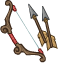ID: 2480**+1 Bow of Owlbear Slaying (NERDS)**After perfectly stalking their foe, it ends with a surprise attack!  Increases the effect of NERDS's Ranger ability by 275%.<code>buff_upgrade,275,6140</code>
                    
                    
                        **Golden Epic**
                        +1 Bow of Owlbear Slaying
                        NERDS (Slot 2)
                    
                
                
                    
                        ID: 2536**Fork of Regicide (Blooshi)**Everyone knows a fork is the best assassination tool. Good size for eyes.  Increases the effect of Blooshi's A Life Well Lived ability by 275%.<code>buff_upgrade,275,7520</code>
                    
                    
                        **Golden Epic**
                        Fork of Regicide
                        Blooshi (Slot 4)
                    
                
                
                    
                        ID: 3905**Trapfinder's Friend (Tess)**No trap is safe from me.  Increases the effect of Tess's Trap Expert ability by 275%.<code>buff_upgrade,275,17320</code>
                    
                    
                        **Golden Epic**
                        Trapfinder's Friend
                        Tess (Slot 4)
                    
                
            
        
        
            
                **Start Date**
            
            
                **End Date**
            
            
                **Exclusive Date**
            
        
        
            
                23 July 2025
            
            
                31 October 2025
            
            
                31 January 2026 (Guess)
            
        
    
    
        
            
                <a id="g1a" onclick="exclusiveToggleContent(`g1`)">
                    [show contents]
                </a>
                **XBox Giveaway** - Better Play Experience
            
        
        
            
                
                    
                        ID: 249**Clove the Badger**He's on the hunt, best leave him alone till he finds that crow. 
                    
                    
                        **Familiar**
                        Clove the Badger
                    
                
            
        
        
            
                **Start Date**
            
            
                **End Date**
            
            
                **Exclusive Date**
            
        
        
            
                22 October 2025
            
            
                31 October 2025
            
            
                31 January 2026 (Guess)
            
        
    
    
        
            
                <a id="g3a" onclick="exclusiveToggleContent(`g3`)">
                    [show contents]
                </a>
                **EGS Giveaway** - Nixie's Champions of Renown Pack
            
        
        
            
                
                    
                        ID: 299**Sting the Scorpion**It's all fun and games till Sting skitters out! 
                    
                    
                        **Familiar**
                        Sting the Scorpion
                    
                
            
        
        
            
                **Start Date**
            
            
                **End Date**
            
            
                **Exclusive Date**
            
        
        
            
                06 November 2025
            
            
                13 November 2025
            
            
                13 February 2026 (Guess)
            
        
    
    
        
            
                <a id="g2a" onclick="exclusiveToggleContent(`g2`)">
                    [show contents]
                </a>
                **XBox Giveaway** - Jang Sao's Champions of Renown Pack
            
        
        
            
                
                    
                        ID: 300**Striker the Blood Hawk**Beware the screech of Striker! 
                    
                    
                        **Familiar**
                        Striker the Blood Hawk
                    
                
            
        
        
            
                **Start Date**
            
            
                **End Date**
            
            
                **Exclusive Date**
            
        
        
            
                03 December 2025
            
            
                10 December 2025
            
            
                10 March 2026 (Guess)
            
        
    
    
        
            
                <a id="g4a" onclick="exclusiveToggleContent(`g4`)">
                    [show contents]
                </a>
                **Years End Giveaway** - Winterfest Celebration
            
        
        
            
                
                    
                        ID: 634**Cozy Tess (Tess)**
                    
                    
                        **Skin**
                        Cozy Tess
                    
                
            
        
        
            
                **Start Date**
            
            
                **End Date**
            
            
                **Exclusive Date**
            
        
        
            
                04 December 2025
            
            
                11 December 2025
            
            
                11 March 2026 (Guess)
            
        
    
    
        
            
                <a id="g5a" onclick="exclusiveToggleContent(`g5`)">
                    [show contents]
                </a>
                **EGS Giveaway** - Cozy Dark Urge Party Pack
            
        
        
            
                
                    
                        ID: 2440**Vicious Damage (Dark Urge)**Ooh, that's sure to leave a nasty scar, milord. Bravo!  Increases the damage of Dark Urge by 400%. Dark Urge's attacks prevent the target from healing for 10 seconds.<code>hero_dps_multiplier_mult,400 vicious_damage,10</code>
                    
                    
                        **Feat**
                        Vicious Damage
                        Dark Urge
                    
                
            
        
        
            
                **Start Date**
            
            
                **End Date**
            
            
                **Exclusive Date**
            
        
        
            
                11 December 2025
            
            
                18 December 2025
            
            
                18 March 2026 (Guess)
            
        
    
    
        
            
                <a id="e13a" onclick="exclusiveToggleContent(`e13`)">
                    [show contents]
                </a>
                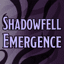**Emergence 13** - Shadar-kai
            
        
        
            
                
                    
                        ID: 2261**Tabaxi Glitch (Shandie)**I don't have friends. I've got clowder.  Shandie also counts as a Tabaxi and increases the effect of Agile Allies by 20% for each unique species in the formation, stacking additively.<code>add_hero_tags,0,tabaxi buff_upgrade,20,9727</code>
                    
                    
                        **Feat**
                        Tabaxi Glitch
                        Shandie
                    
                
                
                    
                        ID: 2262**Death's Shadow (Kalix)**I am their end. I am inevitable.  Increases the effect of Kalix's Chameleon Carapace ability by 80%.<code>buff_upgrade,80,16519,0</code>
                    
                    
                        **Feat**
                        Death's Shadow
                        Kalix
                    
                
                
                    
                        ID: 2327**Tess Family (Tess)**We'll always be together, won't we, girl?  Increases the effect of Tess's Unleash Uggie ability by 80%.<code>buff_upgrade,80,17317</code>
                    
                    
                        **Feat**
                        Tess Family
                        Tess
                    
                
                
                    
                        ID: 2328**Lightbringer (Baldric)**Looks like there's still life in you yet.  Increases the effect of Baldric's Healing Lantern ability by 80%.<code>buff_upgrade,80,17478</code>
                    
                    
                        **Feat**
                        Lightbringer
                        Baldric
                    
                
                
                    
                        ID: 2326**Dark Zealot (KoS)**The light of the empire fades... I am what remains...  Increases the effect of King of Shadows's Phase Three: The Warrior ability by 80%.<code>buff_upgrade,80,17760</code>
                    
                    
                        **Feat**
                        Dark Zealot
                        KoS
                    
                
                
                    
                        ID: 614**Shadowfell Kalix (Kalix)**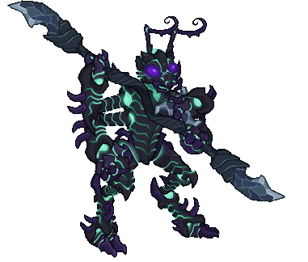
                    
                    
                        **Skin**
                        Shadowfell Kalix
                    
                
                
                    
                        ID: 3681**Ring of Spell Turning (Wren)**They told me I couldn't block spells, but nothing about returning them!  Increases the effect of Wren's Hero's Call ability by 275%.<code>buff_upgrade,275,15208</code>
                    
                    
                        **Golden Epic**
                        Ring of Spell Turning
                        Wren (Slot 2)
                    
                
                
                    
                        ID: 3993**Accursed Harness (KoS)**I will protect their legacy at all costs.  Increases the effect of King of Shadows's Phase Two: The Warden ability by 275%.<code>buff_upgrade,275,17759</code>
                    
                    
                        **Golden Epic**
                        Accursed Harness
                        KoS (Slot 2)
                    
                
            
        
        
            
                **Start Date**
            
            
                **End Date**
            
            
                **Exclusive Date**
            
        
        
            
                22 October 2025
            
            
                02 January 2026
            
            
                02 April 2026 (Guess)
            
        
    

# Old Exclusive Special Events

This is the list of recurring events that have had their exclusivity period end. This means their contents are available again. This list does not include platform giveaways.

ⓘ *Note: They're sorted by the date at which they stopped being exclusive - with the most recent at the bottom. Ties sort by start date.*

    
        
            
                <a id="s1a" onclick="exclusiveToggleContent(`s1`)">
                    [show contents]
                </a>
                **Season 1** - Heroes of Aerois
            
        
        
            
                
                    
                        ID: 879**Everything's a Nail (Aila)**I'm a delight.  Increases the effect of Aila's Aerois Synergy ability by 80%.<code>buff_upgrade,80,8783</code>
                    
                    
                        **Feat**
                        Everything's a Nail
                        Aila
                    
                
                
                    
                        ID: 913**Eye of the Storm (Qillek)**I see what was and is and will be.  Increases the effect of Qillek's Aerois Synergy ability by 80%.<code>buff_upgrade,80,8770</code>
                    
                    
                        **Feat**
                        Eye of the Storm
                        Qillek
                    
                
                
                    
                        ID: 937**Sentinel Prime (Sentry)**My new home will be protected.  Increases the effect of Sentry's Aerois Synergy ability by 80%.<code>buff_upgrade,80,8762</code>
                    
                    
                        **Feat**
                        Sentinel Prime
                        Sentry
                    
                
                
                    
                        ID: 896**Merry Crew (Nova)**If we all work together, what could go wrong?  Increases the effect of Nova's Aerois Synergy ability by 80%.<code>buff_upgrade,80,8752</code>
                    
                    
                        **Feat**
                        Merry Crew
                        Nova
                    
                
                
                    
                        ID: 939**Privileged Background (Lucius)**Can we just solve this with coin?  Increases the effect of Lucius's Aerois Synergy ability by 80%.<code>buff_upgrade,80,8730</code>
                    
                    
                        **Feat**
                        Privileged Background
                        Lucius
                    
                
                
                    
                        ID: 193**Champion of Aerois Aila (Aila)**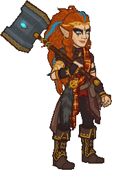
                    
                    
                        **Skin**
                        Champion of Aerois Aila
                    
                
                
                    
                        ID: 192**H'esper's Avatar Qillek (Qillek)**
                    
                    
                        **Skin**
                        H'esper's Avatar Qillek
                    
                
                
                    
                        ID: 190**Prime's Hope Sentry (Sentry)**
                    
                    
                        **Skin**
                        Prime's Hope Sentry
                    
                
                
                    
                        ID: 191**Tiangong Nova (Nova)**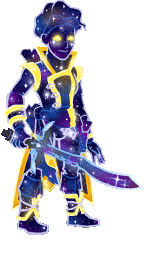
                    
                    
                        **Skin**
                        Tiangong Nova
                    
                
                
                    
                        ID: 194**Prism Lucius (Lucius)**
                    
                    
                        **Skin**
                        Prism Lucius
                    
                
                
                    
                        ID: 5**Aerois Core**A modron core to massively buff Aerois Champions
                    
                    
                        **Modron Core**
                        Aerois Core
                    
                
                
                    
                        ID: 112**Tiangong**All that you have done for us, we know. Thank you 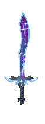
                    
                    
                        **Familiar**
                        Tiangong
                    
                
            
        
        
            
                **Start Date**
            
            
                **End Date**
            
            
                **Exclusive Date**
            
        
        
            
                14 September 2022
            
            
                23 November 2022
            
            
                23 May 2023
            
        
    
    
        
            
                <a id="s2a" onclick="exclusiveToggleContent(`s2`)">
                    [show contents]
                </a>
                **Season 2** - The Flayer Hunters
            
        
        
            
                
                    
                        ID: 1036**Judge of the Dead (Nerys)**Your existence is anathema, foul undead!  Increases the effect of Nerys's Sanctify ability by 80%.<code>buff_upgrade,80,9736</code>
                    
                    
                        **Feat**
                        Judge of the Dead
                        Nerys
                    
                
                
                    
                        ID: 1035**Second Wind (Shandie)**I could do this all day!  Decreases the time it takes Shandie's Dash ability to trigger from 30 seconds to 10 seconds.<code>change_upgrade_data,9728</code>
                    
                    
                        **Feat**
                        Second Wind
                        Shandie
                    
                
                
                    
                        ID: 1032**Prodigal Leader (Krydle)**You can trust me!  All Champions damage +50%.<code>global_dps_multiplier_mult,50</code>
                    
                    
                        **Feat**
                        Prodigal Leader
                        Krydle
                    
                
                
                    
                        ID: 1027**Thrill of the Hunt (Jaheira)**You won't escape me!  Increases the effect of Jaheira's Fierce Hunter ability by 80%.<code>buff_upgrade,80,9710</code>
                    
                    
                        **Feat**
                        Thrill of the Hunt
                        Jaheira
                    
                
                
                    
                        ID: 1024**The Grave Rejects You (Viconia)**Hordes of undead? I don't see a problem.  Increases the effect of Viconia's Yesterday's Undead ability by 150%.<code>buff_upgrade,150,9752</code>
                    
                    
                        **Feat**
                        The Grave Rejects You
                        Viconia
                    
                
                
                    
                        ID: 239**Flayer Hunter Nerys (Nerys)**
                    
                    
                        **Skin**
                        Flayer Hunter Nerys
                    
                
                
                    
                        ID: 238**Flayer Hunter Shandie (Shandie)**
                    
                    
                        **Skin**
                        Flayer Hunter Shandie
                    
                
                
                    
                        ID: 236**Flayer Hunter Krydle (Krydle)**
                    
                    
                        **Skin**
                        Flayer Hunter Krydle
                    
                
                
                    
                        ID: 235**Flayer Hunter Jaheira (Jaheira)**
                    
                    
                        **Skin**
                        Flayer Hunter Jaheira
                    
                
                
                    
                        ID: 237**Flayer Hunter Viconia (Viconia)**
                    
                    
                        **Skin**
                        Flayer Hunter Viconia
                    
                
                
                    
                        ID: 1428**Cloak of The Blades (Krydle)**I ran with them for a while. It... didn't end well.  Increases the effect of Krydle's From The Shadows ability by 275%.<code>buff_upgrade,275,9629,0</code>
                    
                    
                        **Golden Epic**
                        Cloak of The Blades
                        Krydle (Slot 3)
                    
                
                
                    
                        ID: 115**Intellect Devourer**Feeding on intellect. 
                    
                    
                        **Familiar**
                        Intellect Devourer
                    
                
            
        
        
            
                **Start Date**
            
            
                **End Date**
            
            
                **Exclusive Date**
            
        
        
            
                21 December 2022
            
            
                01 March 2023
            
            
                01 September 2023
            
        
    
    
        
            
                <a id="e1a" onclick="exclusiveToggleContent(`e1`)">
                    [show contents]
                </a>
                **Emergence 1** - Red Wizards
            
        
        
            
                
                    
                        ID: 1193**Five Questions (Hitch)**You hold 'em, I'll drop 'em!  Increases the effect of Hitch's Ricochet ability by 80%.<code>buff_upgrade,80,3672</code>
                    
                    
                        **Feat**
                        Five Questions
                        Hitch
                    
                
                
                    
                        ID: 1086**Neverwinter Diversity (Hew Maan)**Greetings, fellow humans!  Increases the number of other champions counted by Hello, Fellow Humans by 3.<code>additional_fellow_humans,3</code>
                    
                    
                        **Feat**
                        Neverwinter Diversity
                        Hew Maan
                    
                
                
                    
                        ID: 1194**Wisened Friends (Fen)**If we put our heads together, we can overcome!  Increases the effect of Fen's I've Got You, Friends ability by 80%.<code>buff_upgrade,80,9759</code>
                    
                    
                        **Feat**
                        Wisened Friends
                        Fen
                    
                
                
                    
                        ID: 289**Red Wizard Calliope (Calliope)**
                    
                    
                        **Skin**
                        Red Wizard Calliope
                    
                
                
                    
                        ID: 288**Red Wizard Widdle (Widdle)**
                    
                    
                        **Skin**
                        Red Wizard Widdle
                    
                
                
                    
                        ID: 2889**High Sorcery Robes (Miria)**A mark of the respect and station I deserve.  Increases the effect of Miria's Mage of High Sorcery ability by 275%.<code>buff_upgrade,275,10665</code>
                    
                    
                        **Golden Epic**
                        High Sorcery Robes
                        Miria (Slot 2)
                    
                
            
        
        
            
                **Start Date**
            
            
                **End Date**
            
            
                **Exclusive Date**
            
        
        
            
                29 March 2023
            
            
                07 June 2023
            
            
                01 September 2023
            
        
    
    
        
            
                <a id="s3a" onclick="exclusiveToggleContent(`s3`)">
                    [show contents]
                </a>
                **Season 3** - Ancients and Lawbringers
            
        
        
            
                
                    
                        ID: 1164**Calm Under Pressure (Barrowin)**Clan Undurr does not back down!  Barrowin takes 10 more Enemies attacking to get overwhelmed.<code>overwhelm_start_increase,10</code>
                    
                    
                        **Feat**
                        Calm Under Pressure
                        Barrowin
                    
                
                
                    
                        ID: 1171**Athlete (Birdsong)**I've been sharpening my claws for days!  Increases the Strength score of Birdsong by 1.<code>increase_ability_score,str,1</code>
                    
                    
                        **Feat**
                        Athlete
                        Birdsong
                    
                
                
                    
                        ID: 1173**Extra Wasps (Spurt)**I call this bag the angries.  Increases the cooldown on Spurt's Ultimate Attack by 30 seconds.<code>increase_ultimate_cooldown,30</code>
                    
                    
                        **Feat**
                        Extra Wasps
                        Spurt
                    
                
                
                    
                        ID: 1182**Athlete (Turiel)**Strength of Bahamut, flow through me!  Increases the Strength score of Turiel by 1.<code>increase_ability_score,str,1</code>
                    
                    
                        **Feat**
                        Athlete
                        Turiel
                    
                
                
                    
                        ID: 1184**The Path Is Clear (Hew Maan)**Surprises around every corner! But not this one. I don't think. ~ Kleeb  Increases game speed by 10% when the formation is not under attack.<code>time_scale_when_not_attacked,10,2</code>
                    
                    
                        **Feat**
                        The Path Is Clear
                        Hew Maan
                    
                
                
                    
                        ID: 1163**Dwarven Tradition (Barrowin)**Undurr Ground. Get it?  Increases the effect of Barrowin's Blessed Hammer ability by 80%.<code>buff_upgrade,80,10684</code>
                    
                    
                        **Feat**
                        Dwarven Tradition
                        Barrowin
                    
                
                
                    
                        ID: 1169**Harmony (Birdsong)**Just keep it going!  Increases the effect of Birdsong's Crescendo ability by 80%. (Prestack)<code>buff_upgrade,80,10776</code>
                    
                    
                        **Feat**
                        Harmony
                        Birdsong
                    
                
                
                    
                        ID: 1172**Kobold Brethren (Spurt)**For Glory!  Increases the effect of Spurt's Pack Tactics ability by 80%.<code>buff_upgrade,80,10680</code>
                    
                    
                        **Feat**
                        Kobold Brethren
                        Spurt
                    
                
                
                    
                        ID: 1179**Shout Above The Din (Turiel)**The time for debate is over!  Increases the effect of all of Turiel's specialization choices by 80%.<code>buff_upgrades,80,10663,10664</code>
                    
                    
                        **Feat**
                        Shout Above The Din
                        Turiel
                    
                
                
                    
                        ID: 1183**Immolation (Hew Maan)**Kleeb prefers fire going in opposite direction! ~Kleeb  Hew Maan's attacks deal an additional 1 second of BUD damage every second for 5 seconds.<code>immolation,1,5</code>
                    
                    
                        **Feat**
                        Immolation
                        Hew Maan
                    
                
                
                    
                        ID: 283**Ancient Barrowin (Barrowin)**
                    
                    
                        **Skin**
                        Ancient Barrowin
                    
                
                
                    
                        ID: 284**Lawbringer Birdsong (Birdsong)**
                    
                    
                        **Skin**
                        Lawbringer Birdsong
                    
                
                
                    
                        ID: 286**Lawbringer Spurt (Spurt)**
                    
                    
                        **Skin**
                        Lawbringer Spurt
                    
                
                
                    
                        ID: 285**Ancient Turiel (Turiel)**
                    
                    
                        **Skin**
                        Ancient Turiel
                    
                
                
                    
                        ID: 287**Law Maan (Hew Maan)**
                    
                    
                        **Skin**
                        Law Maan
                    
                
                
                    
                        ID: 6**Unaffiliated Core**A modron core to massively buff Unaffiliated Champions
                    
                    
                        **Modron Core**
                        Unaffiliated Core
                    
                
                
                    
                        ID: 113**Baby Guenhwyvar**This panther from the astral plane is looking for her new best friend! 
                    
                    
                        **Familiar**
                        Baby Guenhwyvar
                    
                
            
        
        
            
                **Start Date**
            
            
                **End Date**
            
            
                **Exclusive Date**
            
        
        
            
                15 March 2023
            
            
                24 May 2023
            
            
                15 November 2023
            
        
    
    
        
            
                <a id="e2a" onclick="exclusiveToggleContent(`e2`)">
                    [show contents]
                </a>
                **Emergence 2** - Modrons
            
        
        
            
                
                    
                        ID: 1291**Entertainer (Nrakk)**Some have called my battle meditations... calming to watch.  Increases the Charisma score of Nrakk by 2.<code>increase_ability_score,cha,2</code>
                    
                    
                        **Feat**
                        Entertainer
                        Nrakk
                    
                
                
                    
                        ID: 290**Modron Antrius (Antrius)**
                    
                    
                        **Skin**
                        Modron Antrius
                    
                
                
                    
                        ID: 307**Modron Nixie (Nixie)**
                    
                    
                        **Skin**
                        Modron Nixie
                    
                
                
                    
                        ID: 1588**The Lost Friend (Dragonbait)**Dragonbait carries a drawing of Artus Cimber.  All Champions damage +230%.<code>global_dps_multiplier_mult,230</code>
                    
                    
                        **Golden Epic**
                        The Lost Friend
                        Dragonbait (Slot 1)
                    
                
                
                    
                        ID: 2961**Armor of Victory (Evandra)**Won this at a jousting tourney. No thanks to Dargle-bark.  Increases the health of Evandra by 100%.<code>health_mult,100</code>
                    
                    
                        **Golden Epic**
                        Armor of Victory
                        Evandra (Slot 2)
                    
                
            
        
        
            
                **Start Date**
            
            
                **End Date**
            
            
                **Exclusive Date**
            
        
        
            
                24 May 2023
            
            
                01 September 2023
            
            
                29 November 2023
            
        
    
    
        
            
                <a id="s4a" onclick="exclusiveToggleContent(`s4`)">
                    [show contents]
                </a>
                **Season 4** - Legends of Mithral Hall
            
        
        
            
                
                    
                        ID: 1315**Rest Awhile (Regis)**Relax -- there can't be a battle every day.  Additively increases Regis' Mithral Hall Stacks contribution by 1.<code>add_mithral_hall_stacks,1</code>
                    
                    
                        **Feat**
                        Rest Awhile
                        Regis
                    
                
                
                    
                        ID: 1313**Weapon Swap (Catti-brie)**Aye, I know how to use a warhammer.  Additively increases Catti-brie's Mithral Hall Stacks contribution by 1.<code>add_mithral_hall_stacks,1</code>
                    
                    
                        **Feat**
                        Weapon Swap
                        Catti-brie
                    
                
                
                    
                        ID: 1317**Imposing Build (Wulfgar)**They will think twice with me at your side.  Additively increases Wulfgar's Mithral Hall Stacks contribution by 1.<code>add_mithral_hall_stacks,1</code>
                    
                    
                        **Feat**
                        Imposing Build
                        Wulfgar
                    
                
                
                    
                        ID: 1319**Aggressive Stance (Pwent)**Think they got the point?  Additively increases Pwent's Mithral Hall Stacks contribution by 1.<code>add_mithral_hall_stacks,1</code>
                    
                    
                        **Feat**
                        Aggressive Stance
                        Pwent
                    
                
                
                    
                        ID: 1297**Battle Expertise (Artemis)**Their last thoughts will dismiss me as just a shadow.  Additively increases the Crit Chance of Artemis by 10%.<code>buff_base_crit_chance_add,10</code>
                    
                    
                        **Feat**
                        Battle Expertise
                        Artemis
                    
                
                
                    
                        ID: 1316**Advisor of the Hall (Regis)**We stick with Bruenor's plan!  Additively increases Regis' Mithral Hall Stacks contribution by 2.<code>add_mithral_hall_stacks,2</code>
                    
                    
                        **Feat**
                        Advisor of the Hall
                        Regis
                    
                
                
                    
                        ID: 1314**Speaker of the Hall (Catti-brie)**Behind you! I've got them!  Additively increases Catti-brie's Mithral Hall Stacks contribution by 2.<code>add_mithral_hall_stacks,2</code>
                    
                    
                        **Feat**
                        Speaker of the Hall
                        Catti-brie
                    
                
                
                    
                        ID: 1318**Aegis of the Hall (Wulfgar)**To me! Make haste!  Additively increases Wulfgar's Mithral Hall Stacks contribution by 2.<code>add_mithral_hall_stacks,2</code>
                    
                    
                        **Feat**
                        Aegis of the Hall
                        Wulfgar
                    
                
                
                    
                        ID: 1320**Vanguard of the Hall (Pwent)**Gutbusters! Are you ready?!  Additively increases Pwent's Mithral Hall Stacks contribution by 2.<code>add_mithral_hall_stacks,2</code>
                    
                    
                        **Feat**
                        Vanguard of the Hall
                        Pwent
                    
                
                
                    
                        ID: 1298**Vicious Damage (Artemis)**Your life essence belongs to me now.  Increases the damage of Artemis by 400%. Artemis's attacks prevent the target from healing for 10 seconds.<code>hero_dps_multiplier_mult,400 vicious_damage,10</code>
                    
                    
                        **Feat**
                        Vicious Damage
                        Artemis
                    
                
                
                    
                        ID: 323**Mythic Regis (Regis)**
                    
                    
                        **Skin**
                        Mythic Regis
                    
                
                
                    
                        ID: 308**Mythic Catti-brie (Catti-brie)**
                    
                    
                        **Skin**
                        Mythic Catti-brie
                    
                
                
                    
                        ID: 316**Mythic Wulfgar (Wulfgar)**
                    
                    
                        **Skin**
                        Mythic Wulfgar
                    
                
                
                    
                        ID: 314**Mythic Pwent (Pwent)**
                    
                    
                        **Skin**
                        Mythic Pwent
                    
                
                
                    
                        ID: 312**Mythic Artemis (Artemis)**
                    
                    
                        **Skin**
                        Mythic Artemis
                    
                
                
                    
                        ID: 1192**Helm of Clangeddin's Wrath (Pwent)**When a dwarf enters tha bloodrage, stand clear.  Increases the effect of Pwent's Gutbuster Recruits ability by 275%.<code>buff_upgrade,275,11494</code>
                    
                    
                        **Golden Epic**
                        Helm of Clangeddin's Wrath
                        Pwent (Slot 4)
                    
                
                
                    
                        ID: 150**Mythic Guenhwyvar**She says it looks better on her. 
                    
                    
                        **Familiar**
                        Mythic Guenhwyvar
                    
                
                
                    
                        ID: 5**Guenhwyvar's Strike**
                    
                    
                        **Click Damage Skin**
                        Guenhwyvar's Strike
                    
                
            
        
        
            
                **Start Date**
            
            
                **End Date**
            
            
                **Exclusive Date**
            
        
        
            
                21 June 2023
            
            
                30 August 2023
            
            
                14 February 2024
            
        
    
    
        
            
                <a id="e3a" onclick="exclusiveToggleContent(`e3`)">
                    [show contents]
                </a>
                **Emergence 3** - Mind Flayers
            
        
        
            
                
                    
                        ID: 1504**Illithid Tadpole (Nrakk)**They said it would be fine...  All Champions damage +25%. Additively increases Ceremorphosis Stacks by 1.<code>global_dps_multiplier_mult,25 add_global_ceremorphosis_stacks,1</code>
                    
                    
                        **Feat**
                        Illithid Tadpole
                        Nrakk
                    
                
                
                    
                        ID: 1424**Very Important Person (Valentine)**I had to put in an appearance.  Increases the effect of Valentine's Socialite ability by 80%.<code>buff_upgrade,80,8147</code>
                    
                    
                        **Feat**
                        Very Important Person
                        Valentine
                    
                
                
                    
                        ID: 334**Mind Flayer Jamilah (Jamilah)**
                    
                    
                        **Skin**
                        Mind Flayer Jamilah
                    
                
                
                    
                        ID: 335**Mind Flayer Nrakk (Nrakk)**
                    
                    
                        **Skin**
                        Mind Flayer Nrakk
                    
                
                
                    
                        ID: 2528**Endless Patron (Blooshi)**Whoever he is, I like the powers he gives me!  Increases the effect of Blooshi's Soul Gatherer ability by 275%.<code>buff_upgrade,275,7518</code>
                    
                    
                        **Golden Epic**
                        Endless Patron
                        Blooshi (Slot 2)
                    
                
                
                    
                        ID: 3061**Token of Vlaakith (Lae'zel)**The engraving on the back reads: 'Vlaakith'ka sivim hrath krash'ht'  Increases the effect of Lae'zel's Ceremorphosis ability by 275%. (Prestack)<code>buff_upgrade,275,12114</code>
                    
                    
                        **Golden Epic**
                        Token of Vlaakith
                        Lae'zel (Slot 3)
                    
                
            
        
        
            
                **Start Date**
            
            
                **End Date**
            
            
                **Exclusive Date**
            
        
        
            
                23 August 2023
            
            
                01 December 2023
            
            
                14 February 2024
            
        
    
    
        
            
                <a id="s5a" onclick="exclusiveToggleContent(`s5`)">
                    [show contents]
                </a>
                **Season 5** - Acquisitions Incorporated
            
        
        
            
                
                    
                        ID: 1444**Dead Friends (Strix)**Oh, you're alive again? That's good. I guess.  Increases the effect of Strix's Haunted ability by 40%.<code>buff_upgrade,40,12287</code>
                    
                    
                        **Feat**
                        Dead Friends
                        Strix
                    
                
                
                    
                        ID: 1443**Yay Lathander! (Evelyn)**Give me an L! Give me an A! Give me a --  Increases the effect of Evelyn's Channel Divinity ability by 40%.<code>buff_upgrade,40,12206</code>
                    
                    
                        **Feat**
                        Yay Lathander!
                        Evelyn
                    
                
                
                    
                        ID: 1228**Magic Tour Bus (Jim)**Get in, nerds -- we're doing magic.  Increases the effect of Jim's Magical Mystery Tour ability by 40%.<code>buff_upgrade,40,12130</code>
                    
                    
                        **Feat**
                        Magic Tour Bus
                        Jim
                    
                
                
                    
                        ID: 1442**Waterdeep Investors (Omin)**Q3 adventures are looking good!  Increases the effect of Omin's Well Funded ability by 40%.<code>buff_upgrade,40,12303</code>
                    
                    
                        **Feat**
                        Waterdeep Investors
                        Omin
                    
                
                
                    
                        ID: 1445**Sass for Days (Vi)**Honey, I can do this all day.  Increases the effect of Vi's I Can't Get No Sass-isfaction ability by 40%.<code>buff_upgrade,40,12315</code>
                    
                    
                        **Feat**
                        Sass for Days
                        Vi
                    
                
                
                    
                        ID: 1449**Friends? (Strix)**You want to be my friend? That sounds like a lot of work...  Increases the effect of Strix's The Power of Friendship (and Nose Plugs) ability by 80%.<code>buff_upgrade,80,12289,1</code>
                    
                    
                        **Feat**
                        Friends?
                        Strix
                    
                
                
                    
                        ID: 1448**Training Montage (Evelyn)**That was great! Now let's do that 400 more times, and it will be perfect!  Increases the effect of Evelyn's Lathander's Grace ability by 80%. (Prestack)<code>buff_upgrade,80,12209</code>
                    
                    
                        **Feat**
                        Training Montage
                        Evelyn
                    
                
                
                    
                        ID: 1229**Official Fan Club Card (Jim)**I'm Jim Darkmagic and YOUR NAME HERE is my #1 fan!  Increases the pre-stack effect of Jim's Fan Club ability by 80%. (Prestack)<code>buff_upgrade,80,12128,0</code>
                    
                    
                        **Feat**
                        Official Fan Club Card
                        Jim
                    
                
                
                    
                        ID: 1447**Motivational Keynote (Omin)**It's been proven that listening to me can make me richer.  Increases the effect of all Omin's Specializations by 80%.<code>buff_upgrades,80,12304,12305,12306</code>
                    
                    
                        **Feat**
                        Motivational Keynote
                        Omin
                    
                
                
                    
                        ID: 1450**Stand Off (Vi)**Honey, you've got to ask yourself one question...  Increases the chance that Vi activates her Catch and Release ability by 100%.<code>buff_upgrade,100,12313,0</code>
                    
                    
                        **Feat**
                        Stand Off
                        Vi
                    
                
                
                    
                        ID: 340**Venture Casual Strix (Strix)**
                    
                    
                        **Skin**
                        Venture Casual Strix
                    
                
                
                    
                        ID: 339**Venture Casual Evelyn (Evelyn)**
                    
                    
                        **Skin**
                        Venture Casual Evelyn
                    
                
                
                    
                        ID: 337**Venture Casual Jim (Jim)**
                    
                    
                        **Skin**
                        Venture Casual Jim
                    
                
                
                    
                        ID: 338**Venture Casual Omin (Omin)**
                    
                    
                        **Skin**
                        Venture Casual Omin
                    
                
                
                    
                        ID: 341**Venture Casual Vi (Vi)**
                    
                    
                        **Skin**
                        Venture Casual Vi
                    
                
                
                    
                        ID: 2216**Glamourous Neckwear (Vi)**I get this out for special occasions.  Increases the effect of Vi's A Good Example ability by 275%.<code>buff_upgrade,275,12312</code>
                    
                    
                        **Golden Epic**
                        Glamourous Neckwear
                        Vi (Slot 2)
                    
                
                
                    
                        ID: 164**Clone Jim**Clone Jim winks. 
                    
                    
                        **Familiar**
                        Clone Jim
                    
                
                
                    
                        ID: 6**Golden Sparks**
                    
                    
                        **Click Damage Skin**
                        Golden Sparks
                    
                
            
        
        
            
                **Start Date**
            
            
                **End Date**
            
            
                **Exclusive Date**
            
        
        
            
                30 August 2023
            
            
                08 November 2023
            
            
                08 May 2024
            
        
    
    
        
            
                <a id="e4a" onclick="exclusiveToggleContent(`e4`)">
                    [show contents]
                </a>
                **Emergence 4** - Glitches
            
        
        
            
                
                    
                        ID: 1594**Centaur Glitch (Hitch)**I am going to go SO FAST!  Hitch also counts as a Centaur.<code>add_hero_tags,0,centaur buff_upgrade_per_unique_race,20,390</code>
                    
                    
                        **Feat**
                        Centaur Glitch
                        Hitch
                    
                
                
                    
                        ID: 1524**Gibbous Script (Warden)**The words I utter have existed since time itself.  Increases the number of Hex stacks applied by Master of Hexes by 2 (additively).<code>buff_upgrade_add,2,13244</code>
                    
                    
                        **Feat**
                        Gibbous Script
                        Warden
                    
                
                
                    
                        ID: 1560**Specter of Aeons (Warden)**These are spirits of time itself.  Increases the max number of Accursed Specters by 2.<code>increase_warden_specter_max,2</code>
                    
                    
                        **Feat**
                        Specter of Aeons
                        Warden
                    
                
                
                    
                        ID: 1597**Half-Elf Glitch (Sentry)**I... I can still feel a connection to The Prime Matrix.  Sentry also counts as a Half-Elf.<code>add_hero_tags,0,half-elf buff_upgrade_per_any_tagged_crusader,20,8761,half-elf</code>
                    
                    
                        **Feat**
                        Half-Elf Glitch
                        Sentry
                    
                
                
                    
                        ID: 367**Centaur Glitch Hitch (Hitch)**
                    
                    
                        **Skin**
                        Centaur Glitch Hitch
                    
                
                
                    
                        ID: 368**Half-Elf Glitch Sentry (Sentry)**
                    
                    
                        **Skin**
                        Half-Elf Glitch Sentry
                    
                
                
                    
                        ID: 1364**Scimitar of Dendar (Sisaspia)**The Night Serpent waits...  Buffs Sisaspia's Ultimate Attack Damage by 275%.<code>buff_ultimate,275</code>
                    
                    
                        **Golden Epic**
                        Scimitar of Dendar
                        Sisaspia (Slot 5)
                    
                
                
                    
                        ID: 3333**Lunation (Jang Sao)**All of time and space, within your imagination  Increases the effect of Jang Sao's Wisdom of the Ages and Speed of Shooting Stars by 275%. (Prestack)<code>buff_upgrades,275,13261,13262</code>
                    
                    
                        **Golden Epic**
                        Lunation
                        Jang Sao (Slot 5)
                    
                
            
        
        
            
                **Start Date**
            
            
                **End Date**
            
            
                **Exclusive Date**
            
        
        
            
                22 November 2023
            
            
                02 February 2024
            
            
                08 May 2024
            
        
    
    
        
            
                <a id="s6a" onclick="exclusiveToggleContent(`s6`)">
                    [show contents]
                </a>
                **Season 6** - Elemental Rebirth
            
        
        
            
                
                    
                        ID: 1245**Research (Zorbu)**Not everything is learned in battle.  Increases the effect of Zorbu's Know Your Enemy ability by 40%.<code>buff_upgrade,40,12989</code>
                    
                    
                        **Feat**
                        Research
                        Zorbu
                    
                
                
                    
                        ID: 1253**Chosen of Gith (Nrakk)**In Gith's name, you will meet your end.  Increases the effect of Nrakk's Githzerai Focus and Githzerai Agility by 40%.<code>buff_upgrades,40,13005,13006</code>
                    
                    
                        **Feat**
                        Chosen of Gith
                        Nrakk
                    
                
                
                    
                        ID: 1561**Hunter's Hex (Warden)**My hex will follow you across the planes.  Increases monsters' max number of Hex Stacks by 2.<code>increase_max_hex_stacks,2</code>
                    
                    
                        **Feat**
                        Hunter's Hex
                        Warden
                    
                
                
                    
                        ID: 1549**Actor (Korth)**You want me to pretend to have emotions?  Increases the Charisma score of Korth by 1.<code>increase_ability_score,cha,1</code>
                    
                    
                        **Feat**
                        Actor
                        Korth
                    
                
                
                    
                        ID: 1222**Nimble (Sisaspia)**Sspeed is your ally.  Increases the Dexterity score of Sisaspia by 1.<code>increase_ability_score,dex,1</code>
                    
                    
                        **Feat**
                        Nimble
                        Sisaspia
                    
                
                
                    
                        ID: 1526**Wolf Pack (Zorbu)**A lone wolf is dangerous. A pack is lethal.  Increases the effect of Hunter's Pack by 400% and the DEX score of adjacent Champions by 1.<code>effect_def,1750</code>
                    
                    
                        **Feat**
                        Wolf Pack
                        Zorbu
                    
                
                
                    
                        ID: 1259**Centered (Nrakk)**There is no solution through rage.  Increases the effect of Nrakk's Ki Master ability by 80%. (Prestack)<code>buff_upgrade,80,13001</code>
                    
                    
                        **Feat**
                        Centered
                        Nrakk
                    
                
                
                    
                        ID: 1562**Beguiling Hex (Warden)**There is no escape from this.  Increases monsters' max number of Hex Stacks by 4.<code>increase_max_hex_stacks,4</code>
                    
                    
                        **Feat**
                        Beguiling Hex
                        Warden
                    
                
                
                    
                        ID: 1550**Iaido (Korth)**The battle will end before you even see me draw my blade.  Increases the base Dexterity score buff provided by Samurai Training by 1.<code>effect_def,1753</code>
                    
                    
                        **Feat**
                        Iaido
                        Korth
                    
                
                
                    
                        ID: 1223**Fungal Colony (Sisaspia)**Growth is our only method of ssurvival.  Increases Sisaspia's maximum spore reserve by 10.<code>increase_sisaspia_reserve_spore_max,10</code>
                    
                    
                        **Feat**
                        Fungal Colony
                        Sisaspia
                    
                
                
                    
                        ID: 361**Elemental Zorbu (Zorbu)**
                    
                    
                        **Skin**
                        Elemental Zorbu
                    
                
                
                    
                        ID: 358**Elemental Nrakk (Nrakk)**
                    
                    
                        **Skin**
                        Elemental Nrakk
                    
                
                
                    
                        ID: 360**Elemental Warden (Warden)**
                    
                    
                        **Skin**
                        Elemental Warden
                    
                
                
                    
                        ID: 357**Elemental Korth (Korth)**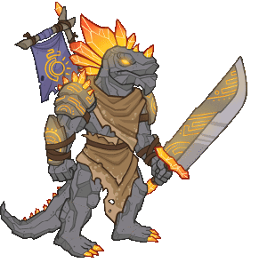
                    
                    
                        **Skin**
                        Elemental Korth
                    
                
                
                    
                        ID: 359**Elemental Sisaspia (Sisaspia)**
                    
                    
                        **Skin**
                        Elemental Sisaspia
                    
                
                
                    
                        ID: 556**Kensei Naginata of Illithid Slaying (Nrakk)**The force of this Naginata disrupts the Illithid's psionic field.  All Champions damage +230%.<code>global_dps_multiplier_mult,230</code>
                    
                    
                        **Golden Epic**
                        Kensei Naginata of Illithid Slaying
                        Nrakk (Slot 1)
                    
                
                
                    
                        ID: 7**Dexterous Core**A modron core to massively buff Dexterous Champions
                    
                    
                        **Modron Core**
                        Dexterous Core
                    
                
                
                    
                        ID: 181**Bash the Earth Elemental**I JUST GOTTA BASH IT! 
                    
                    
                        **Familiar**
                        Bash the Earth Elemental
                    
                
            
        
        
            
                **Start Date**
            
            
                **End Date**
            
            
                **Exclusive Date**
            
        
        
            
                08 November 2023
            
            
                03 January 2024
            
            
                05 June 2024
            
        
    
    
        
            
                <a id="e5a" onclick="exclusiveToggleContent(`e5`)">
                    [show contents]
                </a>
                **Emergence 5** - Astral Elves
            
        
        
            
                
                    
                        ID: 1616**Fields of Green (D'hani)**I think we need a bit more mossy colors.  Increase the chance of applying a Stroke of Green by 80%.<code>buff_upgrade,80,13714,0</code>
                    
                    
                        **Feat**
                        Fields of Green
                        D'hani
                    
                
                
                    
                        ID: 1665**Prodigal Leader (Gazrick)**Well, isn't that a kind thing to say!  All Champions damage +50%.<code>global_dps_multiplier_mult,50</code>
                    
                    
                        **Feat**
                        Prodigal Leader
                        Gazrick
                    
                
                
                    
                        ID: 1109**Caged Dreams (Miria)**Their power flows through me.  Increases the effect of Miria's Soul Cage ability by 80%.<code>buff_upgrade,80,10666</code>
                    
                    
                        **Feat**
                        Caged Dreams
                        Miria
                    
                
                
                    
                        ID: 1666**Fiery Tempest (Karlach)**Oh... You're going to regret that!  Increases the effect of Karlach's The Fury of Avernus ability by 80%.<code>buff_upgrade,80,13721</code>
                    
                    
                        **Feat**
                        Fiery Tempest
                        Karlach
                    
                
                
                    
                        ID: 372**Spelljammer Pilot Strix (Strix)**
                    
                    
                        **Skin**
                        Spelljammer Pilot Strix
                    
                
                
                    
                        ID: 373**Spelljammer Pilot Miria (Miria)**
                    
                    
                        **Skin**
                        Spelljammer Pilot Miria
                    
                
                
                    
                        ID: 2757**Thrilling Memoirs (Virgil)**All our adventures together are contained in this book. Well...most of them.  Increases the effect of Virgil's Rapid Fire ability by 100%.<code>buff_upgrade,100,9605</code>
                    
                    
                        **Golden Epic**
                        Thrilling Memoirs
                        Virgil (Slot 5)
                    
                
                
                    
                        ID: 3393**Helldusk Armour (Karlach)**I CAN FLY NOW?!  Increases the health of Karlach by 100%.<code>health_mult,100</code>
                    
                    
                        **Golden Epic**
                        Helldusk Armour
                        Karlach (Slot 2)
                    
                
            
        
        
            
                **Start Date**
            
            
                **End Date**
            
            
                **Exclusive Date**
            
        
        
            
                24 January 2024
            
            
                08 March 2024
            
            
                05 June 2024
            
        
    
    
        
            
                <a id="s7a" onclick="exclusiveToggleContent(`s7`)">
                    [show contents]
                </a>
                **Season 7** - The Rivals
            
        
        
            
                
                    
                        ID: 1433**Puzzling Answers (Shaka)**The answer you get may not be the answer you need.  Increases the effect of Shaka's Riddling Rivals ability by 40%. (Prestack)<code>buff_upgrade,40,13419</code>
                    
                    
                        **Feat**
                        Puzzling Answers
                        Shaka
                    
                
                
                    
                        ID: 1653**Fresh Palette (D'hani)**A refreshed fighter is a strong fighter.  Increase the effect of all D'hani's Specializations by 40%.<code>buff_upgrades,40,13717,13718,13719</code>
                    
                    
                        **Feat**
                        Fresh Palette
                        D'hani
                    
                
                
                    
                        ID: 1649**Darting Weapon (Kent)**Have at thee!  Reduces the cooldown on Kent's Base Attack by 0.5 seconds.<code>reduce_attack_cooldown,0.5</code>
                    
                    
                        **Feat**
                        Darting Weapon
                        Kent
                    
                
                
                    
                        ID: 1650**Form Up! (Virgil)**Kent, please don't say 'Roll Out' - no one knows what that means.  Increases the damage of all Champions by 20% for each Rivals of Waterdeep Champion in the formation.<code>global_dps_multiplier_mult,20</code>
                    
                    
                        **Feat**
                        Form Up!
                        Virgil
                    
                
                
                    
                        ID: 1635**Riddles Within Riddles (Shaka)**There is far more to this than you might think.  Increases the effect of Shaka's Riddling Rivals ability by 80%. (Prestack)<code>buff_upgrade,80,13419</code>
                    
                    
                        **Feat**
                        Riddles Within Riddles
                        Shaka
                    
                
                
                    
                        ID: 1434**Champion of Tyr (Selise)**Tyr, give me strength!  Increases the damage of Thunderous Smite by 100% and prevents roaming familiars from automatically activating Selise's ultimate attack.<code>buff_ultimate,100 disallow_roaming_familiar_ult_trigger</code>
                    
                    
                        **Feat**
                        Champion of Tyr
                        Selise
                    
                
                
                    
                        ID: 1648**Taunt (Selise)**I've killed Death. You're nothing compared to that.  All Champions damage +100%. Selise's attacks have a 50% chance to taunt enemies.<code>global_dps_multiplier_mult,100 taunt,50</code>
                    
                    
                        **Feat**
                        Taunt
                        Selise
                    
                
                
                    
                        ID: 1654**Color Theory (D'hani)**Fighting is like mixing paint. You need to know what works for a situation.  Increase the effect of all D'hani's Specializations by 80%.<code>buff_upgrades,80,13717,13718,13719</code>
                    
                    
                        **Feat**
                        Color Theory
                        D'hani
                    
                
                
                    
                        ID: 1651**Vicious Damage (Kent)**Now you're in for it!  Increases the damage of Kent by 400%. Kent's attacks prevent the target from healing for 10 seconds.<code>hero_dps_multiplier_mult,400 vicious_damage,10</code>
                    
                    
                        **Feat**
                        Vicious Damage
                        Kent
                    
                
                
                    
                        ID: 1652**It's time! (Virgil)**Why would I say 'morphing' in the middle of that, Kent? That doesn't make sense.  Increases the damage of all Champions by 40% for each Rivals of Waterdeep Champion in the formation.<code>global_dps_multiplier_mult,40</code>
                    
                    
                        **Feat**
                        It's time!
                        Virgil
                    
                
                
                    
                        ID: 383**Waterdhavian Shaka (Shaka)**
                    
                    
                        **Skin**
                        Waterdhavian Shaka
                    
                
                
                    
                        ID: 384**Waterdhavian Selise (Selise)**
                    
                    
                        **Skin**
                        Waterdhavian Selise
                    
                
                
                    
                        ID: 385**Waterdhavian D'hani (D'hani)**
                    
                    
                        **Skin**
                        Waterdhavian D'hani
                    
                
                
                    
                        ID: 386**Waterdhavian Kent (Kent)**
                    
                    
                        **Skin**
                        Waterdhavian Kent
                    
                
                
                    
                        ID: 387**Waterdhavian Virgil (Virgil)**
                    
                    
                        **Skin**
                        Waterdhavian Virgil
                    
                
                
                    
                        ID: 1892**Locket of the Rivals (Shaka)**It holds an image of my family.  Increases the effect of Shaka's Feast or Famine ability by 275%. (Prestack)<code>buff_upgrade,275,13418</code>
                    
                    
                        **Golden Epic**
                        Locket of the Rivals
                        Shaka (Slot 5)
                    
                
                
                    
                        ID: 171**The Hawk Man**A miniature form of one of the eight walking statues of Waterdeep! 
                    
                    
                        **Familiar**
                        The Hawk Man
                    
                
                
                    
                        ID: 7**Rivals Attack**
                    
                    
                        **Click Damage Skin**
                        Rivals Attack
                    
                
            
        
        
            
                **Start Date**
            
            
                **End Date**
            
            
                **Exclusive Date**
            
        
        
            
                03 January 2024
            
            
                28 February 2024
            
            
                28 August 2024
            
        
    
    
        
            
                <a id="e6a" onclick="exclusiveToggleContent(`e6`)">
                    [show contents]
                </a>
                **Emergence 6** - Illithids
            
        
        
            
                
                    
                        ID: 1714**Illithid Tadpole (Minsc)**This smells of EVIL! But I trust you. I just put it in my eye?  All Champions damage +25%. Additively increases Ceremorphosis Stacks by 1.<code>global_dps_multiplier_mult,25 add_global_ceremorphosis_stacks,1</code>
                    
                    
                        **Feat**
                        Illithid Tadpole
                        Minsc
                    
                
                
                    
                        ID: 1713**Prodigal Leader (Solaak)**Trust me, we've got this.  All Champions damage +50%.<code>global_dps_multiplier_mult,50</code>
                    
                    
                        **Feat**
                        Prodigal Leader
                        Solaak
                    
                
                
                    
                        ID: 1689**Tenacious (Presto)**I won't give up! No matter what Venger throws at us!  Increases the Constitution score of Presto by 2.<code>increase_ability_score,con,2</code>
                    
                    
                        **Feat**
                        Tenacious
                        Presto
                    
                
                
                    
                        ID: 1712**Illithid Tadpole (Dynaheir)**You want me to put what in my brain?  All Champions damage +25%. Additively increases Ceremorphosis Stacks by 1.<code>global_dps_multiplier_mult,25 add_global_ceremorphosis_stacks,1</code>
                    
                    
                        **Feat**
                        Illithid Tadpole
                        Dynaheir
                    
                
                
                    
                        ID: 423**Mind Flayer Celeste (Celeste)**
                    
                    
                        **Skin**
                        Mind Flayer Celeste
                    
                
                
                    
                        ID: 424**Mind Flayer Dynaheir (Dynaheir)**
                    
                    
                        **Skin**
                        Mind Flayer Dynaheir
                    
                
                
                    
                        ID: 2476**Ornamental Weaponry (NERDS)**Fighters are masters of weaponry and martial skill.  Increases the effect of NERDS's Fighter ability by 275%.<code>buff_upgrade,275,6139</code>
                    
                    
                        **Golden Epic**
                        Ornamental Weaponry
                        NERDS (Slot 1)
                    
                
                
                    
                        ID: 3453**Old Empires Fire Wine (Dynaheir)**The decanter is for Minsc. The glass is all I require.  Increases the effect of Dynaheir's specializations by 100%. (Prestack)<code>buff_upgrades,100,13879,13880,13881</code>
                    
                    
                        **Golden Epic**
                        Old Empires Fire Wine
                        Dynaheir (Slot 5)
                    
                
            
        
        
            
                **Start Date**
            
            
                **End Date**
            
            
                **Exclusive Date**
            
        
        
            
                28 February 2024
            
            
                31 May 2024
            
            
                28 August 2024
            
        
    
    
        
            
                <a id="e7a" onclick="exclusiveToggleContent(`e7`)">
                    [show contents]
                </a>
                **Emergence 7** - Vecna Cultists
            
        
        
            
                
                    
                        ID: 1304**Courage in Battle (Drizzt)**Hope is the ally of all courageous people.  Additively increases Drizzt's Mithral Hall Stacks contribution by 1.<code>add_mithral_hall_stacks,1</code>
                    
                    
                        **Feat**
                        Courage in Battle
                        Drizzt
                    
                
                
                    
                        ID: 1471**Quick Friends (Evelyn)**Did you heal me? OH! Yay! We're best friends now!  Increases the effect of Evelyn's Conduit of the Light ability by 80%.<code>buff_upgrade,80,12208</code>
                    
                    
                        **Feat**
                        Quick Friends
                        Evelyn
                    
                
                
                    
                        ID: 1797**Heavily Armored (Krydle)**You want me to hide in this?! Do you have a barn?  Increases the health of Krydle by 60%.<code>health_mult,60</code>
                    
                    
                        **Feat**
                        Heavily Armored
                        Krydle
                    
                
                
                    
                        ID: 1775**Scholar (Diana)**I've got a 4.0 GPA.  Increases the Intelligence score of Diana by 2.<code>increase_ability_score,int,2</code>
                    
                    
                        **Feat**
                        Scholar
                        Diana
                    
                
                
                    
                        ID: 430**Pirate Azaka (Azaka)**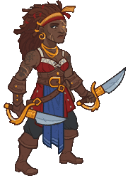
                    
                    
                        **Skin**
                        Pirate Azaka
                    
                
                
                    
                        ID: 431**Pirate Diana (Diana)**
                    
                    
                        **Skin**
                        Pirate Diana
                    
                
                
                    
                        ID: 708**Magical Coin Pack (Azaka)**It always has more room!  Increases the effect of Azaka's Guiding Hand ability by 275%.<code>buff_upgrade,275,1233</code>
                    
                    
                        **Golden Epic**
                        Magical Coin Pack
                        Azaka (Slot 3)
                    
                
                
                    
                        ID: 3525**Weavebound Staff (Diana)**Dungeon Master told me the Weave itself flows through this...  Buffs Diana's Ultimate Attack Damage by 275%.<code>buff_ultimate,275</code>
                    
                    
                        **Golden Epic**
                        Weavebound Staff
                        Diana (Slot 5)
                    
                
            
        
        
            
                **Start Date**
            
            
                **End Date**
            
            
                **Exclusive Date**
            
        
        
            
                22 May 2024
            
            
                02 August 2024
            
            
                30 October 2024
            
        
    
    
        
            
                <a id="e8a" onclick="exclusiveToggleContent(`e8`)">
                    [show contents]
                </a>
                **Emergence 8** - Planescape
            
        
        
            
                
                    
                        ID: 1873**Better Every Day (Ulkoria)**You should do something every day to get you closer to your next goal!  Increases the positional formation buff of Watchful Order by 80%.<code>buff_upgrade,80,4347,2</code>
                    
                    
                        **Feat**
                        Better Every Day
                        Ulkoria
                    
                
                
                    
                        ID: 1867**Air Genasi Glitch (Valentine)**Huh. Well, at least I still look good in black.  Valentine also counts as Air Genasi.<code>add_hero_tags,0,genasi change_hero_alignment_tag,chaotic,evil</code>
                    
                    
                        **Feat**
                        Air Genasi Glitch
                        Valentine
                    
                
                
                    
                        ID: 1814**Heart of Battle (Ravengard)**Let hope strengthen your blades and deliver us victory!  Ravengard's Critical Teamwork keeps 40% of its stacks when they would be reset.<code>persist_effect_stacks,40,15030</code>
                    
                    
                        **Feat**
                        Heart of Battle
                        Ravengard
                    
                
                
                    
                        ID: 1848**Woken the Hive (Umberto)**You've done it now!  Increases the damage of Umberto's bees by 80%.<code>buff_upgrade,80,15049,0</code>
                    
                    
                        **Feat**
                        Woken the Hive
                        Umberto
                    
                
                
                    
                        ID: 452**Tabaxi Glitch Shandie (Shandie)**
                    
                    
                        **Skin**
                        Tabaxi Glitch Shandie
                    
                
                
                    
                        ID: 451**Secret Agent Maan (Hew Maan)**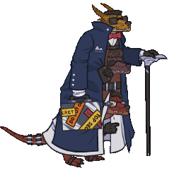
                    
                    
                        **Skin**
                        Secret Agent Maan
                    
                
                
                    
                        ID: 1616**Volo's Guide to the Weave (Ulkoria)**I'm writing a review for the Sentinel, nothing more.  All Champions damage +230%.<code>global_dps_multiplier_mult,230</code>
                    
                    
                        **Golden Epic**
                        Volo's Guide to the Weave
                        Ulkoria (Slot 2)
                    
                
                
                    
                        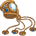ID: 3565**Bigby's Beneficent Bracelet (Aeon)**A recent gift from back home. Somewhere I haven't been in a long, long time.  Increases the effect of Aeon's Uncover Weakness ability by 275%. (Prestack)<code>buff_upgrade,275,15197,0</code>
                    
                    
                        **Golden Epic**
                        Bigby's Beneficent Bracelet
                        Aeon (Slot 3)
                    
                
            
        
        
            
                **Start Date**
            
            
                **End Date**
            
            
                **Exclusive Date**
            
        
        
            
                24 July 2024
            
            
                01 November 2024
            
            
                29 January 2025
            
        
    
    
        
            
                <a id="e9a" onclick="exclusiveToggleContent(`e9`)">
                    [show contents]
                </a>
                **Emergence 9** - Vampires
            
        
        
            
                
                    
                        ID: 2004**Strategic Stride (Briv)**Mine mighty legs could go farther, but there is wisdom in restraint.  Caps Briv's Unnatural Haste ability at 100% chance to skip 9 areas.<code>cap_upgrade,25600,3452</code>
                    
                    
                        **Feat**
                        Strategic Stride
                        Briv
                    
                
                
                    
                        ID: 1880**Gem (Ellywick)**Spread the wealth.  Ellywick stacks the deck to always draw a Gem card, unless she already has one in her hand.<code>ellywick_gem_prioritized</code>
                    
                    
                        **Feat**
                        Gem
                        Ellywick
                    
                
                
                    
                        ID: 1894**Make Undead (Widdle)**HUNGRY!  Widdle also counts as Undead.<code>add_hero_tags,0,undead buff_upgrade,160,6905 appear_dead</code>
                    
                    
                        **Feat**
                        Make Undead
                        Widdle
                    
                
                
                    
                        ID: 1893**Make Undead (Nahara)**I feel stronger...  Nahara also counts as Undead.<code>add_hero_tags,0,undead hero_dps_multiplier_mult,400 appear_dead</code>
                    
                    
                        **Feat**
                        Make Undead
                        Nahara
                    
                
                
                    
                        ID: 1723**Prodigal Leader (Voronika)**Do as I say - you'll live longer.  All Champions damage +50%.<code>global_dps_multiplier_mult,50</code>
                    
                    
                        **Feat**
                        Prodigal Leader
                        Voronika
                    
                
                
                    
                        ID: 461**Nosferatu Widdle (Widdle)**
                    
                    
                        **Skin**
                        Nosferatu Widdle
                    
                
                
                    
                        ID: 462**Vampire Nahara (Nahara)**
                    
                    
                        **Skin**
                        Vampire Nahara
                    
                
                
                    
                        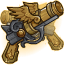ID: 3225**Muskets of Precision (Krux)**Won these in a game at Infinity's. That celestial was not happy with me...  Increases the effect of Krux's All Hands On Deck! ability by 275%.<code>buff_upgrade,275,11653</code>
                    
                    
                        **Golden Epic**
                        Muskets of Precision
                        Krux (Slot 2)
                    
                
                
                    
                        ID: 3637**Eye of Vecna (Kas)**Sometimes I feel as if he can still see me through it...  Increases the effect of Kas' Life Drain ability by 100%.<code>buff_upgrade,100,15621,0</code>
                    
                    
                        **Golden Epic**
                        Eye of Vecna
                        Kas (Slot 3)
                    
                
            
        
        
            
                **Start Date**
            
            
                **End Date**
            
            
                **Exclusive Date**
            
        
        
            
                23 October 2024
            
            
                31 January 2025
            
            
                30 April 2025
            
        
    
    
        
            
                <a id="e10a" onclick="exclusiveToggleContent(`e10`)">
                    [show contents]
                </a>
                **Emergence 10** - Constructs
            
        
        
            
                
                    
                        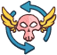ID: 2007**Shar's Veil (Shadowheart)**Lady Shar demands my heart, and I give it to her freely.  Changes Hero Alignment to Lawful Evil for Shadowheart.<code>change_hero_alignment_tag,lawful,evil</code>
                    
                    
                        **Feat**
                        Shar's Veil
                        Shadowheart
                    
                
                
                    
                        ID: 2012**Tenacious (Bobby)**Heroes never say die!  Increases the Constitution score of Bobby by 2.<code>increase_ability_score,con,2</code>
                    
                    
                        **Feat**
                        Tenacious
                        Bobby
                    
                
                
                    
                        ID: 2011**Weapon Master (Kas)**I've practiced the blade for centuries. You are nothing before me.  Increases the damage of Kas by 120%.<code>hero_dps_multiplier_mult,120</code>
                    
                    
                        **Feat**
                        Weapon Master
                        Kas
                    
                
                
                    
                        ID: 2034**Prolonged Push (Eric)**You guys handle the fighting. I'll stay back here and hold them off!  Increases the duration of Eric's Keep Away ability by 80%.<code>buff_upgrade,80,16132,0</code>
                    
                    
                        **Feat**
                        Prolonged Push
                        Eric
                    
                
                
                    
                        ID: 514**Modron Ellywick (Ellywick)**
                    
                    
                        **Skin**
                        Modron Ellywick
                    
                
                
                    
                        ID: 515**Modron Vin Ursa (Vin Ursa)**
                    
                    
                        **Skin**
                        Modron Vin Ursa
                    
                
                
                    
                        ID: 2500**Blade of the Ages (Xerophon)**A reminder of a time and place I've left behind. I doubt Ythyrn's dead will mind.  All Champions damage +230%.<code>global_dps_multiplier_mult,230</code>
                    
                    
                        **Golden Epic**
                        Blade of the Ages
                        Xerophon (Slot 1)
                    
                
                
                    
                        ID: 3729**Cavalier's Breastplate (Eric)**Not even Tiamat can melt this metal!  Increases the health of Eric by 100%.<code>health_mult,100</code>
                    
                    
                        **Golden Epic**
                        Cavalier's Breastplate
                        Eric (Slot 2)
                    
                
            
        
        
            
                **Start Date**
            
            
                **End Date**
            
            
                **Exclusive Date**
            
        
        
            
                22 January 2025
            
            
                02 May 2025
            
            
                30 July 2025
            
        
    
    
        
            
                <a id="e11a" onclick="exclusiveToggleContent(`e11`)">
                    [show contents]
                </a>
                **Emergence 11** - Dragons
            
        
        
            
                
                    
                        ID: 2155**Venom Harvester (Spurt)**I made a discovery! Wyvern tail VERY stingy!  Increases the effect of Spurt's Wa-spiration: Stingy ability by 80%.<code>buff_spurt_waspiration_effect,80,0</code>
                    
                    
                        **Feat**
                        Venom Harvester
                        Spurt
                    
                
                
                    
                        ID: 2125**Reaching Shadow (Beadle)**As the sun dips low, shadows loom large. That's when we strike. ~Beadle  Increases effect of In The Shadows to within three slots.<code>change_upgrade_targets,16722 change_upgrade_targets,16722</code>
                    
                    
                        **Feat**
                        Reaching Shadow
                        Beadle
                    
                
                
                    
                        ID: 2156**Heavily Armored (Miria)**You have no idea how much suffering a body can take.  Increases the health of Miria by 60%.<code>health_mult,60</code>
                    
                    
                        **Feat**
                        Heavily Armored
                        Miria
                    
                
                
                    
                        ID: 2157**Weapon Master (Grimm)**Whether giants or dragons, all I need is one good swing.  ~Grimm  Increases the damage of Grimm by 120%.<code>hero_dps_multiplier_mult,120</code>
                    
                    
                        **Feat**
                        Weapon Master
                        Grimm
                    
                
                
                    
                        ID: 558**Dragonlance Spurt (Spurt)**
                    
                    
                        **Skin**
                        Dragonlance Spurt
                    
                
                
                    
                        ID: 557**Highlord Miria (Miria)**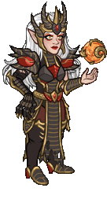
                    
                    
                        **Skin**
                        Highlord Miria
                    
                
                
                    
                        ID: 2060**Broken Hellrider Sign (Reya)**I put it on the wall in Trollskull. A reminder of where I've been.  Increases the effect of Reya's Celestial Champion ability by 275%.<code>buff_upgrade,275,5458</code>
                    
                    
                        **Golden Epic**
                        Broken Hellrider Sign
                        Reya (Slot 5)
                    
                
                
                    
                        ID: 3837**Elegant Snow Cloak (Grimm)**Now THIS is a fashion statement! ~Grimm  Buffs Grimm's Ultimate Attack Damage by 275%.<code>buff_ultimate,275</code>
                    
                    
                        **Golden Epic**
                        Elegant Snow Cloak
                        Grimm (Slot 5)
                    
                
            
        
        
            
                **Start Date**
            
            
                **End Date**
            
            
                **Exclusive Date**
            
        
        
            
                23 April 2025
            
            
                01 August 2025
            
            
                01 November 2025 (Guess)
            
        
    

[Back to Top](#top)

*Last Modified: {{ site.time }}*