[Back to Main](index.md)

# Exclusivity Dates

When a season ends - most of the items that were available in the season pass track become exclusive and unavailable for a period of six months - at which point they become available again. Usually this means everything goes into Wild Offers (including the feats) while feats also become available for gems.

Modron cores that were in the season pass are added to Wild Offers - and ones that were in the free track become available for gems the same way the Strong Core is.

For Emergences - the items added will remain in the Thayan Enclave until the following Emergence ends. Then it will remain exclusive for another 3 months. Because of this - I have set the `End Date` for Emergences as the date the items leave the shop (not the date the emergence actually ended).

For platform giveaways we've been told the exclusivity period is 3 months from the moment the giveaway ends.

<a id="showHideAll" onClick="exclusiveToggleAllContents()" style="cursor:pointer">[show all contents]</a>
    
        
            
                <a id="g1a" onclick="exclusiveToggleContent(`g1`)">
                    [show contents]
                </a>
                **7th Anniversary Giveaway** - Anniversary Celebration 2024
            
        
        
            
                
                    
                        ID: 1895**Room to Breathe (Presto)**You three take on Tiamat and I'll see what I can do from over here!<code>buff_upgrade,80,13762</code>
                    
                    
                        **Feat**
                        Room to Breathe
                        Presto (80% Hesitant Helper)
                    
                
                
                    
                        ID: 478**Harvestguard Presto (Presto)**
                    
                    
                        **Skin**
                        Harvestguard Presto
                    
                
            
        
        
            
                **Start Date**
            
            
                **End Date**
            
            
                **Exclusive Date**
            
        
        
            
                04 September 2024
            
            
                11 September 2024
            
            
                11 December 2024 (Guess)
            
        
    
    
        
            
                <a id="e8a" onclick="exclusiveToggleContent(`e8`)">
                    [show contents]
                </a>
                **Emergence 8** - Planescape
            
        
        
            
                
                    
                        ID: 1873**Better Every Day (Ulkoria)**You should do something every day to get you closer to your next goal!<code>buff_upgrade,80,4347,2</code>
                    
                    
                        **Feat**
                        Better Every Day
                        Ulkoria (80% Watchful Order)
                    
                
                
                    
                        ID: 1867**Air Genasi Glitch (Valentine)**Huh. Well, at least I still look good in black.<code>add_hero_tags,0,genasi change_hero_alignment_tag,chaotic,evil</code>
                    
                    
                        **Feat**
                        Air Genasi Glitch
                        Valentine (Counts as Genasi & Change Alignment to Chaotic Evil)
                    
                
                
                    
                        ID: 1814**Heart of Battle (Ravengard)**Let hope strengthen your blades and deliver us victory!<code>persist_effect_stacks,40,15030</code>
                    
                    
                        **Feat**
                        Heart of Battle
                        Ravengard (40% of Critical Teamwork Stacks Persist When Reset)
                    
                
                
                    
                        ID: 1848**Woken the Hive (Umberto)**You've done it now!<code>buff_upgrade,80,15049,0</code>
                    
                    
                        **Feat**
                        Woken the Hive
                        Umberto (80% Beehive Barrage)
                    
                
                
                    
                        ID: 452**Tabaxi Glitch Shandie (Shandie)**
                    
                    
                        **Skin**
                        Tabaxi Glitch Shandie
                    
                
                
                    
                        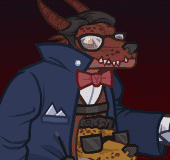ID: 451**Secret Agent Maan (Hew Maan)**
                    
                    
                        **Skin**
                        Secret Agent Maan
                    
                
                
                    
                        ID: 1616**Volo's Guide to the Weave (Ulkoria)**I'm writing a review for the Sentinel, nothing more.<code>global_dps_multiplier_mult,230</code>
                    
                    
                        **Golden Epic**
                        All Champion Damage
                        Ulkoria (Slot 2)
                    
                
                
                    
                        ID: 3565**Bigby's Beneficent Bracelet (Aeon)**A recent gift from back home. Somewhere I haven't been in a long, long time.<code>buff_upgrade,275,15197,0</code>
                    
                    
                        **Golden Epic**
                        Uncover Weakness (Prestack)
                        Aeon (Slot 3)
                    
                
            
        
        
            
                **Start Date**
            
            
                **End Date**
            
            
                **Exclusive Date**
            
        
        
            
                24 July 2024
            
            
                01 November 2024
            
            
                01 February 2025 (Guess)
            
        
    
    
        
            
                <a id="g2a" onclick="exclusiveToggleContent(`g2`)">
                    [show contents]
                </a>
                **XBox Giveaway** - Shadowheart's Champions of Renown Pack
            
        
        
            
                
                    
                        ID: 492**Sharran Shadowheart (Shadowheart)**
                    
                    
                        **Skin**
                        Sharran Shadowheart
                    
                
                
                    
                        ID: 234**Sir Perchington the Fancy Owl**Hoot, I say. HOOOOOOOT! 
                    
                    
                        **Familiar**
                        Sir Perchington the Fancy Owl
                    
                
            
        
        
            
                **Start Date**
            
            
                **End Date**
            
            
                **Exclusive Date**
            
        
        
            
                04 December 2024
            
            
                11 December 2024
            
            
                11 March 2025 (Guess)
            
        
    
    
        
            
                <a id="e9a" onclick="exclusiveToggleContent(`e9`)">
                    [show contents]
                </a>
                **Emergence 9** - Vampires
            
        
        
            
                
                    
                        ID: 2004**Strategic Stride (Briv)**Mine mighty legs could go farther, but there is wisdom in restraint.<code>cap_upgrade,25600,3452</code>
                    
                    
                        **Feat**
                        Strategic Stride
                        Briv (Cap Unnatural Haste at 9j)
                    
                
                
                    
                        ID: 1880**Gem (Ellywick)**Spread the wealth.<code>ellywick_gem_prioritized</code>
                    
                    
                        **Feat**
                        Gem
                        Ellywick (Always Draws at Least 1 Gems Card)
                    
                
                
                    
                        ID: 1894**Make Undead (Widdle)**HUNGRY!<code>add_hero_tags,0,undead buff_upgrade,160,6905 appear_dead</code>
                    
                    
                        **Feat**
                        Make Undead
                        Widdle (Counts as Undead & 160% Vampiric Gaze)
                    
                
                
                    
                        ID: 1893**Make Undead (Nahara)**I feel stronger...<code>add_hero_tags,0,undead hero_dps_multiplier_mult,400 appear_dead</code>
                    
                    
                        **Feat**
                        Make Undead
                        Nahara (Counts as Undead & 400% Self DPS)
                    
                
                
                    
                        ID: 1723**Prodigal Leader (Voronika)**Do as I say - you'll live longer.<code>global_dps_multiplier_mult,50</code>
                    
                    
                        **Feat**
                        Prodigal Leader
                        Voronika (50% All Champion Damage)
                    
                
                
                    
                        ID: 461**Nosferatu Widdle (Widdle)**
                    
                    
                        **Skin**
                        Nosferatu Widdle
                    
                
                
                    
                        ID: 462**Vampire Nahara (Nahara)**
                    
                    
                        **Skin**
                        Vampire Nahara
                    
                
                
                    
                        ID: 3225**Muskets of Precision (Krux)**Won these in a game at Infinity's. That celestial was not happy with me...<code>buff_upgrade,275,11653</code>
                    
                    
                        **Golden Epic**
                        All Hands On Deck!
                        Krux (Slot 2)
                    
                
                
                    
                        ID: 3637**Eye of Vecna (Kas)**Sometimes I feel as if he can still see me through it...<code>buff_upgrade,100,15621,0</code>
                    
                    
                        **Golden Epic**
                        Life Drain
                        Kas (Slot 3)
                    
                
            
        
        
            
                **Start Date**
            
            
                **End Date**
            
            
                **Exclusive Date**
            
        
        
            
                23 October 2024
            
            
                31 January 2025
            
            
                30 April 2025 (Guess)
            
        
    

# Old Exclusives

This is the list of recurring events that have had their exclusivity period end. This means their contents are available again. This list does not include platform giveaways.

ⓘ *Note: They're sorted by the date at which they stopped being exclusive - with the most recent at the bottom. Ties sort by start date.*

    
        
            
                <a id="s1a" onclick="exclusiveToggleContent(`s1`)">
                    [show contents]
                </a>
                **Season 1** - Heroes of Aerois
            
        
        
            
                
                    
                        ID: 879**Everything's a Nail (Aila)**I'm a delight.<code>buff_upgrade,80,8783</code>
                    
                    
                        **Feat**
                        Everything's a Nail
                        Aila (80% Aerois Synergy)
                    
                
                
                    
                        ID: 913**Eye of the Storm (Qillek)**I see what was and is and will be.<code>buff_upgrade,80,8770</code>
                    
                    
                        **Feat**
                        Eye of the Storm
                        Qillek (80% Aerois Synergy)
                    
                
                
                    
                        ID: 937**Sentinel Prime (Sentry)**My new home will be protected.<code>buff_upgrade,80,8762</code>
                    
                    
                        **Feat**
                        Sentinel Prime
                        Sentry (80% Aerois Synergy)
                    
                
                
                    
                        ID: 896**Merry Crew (Nova)**If we all work together, what could go wrong?<code>buff_upgrade,80,8752</code>
                    
                    
                        **Feat**
                        Merry Crew
                        Nova (80% Aerois Synergy)
                    
                
                
                    
                        ID: 939**Privileged Background (Lucius)**Can we just solve this with coin?<code>buff_upgrade,80,8730</code>
                    
                    
                        **Feat**
                        Privileged Background
                        Lucius (80% Aerois Synergy)
                    
                
                
                    
                        ID: 193**Champion of Aerois Aila (Aila)**
                    
                    
                        **Skin**
                        Champion of Aerois Aila
                    
                
                
                    
                        ID: 192**H'esper's Avatar Qillek (Qillek)**
                    
                    
                        **Skin**
                        H'esper's Avatar Qillek
                    
                
                
                    
                        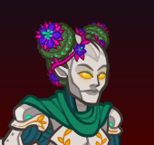ID: 190**Prime's Hope Sentry (Sentry)**
                    
                    
                        **Skin**
                        Prime's Hope Sentry
                    
                
                
                    
                        ID: 191**Tiangong Nova (Nova)**
                    
                    
                        **Skin**
                        Tiangong Nova
                    
                
                
                    
                        ID: 194**Prism Lucius (Lucius)**
                    
                    
                        **Skin**
                        Prism Lucius
                    
                
                
                    
                        ID: 5**Aerois Core**A modron core to massively buff Aerois Champions
                    
                    
                        **Modron Core**
                        Aerois Core
                    
                
                
                    
                        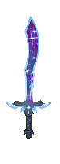ID: 112**Tiangong**All that you have done for us, we know. Thank you 
                    
                    
                        **Familiar**
                        Tiangong
                    
                
            
        
        
            
                **Start Date**
            
            
                **End Date**
            
            
                **Exclusive Date**
            
        
        
            
                14 September 2022
            
            
                23 November 2022
            
            
                23 May 2023
            
        
    
    
        
            
                <a id="s2a" onclick="exclusiveToggleContent(`s2`)">
                    [show contents]
                </a>
                **Season 2** - The Flayer Hunters
            
        
        
            
                
                    
                        ID: 1036**Judge of the Dead (Nerys)**Your existence is anathema, foul undead!<code>buff_upgrade,80,9736</code>
                    
                    
                        **Feat**
                        Judge of the Dead
                        Nerys (80% Sanctify)
                    
                
                
                    
                        ID: 1035**Second Wind (Shandie)**I could do this all day!<code>change_upgrade_data,9728</code>
                    
                    
                        **Feat**
                        Second Wind
                        Shandie (30s->10s Dash Timer)
                    
                
                
                    
                        ID: 1032**Prodigal Leader (Krydle)**You can trust me!<code>global_dps_multiplier_mult,50</code>
                    
                    
                        **Feat**
                        Prodigal Leader
                        Krydle (50% All Champion Damage)
                    
                
                
                    
                        ID: 1027**Thrill of the Hunt (Jaheira)**You won't escape me!<code>buff_upgrade,80,9710</code>
                    
                    
                        **Feat**
                        Thrill of the Hunt
                        Jaheira (80% Fierce Hunter)
                    
                
                
                    
                        ID: 1024**The Grave Rejects You (Viconia)**Hordes of undead? I don't see a problem.<code>buff_upgrade,150,9752</code>
                    
                    
                        **Feat**
                        The Grave Rejects You
                        Viconia (150% Yesterday's Undead)
                    
                
                
                    
                        ID: 239**Flayer Hunter Nerys (Nerys)**
                    
                    
                        **Skin**
                        Flayer Hunter Nerys
                    
                
                
                    
                        ID: 238**Flayer Hunter Shandie (Shandie)**
                    
                    
                        **Skin**
                        Flayer Hunter Shandie
                    
                
                
                    
                        ID: 236**Flayer Hunter Krydle (Krydle)**
                    
                    
                        **Skin**
                        Flayer Hunter Krydle
                    
                
                
                    
                        ID: 235**Flayer Hunter Jaheira (Jaheira)**
                    
                    
                        **Skin**
                        Flayer Hunter Jaheira
                    
                
                
                    
                        ID: 237**Flayer Hunter Viconia (Viconia)**
                    
                    
                        **Skin**
                        Flayer Hunter Viconia
                    
                
                
                    
                        ID: 1428**Cloak of The Blades (Krydle)**I ran with them for a while. It... didn't end well.<code>buff_upgrade,275,9629,0</code>
                    
                    
                        **Golden Epic**
                        From The Shadows
                        Krydle (Slot 3)
                    
                
                
                    
                        ID: 115**Intellect Devourer**Feeding on intellect. 
                    
                    
                        **Familiar**
                        Intellect Devourer
                    
                
            
        
        
            
                **Start Date**
            
            
                **End Date**
            
            
                **Exclusive Date**
            
        
        
            
                21 December 2022
            
            
                01 March 2023
            
            
                01 September 2023
            
        
    
    
        
            
                <a id="e1a" onclick="exclusiveToggleContent(`e1`)">
                    [show contents]
                </a>
                **Emergence 1** - Red Wizards
            
        
        
            
                
                    
                        ID: 1193**Five Questions (Hitch)**You hold 'em, I'll drop 'em!<code>buff_upgrade,80,3672</code>
                    
                    
                        **Feat**
                        Five Questions
                        Hitch (80% Ricochet)
                    
                
                
                    
                        ID: 1086**Neverwinter Diversity (Hew Maan)**Greetings, fellow humans!<code>additional_fellow_humans,3</code>
                    
                    
                        **Feat**
                        Neverwinter Diversity
                        Hew Maan (+3 to Hello, Fellow Humans)
                    
                
                
                    
                        ID: 1194**Wisened Friends (Fen)**If we put our heads together, we can overcome!<code>buff_upgrade,80,9759</code>
                    
                    
                        **Feat**
                        Wisened Friends
                        Fen (80% I've Got You, Friends)
                    
                
                
                    
                        ID: 289**Red Wizard Calliope (Calliope)**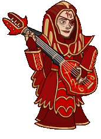
                    
                    
                        **Skin**
                        Red Wizard Calliope
                    
                
                
                    
                        ID: 288**Red Wizard Widdle (Widdle)**
                    
                    
                        **Skin**
                        Red Wizard Widdle
                    
                
                
                    
                        ID: 2889**High Sorcery Robes (Miria)**A mark of the respect and station I deserve.<code>buff_upgrade,275,10665</code>
                    
                    
                        **Golden Epic**
                        Mage of High Sorcery
                        Miria (Slot 2)
                    
                
            
        
        
            
                **Start Date**
            
            
                **End Date**
            
            
                **Exclusive Date**
            
        
        
            
                29 March 2023
            
            
                07 June 2023
            
            
                01 September 2023
            
        
    
    
        
            
                <a id="s3a" onclick="exclusiveToggleContent(`s3`)">
                    [show contents]
                </a>
                **Season 3** - Ancients and Lawbringers
            
        
        
            
                
                    
                        ID: 1164**Calm Under Pressure (Barrowin)**Clan Undurr does not back down!<code>overwhelm_start_increase,10</code>
                    
                    
                        **Feat**
                        Calm Under Pressure
                        Barrowin (+10 Overwhelm)
                    
                
                
                    
                        ID: 1171**Athlete (Birdsong)**I've been sharpening my claws for days!<code>increase_ability_score,str,1</code>
                    
                    
                        **Feat**
                        Athlete
                        Birdsong (Stat: +1 Strength)
                    
                
                
                    
                        ID: 1173**Extra Wasps (Spurt)**I call this bag the angries.<code>increase_ultimate_cooldown,30</code>
                    
                    
                        **Feat**
                        Extra Wasps
                        Spurt (+30s Ultimate Cooldown)
                    
                
                
                    
                        ID: 1182**Athlete (Turiel)**Strength of Bahamut, flow through me!<code>increase_ability_score,str,1</code>
                    
                    
                        **Feat**
                        Athlete
                        Turiel (Stat: +1 Strength)
                    
                
                
                    
                        ID: 1184**The Path Is Clear (Hew Maan)**Surprises around every corner! But not this one. I don't think. ~ Kleeb<code>time_scale_when_not_attacked,10,2</code>
                    
                    
                        **Feat**
                        The Path Is Clear
                        Hew Maan (10% Speed Not Attacked for 2s)
                    
                
                
                    
                        ID: 1163**Dwarven Tradition (Barrowin)**Undurr Ground. Get it?<code>buff_upgrade,80,10684</code>
                    
                    
                        **Feat**
                        Dwarven Tradition
                        Barrowin (80% Blessed Hammer)
                    
                
                
                    
                        ID: 1169**Harmony (Birdsong)**Just keep it going!<code>buff_upgrade,80,10776</code>
                    
                    
                        **Feat**
                        Harmony
                        Birdsong (80% Crescendo (Prestack))
                    
                
                
                    
                        ID: 1172**Kobold Brethren (Spurt)**For Glory!<code>buff_upgrade,80,10680</code>
                    
                    
                        **Feat**
                        Kobold Brethren
                        Spurt (80% Pack Tactics)
                    
                
                
                    
                        ID: 1179**Shout Above The Din (Turiel)**The time for debate is over!<code>buff_upgrades,80,10663,10664</code>
                    
                    
                        **Feat**
                        Shout Above The Din
                        Turiel (80% All Specialisations)
                    
                
                
                    
                        ID: 1183**Immolation (Hew Maan)**Kleeb prefers fire going in opposite direction! ~Kleeb<code>immolation,1,5</code>
                    
                    
                        **Feat**
                        Immolation
                        Hew Maan (1s BUD per sec for 5s)
                    
                
                
                    
                        ID: 283**Ancient Barrowin (Barrowin)**
                    
                    
                        **Skin**
                        Ancient Barrowin
                    
                
                
                    
                        ID: 284**Lawbringer Birdsong (Birdsong)**
                    
                    
                        **Skin**
                        Lawbringer Birdsong
                    
                
                
                    
                        ID: 286**Lawbringer Spurt (Spurt)**
                    
                    
                        **Skin**
                        Lawbringer Spurt
                    
                
                
                    
                        ID: 285**Ancient Turiel (Turiel)**
                    
                    
                        **Skin**
                        Ancient Turiel
                    
                
                
                    
                        ID: 287**Law Maan (Hew Maan)**
                    
                    
                        **Skin**
                        Law Maan
                    
                
                
                    
                        ID: 6**Unaffiliated Core**A modron core to massively buff Unaffiliated Champions
                    
                    
                        **Modron Core**
                        Unaffiliated Core
                    
                
                
                    
                        ID: 113**Baby Guenhwyvar**This panther from the astral plane is looking for her new best friend! 
                    
                    
                        **Familiar**
                        Baby Guenhwyvar
                    
                
            
        
        
            
                **Start Date**
            
            
                **End Date**
            
            
                **Exclusive Date**
            
        
        
            
                15 March 2023
            
            
                24 May 2023
            
            
                15 November 2023
            
        
    
    
        
            
                <a id="e2a" onclick="exclusiveToggleContent(`e2`)">
                    [show contents]
                </a>
                **Emergence 2** - Modrons
            
        
        
            
                
                    
                        ID: 1291**Entertainer (Nrakk)**Some have called my battle meditations... calming to watch.<code>increase_ability_score,cha,2</code>
                    
                    
                        **Feat**
                        Entertainer
                        Nrakk (Stat: +2 Charisma)
                    
                
                
                    
                        ID: 290**Modron Antrius (Antrius)**
                    
                    
                        **Skin**
                        Modron Antrius
                    
                
                
                    
                        ID: 307**Modron Nixie (Nixie)**
                    
                    
                        **Skin**
                        Modron Nixie
                    
                
                
                    
                        ID: 1588**The Lost Friend (Dragonbait)**Dragonbait carries a drawing of Artus Cimber.<code>global_dps_multiplier_mult,230</code>
                    
                    
                        **Golden Epic**
                        All Champion Damage
                        Dragonbait (Slot 1)
                    
                
                
                    
                        ID: 2961**Armor of Victory (Evandra)**Won this at a jousting tourney. No thanks to Dargle-bark.<code>health_mult,100</code>
                    
                    
                        **Golden Epic**
                        Health
                        Evandra (Slot 2)
                    
                
            
        
        
            
                **Start Date**
            
            
                **End Date**
            
            
                **Exclusive Date**
            
        
        
            
                24 May 2023
            
            
                01 September 2023
            
            
                29 November 2023
            
        
    
    
        
            
                <a id="s4a" onclick="exclusiveToggleContent(`s4`)">
                    [show contents]
                </a>
                **Season 4** - Legends of Mithral Hall
            
        
        
            
                
                    
                        ID: 1315**Rest Awhile (Regis)**Relax -- there can't be a battle every day.<code>add_mithral_hall_stacks,1</code>
                    
                    
                        **Feat**
                        Rest Awhile
                        Regis (+1 Mithral Hall Stacks)
                    
                
                
                    
                        ID: 1313**Weapon Swap (Catti-brie)**Aye, I know how to use a warhammer.<code>add_mithral_hall_stacks,1</code>
                    
                    
                        **Feat**
                        Weapon Swap
                        Catti-brie (+1 Mithral Hall Stacks)
                    
                
                
                    
                        ID: 1317**Imposing Build (Wulfgar)**They will think twice with me at your side.<code>add_mithral_hall_stacks,1</code>
                    
                    
                        **Feat**
                        Imposing Build
                        Wulfgar (+1 Mithral Hall Stacks)
                    
                
                
                    
                        ID: 1319**Aggressive Stance (Pwent)**Think they got the point?<code>add_mithral_hall_stacks,1</code>
                    
                    
                        **Feat**
                        Aggressive Stance
                        Pwent (+1 Mithral Hall Stacks)
                    
                
                
                    
                        ID: 1297**Battle Expertise (Artemis)**Their last thoughts will dismiss me as just a shadow.<code>buff_base_crit_chance_add,10</code>
                    
                    
                        **Feat**
                        Battle Expertise
                        Artemis (+10% Crit Chance)
                    
                
                
                    
                        ID: 1316**Advisor of the Hall (Regis)**We stick with Bruenor's plan!<code>add_mithral_hall_stacks,2</code>
                    
                    
                        **Feat**
                        Advisor of the Hall
                        Regis (+2 Mithral Hall Stacks)
                    
                
                
                    
                        ID: 1314**Speaker of the Hall (Catti-brie)**Behind you! I've got them!<code>add_mithral_hall_stacks,2</code>
                    
                    
                        **Feat**
                        Speaker of the Hall
                        Catti-brie (+2 Mithral Hall Stacks)
                    
                
                
                    
                        ID: 1318**Aegis of the Hall (Wulfgar)**To me! Make haste!<code>add_mithral_hall_stacks,2</code>
                    
                    
                        **Feat**
                        Aegis of the Hall
                        Wulfgar (+2 Mithral Hall Stacks)
                    
                
                
                    
                        ID: 1320**Vanguard of the Hall (Pwent)**Gutbusters! Are you ready?!<code>add_mithral_hall_stacks,2</code>
                    
                    
                        **Feat**
                        Vanguard of the Hall
                        Pwent (+2 Mithral Hall Stacks)
                    
                
                
                    
                        ID: 1298**Vicious Damage (Artemis)**Your life essence belongs to me now.<code>hero_dps_multiplier_mult,400 vicious_damage,10</code>
                    
                    
                        **Feat**
                        Vicious Damage
                        Artemis (400% Self DPS & Prevent Healing for 10s)
                    
                
                
                    
                        ID: 323**Mythic Regis (Regis)**
                    
                    
                        **Skin**
                        Mythic Regis
                    
                
                
                    
                        ID: 308**Mythic Catti-brie (Catti-brie)**
                    
                    
                        **Skin**
                        Mythic Catti-brie
                    
                
                
                    
                        ID: 316**Mythic Wulfgar (Wulfgar)**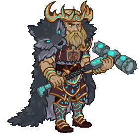
                    
                    
                        **Skin**
                        Mythic Wulfgar
                    
                
                
                    
                        ID: 314**Mythic Pwent (Pwent)**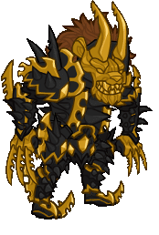
                    
                    
                        **Skin**
                        Mythic Pwent
                    
                
                
                    
                        ID: 312**Mythic Artemis (Artemis)**
                    
                    
                        **Skin**
                        Mythic Artemis
                    
                
                
                    
                        ID: 1192**Helm of Clangeddin's Wrath (Pwent)**When a dwarf enters tha bloodrage, stand clear.<code>buff_upgrade,275,11494</code>
                    
                    
                        **Golden Epic**
                        Gutbuster Recruits
                        Pwent (Slot 4)
                    
                
                
                    
                        ID: 150**Mythic Guenhwyvar**She says it looks better on her. 
                    
                    
                        **Familiar**
                        Mythic Guenhwyvar
                    
                
                
                    
                        ID: 5**Guenhwyvar's Strike**
                    
                    
                        **Click Damage Skin**
                        Guenhwyvar's Strike
                    
                
            
        
        
            
                **Start Date**
            
            
                **End Date**
            
            
                **Exclusive Date**
            
        
        
            
                21 June 2023
            
            
                30 August 2023
            
            
                14 February 2024
            
        
    
    
        
            
                <a id="e3a" onclick="exclusiveToggleContent(`e3`)">
                    [show contents]
                </a>
                **Emergence 3** - Mind Flayers
            
        
        
            
                
                    
                        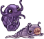ID: 1504**Illithid Tadpole (Nrakk)**They said it would be fine...<code>global_dps_multiplier_mult,25 add_global_ceremorphosis_stacks,1</code>
                    
                    
                        **Feat**
                        Illithid Tadpole
                        Nrakk (25% All Champion Damage & +1 Ceremorphosis Stack)
                    
                
                
                    
                        ID: 1424**Very Important Person (Valentine)**I had to put in an appearance.<code>buff_upgrade,80,8147</code>
                    
                    
                        **Feat**
                        Very Important Person
                        Valentine (80% Socialite)
                    
                
                
                    
                        ID: 334**Mind Flayer Jamilah (Jamilah)**
                    
                    
                        **Skin**
                        Mind Flayer Jamilah
                    
                
                
                    
                        ID: 335**Mind Flayer Nrakk (Nrakk)**
                    
                    
                        **Skin**
                        Mind Flayer Nrakk
                    
                
                
                    
                        ID: 2528**Endless Patron (Blooshi)**Whoever he is, I like the powers he gives me!<code>buff_upgrade,275,7518</code>
                    
                    
                        **Golden Epic**
                        Soul Gatherer
                        Blooshi (Slot 2)
                    
                
                
                    
                        ID: 3061**Token of Vlaakith (Lae'zel)**The engraving on the back reads: 'Vlaakith'ka sivim hrath krash'ht'<code>buff_upgrade,275,12114</code>
                    
                    
                        **Golden Epic**
                        Ceremorphosis (Prestack)
                        Lae'zel (Slot 3)
                    
                
            
        
        
            
                **Start Date**
            
            
                **End Date**
            
            
                **Exclusive Date**
            
        
        
            
                23 August 2023
            
            
                01 December 2023
            
            
                14 February 2024
            
        
    
    
        
            
                <a id="s5a" onclick="exclusiveToggleContent(`s5`)">
                    [show contents]
                </a>
                **Season 5** - Acquisitions Incorporated
            
        
        
            
                
                    
                        ID: 1444**Dead Friends (Strix)**Oh, you're alive again? That's good. I guess.<code>buff_upgrade,40,12287</code>
                    
                    
                        **Feat**
                        Dead Friends
                        Strix (40% Haunted)
                    
                
                
                    
                        ID: 1443**Yay Lathander! (Evelyn)**Give me an L! Give me an A! Give me a --<code>buff_upgrade,40,12206</code>
                    
                    
                        **Feat**
                        Yay Lathander!
                        Evelyn (40% Channel Divinity)
                    
                
                
                    
                        ID: 1228**Magic Tour Bus (Jim)**Get in, nerds -- we're doing magic.<code>buff_upgrade,40,12130</code>
                    
                    
                        **Feat**
                        Magic Tour Bus
                        Jim (40% Magical Mystery Tour)
                    
                
                
                    
                        ID: 1442**Waterdeep Investors (Omin)**Q3 adventures are looking good!<code>buff_upgrade,40,12303</code>
                    
                    
                        **Feat**
                        Waterdeep Investors
                        Omin (40% Well Funded)
                    
                
                
                    
                        ID: 1445**Sass for Days (Vi)**Honey, I can do this all day.<code>buff_upgrade,40,12315</code>
                    
                    
                        **Feat**
                        Sass for Days
                        Vi (40% I Can't Get No Sass-isfaction)
                    
                
                
                    
                        ID: 1449**Friends? (Strix)**You want to be my friend? That sounds like a lot of work...<code>buff_upgrade,80,12289,1</code>
                    
                    
                        **Feat**
                        Friends?
                        Strix (80% The Power of Friendship (and Nose Plugs))
                    
                
                
                    
                        ID: 1448**Training Montage (Evelyn)**That was great! Now let's do that 400 more times, and it will be perfect!<code>buff_upgrade,80,12209</code>
                    
                    
                        **Feat**
                        Training Montage
                        Evelyn (80% Lathander's Grace (Prestack))
                    
                
                
                    
                        ID: 1229**Official Fan Club Card (Jim)**I'm Jim Darkmagic and YOUR NAME HERE is my #1 fan!<code>buff_upgrade,80,12128,0</code>
                    
                    
                        **Feat**
                        Official Fan Club Card
                        Jim (80% Fan Club (Prestack))
                    
                
                
                    
                        ID: 1447**Motivational Keynote (Omin)**It's been proven that listening to me can make me richer.<code>buff_upgrades,80,12304,12305,12306</code>
                    
                    
                        **Feat**
                        Motivational Keynote
                        Omin (80% All Specialisations)
                    
                
                
                    
                        ID: 1450**Stand Off (Vi)**Honey, you've got to ask yourself one question...<code>buff_upgrade,100,12313,0</code>
                    
                    
                        **Feat**
                        Stand Off
                        Vi (100% Catch and Release)
                    
                
                
                    
                        ID: 340**Venture Casual Strix (Strix)**
                    
                    
                        **Skin**
                        Venture Casual Strix
                    
                
                
                    
                        ID: 339**Venture Casual Evelyn (Evelyn)**
                    
                    
                        **Skin**
                        Venture Casual Evelyn
                    
                
                
                    
                        ID: 337**Venture Casual Jim (Jim)**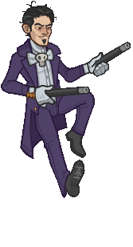
                    
                    
                        **Skin**
                        Venture Casual Jim
                    
                
                
                    
                        ID: 338**Venture Casual Omin (Omin)**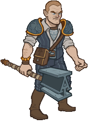
                    
                    
                        **Skin**
                        Venture Casual Omin
                    
                
                
                    
                        ID: 341**Venture Casual Vi (Vi)**
                    
                    
                        **Skin**
                        Venture Casual Vi
                    
                
                
                    
                        ID: 2216**Glamourous Neckwear (Vi)**I get this out for special occasions.<code>buff_upgrade,275,12312</code>
                    
                    
                        **Golden Epic**
                        A Good Example
                        Vi (Slot 2)
                    
                
                
                    
                        ID: 164**Clone Jim**Clone Jim winks. 
                    
                    
                        **Familiar**
                        Clone Jim
                    
                
                
                    
                        ID: 6**Golden Sparks**
                    
                    
                        **Click Damage Skin**
                        Golden Sparks
                    
                
            
        
        
            
                **Start Date**
            
            
                **End Date**
            
            
                **Exclusive Date**
            
        
        
            
                30 August 2023
            
            
                08 November 2023
            
            
                08 May 2024
            
        
    
    
        
            
                <a id="e4a" onclick="exclusiveToggleContent(`e4`)">
                    [show contents]
                </a>
                **Emergence 4** - Glitches
            
        
        
            
                
                    
                        ID: 1594**Centaur Glitch (Hitch)**I am going to go SO FAST!<code>add_hero_tags,0,centaur buff_upgrade_per_unique_race,20,390</code>
                    
                    
                        **Feat**
                        Centaur Glitch
                        Hitch (Counts as Centaur & +20% to Natural Performer per Unique Species)
                    
                
                
                    
                        ID: 1524**Gibbous Script (Warden)**The words I utter have existed since time itself.<code>buff_upgrade_add,2,13244</code>
                    
                    
                        **Feat**
                        Gibbous Script
                        Warden (+2 to Master of Hexes)
                    
                
                
                    
                        ID: 1560**Specter of Aeons (Warden)**These are spirits of time itself.<code>increase_warden_specter_max,2</code>
                    
                    
                        **Feat**
                        Specter of Aeons
                        Warden (+2 Max Spectres)
                    
                
                
                    
                        ID: 1597**Half-Elf Glitch (Sentry)**I... I can still feel a connection to The Prime Matrix.<code>add_hero_tags,0,half-elf buff_upgrade_per_any_tagged_crusader,20,8761,half-elf</code>
                    
                    
                        **Feat**
                        Half-Elf Glitch
                        Sentry (Counts as Half-Elf & +20% to Guardian of Solwynn per Half Elf)
                    
                
                
                    
                        ID: 367**Centaur Glitch Hitch (Hitch)**
                    
                    
                        **Skin**
                        Centaur Glitch Hitch
                    
                
                
                    
                        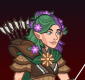ID: 368**Half-Elf Glitch Sentry (Sentry)**
                    
                    
                        **Skin**
                        Half-Elf Glitch Sentry
                    
                
                
                    
                        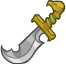ID: 1364**Scimitar of Dendar (Sisaspia)**The Night Serpent waits...<code>buff_ultimate,275</code>
                    
                    
                        **Golden Epic**
                        Ultimate Damage
                        Sisaspia (Slot 5)
                    
                
                
                    
                        ID: 3333**Lunation (Jang Sao)**All of time and space, within your imagination<code>buff_upgrades,275,13261,13262</code>
                    
                    
                        **Golden Epic**
                        All First Specialisations (Prestack)
                        Jang Sao (Slot 5)
                    
                
            
        
        
            
                **Start Date**
            
            
                **End Date**
            
            
                **Exclusive Date**
            
        
        
            
                22 November 2023
            
            
                02 February 2024
            
            
                08 May 2024
            
        
    
    
        
            
                <a id="s6a" onclick="exclusiveToggleContent(`s6`)">
                    [show contents]
                </a>
                **Season 6** - Elemental Rebirth
            
        
        
            
                
                    
                        ID: 1245**Research (Zorbu)**Not everything is learned in battle.<code>buff_upgrade,40,12989</code>
                    
                    
                        **Feat**
                        Research
                        Zorbu (40% Know Your Enemy)
                    
                
                
                    
                        ID: 1253**Chosen of Gith (Nrakk)**In Gith's name, you will meet your end.<code>buff_upgrades,40,13005,13006</code>
                    
                    
                        **Feat**
                        Chosen of Gith
                        Nrakk (40% All Specialisations)
                    
                
                
                    
                        ID: 1561**Hunter's Hex (Warden)**My hex will follow you across the planes.<code>increase_max_hex_stacks,2</code>
                    
                    
                        **Feat**
                        Hunter's Hex
                        Warden (+2 Max Hex Stacks)
                    
                
                
                    
                        ID: 1549**Actor (Korth)**You want me to pretend to have emotions?<code>increase_ability_score,cha,1</code>
                    
                    
                        **Feat**
                        Actor
                        Korth (Stat: +1 Charisma)
                    
                
                
                    
                        ID: 1222**Nimble (Sisaspia)**Sspeed is your ally.<code>increase_ability_score,dex,1</code>
                    
                    
                        **Feat**
                        Nimble
                        Sisaspia (Stat: +1 Dexterity)
                    
                
                
                    
                        ID: 1526**Wolf Pack (Zorbu)**A lone wolf is dangerous. A pack is lethal.<code>effect_def,1750</code>
                    
                    
                        **Feat**
                        Wolf Pack
                        Zorbu (Stat: +1 Dexterity & 400% Hunter's Pack)
                    
                
                
                    
                        ID: 1259**Centered (Nrakk)**There is no solution through rage.<code>buff_upgrade,80,13001</code>
                    
                    
                        **Feat**
                        Centered
                        Nrakk (80% Ki Master (Prestack))
                    
                
                
                    
                        ID: 1562**Beguiling Hex (Warden)**There is no escape from this.<code>increase_max_hex_stacks,4</code>
                    
                    
                        **Feat**
                        Beguiling Hex
                        Warden (+4 Max Hex Stacks)
                    
                
                
                    
                        ID: 1550**Iaido (Korth)**The battle will end before you even see me draw my blade.<code>effect_def,1753</code>
                    
                    
                        **Feat**
                        Iaido
                        Korth (+1 Extra Dex to Samurai Training)
                    
                
                
                    
                        ID: 1223**Fungal Colony (Sisaspia)**Growth is our only method of ssurvival.<code>increase_sisaspia_reserve_spore_max,10</code>
                    
                    
                        **Feat**
                        Fungal Colony
                        Sisaspia (+10 Max Spore Reserve)
                    
                
                
                    
                        ID: 361**Elemental Zorbu (Zorbu)**
                    
                    
                        **Skin**
                        Elemental Zorbu
                    
                
                
                    
                        ID: 358**Elemental Nrakk (Nrakk)**
                    
                    
                        **Skin**
                        Elemental Nrakk
                    
                
                
                    
                        ID: 360**Elemental Warden (Warden)**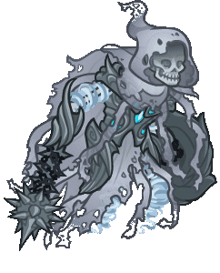
                    
                    
                        **Skin**
                        Elemental Warden
                    
                
                
                    
                        ID: 357**Elemental Korth (Korth)**
                    
                    
                        **Skin**
                        Elemental Korth
                    
                
                
                    
                        ID: 359**Elemental Sisaspia (Sisaspia)**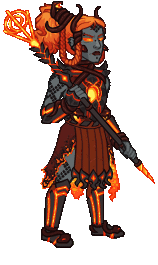
                    
                    
                        **Skin**
                        Elemental Sisaspia
                    
                
                
                    
                        ID: 556**Kensei Naginata of Illithid Slaying (Nrakk)**The force of this Naginata disrupts the Illithid's psionic field.<code>global_dps_multiplier_mult,230</code>
                    
                    
                        **Golden Epic**
                        All Champion Damage
                        Nrakk (Slot 1)
                    
                
                
                    
                        ID: 7**Dexterous Core**A modron core to massively buff Dexterous Champions
                    
                    
                        **Modron Core**
                        Dexterous Core
                    
                
                
                    
                        ID: 181**Bash the Earth Elemental**I JUST GOTTA BASH IT! 
                    
                    
                        **Familiar**
                        Bash the Earth Elemental
                    
                
            
        
        
            
                **Start Date**
            
            
                **End Date**
            
            
                **Exclusive Date**
            
        
        
            
                08 November 2023
            
            
                03 January 2024
            
            
                05 June 2024
            
        
    
    
        
            
                <a id="e5a" onclick="exclusiveToggleContent(`e5`)">
                    [show contents]
                </a>
                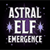**Emergence 5** - Astral Elves
            
        
        
            
                
                    
                        ID: 1616**Fields of Green (D'hani)**I think we need a bit more mossy colors.<code>buff_upgrade,80,13714,0</code>
                    
                    
                        **Feat**
                        Fields of Green
                        D'hani (80% Chance to Apply Stroke of Green)
                    
                
                
                    
                        ID: 1665**Prodigal Leader (Gazrick)**Well, isn't that a kind thing to say!<code>global_dps_multiplier_mult,50</code>
                    
                    
                        **Feat**
                        Prodigal Leader
                        Gazrick (50% All Champion Damage)
                    
                
                
                    
                        ID: 1109**Caged Dreams (Miria)**Their power flows through me.<code>buff_upgrade,80,10666</code>
                    
                    
                        **Feat**
                        Caged Dreams
                        Miria (80% Soul Cage)
                    
                
                
                    
                        ID: 1666**Fiery Tempest (Karlach)**Oh... You're going to regret that!<code>buff_upgrade,80,13721</code>
                    
                    
                        **Feat**
                        Fiery Tempest
                        Karlach (80% The Fury of Avernus)
                    
                
                
                    
                        ID: 372**Spelljammer Pilot Strix (Strix)**
                    
                    
                        **Skin**
                        Spelljammer Pilot Strix
                    
                
                
                    
                        ID: 373**Spelljammer Pilot Miria (Miria)**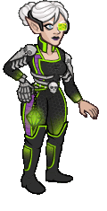
                    
                    
                        **Skin**
                        Spelljammer Pilot Miria
                    
                
                
                    
                        ID: 2757**Thrilling Memoirs (Virgil)**All our adventures together are contained in this book. Well...most of them.<code>buff_upgrade,100,9605</code>
                    
                    
                        **Golden Epic**
                        Rapid Fire
                        Virgil (Slot 5)
                    
                
                
                    
                        ID: 3393**Helldusk Armour (Karlach)**I CAN FLY NOW?!<code>health_mult,100</code>
                    
                    
                        **Golden Epic**
                        Health
                        Karlach (Slot 2)
                    
                
            
        
        
            
                **Start Date**
            
            
                **End Date**
            
            
                **Exclusive Date**
            
        
        
            
                24 January 2024
            
            
                08 March 2024
            
            
                05 June 2024
            
        
    
    
        
            
                <a id="s7a" onclick="exclusiveToggleContent(`s7`)">
                    [show contents]
                </a>
                **Season 7** - The Rivals
            
        
        
            
                
                    
                        ID: 1433**Puzzling Answers (Shaka)**The answer you get may not be the answer you need.<code>buff_upgrade,40,13419</code>
                    
                    
                        **Feat**
                        Puzzling Answers
                        Shaka (40% Riddling Rivals (Prestack))
                    
                
                
                    
                        ID: 1653**Fresh Palette (D'hani)**A refreshed fighter is a strong fighter.<code>buff_upgrades,40,13717,13718,13719</code>
                    
                    
                        **Feat**
                        Fresh Palette
                        D'hani (40% All Specialisations)
                    
                
                
                    
                        ID: 1649**Darting Weapon (Kent)**Have at thee!<code>reduce_attack_cooldown,0.5</code>
                    
                    
                        **Feat**
                        Darting Weapon
                        Kent (-0.5s Base Attack Cooldown)
                    
                
                
                    
                        ID: 1650**Form Up! (Virgil)**Kent, please don't say 'Roll Out' - no one knows what that means.<code>global_dps_multiplier_mult,20</code>
                    
                    
                        **Feat**
                        Form Up!
                        Virgil (20% All Champion Damage per Rivals of Waterdeep Champion (Additive))
                    
                
                
                    
                        ID: 1635**Riddles Within Riddles (Shaka)**There is far more to this than you might think.<code>buff_upgrade,80,13419</code>
                    
                    
                        **Feat**
                        Riddles Within Riddles
                        Shaka (80% Riddling Rivals (Prestack))
                    
                
                
                    
                        ID: 1434**Champion of Tyr (Selise)**Tyr, give me strength!<code>buff_ultimate,100 disallow_roaming_familiar_ult_trigger</code>
                    
                    
                        **Feat**
                        Champion of Tyr
                        Selise (100% Ultimate Damage & Blocks Roaming Ultimate Bar Familiars)
                    
                
                
                    
                        ID: 1648**Taunt (Selise)**I've killed Death. You're nothing compared to that.<code>hero_dps_multiplier_mult,400 taunt,50</code>
                    
                    
                        **Feat**
                        Taunt
                        Selise (400% Self DPS & 50% Taunt)
                    
                
                
                    
                        ID: 1654**Color Theory (D'hani)**Fighting is like mixing paint. You need to know what works for a situation.<code>buff_upgrades,80,13717,13718,13719</code>
                    
                    
                        **Feat**
                        Color Theory
                        D'hani (80% All Specialisations)
                    
                
                
                    
                        ID: 1651**Vicious Damage (Kent)**Now you're in for it!<code>hero_dps_multiplier_mult,400 vicious_damage,10</code>
                    
                    
                        **Feat**
                        Vicious Damage
                        Kent (400% Self DPS & Prevent Healing for 10s)
                    
                
                
                    
                        ID: 1652**It's time! (Virgil)**Why would I say 'morphing' in the middle of that, Kent? That doesn't make sense.<code>global_dps_multiplier_mult,40</code>
                    
                    
                        **Feat**
                        It's time!
                        Virgil (40% All Champion Damage per Rivals of Waterdeep Champion (Additive))
                    
                
                
                    
                        ID: 383**Waterdhavian Shaka (Shaka)**
                    
                    
                        **Skin**
                        Waterdhavian Shaka
                    
                
                
                    
                        ID: 384**Waterdhavian Selise (Selise)**
                    
                    
                        **Skin**
                        Waterdhavian Selise
                    
                
                
                    
                        ID: 385**Waterdhavian D'hani (D'hani)**
                    
                    
                        **Skin**
                        Waterdhavian D'hani
                    
                
                
                    
                        ID: 386**Waterdhavian Kent (Kent)**
                    
                    
                        **Skin**
                        Waterdhavian Kent
                    
                
                
                    
                        ID: 387**Waterdhavian Virgil (Virgil)**
                    
                    
                        **Skin**
                        Waterdhavian Virgil
                    
                
                
                    
                        ID: 1892**Locket of the Rivals (Shaka)**It holds an image of my family.<code>buff_upgrade,275,13418</code>
                    
                    
                        **Golden Epic**
                        Feast or Famine (Prestack)
                        Shaka (Slot 5)
                    
                
                
                    
                        ID: 171**The Hawk Man**A miniature form of one of the eight walking statues of Waterdeep! 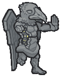
                    
                    
                        **Familiar**
                        The Hawk Man
                    
                
                
                    
                        ID: 7**Rivals Attack**
                    
                    
                        **Click Damage Skin**
                        Rivals Attack
                    
                
            
        
        
            
                **Start Date**
            
            
                **End Date**
            
            
                **Exclusive Date**
            
        
        
            
                03 January 2024
            
            
                28 February 2024
            
            
                28 August 2024
            
        
    
    
        
            
                <a id="e6a" onclick="exclusiveToggleContent(`e6`)">
                    [show contents]
                </a>
                **Emergence 6** - Illithids
            
        
        
            
                
                    
                        ID: 1714**Illithid Tadpole (Minsc)**This smells of EVIL! But I trust you. I just put it in my eye?<code>global_dps_multiplier_mult,25 add_global_ceremorphosis_stacks,1</code>
                    
                    
                        **Feat**
                        Illithid Tadpole
                        Minsc (25% All Champion Damage & +1 Ceremorphosis Stack)
                    
                
                
                    
                        ID: 1713**Prodigal Leader (Solaak)**Trust me, we've got this.<code>global_dps_multiplier_mult,50</code>
                    
                    
                        **Feat**
                        Prodigal Leader
                        Solaak (50% All Champion Damage)
                    
                
                
                    
                        ID: 1689**Tenacious (Presto)**I won't give up! No matter what Venger throws at us!<code>increase_ability_score,con,2</code>
                    
                    
                        **Feat**
                        Tenacious
                        Presto (Stat: +2 Constitution)
                    
                
                
                    
                        ID: 1712**Illithid Tadpole (Dynaheir)**You want me to put what in my brain?<code>global_dps_multiplier_mult,25 add_global_ceremorphosis_stacks,1</code>
                    
                    
                        **Feat**
                        Illithid Tadpole
                        Dynaheir (25% All Champion Damage & +1 Ceremorphosis Stack)
                    
                
                
                    
                        ID: 423**Mind Flayer Celeste (Celeste)**
                    
                    
                        **Skin**
                        Mind Flayer Celeste
                    
                
                
                    
                        ID: 424**Mind Flayer Dynaheir (Dynaheir)**
                    
                    
                        **Skin**
                        Mind Flayer Dynaheir
                    
                
                
                    
                        ID: 2476**Ornamental Weaponry (NERDS)**Fighters are masters of weaponry and martial skill.<code>buff_upgrade,275,6139</code>
                    
                    
                        **Golden Epic**
                        Fighter
                        NERDS (Slot 1)
                    
                
                
                    
                        ID: 3453**Old Empires Fire Wine (Dynaheir)**The decanter is for Minsc. The glass is all I require.<code>buff_upgrades,100,13879,13880,13881</code>
                    
                    
                        **Golden Epic**
                        All Specialisations (Prestack)
                        Dynaheir (Slot 5)
                    
                
            
        
        
            
                **Start Date**
            
            
                **End Date**
            
            
                **Exclusive Date**
            
        
        
            
                28 February 2024
            
            
                31 May 2024
            
            
                28 August 2024
            
        
    
    
        
            
                <a id="e7a" onclick="exclusiveToggleContent(`e7`)">
                    [show contents]
                </a>
                **Emergence 7** - Vecna Cultists
            
        
        
            
                
                    
                        ID: 1304**Courage in Battle (Drizzt)**Hope is the ally of all courageous people.<code>add_mithral_hall_stacks,1</code>
                    
                    
                        **Feat**
                        Courage in Battle
                        Drizzt (+1 Mithral Hall Stacks)
                    
                
                
                    
                        ID: 1471**Quick Friends (Evelyn)**Did you heal me? OH! Yay! We're best friends now!<code>buff_upgrade,80,12208</code>
                    
                    
                        **Feat**
                        Quick Friends
                        Evelyn (80% Conduit of the Light)
                    
                
                
                    
                        ID: 1797**Heavily Armored (Krydle)**You want me to hide in this?! Do you have a barn?<code>health_mult,60</code>
                    
                    
                        **Feat**
                        Heavily Armored
                        Krydle (60% Health)
                    
                
                
                    
                        ID: 1775**Scholar (Diana)**I've got a 4.0 GPA.<code>increase_ability_score,int,2</code>
                    
                    
                        **Feat**
                        Scholar
                        Diana (Stat: +2 Intelligence)
                    
                
                
                    
                        ID: 430**Pirate Azaka (Azaka)**
                    
                    
                        **Skin**
                        Pirate Azaka
                    
                
                
                    
                        ID: 431**Pirate Diana (Diana)**
                    
                    
                        **Skin**
                        Pirate Diana
                    
                
                
                    
                        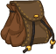ID: 708**Magical Coin Pack (Azaka)**It always has more room!<code>buff_upgrade,275,1233</code>
                    
                    
                        **Golden Epic**
                        Guiding Hand
                        Azaka (Slot 3)
                    
                
                
                    
                        ID: 3525**Weavebound Staff (Diana)**Dungeon Master told me the Weave itself flows through this...<code>buff_ultimate,275</code>
                    
                    
                        **Golden Epic**
                        Ultimate Damage
                        Diana (Slot 5)
                    
                
            
        
        
            
                **Start Date**
            
            
                **End Date**
            
            
                **Exclusive Date**
            
        
        
            
                22 May 2024
            
            
                02 August 2024
            
            
                30 October 2024
            
        
    

[Back to Top](#top)

*Last Modified: {{ site.time }}*