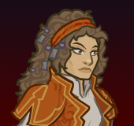
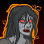

[Back to Main](index.md)

    
        Portait
    

# Ezmerelda

Ezmerelda d'Avenir, a Vistana monster hunter, has devoted herself to ridding the world of evil in all of its forms. After years of tutelage by her mentor, the vampire hunter Rudolph van Richten, Ezmerelda struck out on her own. She has since amassed a sizable personal fortune and an impressive arsenal of weapons for hunting monsters. Following the defeat of Strahd von Zarovich, Ezmerelda joins the Champions on their journeys through the world of Toril.

# Changes

Ezmerelda is potentially a reworked champion in the Dragondown event on 5 June 2024.

Only abilities that have seen some changes will be displayed here - and be aware that there's a lot of guesswork involved. Some abilities may not have names - some may have the *wrong* names - or specialisations might not be marked as such - etc.. Focus on the effect data itself.

Please do me a favour and don't get all melodramatic about what you find here. I - and CNE - don't appreciate it. These are spoilers and will almost certainly change before release - likely multiple times. That and we don't have access to any upgrade data prior to release. Making assumptions on how the champions will turn out based on this information would be premature.

# Abilities

**Ultimate: My Signal** (Guess)
> Ezmerelda causes the enemy with the highest health, greatly debuffing them. The debuff gets stronger with each debuff applied in the current area.

<em>Raw Data</em>

<pre>
{
    "id": 759,
    "name": "My Signal",
    "description": "Ezmerelda causes the enemy with the highest health, greatly debuffing them.",
    "long_description": "Ezmerelda causes the enemy with the highest health, greatly debuffing them. The debuff gets stronger with each debuff applied in the current area.",
    "graphic_id": 8878,
    "target": "highest_health",
    "num_targets": 1,
    "aoe_radius": 0,
    "damage_modifier": 0.03,
    "cooldown": 320,
    "animations": [
        {
            "type": "ezmerelda_ultimate",
            "projectile": "ezmerelda_dagger",
            "projectile_details": {
                "effect_id": 1984,
                "debuff_time": 10
            },
            "shoot_frame": 39,
            "shoot_offset_x": 115,
            "shoot_offset_y": -35
        }
    ],
    "tags": [
        "ranged",
        "ultimate"
    ],
    "damage_types": [
        "ranged"
    ]
}
</pre>

**Training Montage** (Guess)
> Ezmerelda marks enemies that she attacks, training other Champions to spot their vulnerable points. Marked enemies take 100% more damage from all Champions for each Debuff Champion in the formation, stacking multiplicatively.

<em>Raw Data</em>

<pre>
{
    "id": 1976,
    "flavour_text": "",
    "description": {
        "desc": "Ezmerelda marks enemies that she attacks, training other Champions to spot their vulnerable points. Marked enemies take $amount% more damage from all Champions for each Debuff Champion in the formation, stacking multiplicatively."
    },
    "effect_keys": [
        {
            "off_when_benched": true,
            "effect_string": "pre_stack_amount,100"
        },
        {
            "off_when_benched": true,
            "effect_string": "ezmerelda_training_montage_v2,0",
            "debuff_before_damage": true,
            "amount_expr": "upgrade_amount(15037,0)",
            "debuffing_attack_ids": [
                330
            ],
            "debuff_effects": [
                {
                    "effect_string": "training_montage_increase_monster_damage,0",
                    "amount_expr": "upgrade_amount(15037,1)",
                    "amount_func": "ezmerelda_training_montage",
                    "active_graphic_id": 8893,
                    "active_graphic_x": 0,
                    "active_graphic_y": -60
                }
            ],
            "show_bonus": true,
            "stack_func": "per_hero_attribute",
            "per_hero_expr": "HasTag(`debuff`)",
            "amount_func": "mult",
            "amount_updated_listeners": [
                "slot_changed"
            ]
        }
    ],
    "requirements": "",
    "graphic_id": 8880,
    "large_graphic_id": 8879,
    "properties": {
        "is_formation_ability": true,
        "owner_use_outgoing_description": true,
        "indexed_effect_properties": true,
        "per_effect_index_bonuses": true,
        "default_bonus_index": 1
    }
}
</pre>

**Preparation** (Guess)
> Every time a debuff is applied to an enemy, the effect of Training Montage is increased by 20%, stacking multiplicatively, up to 100 times and resetting when changing areas.

<em>Raw Data</em>

<pre>
{
    "id": 1977,
    "flavour_text": "",
    "description": {
        "desc": "Every time a debuff is applied to an enemy, the effect of Training Montage is increased by $amount%, stacking multiplicatively, up to $max_stacks times and resetting when changing areas."
    },
    "effect_keys": [
        {
            "off_when_benched": true,
            "effect_string": "buff_upgrade,20,15037",
            "show_bonus": true,
            "stack_func": "mult",
            "stacks_multiply": true,
            "stacks_on_trigger": "debuff_applied",
            "more_triggers": [
                {
                    "trigger": "area_changed",
                    "action": {
                        "type": "reset"
                    }
                }
            ],
            "max_stacks": 100
        }
    ],
    "requirements": "",
    "graphic_id": 23676,
    "large_graphic_id": 23674,
    "properties": {
        "is_formation_ability": true
    }
}
</pre>

**Threat Tracking** (Guess)
> Undead are Ezmerelda's favored foes. Ezmerelda tracks the favored foes that any Champion kills while she is in the formation, increasing the base effect of Training Montage by $amount% for each favored foe killed (additively then multiplicatively). These stacks persist for the entire adventure, resetting when you complete it. Caps at 1000000 favored foe kills.

<em>Raw Data</em>

<pre>
{
    "id": 1978,
    "flavour_text": "",
    "description": {
        "desc": "Undead are Ezmerelda's favored foes. Ezmerelda tracks the favored foes that any Champion kills while she is in the formation, increasing the base effect of Training Montage by $amount% for each favored foe killed (additively then multiplicatively). These stacks persist for the entire adventure, resetting when you complete it. Caps at $max_stacks favored foe kills."
    },
    "effect_keys": [
        {
            "off_when_benched": true,
            "effect_string": "favored_foe,undead"
        },
        {
            "off_when_benched": true,
            "effect_string": "buff_upgrade,0.025,15037,0",
            "show_bonus": true,
            "stack_func": "add",
            "stacks_on_trigger": {
                "trigger": "favored_foe_killed",
                "is_source_favored_foe": true,
                "action": {
                    "type": "add_stack"
                }
            },
            "max_stacks": 1000000
        },
        {
            "off_when_benched": true,
            "effect_string": "stacks_data_binder_safe,1,ezmerelda_threat_tracking_stacks",
            "is_instanced_stat": true,
            "use_stat_defs": true
        }
    ],
    "requirements": "",
    "graphic_id": 8882,
    "large_graphic_id": 8881,
    "properties": {
        "is_formation_ability": true,
        "owner_use_outgoing_description": true
    }
}
</pre>

**Enemies in the Mist** (Guess)
> While Ezmerelda is in the formation, 0-2 "Mist" enemies can spawn with each wave. When a "Mist" enemy is defeated, an enemy whose type matches one of Ezmerelda's favored foe appears from the mist, and all nearby enemies gain the Training Montage debuff.

<em>Raw Data</em>

<pre>
{
    "id": 1979,
    "flavour_text": "",
    "description": {
        "desc": "While Ezmerelda is in the formation, 0-2 \"Mist\" enemies can spawn with each wave. When a \"Mist\" enemy is defeated, an enemy whose type matches one of Ezmerelda's favored foe appears from the mist, and all nearby enemies gain the Training Montage debuff."
    },
    "effect_keys": [
        {
            "off_when_benched": true,
            "effect_string": "spawn_additional_monsters,100",
            "monster_id": 2172,
            "spawn_count_range": [
                0,
                2
            ]
        },
        {
            "off_when_benched": true,
            "effect_string": "ezmerelda_enemies_in_the_mist",
            "mist_monster_id": 2172,
            "foe_monsters": {
                "undead": [
                    2173,
                    2174,
                    2175
                ],
                "fiend": [
                    36,
                    37,
                    38
                ],
                "humanoid": [
                    176,
                    177,
                    178
                ],
                "monstrosity": [
                    125,
                    126,
                    127
                ]
            },
            "debuff_area_radius": 100
        }
    ],
    "requirements": "",
    "graphic_id": 23675,
    "large_graphic_id": 23673,
    "properties": {
        "is_formation_ability": true,
        "owner_use_outgoing_description": true
    }
}
</pre>

**Unknown** (Guess)
> All champions deal 100% more damage against enemies with armor-based health, increasing their chance of breaking an armor piece. Additionally, if a hits-based or armor-based enemy is affected by Training Montage, successful hits against them remove an additional hit or armor piece.

<em>Raw Data</em>

<pre>
{
    "id": 1980,
    "flavour_text": "",
    "description": {
        "desc": "All champions deal $amount% more damage against enemies with armor-based health, increasing their chance of breaking an armor piece. Additionally, if a hits-based or armor-based enemy is affected by Training Montage, successful hits against them remove an additional hit or armor piece."
    },
    "effect_keys": [
        {
            "off_when_benched": true,
            "effect_string": "monster_with_tag_more_damage,100,armor_based"
        },
        {
            "off_when_benched": true,
            "effect_string": "increase_damage_against_monster_armor,1",
            "monster_has_effect_key": "training_montage_increase_monster_damage",
            "targets": [
                "all"
            ]
        },
        {
            "off_when_benched": true,
            "effect_string": "increase_damage_against_monster_hits,1",
            "monster_has_effect_key": "training_montage_increase_monster_damage",
            "targets": [
                "all"
            ]
        }
    ],
    "requirements": "",
    "graphic_id": 0,
    "large_graphic_id": 0,
    "properties": {
        "is_formation_ability": true,
        "owner_use_outgoing_description": true,
        "show_incoming": false,
        "indexed_effect_properties": true,
        "per_effect_index_bonuses": true,
        "default_bonus_index": 0
    }
}
</pre>

**Unknown** (Guess)
> The effect of Training Montage is increased by 400% on enemies who are one of Ezmerelda's favored foes, and Threat Tracking counts each favored foe killed twice.

<em>Raw Data</em>

<pre>
{
    "id": 1981,
    "flavour_text": "",
    "description": {
        "desc": "The effect of Training Montage is increased by $amount% on enemies who are one of Ezmerelda's favored foes, and Threat Tracking counts each favored foe killed twice."
    },
    "effect_keys": [
        {
            "off_when_benched": true,
            "effect_string": "just_an_amount,400"
        },
        {
            "off_when_benched": true,
            "effect_string": "buff_upgrade_effect_stacks_trigger_add,1,15039,1"
        }
    ],
    "requirements": "",
    "graphic_id": 0,
    "large_graphic_id": 0,
    "properties": {
        "is_formation_ability": true,
        "owner_use_outgoing_description": true,
        "indexed_effect_properties": true,
        "per_effect_index_bonuses": true,
        "default_bonus_index": 0
    }
}
</pre>

**The Devil You Know** (Guess)
> Increases the effect of Training Montage by 100%, or by 200% if the current adventure is a Strahd patron variant.

<em>Raw Data</em>

<pre>
{
    "id": 1982,
    "flavour_text": "",
    "description": {
        "desc": {
            "conditions": [
                {
                    "condition": "ezmerelda_strahd_boss_buff_active",
                    "desc": "Increases the effect of Training Montage by $(amount___4)%, or by $(amount___5)% if the current adventure is a Strahd patron variant."
                },
                {
                    "desc": "Increases the effect of Training Montage by $(amount___2)%, or by $(amount___3)% if the current adventure is a Strahd patron variant."
                }
            ]
        }
    },
    "effect_keys": [
        {
            "off_when_benched": true,
            "effect_string": "ezmerelda_the_devil_you_know",
            "strahd_monster_ids": [
                826,
                935,
                936,
                937,
                938,
                956,
                957,
                1885
            ]
        },
        {
            "off_when_benched": true,
            "apply_manually": true,
            "effect_string": "buff_upgrade,100,15037"
        },
        {
            "off_when_benched": true,
            "apply_manually": true,
            "effect_string": "buff_upgrade,200,15037"
        },
        {
            "off_when_benched": true,
            "apply_manually": true,
            "effect_string": "buff_upgrade,100000,15037"
        },
        {
            "off_when_benched": true,
            "apply_manually": true,
            "effect_string": "buff_upgrade,200000,15037"
        }
    ],
    "requirements": "",
    "graphic_id": 0,
    "large_graphic_id": 0,
    "properties": {
        "is_formation_ability": true,
        "owner_use_outgoing_description": true,
        "indexed_effect_properties": true
    }
}
</pre>

**Specialisation: Unknown** (Guess)
> Monstrosities become one of Ezmerelda's Favored Foes.

<em>Raw Data</em>

<pre>
{
    "id": 1985,
    "flavour_text": "",
    "description": {
        "desc": "Monstrosities become one of Ezmerelda's Favored Foes."
    },
    "effect_keys": [
        {
            "off_when_benched": true,
            "effect_string": "favored_foe,monstrosity"
        }
    ],
    "requirements": "",
    "graphic_id": 0,
    "large_graphic_id": 0,
    "properties": {
        "is_formation_ability": false
    }
}
</pre>

**Specialisation: Unknown** (Guess)
> Fiends become one of Ezmerelda's Favored Foes.

<em>Raw Data</em>

<pre>
{
    "id": 1986,
    "flavour_text": "",
    "description": {
        "desc": "Fiends become one of Ezmerelda's Favored Foes."
    },
    "effect_keys": [
        {
            "off_when_benched": true,
            "effect_string": "favored_foe,fiend"
        }
    ],
    "requirements": "",
    "graphic_id": 0,
    "large_graphic_id": 0,
    "properties": {
        "is_formation_ability": false
    }
}
</pre>

**Specialisation: Unknown** (Guess)
> Humanoids become one of Ezmerelda's Favored Foes.

<em>Raw Data</em>

<pre>
{
    "id": 1987,
    "flavour_text": "",
    "description": {
        "desc": "Humanoids become one of Ezmerelda's Favored Foes."
    },
    "effect_keys": [
        {
            "off_when_benched": true,
            "effect_string": "favored_foe,humanoid"
        }
    ],
    "requirements": "",
    "graphic_id": 0,
    "large_graphic_id": 0,
    "properties": {
        "is_formation_ability": false
    }
}
</pre>

# Adventures and Variants

 **Unlock Adventure: The Trickster's Delight (Ezmerelda)** (Complete Area 50)
> Chase down a masked man who has performed a daring heist.

 **Variant 1: The Devil's Scourge** (Complete Area 75)
> Strahd von Zarovich sent his Zombies to follow Ezmerelda from Barovia. Strahd Zombies appear in each wave. These Zombies deal 100% additional damage, do not drop gold, and do not count towards quest progress.

 **Variant 2: The Devil Knocks** (Complete Area 125)
> The mists of Ravenloft encroach upon us, making it harder for the Champions to see. Enemies move 100% faster and drop 99% less gold.

 **Variant 3: The Devil You Know** (Complete Area 175)
> Ezmerelda starts in the formation and can't move. Only Champions in Ezmerelda's column can deal damage. All other Champions have their DPS disabled, but their formation abilities are active. Vampire Spawn appear in each wave. They deal 100% additional damage. They do not drop gold, nor do they count towards quest progress. This adventure has unique dialogue.

# Formation

    <svg xmlns="http://www.w3.org/2000/svg" id="Ezmerelda" fill="#aaa" data-formationName="Ezmerelda" data-campaignName="Liar's Night" width="335" height="160"><circle cx="175" cy="45" r="15"/><circle cx="175" cy="125" r="15"/><circle cx="135" cy="25" r="15"/><circle cx="135" cy="65" r="15"/><circle cx="135" cy="105" r="15"/><circle cx="135" cy="145" r="15"/><circle cx="95" cy="85" r="15"/><circle cx="55" cy="25" r="15"/><circle cx="55" cy="65" r="15"/><circle cx="15" cy="85" r="15"/><text x="205" y="25" fill="#dcdcdc" font-size="25" font-family="Arial" font-weight="bold">Ezmerelda</text><text x="205" y="65" fill="#dcdcdc" font-size="15" font-family="Arial" font-weight="bold">Liar's Night</text></svg>

[Back to Top](#top)

*Last Modified: {{ site.time }}*