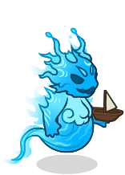
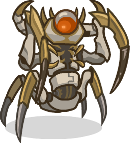
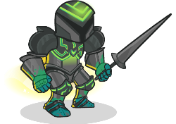
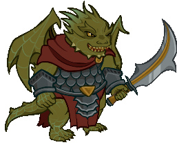

[Back to Main](index.md)

# Familiars

Upcoming familiars that are found in future premiums or simply listed as unavailable at the moment.

    
        
            ID: 309**Splash the Water Elemental**The consummate puddle jumper.
        
        
            Splash the Water Elemental
        
        
            Splash the Water Elemental Familiar Pack
        
        
            1,680p
        
        
            25 Feb 2026
        
    
    
        
            ID: 310**Caramon the Rabbit**Dear, good, steadfast, boring Caramon.
        
        
            Caramon the Rabbit
        
        
            Raistlin, Master of Past and Present Theme Pack
        
        
            3,830p
        
        
            04 Mar 2026
        
    
    
        
            ID: 311**Dragon Orb of Istar**Each Orb of Dragonkind contains the essence of an evil dragon, who resents any attempt to coax magic from it.
        
        
            Dragon Orb of Istar
        
        
            Dragon Orb of Istar Familiar Pack
        
        
            840p
        
        
            04 Mar 2026
        
    
    
        
            ID: 312**Drone of Dooooom**Bards can't share their stories all alone…
        
        
            Drone of Dooooom
        
        
            Bard of the Dragon Queen Deekin Theme Pack
        
        
            3,830p
        
        
            11 Mar 2026
        
    
    
        
            ID: 314**Seeker the Star Angler**Just watch out when her teeth grow in!
        
        
            Seeker the Star Angler
        
        
            Seeker the Star Angler Familiar Pack
        
        
            2,380p
        
        
            25 Mar 2026
        
    
    
        
            ID: 315**Animated Armor of Collaboration**Forged from many disciplines and powered by a shared goal, this living armor stands as proof that games and communities are built better together.
        
        
            Animated Armor of Collaboration
        
        
            Animated Armor of Collaboration Familiar Pack
        
        
            0p
        
        
            27 Mar 2026
        
    
    
        
            ID: 313**Rocky the Baaz Draconian**Even the smallest draconian is not one to underestimate!
        
        
            Rocky the Baaz Draconian
        
        
            None
        
        
            ???
        
        
            ???
        
    

[Back to Top](#top)

*Last Modified: {{ site.time }}*