[Back to Main](index.md)

# Familiars

Upcoming familiars that are found in future premiums or simply listed as unavailable at the moment.

    
        
            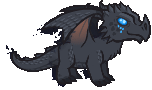ID: 287**Umbra the Shadow Dragon**Beware her dark breath weapon - you will rise in her service after death.
        
        
            Umbra the Shadow Dragon
        
        
            Avatar of Mask Familiar Pack
        
        
            1,680p
        
        
            22 Oct 2025
        
    
    
        
            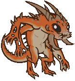ID: 288**Form of the Slayer**A form for Bhaal's chosen…
        
        
            Form of the Slayer
        
        
            Dark Urge Slayer Familiar & Feat Pack
        
        
            1,680p
        
        
            29 Oct 2025
        
    
    
        
            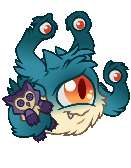ID: 290**Snug the Spectator**Surprisingly snuggly for a Spectator.
        
        
            Snug the Spectator
        
        
            Snug the Spectator Familiar Pack
        
        
            0p
        
        
            03 Nov 2025
        
    
    
        
            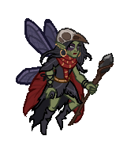ID: 291**Spite the Sprite**A sprite as spiteful as their master is frightful.
        
        
            Spite the Sprite
        
        
            Action Figure Skylla Theme Pack
        
        
            3,830p
        
        
            05 Nov 2025
        
    
    
        
            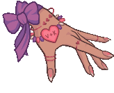ID: 292**Lefty the Crawling Claw**Undeath wrecks your cuticles--you have to stay on top of that.
        
        
            Lefty the Crawling Claw
        
        
            Twice Cursed Havilar Theme Pack
        
        
            3,830p
        
        
            12 Nov 2025
        
    
    
        
            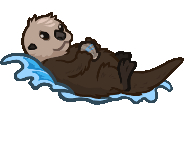ID: 293**Shellby The Sea Otter**Longtime ally of Gromma - easily distracted by pretty things.
        
        
            Shellby The Sea Otter
        
        
            Gromma's Sea Otter Guide Familiar & Feat Pack
        
        
            1,680p
        
        
            19 Nov 2025
        
    
    
        
            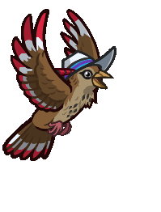ID: 294**Lerk the Lark**No idea where he got that hat from, but he has good taste!
        
        
            Lerk the Lark
        
        
            Cozy Lark Theme Pack
        
        
            3,830p
        
        
            03 Dec 2025
        
    
    
        
            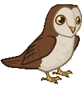ID: 295**Owlsworth the Snowy Owl**Most fear Owlsworth. One didn’t. He doesn't come back now.
        
        
            Owlsworth the Snowy Owl
        
        
            Owlsworth the Snowy Owl Familiar Pack
        
        
            1,680p
        
        
            03 Dec 2025
        
    
    
        
            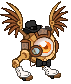ID: 296**Cog the Clockwork Modron**Craftsmanship even Primus would be impressed by.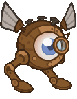
        
        
            Cog the Clockwork Modron
        
        
            Cozy Nordom Theme Pack
        
        
            3,830p
        
        
            10 Dec 2025
        
    
    
        
            ID: 297**Hug the Rug of Smothering**Full-bodied snuggles, whether you want them or not.
        
        
            Hug the Rug of Smothering
        
        
            Hug the Rug of Smothering Familiar Pack
        
        
            2,380p
        
        
            10 Dec 2025
        
    
    
        
            ID: 298**Fixer the Automaton**Quicker she says. Always quicker!
        
        
            Fixer the Automaton
        
        
            Fixer the Automaton Familiar & Lazaapz Feat Pack
        
        
            1,680p
        
        
            30 Dec 2025
        
    
    
        
            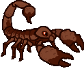ID: 299**Sting the Scorpion**It's all fun and games till Sting skitters out!
        
        
            Sting the Scorpion
        
        
            None
        
        
            ???
        
        
            ???
        
    

[Back to Top](#top)

*Last Modified: {{ site.time }}*