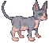
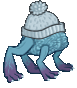
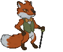
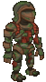
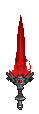
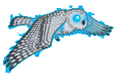

[Back to Main](index.md)

# Familiars

Upcoming familiars that are found in future premiums or simply listed as unavailable at the moment.

    
        
            ID: 210**Snuggles the Sphynx Cat**Snuggles the Sphynx Cat
        
        
            None
        
        
            ???
        
        
            ???
        
    
    
        
            ID: 187**Winter Intellect Devourer**Winter Intellect Devourer
        
        
            None
        
        
            ???
        
        
            ???
        
    
    
        
            ID: 220**Fritz the Red Fox**Fritz the Red Fox
        
        
            Fritz the Red Fox Familiar Pack
        
        
            $11.99
        
        
            16 Sept 2024
        
    
    
        
            ID: 221**Warforged Colossus**Warforged Colossus
        
        
            Warforged Colossus Familiar Pack
        
        
            $16.99
        
        
            25 Sept 2024
        
    
    
        
            ID: 223**Bloodsword**Bloodsword
        
        
            Darklord Kas Theme Pack
        
        
            $27.99
        
        
            02 Oct 2024
        
    
    
        
            ID: 222**Glimmer the Ghost Owl**Glimmer the Ghost Owl
        
        
            Vampire Hunter Voronika Theme Pack
        
        
            $27.99
        
        
            02 Oct 2024
        
    
    
        
            ID: 226**Mirror Shade**Model gif does not currently exist.Mirror Shade
        
        
            Avatar of Leira Familiar Pack
        
        
            $11.99
        
        
            02 Oct 2024
        
    
    
        
            ID: 224**Vincent the Vargouille**Model gif does not currently exist.Vincent the Vargouille
        
        
            Vincent the Vargouille Familiar Pack
        
        
            $11.99
        
        
            23 Oct 2024
        
    
    
        
            ID: 225**Creeping Hut**Model gif does not currently exist.Creeping Hut
        
        
            Creeping Hut Familiar Pack
        
        
            $5.99
        
        
            30 Oct 2024
        
    

[Back to Top](#top)

*Last Modified: {{ site.time }}*