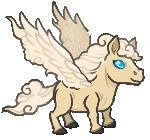

[Back to Main](index.md)

# Familiars

Upcoming familiars that are found in future premiums or simply listed as unavailable at the moment.

    
        
            ID: 276**Goldie the Sprite**She valiantly defends the gold hoard of the dragon's lair in her forest.
        
        
            Goldie the Sprite
        
        
            Goldie the Sprite Familiar Pack
        
        
            1,680p
        
        
            30 Jul 2025
        
    
    
        
            ID: 280**Quandary the Sphinx of Wonder**Mystifying even to themselves.
        
        
            Quandary the Sphinx of Wonder
        
        
            Quandary the Sphinx of Wonder Familiar Pack
        
        
            1,680p
        
        
            06 Aug 2025
        
    
    
        
            ID: 279**Uggie the Otyugh**Loves giving hugs and eating trash.
        
        
            Uggie the Otyugh
        
        
            Ascended Baldric Theme Pack
        
        
            3,830p
        
        
            06 Aug 2025
        
    
    
        
            ID: 281**Aurelia the Clockwork Hollyphant**Made by Mechanus' finest artificers.
        
        
            Aurelia the Clockwork Hollyphant
        
        
            Seven Heavens Lazaapz Theme Pack
        
        
            3,830p
        
        
            13 Aug 2025
        
    
    
        
            ID: 282**Radiance the Pegasus Familiar**From the skies of the Seven Heavens.
        
        
            Radiance the Pegasus Familiar
        
        
            Radiance the Pegasus Familiar Pack
        
        
            2,380p
        
        
            13 Aug 2025
        
    
    
        
            ID: 284**Keeper the Spellbook**Little secret keepers.
        
        
            Keeper the Spellbook
        
        
            Mythic Cazrin Theme Pack
        
        
            3,830p
        
        
            03 Sept 2025
        
    
    
        
            ID: 278**Professor Griff**The judgiest judge to ever judge.
        
        
            Professor Griff
        
        
            Legendkeeper Alyndra Theme Pack
        
        
            3,830p
        
        
            10 Sept 2025
        
    
    
        
            ID: 283**Animated Silver Sword**A gift. A burden. The sacred blade of shadow's bane.
        
        
            Animated Silver Sword
        
        
            Silver Sword of Gith Familiar Pack
        
        
            840p
        
        
            24 Sept 2025
        
    
    
        
            ID: 285**Ebrath the Illefarn Mastiff**Guardian's Best Friend.
        
        
            Ebrath the Illefarn Mastiff
        
        
            King of Shadows Origin Theme Pack
        
        
            0p
        
        
            01 Oct 2025
        
    
    
        
            ID: 286**Ausir the White Raven**The bright messenger of a dark lady.
        
        
            Ausir the White Raven
        
        
            Darklord Farideh Theme Pack
        
        
            3,830p
        
        
            08 Oct 2025
        
    
    
        
            ID: 287**Umbra the Shadow Dragon**Beware her dark breath weapon - you will rise in her service after death.
        
        
            Umbra the Shadow Dragon
        
        
            Umbra the Shadow Dragon Familiar Pack
        
        
            1,680p
        
        
            22 Oct 2025
        
    
    
        
            ID: 288**Form of the Slayer**A form for Bhaal's chosen…
        
        
            Form of the Slayer
        
        
            Dark Urge Slayer Familiar & Feat Pack
        
        
            1,680p
        
        
            29 Oct 2025
        
    

[Back to Top](#top)

*Last Modified: {{ site.time }}*