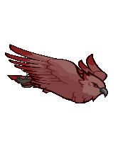
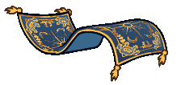

[Back to Main](index.md)

# Familiars

Upcoming familiars that are found in future premiums or simply listed as unavailable at the moment.

    
        
            ID: 294**Lerk the Lark**No idea where he got that hat from, but he has good taste!
        
        
            Lerk the Lark
        
        
            Cozy Lark Theme Pack
        
        
            3,830p
        
        
            03 Dec 2025
        
    
    
        
            ID: 295**Owlsworth the Snowy Owl**Most fear Owlsworth. One didn’t. He doesn't come back now.
        
        
            Owlsworth the Snowy Owl
        
        
            Owlsworth the Snowy Owl Familiar Pack
        
        
            1,680p
        
        
            03 Dec 2025
        
    
    
        
            ID: 300**Striker the Blood Hawk**Beware the screech of Striker!
        
        
            Striker the Blood Hawk
        
        
            XBox Giveaway - Jang Sao's Champions of Renown Pack
        
        
            0p
        
        
            03 Dec 2025
        
    
    
        
            ID: 296**Cog the Clockwork Modron**Craftsmanship even Primus would be impressed by.
        
        
            Cog the Clockwork Modron
        
        
            Cozy Nordom Theme Pack
        
        
            3,830p
        
        
            10 Dec 2025
        
    
    
        
            ID: 297**Hug the Rug of Smothering**Full-bodied snuggles, whether you want them or not.
        
        
            Hug the Rug of Smothering
        
        
            Hug the Rug of Smothering Familiar Pack
        
        
            2,380p
        
        
            10 Dec 2025
        
    
    
        
            ID: 298**Fixer the Automaton**Quicker she says. Always quicker!
        
        
            Fixer the Automaton
        
        
            Fixer the Automaton Familiar & Lazaapz Feat Pack
        
        
            1,680p
        
        
            30 Dec 2025
        
    

[Back to Top](#top)

*Last Modified: {{ site.time }}*