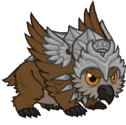
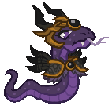

[Back to Main](index.md)

# Familiars

Upcoming familiars that are found in future premiums or simply listed as unavailable at the moment.

    
        
            ID: 228**Scrying Eye**
        
        
            Scrying Eye
        
        
            Herald of the Absolute Minthara Theme Pack
        
        
            3,830p
        
        
            06 Nov 2024
        
    
    
        
            ID: 229**Crown of Neverwinter**
        
        
            Crown of Neverwinter
        
        
            Herald of Neverwinter Sgt. Knox Theme Pack
        
        
            3,830p
        
        
            13 Nov 2024
        
    
    
        
            ID: 230**Herald the Golden Crow**
        
        
            Herald the Golden Crow
        
        
            Herald the Golden Crow Familiar Pack
        
        
            1,680p
        
        
            13 Nov 2024
        
    
    
        
            ID: 232**Armored Owlbear**
        
        
            Armored Owlbear
        
        
            Moonlight Halsin Theme Pack
        
        
            3,830p
        
        
            04 Dec 2024
        
    
    
        
            ID: 234**Sir Perchington the Fancy Owl**
        
        
            Sir Perchington the Fancy Owl
        
        
            Shadowheart's Champions of Renown Pack
        
        
            0p
        
        
            04 Dec 2024
        
    
    
        
            ID: 233**Sharran Viper**
        
        
            Sharran Viper
        
        
            Sharran Stoki Theme Pack
        
        
            3,830p
        
        
            11 Dec 2024
        
    
    
        
            ID: 235**Sharran Weasel**
        
        
            Sharran Weasel
        
        
            Avatar of Shar Familiar Pack
        
        
            1,680p
        
        
            11 Dec 2024
        
    
    
        
            ID: 236**Crescent the Lunar Moth**
        
        
            Crescent the Lunar Moth
        
        
            Crescent the Lunar Moth Familiar Pack
        
        
            840p
        
        
            26 Dec 2024
        
    
    
        
            ID: 237**Rumble the Angry Flumph**
        
        
            Rumble the Angry Flumph
        
        
            None
        
        
            ???
        
        
            24 May 2025
        
    

[Back to Top](#top)

*Last Modified: {{ site.time }}*